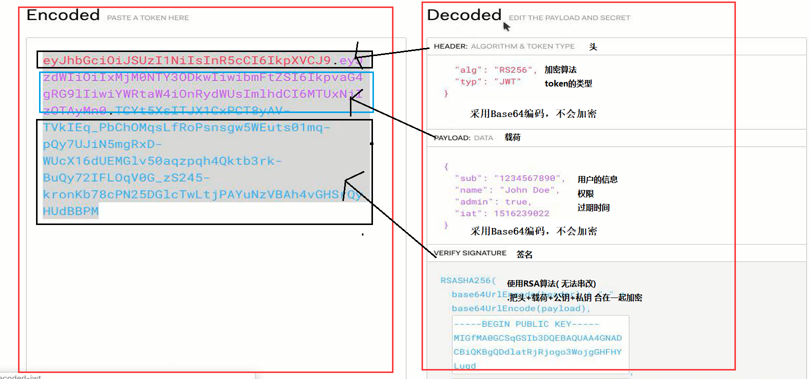

# JWT—JSON Web Token

## 登录原理

### 有状态登录

单台tomcat的情况下：编码的流程如下

1. 前端提交表单里用户的输入的账号密码
2. 后台接受,查数据库,
3. 在数据库中找到用户的信息后,把用户的信息存放到session里面,返回给用户cookie
4. 以后用户的请求都会自动携带着cookie去访问后台,后台根据用户的cookie辨识用户的身份

但是有缺点：

- 如果有千千万的用户都往session里面存放信息,
- session很难跨服务器,也就是说,用户每次请求,都必须访问同一台tomcat,新的tomcat不认识用户的cookie

### 无状态登录

- 对于服务端,不再保存任何用户的信息,对于他们来说,所有的用户地位平等
- 对于用户,他们需要自己携带着信息去访问服务端,携带的信息可以被所有服务端辨认,所以,对于用户,所有的服务地位平等

具体如何实现呢：

- 用户登录,服务端返回给用户的个人信息+token令牌
- 前端为了自己使用方便,将用户的个人信息缓存进浏览器(因为后端只是给了他一个token)
- 用户携带自己的token去访问服务端
- 认证通过,把用户请求的数据返回给客户端
- 以后不论用户请求哪个微服务,都携带着token
- 微服务对token进行解密,判断他是否有效


## JWT(Json Web Token)生成规则

整个登录、授权、鉴权的过程token的安全性至关重要，而JWT就是一门有关于如何生成一个不可仿造的token的**规范**。

他是JSON风格轻量级的授权和身份认证规范，可实现无状态、分布式的Web应用授权,而且它不是技术，和语言无关，java有对这个规范的实现叫做 **jjwt**（[点击进入jjwt的github项目](https://github.com/jwtk/jjwt)）



由JWT算法得到的token格式如上图，**由头部，载荷，签名三部分组成**：

- 头部
  由两部分组成，alg表示使用的加密算法 typ表示使用的token的类型。

- 载荷

  存放用户相关的信息。

  ```json
  // 下面是它已经定义好的载荷部分key,也允许我们自定义载荷部分key
  iss: jwt签发者
  sub: jwt所面向的用户
  aud: 接收jwt的一方
  exp: jwt的过期时间，这个过期时间必须要大于签发时间
  nbf: 定义在什么时间之前，该jwt都是不可用的.
  iat: jwt的签发时间
  jti: jwt的唯一身份标识，主要用来作为一次性token,从而回避重放攻击。
  ```

- 签名

  由 头+载荷+密钥 三部分加密组成。签名用于保证头部和载荷不发生串改，只要密钥不泄露，就不会发生token伪造的问题。需要注意的是，载荷只采用Base64编码，并没有进行加密操作，所以在载荷中一定不要放置密码等敏感信息。

## JWT+Interceptor实现登录和验证

在项目中添加`jjwt`依赖：

```xml
<dependency>
    <groupId>io.jsonwebtoken</groupId>
    <artifactId>jjwt</artifactId>
    <version>0.9.0</version>
</dependency>
```

创建JWT工具类：

```java
/**
 * @Auther: TJD
 * @Date: 2020-02-02
 * @DESCRIPTION:
 **/
public class TokenUtils {

    //生成签名的时候使用的秘钥secret,这个方法本地封装了的，一般可以从本地配置文件中读取，切记这个秘钥不能外露哦。它就是你服务端的私钥，在任何场景都不应该流露出去。一旦客户端得知这个secret, 那就意味着客户端是可以自我签发jwt了。
    private static final String key = "k5jg46hh18v4891h1e3j1sdfh65";

    /**
     * 用户登录成功后生成Jwt
     * 使用Hs256算法  私匙使用用户密码
     *
     * @param ttlMillis jwt过期时间
     * @param user      登录成功的user对象
     * @return
     */
    public static String createJWT(long ttlMillis, User user) {
        //指定签名的时候使用的签名算法，也就是header那部分，jjwt已经将这部分内容封装好了。
        SignatureAlgorithm signatureAlgorithm = SignatureAlgorithm.HS256;

        //生成JWT的时间
        long nowMillis = System.currentTimeMillis();
        Date now = new Date(nowMillis);

        //创建payload的私有声明（根据特定的业务需要添加，如果要拿这个做验证，一般是需要和jwt的接收方提前沟通好验证方式的）
        Map<String, Object> claims = new HashMap<String, Object>();
        claims.put("id", user.getUserCode());
        claims.put("username", user.getUserName());


        //生成签发人
        String subject = "xxx";

        //下面就是在为payload添加各种标准声明和私有声明了
        //这里其实就是new一个JwtBuilder，设置jwt的body
        JwtBuilder builder = Jwts.builder()
                //如果有私有声明，一定要先设置这个自己创建的私有的声明，这个是给builder的claim赋值，一旦写在标准的声明赋值之后，就是覆盖了那些标准的声明的
                .setClaims(claims)
                //设置jti(JWT ID)：是JWT的唯一标识，根据业务需要，这个可以设置为一个不重复的值，主要用来作为一次性token,从而回避重放攻击。
                .setId(UUID.randomUUID().toString())
                //iat: jwt的签发时间
                .setIssuedAt(now)
                //代表这个JWT的主体，即它的所有人，这个是一个json格式的字符串，可以存放什么userid，roldid之类的，作为什么用户的唯一标志。
                .setSubject(subject)
                //设置签名使用的签名算法和签名使用的秘钥
                .signWith(signatureAlgorithm, key);
        if (ttlMillis >= 0) {
            long expMillis = nowMillis + ttlMillis;
            Date exp = new Date(expMillis);
            //设置过期时间
            builder.setExpiration(exp);
        }
        return builder.compact();
    }


    /**
     * Token的解密
     *
     * @param token 加密后的token
     * @return
     */
    public static Claims parseJWT(String token) {
        //得到DefaultJwtParser
        Claims claims = Jwts.parser()
                //设置签名的秘钥
                .setSigningKey(key)
                //设置需要解析的jwt
                .parseClaimsJws(token).getBody();
        return claims;
    }
}

```

自定义`PassToken`注解，加上该注解的方法不用进行Token验证：

```java
/**
 * @Auther: TJD
 * @Date: 2020-02-02
 * @DESCRIPTION:
 **/
@Target({ElementType.METHOD})
@Retention(RetentionPolicy.RUNTIME)
public @interface PassToken {
}
```

自定义拦截器：

```java
/**
 * @Auther: TJD
 * @Date: 2020-02-02
 * @DESCRIPTION:
 **/
public class UserInterceptor implements HandlerInterceptor {

    /**
     * 用于缓存当前线程中Token保存的信息
     */
    private static final ThreadLocal<Map> cache = new ThreadLocal<>();


    @Override
    public boolean preHandle(HttpServletRequest request, HttpServletResponse response, Object handler) throws Exception {
        String token = request.getHeader("token");
        // 如果不是映射到方法直接通过
        if (!(handler instanceof HandlerMethod)) {
            return true;
        }
        HandlerMethod handlerMethod = (HandlerMethod) handler;
        Method method = handlerMethod.getMethod();
        //PassToken，有则跳过认证
        if (method.isAnnotationPresent(PassToken.class)) {
            return true;
        }
        if (token == null) {
            response.setHeader("content-Type", "text/html;charset=UTF-8");
            response.getWriter().write("登录过期");
            return false;
        }
        Claims claims = TokenUtils.parseJWT(token);
        cache.set(claims);
        return true;
    }

    @Override
    public void postHandle(HttpServletRequest request, HttpServletResponse response, Object handler,
                           ModelAndView modelAndView) throws Exception {
        cache.remove();
    }

    public static Map<String,String> getUser() {
        return cache.get();
    }
}

```

将拦截器注册进容器：

```java
@Configuration
public class WebAppConfig implements WebMvcConfigurer {

    /**
     * 拦截token校验
     */
    @Override
    public void addInterceptors(InterceptorRegistry registry) {
        registry.addInterceptor(userInterceptor()).addPathPatterns("/**");
    }

    @Bean
    public UserInterceptor userInterceptor() {
        return new UserInterceptor();
    }
}
```

登录接口：

```java
public class BaseController {
    public Map<String,String> getUser() {
        return UserInterceptor.getUser();
    }
}

@RestController
public class UserController extends BaseController {

    @Autowired
    private UserService userService;

    @PostMapping("/login")
    @PassToken
    public String login(String username, String passwd) {
        String token = userService.login(username, passwd);
        if (token == null) {
            return "用户名或密码错误";
        }
        return token;
    }
}
```

```java
@Service
public class UserServiceImpl implements UserService {

    @Autowired
    private UserMapper userMapper;

    @Override
    public String login(String userCode, String pwd) {
        User user = userMapper.login(userCode, pwd);
        String token = null;
        if (user != null) {
            token = TokenUtils.createJWT(300000, user);
        }
        return token;
    }
}

```

项目源码：[GitHub地址](https://github.com/tianjindong/jwt-demo) [Gitee地址](https://gitee.com/tianjindong/jwt-demo)