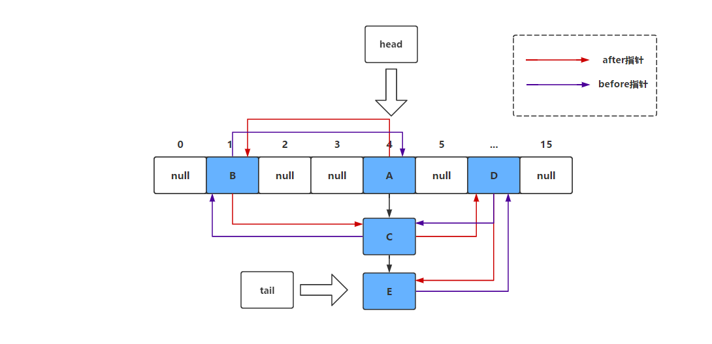
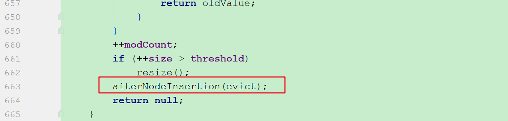

# LinkedHashMap深度解析


​		LinkedHashMap是HashMap的一个子类，保存了记录的插入顺序，在用Iterator遍历LinkedHashMap时，先得到的记录肯定是先插入的，`也可以在构造时带参数，按照访问次序排序`。

```java
public void test(){
    Map<String,String> map=new LinkedHashMap<>();
    map.put("a","1");
    map.put("b","2");
    map.put("c","3");
    Set<Map.Entry<String, String>> entries = map.entrySet();
    for (Map.Entry<String, String> entry : entries) {
        System.out.println(entry);
    }
}
```


​		可以看到，通过遍历Entry发现LinkedHashMap是有序的。在上面的案例中我们展示了LinkedHashMap默认的顺序维持方式（维持插入的顺序），通过重载的构造函数，我们可以将LinkedHashMap设置为维持访问的顺序：

```java
public void test(){
    Map<String,String> map=new LinkedHashMap<>(16,0.75f,true);
    map.put("a","1");
    map.put("b","2");
    map.put("c","3");
    //获取b后，b节点就会移动到链表的尾部
    map.get("b");
    Set<Map.Entry<String, String>> entries = map.entrySet();
    for (Map.Entry<String, String> entry : entries) {
        System.out.println(entry);
    }
}
```


## **1. LinkedHashMap维持插入顺序的原理**

想要知道LinkedHashMap是如何维持插入顺序的，就需要从其内部类入手解决：

```java
static class Entry<K,V> extends HashMap.Node<K,V> {
    Entry<K,V> before, after;
    Entry(int hash, K key, V value, Node<K,V> next) {
        super(hash, key, value, next);
    }
}
```

可以看到，LinkedHashMap中Entry内部类继承与HashMap.Node内部类，LinkedHashMap.Entry类在HashMap.Node的基础上增加了两个指针：before、after。没错，LinkedHashMap就是采用双向链表来维持插入顺序的。LinkedHashMap也提供了两个字段来保存双向链表的头尾的引用。

```java
/**
 * The head (eldest) of the doubly linked list.
 */
transient LinkedHashMap.Entry<K,V> head;
/**
 * The tail (youngest) of the doubly linked list.
 */
transient LinkedHashMap.Entry<K,V> tail;
```




如上图，我们依次插入A、B、C、D、E五个Entry，而每次插入时，我们都按照插入顺序维持一个双向链表。我们从head指针开始，顺着after指针走（也就是图中的红色箭头），就可以还原我们的插入顺序。


## **2. LinkedHashMap源码解析**

在了解完LinkedHashMap基本原理后，我们就来看看它的源码，我们先从它的构造器入手。

### **2.1 构造函数**

```java
public LinkedHashMap(int initialCapacity,float loadFactor,boolean accessOrder) {
    super(initialCapacity, loadFactor);
    this.accessOrder = accessOrder;
}
```

其中initialCapacity和loadFactor在 [《JDK8HashMap源码深度解析》](./_38JDK8HashMap源码分析.md)一文中详细介绍过了，这里不再赘述。需要注意的是`accessOrder`参数，它决定了LinkedHashMap的顺序维持策略，当accessOrder=true时，采用访问顺序维持模式，而accessOrder=false时采用插入顺序维持模式。

```java
public LinkedHashMap() {
    super();
    accessOrder = false;
}
```

可以看到LinkedHashMap无参构造器，将accessOrder属性设置为了false。


### **2.2 put方法**

根据前面的描述知道了LinkedHashMap在插入Entry时会不断维持一个双向链表，那么我们有必要对put方法进行一些分析，需要注意的是LinkedHashMap并没实现自己的put方法，而是继承至HashMap的put方法。下面是HashMap中的put方法的源码：

```java
   public V put(K key, V value) {
       return putVal(hash(key), key, value, false, true);
   }

   /**
   * 计算key的hash值，该hash算法调用了Obejct的hashcode
   * 返回的是key.hashCode()&(key.hashCode()>>>16),其中>>>代表无符号右移
   **/
   static final int hash(Object key) {
       int h;
       return (key == null) ? 0 : (h = key.hashCode()) ^ (h >>> 16);
   }

   final V putVal(int hash, K key, V value, boolean onlyIfAbsent,
                  boolean evict) {
       Node<K,V>[] tab; 
       Node<K,V> p; 
       int n, i;
       //将Map内部的table数组赋给局部变量tab，如果table为空或者大小为0，则使用resize进行扩容
       if ((tab = table) == null || (n = tab.length) == 0)
           n = (tab = resize()).length;

    	/**
    	 * n-1&hash的效果就是 hash%n （因为HashMap中封装的数组的长度都是2的幂(默认16)）
    	 * 如果数组对应位置没有元素（没有发生Hash冲突），则新建一个Node元素，放入该数组位置
    	 */
       if ((p = tab[i = (n - 1) & hash]) == null)
           // 重点******************************************
           tab[i] = newNode(hash, key, value, null);
           // 重点******************************************

       /**
        * 发生Hash冲突后的处理
        */
       else {
           Node<K,V> e; K k;
           if (p.hash == hash &&
               ((k = p.key) == key || (key != null && key.equals(k))))
               e = p;
           else if (p instanceof TreeNode)
               e = ((TreeNode<K,V>)p).putTreeVal(this, tab, hash, key, value);
           else {
           	//如果此时解决Hash冲突的数据结构为链表，则遍历到链表尾部
               for (int binCount = 0; ; ++binCount) {
                   if ((e = p.next) == null) {
                   	//向链表中添加新元素
                       p.next = newNode(hash, key, value, null);
                       //如果新元素未加入之前，链表长度大于等于7了则需要将链表转换为红黑树了，换句话说加入新元素后链表长度大于等于8了，就转成红黑树。
                       if (binCount >= TREEIFY_THRESHOLD - 1) // -1 for 1st
                           treeifyBin(tab, hash);//将链表转换为红黑树
                       //跳出循环
                       break;
                   }
                   //判断key是否相等
                   //这里的条件判断显示出HashMap允许一个key==null的键值对存储
                   if (e.hash == hash &&
                       ((k = e.key) == key || (key != null && key.equals(k))))
                       break;
                   p = e;
               }
           }
           //如果找到了一个相同的key，则根据onlyIfAbsent判断是否需要替换旧的value。
           //onlyIfAbsent为true时代表不替换原先元素。
           if (e != null) { // existing mapping for key
               V oldValue = e.value;
               if (!onlyIfAbsent || oldValue == null)
                   e.value = value;
               afterNodeAccess(e);
               return oldValue;
           }
       }

       //被修改的次数，fast-fail机制
       ++modCount;

       //如果HashMap中存储的节点数量是否到达了扩容的阈值
       if (++size > threshold)
       	//进行扩容
           resize();
       afterNodeInsertion(evict);
       return null;
   }
```

可能有人就糊涂了，既然是使用的父类的put方法，那么LinkedHashMap是如何维持双向链表的呢？实际上真正的玄机在第29行中，`tab[i] = newNode(hash, key, value, null);`掉用的是LinkedHashMap的newNode方法，就是在这个方法中实现了维持插入顺序的功能（不得不感叹设计的精妙）。

```java
Node<K,V> newNode(int hash, K key, V value, Node<K,V> e) {
    //创建Entry节点
    LinkedHashMap.Entry<K,V> p = new LinkedHashMap.Entry<K,V>(hash, key, value, e);
    //将新增节点放在链表尾部
    linkNodeLast(p);
    return p;
}
private void linkNodeLast(LinkedHashMap.Entry<K,V> p) {
    LinkedHashMap.Entry<K,V> last = tail;
    //将tail指针指向该元素（tail指针永远指向链表的尾部节点）
    tail = p;
    //原先的尾部节点若为空，则代表当前Map中没有存储数据，则将head指针也指向新增节点p
    if (last == null)
        head = p;
    else {
        //将before指针指向原先的队尾
        p.before = last;
        //将原先队尾的next指针指向新增元素
        last.after = p;
    }
}
```


### **2.3 get方法**

前面我们提到了accessOrder属性，如果accessOrder=true就会使得LinkedHashMap维持访问顺序，一说到访问那就肯定是get方法了，我们就来看看它是如何维持访问顺序的。LinkedHashMap实现了自己的get方法：

```java
public V get(Object key) {
    Node<K,V> e;
    if ((e = getNode(hash(key), key)) == null)
        return null;
    if (accessOrder)
        //如果accessOrder为true则将访问的元素移到双向链表的尾部
        afterNodeAccess(e);
    return e.value;
}
```

```java
void afterNodeAccess(Node<K,V> e) { // move node to last
    LinkedHashMap.Entry<K,V> last;
    // accessOrder=true且当前元素不处于链表的尾部
    if (accessOrder && (last = tail) != e) {
        LinkedHashMap.Entry<K,V> p = (LinkedHashMap.Entry<K,V>)e, b = p.before, a = p.after;
        // 因为马上要到链表尾部去了，所以要将当前元素的after指针置为空
        p.after = null;
        if (b == null)
            //如果前一个节点为空，那么将头指针指向下一个节点
            head = a;
        else
            //前一个节点不为空，那么将前一个节点的after指针指向下一个节点
            b.after = a;
        if (a != null)
            //如果下一个节点不为空，则将下一个节点的before指针设为前一个节点
            a.before = b;
        else
            //如果没有下一个节点，则将last指向前一个节点，实际上这一步正常情况下不会发生，因为前面已经验证了当前元素不是尾节点
            last = b;
        if (last == null)
            head = p;
        else {
            //将当前元素插入链表尾部
            p.before = last;
            last.after = p;
        }
        //此时当前元素已经移到了链表尾部，将tail指针指向当前元素
        tail = p;
        //modeCount用于迭代器的快速失败机制（fail-fast）
        ++modCount;
    }
}
```


## **3. LinkedHashMap用途浅析**

​		我们在使用缓存的时候，需要采用特定的缓存淘汰机制，而LRU（Least Recently Used 最近最少使用）淘汰机制也是最常使用的。它会淘汰最久没有使用过的缓存，而借助LinkedHashMap可以非常容易的实现这一策略：

```java
import java.util.LinkedHashMap;
import java.util.Map;

public class LRUCache<K, V> extends LinkedHashMap<K, V> {

    private int maxEntries;

    public LRUCache(int maxEntries) {
        super(16, 0.75f, true);
        this.maxEntries = maxEntries;
    }
    @Override
    protected boolean removeEldestEntry(Map.Entry<K, V> eldest) {
        return size() > maxEntries;
    }
}
```

为什么重写父类的removeEldestEntry就能实现LRU策略呢？这仍然需要分析LinkedHashMap的源码，在该类中put方法（HashMap中的方法）会调用putVal()方法（HashMap的方法），而在putVal()方法的尾部会调用afterNodeInsertion()方法（LinkedHashMap中的方法），afterNodeInsertion方法就是淘汰策略的实现代码：



```java
/**
* 可能移除最少使用的元素
**/
void afterNodeInsertion(boolean evict) { 
    LinkedHashMap.Entry<K,V> first;
    //如果removeEldestEntry(first)返回true就会触发淘汰机制，淘汰的最久没有使用过的元素
    if (evict && (first = head) != null && removeEldestEntry(first)) {
        K key = first.key;
        //删除双向链表的头节点
        removeNode(hash(key), key, null, false, true);
    }
}
```

