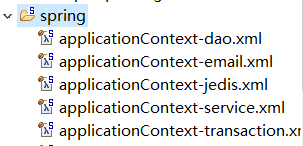
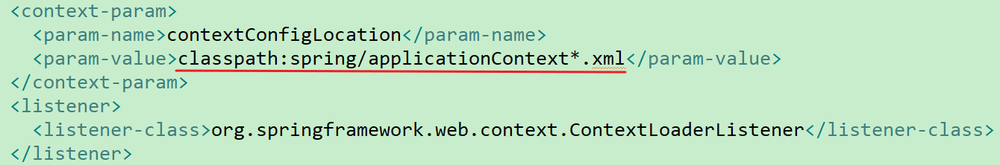

## Spring项目分模块配置

​	在很多情况下，如果将所有配置都拥挤在一个Spring配置文件中，那么会显得特别臃肿，那么我们可以编写多个spring配置文件，在配置spring启动监听器时，通过**通配符**的方式匹配多个配置文件即可。	

​	

​	**注：配置文件的位置必须在配置spring启动监听器的模块中（我在blog-web中配置的启动监听器，就必须将配置文件放在blog-web这个Maven模块中），如果试图将其放入其他模块中，然后进行依赖是行不通的。**

 

