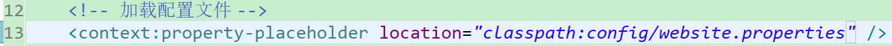

## Spring加载Properties配置文件搭配@Value标签使用

#### 第一步：创建配置文件

#### 第二步：配置加载配置文件

​	**注：如果在一个项目中，需要加载多个配置文件，那么多个配置文件路径之间用逗号隔开，不能写多个property-placeholder,哪怕是模块化配置spring（多个spring配置文件）这些配置文件中，也只能包含一个这个标签**

#### 第三步：使用@Value注解加载值

