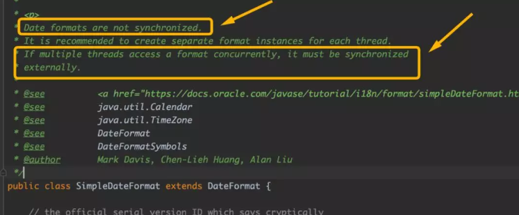

# LocalDateTime——Date的替代者

## 一. 为啥Date遭嫌弃了

假如我们想新建一个表示"此刻"的日期，打印出来：

```java
Date rightNow = new Date();
System.out.print("当前时刻：" + rightNow);
System.out.print("当前年份：" + rightNow.getYear());
System.out.print("当前月份：" + rightNow.getMonth());

输出结果为：
// 当前时刻：Fri Dec 13 21:46:34 CST 2019
// 当前年份：119
// 当前月份：11
```

假如我再想构造一个指定年、月、日的时间，我尝试这么去做：

```java
Date beforeDate = new Date(2019,12,12);
```


你看到啥了，连构造函数都**被弃用**了！

你可以再仔细瞅瞅，其实 `Date`里的很多方法现在都**已经弃用**了！


## 二. LocalDateTime

自 `Java8`开始， `JDK`中其实就增加了一系列表示日期和时间的新类，最典型的就是 `LocalDateTime`。直言不讳，这玩意的出现就是为了干掉之前 `JDK`版本中的 `Date`老哥！

同样，我们也先来感受一下用法！

```java

```

### 构造一个指定年、月、日的时间

比如，想构造：`2019年10月12月12日9时21分32秒`

```java
LocalDateTime beforeDate = LocalDateTime.of(2019,Month.DECEMBER,12,9,21,32);
```

### 修改日期

```java
LocalDateTime rightNow = LocalDateTime.now();
rightNow = rightNow.minusYears(2);//减少两年
rightNow = rightNow.plusMonths(3);//增加两个月

rightNow = rightNow.withYear(2008);//直接修改到2008年
rightNow = rightNow.withHour(13);//直接修改小时到13
```

需要注意的是，LocalDateTime是一个不可变对象，通过调用上述方法会返回一个新的对象：

```java
LocalDateTime rightNow1 = LocalDateTime.now();
LocalDateTime rightNow2 = rightNow1.minusYears(2);
System.out.println(rightNow1 == rightNow2);//输出false
```

### 格式化日期

```java
LocalDateTime now = LocalDateTime.now();
String result1 = now.format(DateTimeFormatter.ISO_DATE); 
String result2 = now.format(DateTimeFormatter.BASIC_ISO_DATE);
String result3 = now.format(DateTimeFormatter.ofPattern("yyy-MM-dd"));
```

### 时间反解析

```java
LocalDateTime date = LocalDateTime.parse("2002--01--02 11:21", DateTimeFormatter.ofPattern("yyyy--MM--dd HH:mm"));
System.out.println(date);
```


## 三. 线程安全性问题

其实上面讲来讲去只讲了两者在用法上的差别，这其实倒还好，并不致命，可是接下来要讨论的**线程安全性问题**才是致命的！

其实以前我们惯用的 `Date`时间类是可变类，这就意味着在多线程环境下对共享 `Date`变量进行操作时，必须**由程序员自己来保证线程安全**！否则极有可能翻车。

而自 `Java8`开始推出的 `LocalDateTime`却是线程安全的，开发人员不用再考虑并发问题，这点我们从 `LocalDateTime`的官方源码中即可看出：


大家除了惯用 `Date`来表示时间之外，还有一个用于和 `Date`连用的 `SimpleDateFormat` 时间格式化类大家可能也戒不掉了!

`SimpleDateFormat`最主要的致命问题也是在于它本身**并不线程安全**，这在它的源码注释里已然告知过了：



那取而代之，我们现在改用什么呢？其实在前文已经用到啦，那就是了 `DateTimeFormatter`了，他也是线程安全的：


文章转载至：<https://mp.weixin.qq.com/s?__biz=MzU4ODI1MjA3NQ==&mid=2247484932&idx=1&sn=13330017eb2ee0f6b96218a1b6d8dfe9&chksm=fdded0c0caa959d63430cc4810980629f09759439b7931bb4212dec727f2f225eaebfb8d440c&mpshare=1&scene=23&srcid=1223hbtwCbX9CAbRI6XfXsRO&sharer_sharetime=1577064132131&sharer_shareid=e81601a95b901aeca142bbe3b957819a#rd>