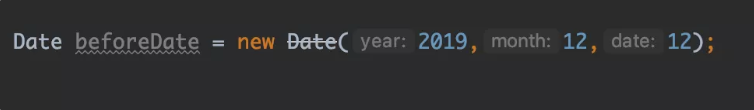
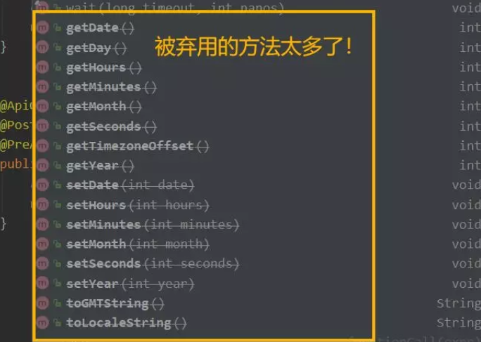
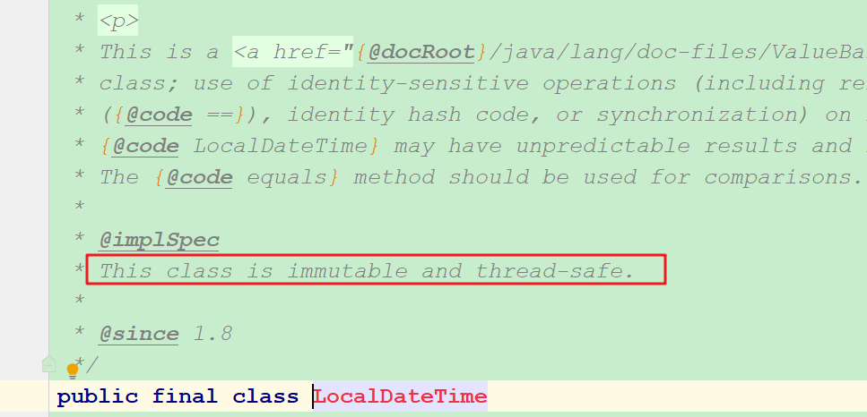

# 什么是Base64算法

HTTP是超文本传输协议，所以HTTP协议中请求、相应都是以ASCII字符方式传输，**如果要传输二进制需要经过BASE64或MIME等编码**（因为HTTP协议pop3、smtp邮件协议都是针对文本的，而FTP支持传输二进制数据,即不需要经过编码转换成字符型数据）

## HTTP传输字节流时为什么会用Base64编码

可能很多人不明白，为什么在进行HTTP传输时二进制数据时，需要将字节流进行Base64编码呢？

可能很多小伙伴都会认为，HTTP传输文本底层仍然是字节流数据，为什么我通过HTTP请求直接传输文件的字节流还需要进行编码呢？

因为**HTTP是文本协议，它只能传输ASCII码表中可打印字符的编码**（类似的还有SMTP邮件协议），ASCII码表的范围是0-127（只需要一个字节中的七位），而一个字节是八位，这也意味着原本8bit字节码（范围0-255）超过了可用范围，因此无法被传输（ASCII码中有一部分控制字符，它们同样无法传输）。例如：当传输图片时某一个byte的值是`0x10111011`，对应的十进制是187不属于ASCII码的范围，因此无法被传输。

**注**：ASCII码的范畴是0-127，其中0-31和127这33个字符属于控制字符。


## Base64原理

把3个8bit字节（3x8=24）转换为4个6位的字节（4x6=24），之后每个六位的前面补0，形成完整8bit字节。在根据每个字节的值，用下表中的值进行替换，不足四个字节的补`=`：



向下图中，8bit x 3的字符串可以每6个bit分成一组，每一组bit对应一个十进制index，每个index又对应了Base64字符。



最终，8bit字符串`Man`编码成了Base64的`TWFu`。相比8bit的字符编码，Base64编码会多占用三分之一的字节长度，以此为代价实现了更好的兼容性。

如果原本8bit字符串长度不是3的倍数，例如我们需要对长度为1个字节的数据进行编码，Base64会对匹配不到8bit字节的6bit字节位用`=`填充：




## Java中Base64编码与解码的使用

### 早期用法（不建议）

```java
final BASE64Encoder encoder = new BASE64Encoder();
final BASE64Decoder decoder = new BASE64Decoder();
final String text = "字串文字";
final byte[] textByte = text.getBytes("UTF-8");
//编码
final String encodedText = encoder.encode(textByte);
System.out.println(encodedText);
//解码
System.out.println(new String(decoder.decodeBuffer(encodedText), "UTF-8"));

final BASE64Encoder encoder = new BASE64Encoder();
final BASE64Decoder decoder = new BASE64Decoder();
final String text = "字串文字";
final byte[] textByte = text.getBytes("UTF-8");
//编码
final String encodedText = encoder.encode(textByte);
System.out.println(encodedText);

//解码
System.out.println(new String(decoder.decodeBuffer(encodedText), "UTF-8"));
```

从以上程式可以发现，在Java用Base64一点都不难，不用几行程式码就解决了！只是这个sun.mis c套件所提供的Base64功能，编码和解码的效率并不太好，而且在以后的Java版本可能就不被支持了，完全不建议使用。

### Java 8之后的作法

Java 8的java.util套件中，新增了Base64的类别，可以用来处理Base64的编码与解码，用法如下：

```java
final Base64.Decoder decoder = Base64.getDecoder();
final Base64.Encoder encoder = Base64.getEncoder();
final String text = "字串文字";
final byte[] textByte = text.getBytes("UTF-8");
//编码
final String encodedText = encoder.encodeToString(textByte);
System.out.println(encodedText);
//解码
System.out.println(new String(decoder.decode(encodedText), "UTF-8"));

final Base64.Decoder decoder = Base64.getDecoder();
final Base64.Encoder encoder = Base64.getEncoder();
final String text = "字串文字";
final byte[] textByte = text.getBytes("UTF-8");
//编码
final String encodedText = encoder.encodeToString(textByte);
System.out.println(encodedText);
//解码
System.out.println(new String(decoder.decode(encodedText), "UTF-8"));
```


文章参考：

<https://mp.weixin.qq.com/s?__biz=MzIxMjE5MTE1Nw==&mid=2653191459&idx=1&sn=6e7d82dabe9c4a26b55f86f502edac03&chksm=8c990ff9bbee86ef7d6eee8a92430ff529b57e2f8720d439b7a4fb83b9ba75cd91395509a239&mpshare=1&scene=23&srcid=1222K4IGT8SVRmO6lUln3Y1A&sharer_sharetime=1576982768669&sharer_shareid=e81601a95b901aeca142bbe3b957819a#rd>

<https://www.cnblogs.com/alter888/p/9140732.html>

