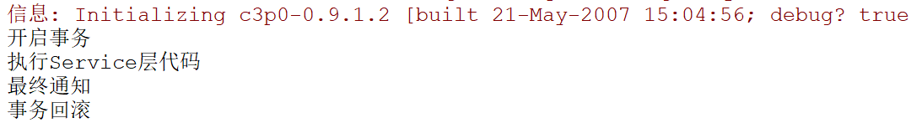

## SpringAOP

#### 什么是AOP

​	AOP（面向切面编程，Aspect Oriented Programming），通过预编译方式和运行期动态代理实现程序功能的统一维护的一种技术。

#### SpringAOP原理

​	Spring中使用了两种动态代理技术，并且优先使用JDK自带的动态代理，如果该类没有实现接口，则使用cglib代理。

- 动态代理：这是JDK自带的动态代理，被代理对象必须要实现接口,才能产生代理对象.如果没有接口将不能使用动态代理技术。
- cglib代理：第三方代理技术,cglib代理.可以对任何类生成代理.代理的原理是对目标对象进行继承代理. 如果目标对象被final修饰.那么该类无法被cglib代理。这也就是为什么Hibernate技术中实体对象要求不能使用final修饰符修饰，因为修饰后就不能通过继承产生动态代理对象了。

#### SpringAOP相关概念

- Joinpoint（连接点）：所谓连接点是指那些被拦截到的点。在Spring中，这些点就是方法，因为Spring只支持方法类型的连接点。
- Pointcut（切入点）：切入点就是，我们需要对哪些Joinpoint进行拦截的定义。
- Advice（通知）：需要增强的代码称为通知。
- Aspect（切面）：切入点和通知**的结合**。
- Weaving（织入）：将通知应用到切入点的过程称为织入。
- Target（目标对象）：被代理对象称为目标对象。
- Proxy（代理）：生成的代理对象。

#### SpringAOP所需环境

​	除了Spring初始的4+2环境，还需要添加`spring-aop` `spring-aspects`包，还需要两个第三方包：


#### SpringAOP的通知类型

- 前置通知（before）

- 环绕通知（around）Spring框架为我们提供了一个接口：`ProceedingJoinPoint`。该接口有一个方法proceed()，此方法就相当于明确调用切入点方法。该接口可以作为环绕通知的方法参数，在程序执行时，spring框架会为我们提供该接口的实现类供我们使用。**环绕通知有着其他通知没有的功能，它可以获得目标方法的入参和返回值。**

  ```java
   public Object around(ProceedingJoinPoint pj) throws Throwable {
          Object[] args = pj.getArgs();//获取入参
          System.out.println("前置操作");
          Object result = pj.proceed();//执行目标方法，并获取返回值
          System.out.println("后置操作");
          return result;
   }
  ```

- 最终通知（after）最终通知（**不管前面是否遇到异常都会执行。它与后置通知或异常通知的执行顺序取决于配置顺序**）

- 异常抛出通知（after-throwing）

- 后置通知（after-returning） 后置通知（前面遇到异常不执行）

#### 切入点表达式

​	在配置SpringAOP前，我们还需要知道切入点表达式，它在配置切入点时会用到。

```xml
切入点表达式的写法：
    关键字：execution(表达式)
    表达式：
        访问修饰符  返回值  包名.包名.包名...类名.方法名(参数列表)
    标准的表达式写法：
        public void com.itheima.service.impl.AccountServiceImpl.saveAccount()
    访问修饰符可以省略
        void com.itheima.service.impl.AccountServiceImpl.saveAccount()
    返回值可以使用通配符，表示任意返回值
        * com.itheima.service.impl.AccountServiceImpl.saveAccount()
    包名可以使用通配符，表示任意包。但是有几级包，就需要写几个*.
        * *.*.*.*.AccountServiceImpl.saveAccount()
    包名可以使用..表示当前包及其子包
        * *..AccountServiceImpl.saveAccount()
    类名和方法名都可以使用*来实现通配
        * *..*.*(..)
    参数列表：
        可以直接写数据类型：
            基本类型直接写名称           int
            引用类型写包名.类名的方式   java.lang.String
        可以使用通配符表示任意类型，但是必须有参数
        可以使用..表示有无参数均可，有参数可以是任意类型
    全通配写法：
        *
    实际开发中切入点表达式的通常写法：
        切到业务层实现类下的所有方法
            * com.itheima.service.impl.*.*(..)
```


#### SpringAOP配置过程

1. 编写目标类（被加强的类）

2. 编写通知类

3. 将目标类和通知类注入到IOC容器中

4. 配置切入点

5. 配置切面（切入点和通知的结合）

   **第一步：编写目标对象**

```java
public class HelloServiceImpl implements HelloService {
    public void sayHello() {
        System.out.println("执行Service层代码");
    }
}
```

​	**第二步：配置通知类**

```java
public class MyAdvice {
    /**
     * 前置通知
     */
    public void before(){
        System.out.println("开启事务");
    }

    /**
     * 最终通知
     */
    public void after(){
        System.out.println("最终通知");
    }
    /**
     * 异常通知
     */
    public void arterThrowing(){
        System.out.println("事务回滚");
    }


    /**
     * 后置通知
     */
    public void afterReturning(){
        System.out.println("提交事务");
    }

}

```

​	**第三步：将目标类和通知类注入IOC容器**（也可以采用注解配置）

```xml
<beans>
    <!--配置目标对象-->
    <bean id="helloService" class="cn.tjd.spring_annotation.service.impl.HelloServiceImpl"></bean>
    <!--配置通知类-->
    <bean id="myAdvice" class="cn.tjd.spring_annotation.advice.MyAdvice"></bean>
</beans>
```

​	**第四步：配置切入点**

```xml
<beans>
    <!--配置目标对象-->
    <bean id="helloService" class="cn.tjd.spring_annotation.service.impl.HelloServiceImpl"></bean>
    <!--配置通知类-->
    <bean id="myAdvice" class="cn.tjd.spring_annotation.advice.MyAdvice"></bean>
    <aop:config>
		<!--切入点-->
        <aop:pointcut id="pc" expression="execution(* cn.tjd.spring_annotation.service.impl.*ServiceImpl.*(..))"></aop:pointcut>
    </aop:config>
</beans>
```

​	**第五步：配置切面**

```xml
<beans>
    <!--配置目标对象-->
    <bean id="helloService" class="cn.tjd.spring_annotation.service.impl.HelloServiceImpl"></bean>
    <!--配置通知类-->
    <bean id="myAdvice" class="cn.tjd.spring_annotation.advice.MyAdvice"></bean>
    <aop:config>
        <!--切点-->
        <aop:pointcut id="pc" expression="execution(* cn.tjd.spring_annotation.service.impl.*ServiceImpl.*(..))"></aop:pointcut>
        <!--切面-->
        <aop:aspect ref="myAdvice">
            <aop:before method="before" pointcut-ref="pc"></aop:before>
            <aop:after method="after" pointcut-ref="pc"></aop:after>
            <aop:after-returning method="afterReturning" pointcut-ref="pc"></aop:after-returning>
            <aop:after-throwing method="arterThrowing" pointcut-ref="pc"></aop:after-throwing>
        </aop:aspect>
    </aop:config>
</beans>
```

**测试：**

```java
@RunWith(SpringJUnit4ClassRunner.class)
@ContextConfiguration(locations = "classpath:spring/applicationContext.xml")
public class TestAop {
    @Autowired
    private HelloService helloService;

    @Test
    public void testAOP(){
        helloService.sayHello();
    }
}
```

发生异常的情况：（注意：**通知的执行顺序是根据xml中配置顺序所决定的**）



未发生异常的情况：

