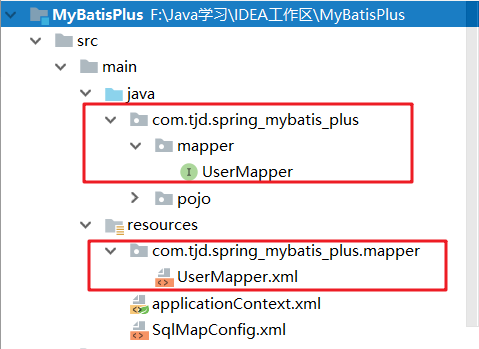

# MyBatis抛出BindingException异常可能是你忘了配置资源拷贝

​	最近博主在搭建Mybatis项目时遇到了一问题，在一切配置妥当后，开始运行测试代码，但是此时控制台无情的抛出了异常：


## 开始寻找问题根源

咦？难道是我哪里写错，我的第一反应是我的xml配置文件哪里写错了，我开始检查下面几个点：

1. XML文件是否与Mapper代码在通过一个包中。

2. XML配置文件文件名是否与Mapper代码文件名相同。（在使用<package>设置mapper配置文件位置时，必须要保证第一点和第二点）

3. Mapper.xml文件中的namespace与mapper接口的类路径相同。

4. Mapper接口方法名和Mapper.xml中定义的每个statement的id相同 。

5. Mapper接口方法的输入参数类型和mapper.xml中定义的每个sql 的parameterType的类型相同。

6. Mapper接口方法的输出参数类型和mapper.xml中定义的每个sql的resultType的类型相同。


​	检查完成后，我发现都没有问题，那就奇怪了，这问题到底出在哪了呢？此时我看来一下编译后的目标文件夹中，发现我的mapper配置文件并没有被编译进去。


原来在典型的maven工程中，目录结构有：`src/main/java`和`src/main/resources`，前者是用来存放java源代码的，后者则是存放一些资源文件，比如配置文件等，**在默认的情况下maven打包的时候，对于src/main/java目录只打包源代码，而不会打包其他文件**。所以此时如果把对应的mapper文件放到`src/main/java`目录下时，不会打包到最终的jar文件夹中，也不会输出到`target`文件夹中，由于在进行单元测试的时候执行的是`/target`目录下`/test-classes`下的代码，所以在测试的时候也不会成功。


## 如何解决资源拷贝问题

### 方式一：默认Maven构建

**为了实现在maven默认环境下打包时，Mybatis的接口和mapper文件在同一包中，可以通过将接口文件放在src/main/java某个包中，而在src/main/resources目录中建立同样的包**，这是一种约定优于配置的方式，这样在maven打包的时候就会将`src/main/java`和`src/main/resources`相同包下的文件合并到同一包中。




### 方式二：更改Maven的构建配置

我们需要在Maven项目的pom.xml文件中配置下列代码：

```xml
<build>
    <resources>
        <resource>
            <directory>src/main/java</directory>
            <includes>
                <include>**/*.xml</include>
            </includes>
            <filtering>false</filtering>
        </resource>
    </resources>
</build>
```

采用上述方法中任意一个，然后重新运行测试代码，BindingException异常的问题就解决了。