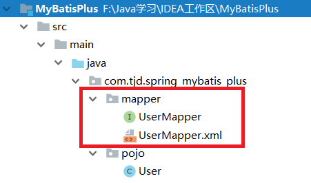

# MyBatis与Spring整合环境搭建

在前段的工作学习中，自己大多数都在使用MyBatis，但是最近有独立搭建SSM环境的需求，所以博主就想着写一篇框架整合的博文，对整合过程进行一个总结：

## 第一步：引入jar包

```xml
 <properties>
        <junit.version>4.12</junit.version>
        <spring.version>4.2.4.RELEASE</spring.version>
        <mybatis.version>3.2.8</mybatis.version>
        <mybatis.spring.version>1.2.2</mybatis.spring.version>
        <mybatis.paginator.version>1.2.15</mybatis.paginator.version>
        <pagehelper.version>3.4.2-fix</pagehelper.version>
        <mysql.version>5.1.32</mysql.version>
        <druid.version>1.0.9</druid.version>
        <jedis.version>2.7.2</jedis.version>
    </properties>

    <dependencies>
        <!-- Spring -->
        <dependency>
            <groupId>org.springframework</groupId>
            <artifactId>spring-context</artifactId>
            <version>${spring.version}</version>
        </dependency>
        <dependency>
            <groupId>org.springframework</groupId>
            <artifactId>spring-beans</artifactId>
            <version>${spring.version}</version>
        </dependency>
        <dependency>
            <groupId>org.springframework</groupId>
            <artifactId>spring-jdbc</artifactId>
            <version>${spring.version}</version>
        </dependency>
        <dependency>
            <groupId>org.springframework</groupId>
            <artifactId>spring-test</artifactId>
            <version>${spring.version}</version>
        </dependency>
        <dependency>
            <groupId>org.springframework</groupId>
            <artifactId>spring-aspects</artifactId>
            <version>${spring.version}</version>
        </dependency>
        <dependency>
            <groupId>org.springframework</groupId>
            <artifactId>spring-jms</artifactId>
            <version>${spring.version}</version>
        </dependency>
        <dependency>
            <groupId>org.springframework</groupId>
            <artifactId>spring-context-support</artifactId>
            <version>${spring.version}</version>
        </dependency>
        <dependency>
            <groupId>org.springframework</groupId>
            <artifactId>spring-tx</artifactId>
            <version>${spring.version}</version>
        </dependency>
		<!-- log4j -->
        <dependency>
            <groupId>log4j</groupId>
            <artifactId>log4j</artifactId>
            <version>1.2.17</version>
        </dependency>
        <!-- Mybatis -->
        <dependency>
            <groupId>org.mybatis</groupId>
            <artifactId>mybatis</artifactId>
            <version>${mybatis.version}</version>
        </dependency>
        <dependency>
            <groupId>org.mybatis</groupId>
            <artifactId>mybatis-spring</artifactId>
            <version>${mybatis.spring.version}</version>
        </dependency>
        <dependency>
            <groupId>com.github.pagehelper</groupId>
            <artifactId>pagehelper</artifactId>
            <version>${pagehelper.version}</version>
        </dependency>

        <!--MyBatisPlus-->
        <dependency>
            <groupId>com.baomidou</groupId>
            <artifactId>mybatis-plus</artifactId>
            <version>3.1.2</version>
        </dependency>


        <!-- MySql -->
        <dependency>
            <groupId>mysql</groupId>
            <artifactId>mysql-connector-java</artifactId>
            <version>${mysql.version}</version>
        </dependency>
        <!-- 连接池 -->
        <dependency>
            <groupId>com.alibaba</groupId>
            <artifactId>druid</artifactId>
            <version>${druid.version}</version>
        </dependency>

        <!--lombok-->
        <dependency>
            <groupId>org.projectlombok</groupId>
            <artifactId>lombok</artifactId>
            <version>1.18.8</version>
            <scope>provided</scope>
        </dependency>

    </dependencies>

    <build>
        <!-- 加载配置文件 -->
        <resources>
            <resource>
                <directory>src/main/java</directory>
                <includes>
                    <include>**/*.xml</include>
                </includes>
            </resource>
        </resources>
    </build>
```

注意最后<resource>标签的配置是非常必要的，在默认构建模式下，放在mapper包中的配置文件并不会编译到目标目录中去，就会导致MyBatis搭建错误，详见：[MyBatis抛出BindingException异常可能是你忘了配置资源拷贝](./_29MyBatis抛出BindingException异常可能是你忘了配置资源拷贝.md)

## 第二步：编写实体类与Mapper接口


## 第三步：配置Mapper配置文件

Mapper配置文件需要满足一下要求：

1. Mapper配置文件与Mapper接口在一个包中
2. Mapper配置文件名与Mapper接口名相同
3. Mapper配置文件中namespace填写为Mapper接口的全限定类名
4. Mapper配置文件配置sql语句的标签的id要与Mapper接口中方法名相同



```xml
<?xml version="1.0" encoding="UTF-8" ?>
<!DOCTYPE mapper PUBLIC "-//mybatis.org//DTD Mapper 3.0//EN" "http://mybatis.org/dtd/mybatis-3-mapper.dtd" >
<mapper namespace="com.tjd.spring_mybatis_plus.mapper.UserMapper">
    <select id="getUserById" resultType="com.tjd.spring_mybatis_plus.pojo.User" parameterType="long">
        select * from user where uid = #{id}
    </select>
</mapper>
```

## 第四步：配置MyBatis核心配置文件

在`resource/`目录下创建SqlMapConfig.xml文件，SqlMapConfig.xml配置文件具体内容参考：[http://www.mybatis.org/mybatis-3/zh/configuration.html](http://www.mybatis.org/mybatis-3/zh/configuration.html)

```xml
<?xml version="1.0" encoding="UTF-8"?>
<!DOCTYPE configuration
		PUBLIC "-//mybatis.org//DTD Config 3.0//EN"
		"http://mybatis.org/dtd/mybatis-3-config.dtd">
<configuration>
    <!--开启日志输出-->
	<settings>
		<setting name="logImpl" value="STDOUT_LOGGING" />
	</settings>
    <!--配置类别名，配置后在Mapper配置文件（通常我们将编写SQL语句的配置文件成为Mapper配置文件）中需要使用pojo包中的类时，使用简单类名即可-->
	<typeAliases>
		<package name="com.tjd.spring_mybatis_plus.pojo"/>
	</typeAliases>
</configuration>
```


## 第五步：配置Spring核心配置文件

在`resource/`目录下创建applicationContext.xml文件

```xml
<?xml version="1.0" encoding="UTF-8"?>
<beans xmlns="http://www.springframework.org/schema/beans"
	xmlns:context="http://www.springframework.org/schema/context" xmlns:p="http://www.springframework.org/schema/p"
	xmlns:aop="http://www.springframework.org/schema/aop" xmlns:tx="http://www.springframework.org/schema/tx"
	xmlns:xsi="http://www.w3.org/2001/XMLSchema-instance"
	xsi:schemaLocation="http://www.springframework.org/schema/beans http://www.springframework.org/schema/beans/spring-beans-4.2.xsd
	http://www.springframework.org/schema/context http://www.springframework.org/schema/context/spring-context-4.2.xsd
	http://www.springframework.org/schema/aop http://www.springframework.org/schema/aop/spring-aop-4.2.xsd http://www.springframework.org/schema/tx http://www.springframework.org/schema/tx/spring-tx-4.2.xsd
	http://www.springframework.org/schema/util http://www.springframework.org/schema/util/spring-util-4.2.xsd">

    <!--配置包扫描器，配置后会自动扫描指定包下面，由注解注册的Bean-->
	<context:component-scan base-package="com.tjd.spring_mybatis_plus"></context:component-scan>

	<!-- 数据库连接池 -->
	<bean id="dataSource" class="com.alibaba.druid.pool.DruidDataSource"
		  destroy-method="close">
		<property name="url" value="jdbc:mysql://localhost:3306/test" />
		<property name="username" value="root" />
		<property name="password" value="xxx" />
		<property name="driverClassName" value="com.mysql.jdbc.Driver" />
	</bean>
	<!-- 让spring管理sqlsessionfactory 使用mybatis和spring整合包中的 -->
	<bean id="sqlSessionFactory" class="org.mybatis.spring.SqlSessionFactoryBean">
		<!-- 数据库连接池 -->
		<property name="dataSource" ref="dataSource" />
		<!-- 加载mybatis的全局配置文件 -->
		<property name="configLocation" value="classpath:SqlMapConfig.xml" />
	</bean>

	<!--BeanDefinitionRegistryPostProcessor，它从一个基本包开始递归地搜索接口，并将它们注册为MapperFactoryBean。-->
	<bean class="org.mybatis.spring.mapper.MapperScannerConfigurer">
		<property name="basePackage" value="com.tjd.spring_mybatis_plus.mapper" />
	</bean>
</beans>

```

需要注意的是，在applicationContext.xml中最后配置的`MapperScannerConfigurer`，它的作用是**从指定的包开始递归地搜索接口，并将它们注册为`MapperFactoryBean`。注意，只有具有至少一个方法的接口才会被注册;具体类将被忽略**。这也就是为什么前面要求：

- Mapper配置文件与Mapper接口在一个包中
- Mapper配置文件名与Mapper接口名相同

**因为只有这样才能让`MapperScannerConfigurer`在找到接口时，顺利的找到接口对应的配置文件。**

那什么是`MapperFactoryBean`，它是我们Mapper接口的代理实现类，如果不在applicationContext.xml不配置`MapperScannerConfigurer`，那么我们就需要手动配置UserMapper接口的实现类，示例如下：

```xml
<bean id="userMapper" class="org.mybatis.spring.mapper.MapperFactoryBean">
		<property name="sqlSessionFactory" ref="sqlSessionFactory"></property>
		<property name="mapperInterface" value="com.tjd.spring_mybatis_plus.mapper.UserMapper"></property>
</bean>
```

但是如果采用这种配置方式，那么每个接口都需要配置一次，会很麻烦，如果我们配置`MapperScannerConfigurer`那么只需要指定包名，就能将该包下所有接口注册为MapperFactoryBean。