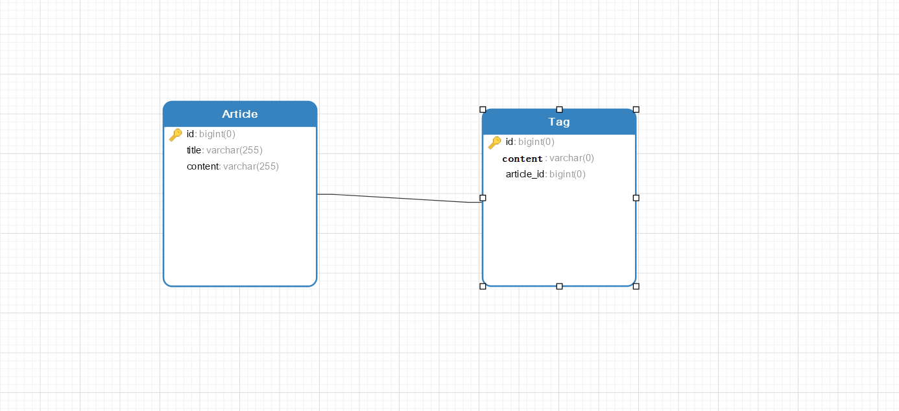

# MyBatis延迟加载策略

延迟加载就是在需要用到数据的时候才进行加载，不需要用到数据的时候就不加载数据。延迟加载也称为懒加载。 

**优点**：在使用关联对象时，才从数据库中查询关联数据，大大降低数据库不必要开销。

**缺点**：因为只有当需要用到数据时，才会进行数据库查询，这样在大批量数据查询时，因为查询工作也需要耗费时间，所以可能造成用户等待时间变长，造成用户体验下降。

## **数据库模型准备**

下面我们给出的就是一个数据库关系模型，在后面的例子中一这两个表为基础讲解MyBatis延迟加载。我们假定Article（文章）与Tag（标签）是一对多的关系。



注意面这段话的表述：表的关联关系大致可以分为四种：一对一、多对一、一对多、多对多，但是实质上从单独一个表的角度上来看只存在一对一和一对多关系；而一对一和一对多的关系都能通过下列两个表来表示，以Article表的角度上来看，一个Article数据可以由多个Tag数据行对应，这就是一对多的关系；而一个Tag数据只能与一个Article关联，这就是一对一的关系。所以了解了MyBatis一对多的延迟加载的配置（双向）也就学会了四种关联模式的配置。


## **第一步：配置MyBatis核心配置文件**

如果想使用延迟加载策略，就需要在MyBatis全局配置文件中开启延迟加载策略：


参数详情参考官方文档：[settings配置](http://www.mybatis.org/mybatis-3/zh/configuration.html#settings)

我们在MyBatis全局配置文件（SqlMapConfig.xml）中添加下列代码：

```xml
<settings>
	<setting name="lazyLoadingEnabled"  value="true"/>
	<setting name="aggressiveLazyLoading" value="true"/>
</settings>
```


## **第二步：配置映射文件**

### **预先定义ArticleMapper和TagMapper接口**

**ArticleMapper接口**：

```java
public interface ArticleMapper {
    Article getArticleById(Long id);
}
```

**TagMapper接口**：

```java
public interface TagMapper {
    Tag getTagById(Long id); 
    
	List<Tag> getTagsByArticleId(Long id);
}
```

### **配置ArticleMapper.xml映射文件（一对多配置）**

在不使用延迟加载的情况下，我们通常使用的是关联查询，直接查出关联对象的数据：

```xml
<mapper namespace="com.tjd.spring_mybatis_plus.mapper.ArticleMapper">
   
    <resultMap id="articleMap" type="Article">
        <id column="id" property="id"></id>
        <result column="title" property="title"></result>
        <result column="content" property="content"></result>
        <collection property="tags" ofType="Tag">
            <id column="tid" property="id"></id>
            <result column="tcontent" property="content"></result>
        </collection>
    </resultMap>

    <select id="getArticleById" resultMap="articleMap" parameterType="long">
      SELECT
	    a.id id,
	    a.title title,
	    a.content content,
	    t.id tid,
	    t.content tcontent
      FROM
	    article a
	    LEFT JOIN tag t ON a.id = t.article_id
      WHERE
	    a.id = #{id}
    </select>

</mapper>
```

`如果要想使用延迟加载策略，那么映射文件配置就不能采用连接查询了，因为这样一旦SQL语句执行了，关联数据也就查询出来了`，所以我们要将原来的关联查询，转换成单表查询：

```xml
<mapper namespace="com.tjd.spring_mybatis_plus.mapper.ArticleMapper">
    <resultMap id="articleMap" type="Article">
        <id column="id" property="id"></id>
        <result column="title" property="title"></result>
        <result column="content" property="content"></result>
        <collection  property="tags" ofType="Tag" column="id"                   select="com.tjd.spring_mybatis_plus.mapper.TagMapper.getTagsByArticleId" ></collection>
    </resultMap>

    <select id="getArticleById" resultMap="articleMap" parameterType="long">
      select * from article where id=#{id}
    </select>

</mapper>
```

collection标签属性:

- ofType：用于指定集合元素的数据类型。
- select：指定用于查询关联表数据SQL语句的ID。
- column：是用于指定使用哪个字段的值作为条件查询。

**在TagMapper.xml映射文件中定义如下语句**：

```xml
<!--在前面定义的ArticleMapper.xml映射文件中collection标签中select属性就是指向的这个SQL语句-->
<select id="getTagsByArticleId" parameterType="long" resultType="Article">
        select * from tag where article_id=#{article_id}
</select>
```

做到这里，一对多的延迟加载配置就完成了，在执行ArticleMapper中ID为getArticleById的SQL语句时，并不会立即执行TagMapper中的getTagsByArticleId，而是在需要时再执行getTagsByArticleId，从而达到了延迟加载的目的。


### **配置TagMapper.xml映射文件（一对一 或 多对一 配置）**

```xml
<mapper namespace="com.tjd.spring_mybatis_plus.mapper.TagMapper">

    <resultMap id="tagMap" type="Tag">
        <id column="id" property="id"></id>
        <result column="content" property="content"></result>
        <association property="article" column="article_id" javaType="Article" select="com.tjd.spring_mybatis_plus.mapper.ArticleMapper.getArticleById"></association>
    </resultMap>
    
    <!--并没有采用关联查询-->
    <select id="getTagById" parameterType="long" resultMap="tagMap">
        select * from tag where id=#{id}
    </select>

    <select id="getTagsByArticleId" parameterType="long" resultMap="Article">
        select * from tag where article_id=#{article_id}
    </select>
</mapper>
```

association标签属性:

- ofType：用于指定集合元素的数据类型。
- select：指定用于查询关联表数据SQL语句的ID。


## 第三步：测试

```java
@RunWith(SpringJUnit4ClassRunner.class)
@ContextConfiguration("classpath:applicationContext.xml")
public class LazyLoadTest {

    @Autowired
    private ArticleMapper articleMapper;

    @Autowired
    private TagMapper tagMapper;

    @Test
    public void test(){
        Tag tag = tagMapper.getTagById(1L);
    	Article article = tag.getArticle();
    	List<Tag> tags = article.getTags();
    }
}
```

如果想要验证延迟加载策略，我们推荐采用Debug，开启MyBatisSQL日志功能，然后每执行一条语句就会发现控制台输出一条SQL语句，这就表明它的关联数据是延迟查询的。


