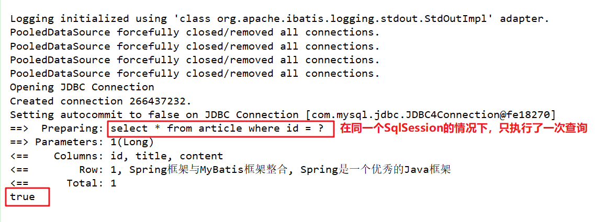
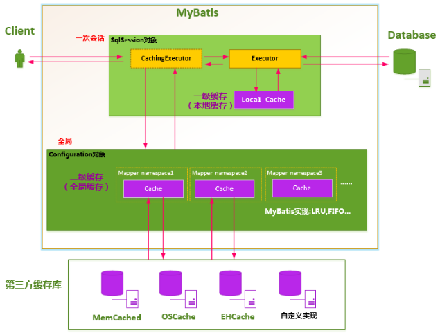
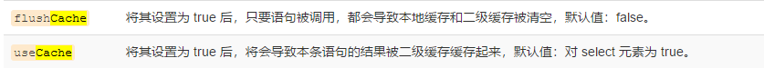
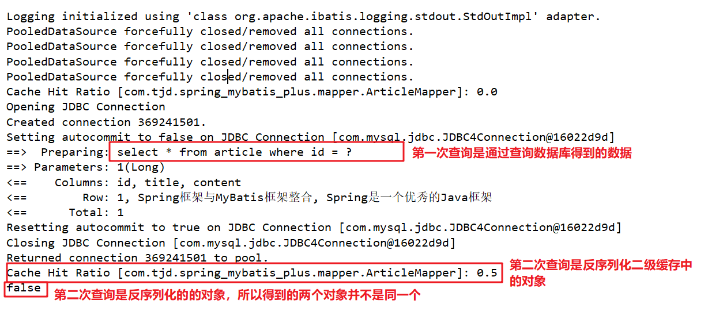

# MyBatis缓存机制

​	缓存是提高软硬件系统性能的一种重要手段；硬件层面，现代先进CPU有三级缓存，而MyBatis也提供了缓存机制，通过缓存机制可以大大提高我们查询性能。

## **一级缓存**

​	Mybatis对缓存提供支持，但是在没有配置的默认情况下，它只开启一级缓存，一级缓存只是相对于同一个SqlSession而言，一级缓存又叫本地缓存。所以在参数和SQL完全一样的情况下，我们使用同一个SqlSession对象调用一个Mapper方法，往往只执行一次SQL，因为使用SelSession第一次查询后，MyBatis会将其放在缓存中，以后再查询的时候，如果没有声明需要刷新，并且缓存没有超时的情况下，SqlSession都会取出当前缓存的数据，而不会再次发送SQL到数据库。


为什么要使用一级缓存，不用多说也知道个大概。但是还有几个问题我们要注意一下。

### **一级缓存的生命周期**

1. MyBatis在开启一个数据库会话时，会创建一个新的SqlSession对象，SqlSession对象中会有一个新的Executor对象。Executor对象中持有一个新的PerpetualCache对象；当会话结束时，SqlSession对象及其内部的Executor对象还有PerpetualCache对象也一并释放掉。
2. 如果SqlSession调用了`close()`方法，会释放掉一级缓存PerpetualCache对象，一级缓存将不可用。
3. 如果SqlSession调用了`clearCache()`，会清空PerpetualCache对象中的数据，但是该对象仍可使用。- 
4. SqlSession中执行了任何一个update操作(update()、delete()、insert()) ，都会清空PerpetualCache对象的数据，但是该对象可以继续使用。

### **如何判断两次查询是完全相同的呢**

mybatis认为，对于两次查询，如果以下条件都完全一样，那么就认为它们是完全相同的两次查询。

- 传入的statementId
- 查询时要求的结果集中的结果范围
- 这次查询所产生的最终要传递给JDBC java.sql.Preparedstatement的Sql语句字符串（boundSql.getSql() ）
-  传递给java.sql.Statement要设置的参数值


### **一级缓存的测试**

```java
public class FirstCachedTest {
    @Test
    public void test() throws Exception {
        InputStream resource = Resources.getResourceAsStream("SqlMapConfig.xml");
        SqlSessionFactory sessionFactory = new SqlSessionFactoryBuilder().build(resource);
        SqlSession session = sessionFactory.openSession();
        ArticleMapper mapper = session.getMapper(ArticleMapper.class);
        Article article1 = mapper.getArticleById(1L);
        Article article2 = mapper.getArticleById(1L);
        System.out.println(article1 == article2);  //输出true
    }
}
```

执行结果：



需要注意的是，这是在单独使用MyBatis时进行的以及缓存测试，`如果MyBatis与Spring整合，那么MyBatis的一级缓存可能会失效`，详情参见 https://blog.csdn.net/ctwy291314/article/details/81938882


## **二级缓存**

​	MyBatis的二级缓存是Application级别的缓存，它可以提高对数据库查询的效率，以提高应用的性能。



SqlSessionFactory层面上的二级缓存默认是不开启的，二级缓存的开启需要进行配置，`实现二级缓存的时候，MyBatis要求返回的POJO必须是可序列化的`。 

### **二级缓存的配置步骤**

#### 第一步：配置SqlMapConfig.xml（可省略）

我们实质上需要在全局配置文件中开启配置文件中的所有映射器已经配置的任何缓存，也就是`cacheEnabled`属性，但是这个属性默认值为true，所以实际上我们可以省略该步骤。

```xml
<settings>
	<setting name="cacheEnabled" value="true"/>
</settings>
```


#### 第二步：配置映射文件

##### cache标签配置

若要要启用全局的二级缓存，只需要在你的 SQL 映射文件中添加一行：

```xml
<cache/>
```

这个简单语句的效果如下:

- 映射语句文件中的所有 select 语句的结果将会被缓存。
- 映射语句文件中的所有 insert、update 和 delete 语句会刷新缓存。
- 缓存会使用最近最少使用算法（LRU, Least Recently Used）算法来清除不需要的缓存。
- 缓存不会定时进行刷新（也就是说，没有刷新间隔）。
- 缓存会保存列表或对象（无论查询方法返回哪种）的 1024 个引用。
- 缓存会被视为读/写缓存，这意味着获取到的对象并不是共享的，可以安全地被调用者修改，而不干扰其他调用者或线程所做的潜在修改。

##### **cache标签的属性**：

- eviction：设置缓存的清除策略，默认值为LRU
  - `LRU` – 最近最少使用：移除最长时间不被使用的对象。
  - `FIFO` – 先进先出：按对象进入缓存的顺序来移除它们。
  - `SOFT` – 软引用：基于垃圾回收器状态和软引用规则移除对象。
  - `WEAK` – 弱引用：更积极地基于垃圾收集器状态和弱引用规则移除对象。
- flushInterval：（刷新间隔）属性可以被设置为任意的正整数，设置的值应该是一个以毫秒为单位的合理时间量。 默认情况是不设置，也就是没有刷新间隔，缓存仅仅会在调用语句时刷新。
- size：（引用数目）属性可以被设置为任意正整数，要注意欲缓存对象的大小和运行环境中可用的内存资源。默认值是 1024。
- readOnly：（只读）属性可以被设置为 true 或 false（默认值）。只读的缓存会给所有调用者返回缓存对象的相同实例。 因此这些对象不能被修改。这就提供了可观的性能提升。`而可读写的缓存会（通过反序列化）返回缓存对象的拷贝。 速度上会慢一些，但是更安全，因此默认值是 false`。


##### **SQL语句标签配置**

​	缓存的配置和缓存实例会被绑定到 SQL 映射文件的命名空间中。 因此，同一命名空间中的所有语句和缓存将通过命名空间绑定在一起。` 每条语句可以自定义与缓存交互的方式，或将它们完全排除于缓存之外，这可以通过在每条语句上使用两个简单属性来达成`。 默认情况下，语句会这样来配置：

```xml
<select ... flushCache="false" useCache="true"/>
<insert ... flushCache="true"/>
<update ... flushCache="true"/>
<delete ... flushCache="true"/>
```

​	鉴于这是默认行为，显然你永远不应该以这样的方式显式配置一条语句。但如果你想改变默认的行为，只需要设置 flushCache 和 useCache 属性。比如，某些情况下你可能希望特定 select 语句的结果排除于缓存之外，或希望一条 select 语句清空缓存。类似地，你可能希望某些 update 语句执行时不要刷新缓存。




```xml
<select id="getArticleById" resultMap="articleMap" parameterType="long" useCache="true" flushCache="false">
	select * from article where id = #{id}
</select>
```


#### 第三步：让实体类实现Serializable接口

由于`<cache/>`标签readOnly标签默认是false，所以MyBatis在读写缓存是通过序列化与反序列化完成的。


### **二级缓存测试**

```java
public class FirstCachedTest {
    @Test
    public void test() throws Exception {
        InputStream resource = Resources.getResourceAsStream("SqlMapConfig.xml");
        SqlSessionFactory sessionFactory = new SqlSessionFactoryBuilder().build(resource);
        SqlSession session = sessionFactory.openSession();
        ArticleMapper mapper = session.getMapper(ArticleMapper.class);
        Article article1 = mapper.getArticleById(1L);
        session.close();
        //开启一个新的SqlSession，在不同的SqlSession中才会读取二级缓存（全局缓存）
        session=sessionFactory.openSession();
        ArticleMapper mapper2 = session.getMapper(ArticleMapper.class);
        Article article2 = mapper2.getArticleById(1L);
        System.out.println(article1 == article2);
    }
}

```

执行结果：



### 二级缓存需要注意的地方

​	对于查询多commit少且用户对查询结果实时性要求不高，此时采用mybatis二级缓存技术降低数据库访问量，提高访问速度。但不能滥用二级缓存，二级缓存也有很多弊端，从MyBatis默认二级缓存是关闭的就可以看出来。二级缓存是建立在同一个namespace下的，如果对表的操作查询可能有多个namespace，那么得到的数据就是错误的（脏读）。

​	举例来说：文章和标签，ArticleMapper、TagMapper。在查询文章时我们需要把文章对应的标签也查询出来，那么这个标签信息被二级缓存在ArticleMapper对应的namespace下，这个时候有人要修改Tag的基本信息，那就是在TagMapper的namespace下修改，他是不会影响到ArticleMapper的缓存的，那么你再次查找文章数据时，拿到的是缓存的数据，这个数据其实已经是过时的。

### 二级缓存脏读测试

Article和Tag是一对多的关系，其中Aticle是一，Tag是多。

**ArticleMapper**

```xml
<mapper namespace="com.tjd.spring_mybatis_plus.mapper.ArticleMapper">
    <cache />
    <resultMap id="articleMap" type="Article">
        <id column="id" property="id"></id>
        <result column="title" property="title"></result>
        <result column="content" property="content"></result>
        <collection property="tags" ofType="Tag" column="id" select="com.tjd.spring_mybatis_plus.mapper.TagMapper.getTagsByArticleId"></collection>
    </resultMap>
    <select id="getArticleById" resultMap="articleMap" parameterType="long" useCache="true">
      select * from article where id = #{id}
    </select>
</mapper>
```

**TagMapper**

```xml
<mapper namespace="com.tjd.spring_mybatis_plus.mapper.TagMapper">
    <cache/>
    <resultMap id="tagMap" type="Tag">
        <id column="id" property="id"></id>
        <result column="content" property="content"></result>
        <association  property="article" column="article_id" javaType="Article" select="com.tjd.spring_mybatis_plus.mapper.ArticleMapper.getArticleById"></association>
    </resultMap>
    <update id="updateTag" parameterType="Tag">
        update tag  set content=#{content} where id=#{id}
    </update>
    <select id="getTagsByArticleId" parameterType="long" resultMap="tagMap">
        select * from tag where article_id=#{article_id}
    </select>
</mapper>
```

**测试代码**

```java
@RunWith(SpringJUnit4ClassRunner.class)
@ContextConfiguration("classpath:applicationContext.xml")
public class SecondCachedErrorTest {

    @Autowired
    private ArticleMapper articleMapper;

    @Autowired
    private TagMapper tagMapper;

    @Test
    public void test() throws IOException {
        //第一次查询，查询出来的aticle对象被缓存在ArticleMapper的namespace下
        Article article = articleMapper.getArticleById(1L);
        Tag tag = article.getTags().get(0);
        tag.setContent("dasdas");
        //更新Tag，那么TagMapper下的二级缓存被刷新（清空）
        tagMapper.updateTag(tag);
        //再次查询Article，此时获得是缓存数据，而关联的tag数据已经过时
        Article article2 = articleMapper.getArticleById(1L);
        //TagMapper对应的namespace下的缓存由于在更新时被刷新（清空），所以查询的结果是正确的
        List<Tag> tags = tagMapper.getTagsByArticleId(1L);
    }
}
```


​	**根据以上测试，我们明白想要使用二级缓存时需要想好两个问题**：

- 对该表的操作与查询都在同一个namespace下，其他的namespace如果有操作，就会发生数据的脏读。
- 对关联表的查询，关联的所有表的操作都必须在同一个namespace。
- 在有多表查询的情况下建议不使用二级缓存。


## 两级缓存的优先级

如果两级缓存同时开启，那么二级缓存比一级缓存优先级高，也就是在执行数据库查询操作时，优先读取二级缓存中的内容。


文章参考至：

[https://blog.csdn.net/ctwy291314/article/details/81938882](https://blog.csdn.net/ctwy291314/article/details/81938882)

[https://www.cnblogs.com/happyflyingpig/p/7739749.html](https://www.cnblogs.com/happyflyingpig/p/7739749.html)

[https://www.cnblogs.com/yuluoxingkong/p/8205858.html](https://www.cnblogs.com/yuluoxingkong/p/8205858.html)

[http://www.mybatis.org/mybatis-3/zh/sqlmap-xml.html](http://www.mybatis.org/mybatis-3/zh/sqlmap-xml.html)

