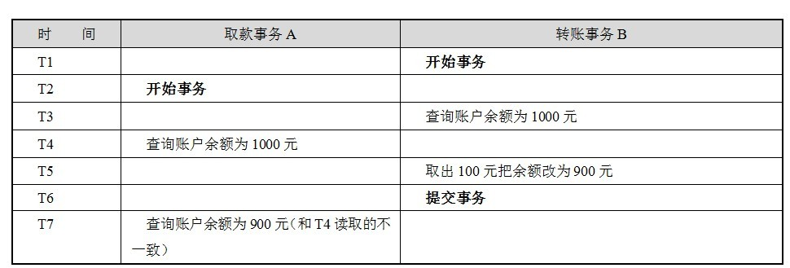

# 事务并发问题

一个数据库可能拥有多个访问客户端，这些客户端都可以并发方式访问数据库。数据库中的相同数据可能同时被多个事务访问，如果没有采取必要的隔离措施，就会导致各种并发问题，破坏数据的完整性。这些问题可以归结为5类，包括3类数据读问题（ 脏读、 不可重复读和 幻读）以及2类数据更新问题（ 第一类丢失更新和 第二类丢失更新）。下面，我们分别通过实例讲解引发问题的场景。 

## 脏读（dirty read）

​	A事务读取B事务尚未提交的更改数据，并在这个数据的基础上操作。如果恰巧B事务回滚，那么A事务读到的数据根本是不被承认的。来看取款事务和转账事务并发时引发的脏读场景：  

在这个场景中，B希望取款500元而后又撤销了动作，而A往相同的账户中转账100元，就因为A事务读取了B事务尚未提交的数据，因而造成账户白白丢失了500元。

## 不可重复读（unrepeatable read） 

不可重复读是指 A事务读取了B事务已经提交的更改数据。假设A在取款事务的过程中，B往该账户转账100元，A两次读取账户的余额发生不一致： 

在同一事务中，T4时间点和T7时间点读取账户存款余额不一样。 

## 幻读（phantom read） 

A事务读取B事务提交的新增数据，这时A事务将出现幻读的问题。幻读一般发生在计算统计数据的事务中，举一个例子，假设银行系统在同一个事务中，两次统计存款账户的总金额，在两次统计过程中，刚好新增了一个存款账户，并存入100元，这时，两次统计的总金额将不一致：  

幻读和不可重复读是两个容易混淆的概念，前者是指读到了其他已经提交事务的新增数据，而后者是指读到了已经提交事务的更改数据（更改或删除），为了避免这两种情况，采取的对策是不同的，防止读取到更改数据，只需要对操作的数据添加行级锁，阻止操作中的数据发生变化，而防止读取到新增数据，则往往需要添加表级锁——将整个表锁定，防止新增数据（Oracle使用多版本数据的方式实现）。  

## 第一类丢失更新

A事务撤销时，把已经提交的B事务的更新数据覆盖了。这种错误可能造成很严重的问题，通过下面的账户取款转账就可以看出来： 

A事务在回滚时，“不小心”将B事务已经转入账户的金额给抹去了。 

## 第二类丢失更新

A事务覆盖B事务已经提交的数据，造成B事务所做操作丢失：  

上面的例子里由于支票转账事务覆盖了取款事务对存款余额所做的更新，导致银行最后损失了100元，相反如果转账事务先提交，那么用户账户将损失100元。