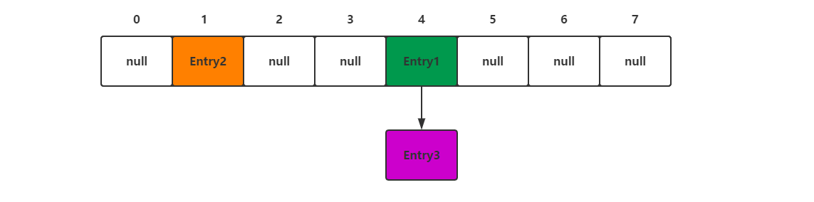
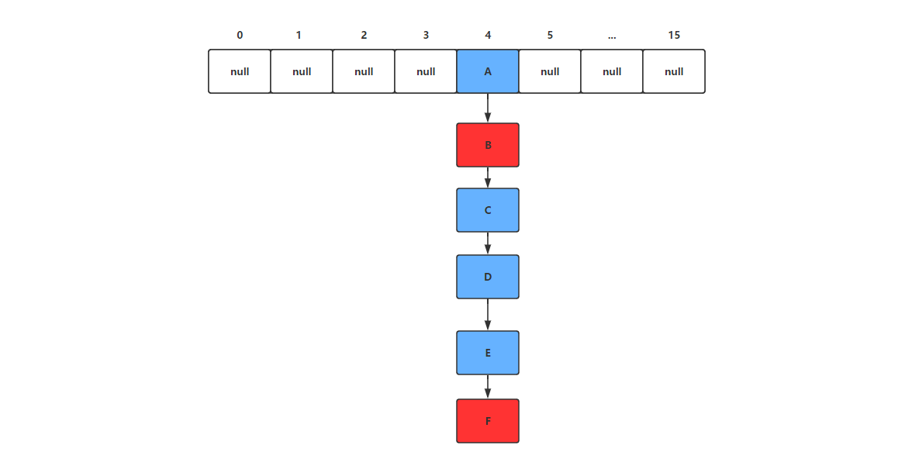

# JDK8HashMap源码分析

​		HashMap是Java程序员使用频率最高的用于映射(键值对)处理的数据类型。随着JDK（Java Developmet Kit）版本的更新，JDK1.8对HashMap底层的实现进行了优化，例如引入红黑树的数据结构和扩容的优化等。

​		Java为数据结构中的映射定义了一个接口java.util.Map，此接口主要有四个常用的实现类，分别是HashMap、Hashtable、LinkedHashMap和TreeMap，类继承关系如下图所示：


下面针对各个实现类的特点做一些说明：

(1) HashMap：它根据键的hashCode值存储数据，大多数情况下可以直接定位到它的值，因而具有很快的访问速度，但遍历顺序却是不确定的。 HashMap最多只允许一条记录的键为null，允许多条记录的值为null。HashMap非线程安全，即任一时刻可以有多个线程同时写HashMap，可能会导致数据的不一致。如果需要满足线程安全，可以用 Collections的synchronizedMap方法使HashMap具有线程安全的能力，或者使用ConcurrentHashMap。

(2) Hashtable：Hashtable是遗留类，很多映射的常用功能与HashMap类似，不同的是它承自Dictionary类，并且是线程安全的，任一时间只有一个线程能写Hashtable，并发性不如ConcurrentHashMap，因为ConcurrentHashMap引入了分段锁。Hashtable不建议在新代码中使用，不需要线程安全的场合可以用HashMap替换，需要线程安全的场合可以用ConcurrentHashMap替换。

(3) LinkedHashMap：LinkedHashMap是HashMap的一个子类，保存了记录的插入顺序，在用Iterator遍历LinkedHashMap时，先得到的记录肯定是先插入的，也可以在构造时带参数，按照访问次序排序。

(4) TreeMap：TreeMap实现SortedMap接口，能够把它保存的记录根据键排序，默认是按键值的升序排序，也可以指定排序的比较器，当用Iterator遍历TreeMap时，得到的记录是排过序的。如果使用排序的映射，建议使用TreeMap。在使用TreeMap时，key必须实现Comparable接口或者在构造TreeMap传入自定义的Comparator，否则会在运行时抛出java.lang.ClassCastException类型的异常。

`对于上述四种Map类型的类，要求映射中的key是不可变对象`。不可变对象是该对象在创建后它的哈希值不会被改变。如果对象的哈希值发生变化，Map对象很可能就定位不到映射的位置了。

## HashMap的基本原理

​		如果小伙伴们对HashMap的基本原理还不熟悉，建议大家参考 [漫画：什么是HashMap？](https://mp.weixin.qq.com/s/HzRH9ZJYmidzW5jrMvEi4w)一文。这里对基本原理进行简单的梳理：

​		HashMap是一个用于存储Key-Value键值对的集合，每一个键值对也叫做**Entry**。这些个键值对（Entry）分散存储在一个数组当中（这个数组被称为Hash桶数组），这个数组就是HashMap的基础。


​		那么我们如何将对象按照key的值放入到数组中去呢？这里我们就需要借助Hash函数，Hash函数可以将任何一个对象转换为一个int类型的值，但是这还不能将元素插入到数组中，因为数组的容量有限，而int类型的值非常大，我们不可能将int类型的Hash值与数组的元素一一对应，那么解决这种问题最简单的方法就是取模（%），将`Hash值%数组容量`就会得到一个不大于数组容量的一个数值，就可以将元素插入到数组中。

​		但是，因为HashMap中数组的长度是有限的，当插入的Entry越来越多时，再完美的Hash函数也难免会出现index冲突的情况（Hash冲突就是两个不同Entry计算出来的数组索引值相同）。那么解决Hash冲突最简单的方法采用拉链法，也就是将冲突的Entry以链表的形式存在。

​	

​		在JDK7之前，HashMap解决Hash冲突时都是采用拉链法解决的；而在JDK8开始，HashMap采用链表+红黑树相结合的方式解决的，具体实现原理在后序源码讲解中体现。

​		当HashMap中的数组中保存的Entry太多后，Hash冲突的可能性不断增大，这样会大大降低HashMap的执行效率，所以HashMap引入了扩容机制。这里就需要了解加载因子（负载因子）的概念，当元素个数大>数组容量*加载因子时就会触发扩容，扩容时HashMap中的数组增加至原来两倍，将原Map中的数组重新散列到新的数组中去，至此完成了扩容操作。


## **HashMap源码分析**

### **HashMap中的常量值**

```java
	/**
     * 默认的数组容量为16
     */
    static final int DEFAULT_INITIAL_CAPACITY = 1 << 4; // aka 16

    /**
     *	数组的最大容量。在后面我们会将每一个数组元素看成一个桶，因为数组元素在后面可能连接的是一个链表或者是一颗树。
     */
    static final int MAXIMUM_CAPACITY = 1 << 30;

    /**
     * 默认的加载因子（负载因子）为0.75
     */
    static final float DEFAULT_LOAD_FACTOR = 0.75f;

    /**
     * 当链表长度到达TREEIFY_THRESHOLD时将链表转换为红黑树，也就是说链表最长为7。
     */
    static final int TREEIFY_THRESHOLD = 8;

     /**
     * . 桶的链表还原阈值：即 红黑树转为链表的阈值，当在扩容（resize（））时（此时HashMap的数据存储位置会重新计算），在重新计算存储位置后，当原有的红黑树内数量 < 6时，则将 红黑树转换成链表
     */
    static final int UNTREEIFY_THRESHOLD = 6;
```

​		上面部分常量值有可能不能完全理解，我们这里只做一些了解即可。

### **HashMap中几个关键字段**

```java
int threshold;             // 所能容纳的key-value对极限 (阈值)
final float loadFactor;    // 负载因子 
int modCount;  //用于迭代的快速失败机制
int size;  	//HashMap中实际存在的键值对数量
```

- **threshold和loadFactor**：Node[] table的初始化长度length(默认值是16)，Load factor为负载因子(默认值是0.75)，threshold是HashMap所能容纳的最大数据量的Node(键值对)个数。threshold = length * Load factor。也就是说，在数组定义好长度之后，负载因子越大，所能容纳的键值对个数越多。
- **size**：这个字段其实很好理解，就是HashMap中实际存在的键值对数量。注意和table的长度length、容纳最大键值对数量threshold的区别。
- **modCount**：这个字段主要用来记录HashMap内部结构发生变化的次数，主要用于迭代的快速失败。强调一点，内部结构发生变化指的是结构发生变化，例如put新键值对，但是某个key对应的value值被覆盖不属于结构变化

### **构造函数分析**

```java
 /**
     * @param  initialCapacity HashMap初始化桶的个数（数组的容量）
     * @param  loadFactor      加载因子小于0抛出异常
     */
    public HashMap(int initialCapacity, float loadFactor) {
    	//如果initialCapacity小于0抛出异常
        if (initialCapacity < 0)
            throw new IllegalArgumentException("Illegal initial capacity: " + initialCapacity);
        //如果initialCapacity大于最大容量，则将初始化容量设为最大值
        if (initialCapacity > MAXIMUM_CAPACITY)
            initialCapacity = MAXIMUM_CAPACITY;
        //当加载因子小于等于0
        if (loadFactor <= 0 || Float.isNaN(loadFactor))
            throw new IllegalArgumentException("Illegal load factor: " +
                                               loadFactor);
        this.loadFactor = loadFactor;
        //如果用户传入的initialCapacity值不是2的幂，那么返回一个不小于它的2的幂
        this.threshold = tableSizeFor(initialCapacity);
    }
```

​	构造函数中传入了initialCapacity，loadFactor。

​	initialCapacity表示HashMap中桶的个数。

​	loadFactor是HashMap的加载因子（负载因子），负载因子决定HashMap的扩容时机，如果HashMap中存储的Entry数量大于等于 `当前数组容量*加载因子时`就会触发数组的扩容操作。举例来说：假如当前数组容量为16，加载因子为0.75，那么此时数组中最大的元素个数为16*0.75=12。

#### **tableSizeFor方法的作用**

​	在构造函数中调用了一个名为tableSizeFor方法，它将用户传入的初始容量转换为一个不小该值的2的幂值。例如：传入initialCapacity=11，他返回的是initialCapacity=16。这样做的目的到底是为什么呢？

​	前面说到了元素定位时会使用取模运算，实际上这种算法效率非常低，为了实现更加高效的算法，HashMap采用位运算的方式：

​	**index =  HashCode（Key） &  （Length - 1）** 

下面我们以值为“book”的Key来演示整个过程：

1. 计算book的hashcode，结果为十进制的3029737，二进制的101110001110101110 1001。

2. 假定HashMap长度是默认的16，计算Length-1的结果为十进制的15，二进制的1111。

3. 把以上两个结果做**与运算**，101110001110101110 1001 & 1111 = 1001，十进制是9，所以 index=9。

采用位运算得到的结果与取模运算的效果完全相同，但是这样做的前提就是Length必须是2的幂。这也就是为什么HashMap会定义tableSizeFor方法返回容量的2次幂值。


### **静态内部类**

```java
// Node实现了Map.Entry<K,V>接口，也就是说Node实际上就是我们前面提到的Entry
static class Node<K,V> implements Map.Entry<K,V> {
        final int hash;//保存当前Entry key的hash值，由于后面会多次使用该Hash值，避免重复计算
        final K key; 
        V value;
        Node<K,V> next;//指向链表下一个节点

        Node(int hash, K key, V value, Node<K,V> next) {
            this.hash = hash;
            this.key = key;
            this.value = value;
            this.next = next;
        }

        public final K getKey()        { return key; }
        public final V getValue()      { return value; }
        public final String toString() { return key + "=" + value; }

        public final int hashCode() {
            return Objects.hashCode(key) ^ Objects.hashCode(value);
        }

        public final V setValue(V newValue) {
            V oldValue = value;
            value = newValue;
            return oldValue;
        }

        public final boolean equals(Object o) {
            if (o == this)
                return true;
            if (o instanceof Map.Entry) {
                Map.Entry<?,?> e = (Map.Entry<?,?>)o;
                if (Objects.equals(key, e.getKey()) &&
                    Objects.equals(value, e.getValue()))
                    return true;
            }
            return false;
        }
}
```

​		看完构造函数和类的常量值以及Entry的结构后，我们就以HashMap中put方法入手，看看HashMap中的底层原理。


### **put方法源码**

```java
	public V put(K key, V value) {
        return putVal(hash(key), key, value, false, true);
    }

	/**
	* 计算key的hash值，该hash算法调用了Obejct的hashcode
	* 返回的是key.hashCode()&(key.hashCode()>>>16),其中>>>代表无符号右移
	**/
	static final int hash(Object key) {
        int h;
        return (key == null) ? 0 : (h = key.hashCode()) ^ (h >>> 16);
    }

    final V putVal(int hash, K key, V value, boolean onlyIfAbsent,
                   boolean evict) {
        Node<K,V>[] tab; 
        Node<K,V> p; 
        int n, i;
        //将Map内部的table数组赋给局部变量tab，如果table为空或者大小为0，则使用resize进行扩容
        if ((tab = table) == null || (n = tab.length) == 0)
            n = (tab = resize()).length;

     	/**
     	 * n-1&hash的效果就是 hash%n （因为HashMap中封装的数组的长度都是2的幂(默认16)）
     	 * 如果数组对应位置没有元素（没有发生Hash冲突），则新建一个Node元素，放入该数组位置
     	 */
        if ((p = tab[i = (n - 1) & hash]) == null)
            tab[i] = newNode(hash, key, value, null);

        /**
         * 发生Hash冲突后的处理
         */
        else {
            Node<K,V> e; K k;
            if (p.hash == hash &&
                ((k = p.key) == key || (key != null && key.equals(k))))
                e = p;
            else if (p instanceof TreeNode)
                e = ((TreeNode<K,V>)p).putTreeVal(this, tab, hash, key, value);
            else {
            	//如果此时解决Hash冲突的数据结构为链表，则遍历到链表尾部
                for (int binCount = 0; ; ++binCount) {
                    if ((e = p.next) == null) {
                    	//向链表中添加新元素
                        p.next = newNode(hash, key, value, null);
                        //如果新元素未加入之前，链表长度大于等于7了则需要将链表转换为红黑树了，换句话说加入新元素后链表长度大于等于8了，就转成红黑树。
                        if (binCount >= TREEIFY_THRESHOLD - 1) // -1 for 1st
                            treeifyBin(tab, hash);//将链表转换为红黑树
                        //跳出循环
                        break;
                    }
                    //判断key是否相等
                    //这里的条件判断显示出HashMap允许一个key==null的键值对存储
                    if (e.hash == hash &&
                        ((k = e.key) == key || (key != null && key.equals(k))))
                        break;
                    p = e;
                }
            }
            //如果找到了一个相同的key，则根据onlyIfAbsent判断是否需要替换旧的value。
            //onlyIfAbsent为true时代表不替换原先元素。
            if (e != null) { // existing mapping for key
                V oldValue = e.value;
                if (!onlyIfAbsent || oldValue == null)
                    e.value = value;
                afterNodeAccess(e);
                return oldValue;
            }
        }

        //被修改的次数，fast-fail机制
        ++modCount;

        //如果HashMap中存储的节点数量是否到达了扩容的阈值
        if (++size > threshold)
        	//进行扩容
            resize();
        afterNodeInsertion(evict);
        return null;
    }
```


### **resize方法**

```java
/**
     * 初始化Map中的Node数组，如果已经初始化则进行扩容操作
     */
    final Node<K,V>[] resize() {
        Node<K,V>[] oldTab = table;
        //获取数组的原始大小
        int oldCap = (oldTab == null) ? 0 : oldTab.length;
        //获取原始阈值
        int oldThr = thresholds;
        //用于记录新容量和新阈值
        int newCap, newThr = 0;
        //如果原始容量大于0，则代表当前Map已经初始化过了，则应该进行扩容操作
        if (oldCap > 0) {
            if (oldCap >= MAXIMUM_CAPACITY) {
                threshold = Integer.MAX_VALUE;
                return oldTab;
            }
            //将新的容量设为原先的两倍（oldCap<<1）
            else if ((newCap = oldCap << 1) < MAXIMUM_CAPACITY &&
                     oldCap >= DEFAULT_INITIAL_CAPACITY)
            	//将阈值也设为原先的两倍
                newThr = oldThr << 1; // double threshold
        }
        // 初始化数组走这里
        // 如果构造函数定义了数组初始容量
        else if (oldThr > 0) // initial capacity was placed in threshold
            newCap = oldThr;

        // 如果构造函数没有定义初始容量
        else {               // zero initial threshold signifies using defaults
        	//初始化数组容量（16）
            newCap = DEFAULT_INITIAL_CAPACITY;	
            //初始化阈值（16*0.75 = 12）
            newThr = (int)(DEFAULT_LOAD_FACTOR * DEFAULT_INITIAL_CAPACITY);
        }
        // 构造函数中定义了初始容量 在这里计算阈值
        if (newThr == 0) {
            float ft = (float)newCap * loadFactor;
            newThr = (newCap < MAXIMUM_CAPACITY && ft < (float)MAXIMUM_CAPACITY ?
                      (int)ft : Integer.MAX_VALUE);
        }
        // 阈值
        threshold = newThr;
        @SuppressWarnings({"rawtypes","unchecked"})

        //创建一个新的数组，可用于初始化，也可用于扩容
        Node<K,V>[] newTab = (Node<K,V>[])new Node[newCap];
        table = newTab;
        if (oldTab != null) {
        	//遍历旧数组，将就数组中的元素，重新散列到新数组中去
            for (int j = 0; j < oldCap; ++j) {
            	//e表示数组上的节点
                Node<K,V> e;
                if ((e = oldTab[j]) != null) {
                	//把头节点置为空
                    oldTab[j] = null;
                    //当就数组中头元素没有链表子节点时，直接散列该元素
                    if (e.next == null)
                        newTab[e.hash & (newCap - 1)] = e;

                    //如果数组头元素下面还有其他子节点，且子节点是树结构
                    else if (e instanceof TreeNode)
                        ((TreeNode<K,V>)e).split(this, newTab, j, oldCap);

                    //如果是一个链表
                    else { // preserve order
                        Node<K,V> loHead = null, loTail = null;
                        Node<K,V> hiHead = null, hiTail = null;
                        Node<K,V> next;
                        do {
                            next = e.next;
                            // 还是原来的索引值
                            if ((e.hash & oldCap) == 0) {
                                if (loTail == null)
                                    loHead = e;
                                else
                                    loTail.next = e;
                                loTail = e;
                            }
                            // 不是原来的索引值了 需要迁移
                            else {
                                if (hiTail == null)
                                    hiHead = e;
                                else
                                    hiTail.next = e;
                                hiTail = e;
                            }
                        } while ((e = next) != null);
                        if (loTail != null) {
                        	//将尾节点的next指针置为空
                            loTail.next = null;
                            //将链接的不移动链表放到原索引位置
                            newTab[j] = loHead;
                        }
                        if (hiTail != null) {
                            hiTail.next = null;
                            //将链接的移动链表放到新的索引位置
                            newTab[j + oldCap] = hiHead;
                        }
                    }
                }
            }
        }
        return newTab;
    }
```

从66行开始代码进入了链表元素的迁移工作，`loHead`和`loTail`两个节点分别记录不需要移动的链表的头部和尾部，`hiHead`和`hiTail`分别记录需要移动的链表头部和尾部。

假设在扩容的时候某个数组下有这样一个链表 :



其中，假设天蓝色部分的不需要挪动，红色部分的需要挪动

第一步 : 建立`loHead` `loTail` `hiHead` `hiTail`四个节点

第二步 ：


第三步 :


...第N步：


## **总结**

**下图是美团技术团队的put函数的流程总结** ：


**参考文章**：

[漫画：什么是HashMap](https://mp.weixin.qq.com/s/HzRH9ZJYmidzW5jrMvEi4w)

[HashMap源码分析——put和get（一）](https://www.jianshu.com/p/8244a21bd2b4)

[美团HashMap技术博客](https://tech.meituan.com/2016/06/24/java-hashmap.html)

[红黑联盟，Java类集框架之HashMap(JDK1.8)源码剖析，2015](https://www.2cto.com/kf/201505/401433.html?ysxejs=ujfxo2)

[CSDN博客频道， 教你初步了解红黑树，2010](https://blog.csdn.net/v_july_v/article/details/6105630)