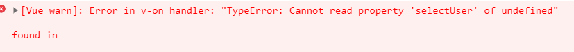

# 使用$refs调用子组件undefined的问题

> 本文参考至：https://blog.csdn.net/m0_46156566/article/details/106476362

今天用vue写项目，用$refs调用子组件方法遇到这样的问题，如下图：




出现这个问题的原因主要是在vue组件还没加载完方法，就开始进行执行组件方法就会报这个错误，解决的办法很简单，只要在让方法在vue加载完组件之后再进行执行就好了！

```js
this.$nextTick(()=>{
     this.$refs.hqMaintainSelect.selectUser(data.firstMaintainDepartmentId, data.firstMaintainUserId);
})
```

