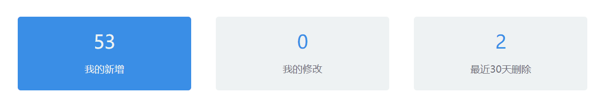

# 自定义组件实现v-model绑定值

最近有这么一个需求，需要实现一个类似于ElementUI中的`<el-radio>`的自定义样式单选框，类似于这样：



我们需要为自己的组件实现v-model指令：

当一个组件需要实现v-model指令时，我们需要借助名为`value`的prop和名为`input`的事件。换句话说，如果我们v-model绑定了一个值，那么在组件内部，我们需要通过一个名为`value`的prop接收该值；如果组件内部需要改变v-model绑定的参数，可以借助名为`input`的事件改变它：

```vue
<!-- 自定义仪表盘组件，交互效果类似于单选框，多个组件之间实现互斥
     使用方法：
        1.引入组件
        2.使用v-model绑定属性，绑定同一个属性即可实现互斥效果;
          label属性指明当前组件的值;
          title指明仪表盘标题;
          summary指明仪表盘描述信息;
        <MessageBlockSelect v-model="xxModel" title="123" :label="1" summary="我的新增"></MessageBlockSelect>
-->
<template>
  <el-col :span="span">
    <div :class="{'summary':value!=label,'summary-active':value==label}" @click="click">
      <div class="summary-title none-select">
        {{ title }}
      </div>
      <div class="summary-description none-select">
        {{ description }}
      </div>
    </div>
  </el-col>
</template>

<script>
export default {
  name: "MessageBlockSelect",
  props: {
    span: {
      type: Number,
      default: 4
    },
    title: [String,Number],
    description: [String,Number],
    label: [Number, String],
    value: [Number, String]
  },
  methods: {
    click() {
      this.$emit('input', this.label);
    }
  }
}
</script>

<style scoped>
.summary {
  background-color: #eef2f3;
  padding: 20px;
  margin: 20px;
  height: 80px;
  border-radius: 5px;
  cursor: pointer;
  text-align: center;
}

.summary-active {
  background-color: #3a8ee6;
  padding: 20px;
  margin: 20px;
  height: 80px;
  border-radius: 5px;
  cursor: pointer;
  text-align: center;
}

.summary .summary-title {
  font-size: 30px;
  color: #3a8ee6;
}

.summary .summary-description {
  margin-top: 15px;
  margin-bottom: 20px;
  color: #717178;
}

.summary-active .summary-title {
  font-size: 30px;
  color: #eef2f3;
}

.summary-active .summary-description {
  margin-top: 15px;
  margin-bottom: 20px;
  color: #eef2f3;
}

.none-select {
  -webkit-touch-callout: none;
  -webkit-user-select: none;
  -khtml-user-select: none;
  -moz-user-select: none;
  -ms-user-select: none;
  user-select: none;
}
</style>
```

```vue
<MessageBlockSelect v-model="myAdd" title="53" :label="1" summary="我的新增"></MessageBlockSelect>
<MessageBlockSelect v-model="modify" title="0" :label="2" summary="我的修改"></MessageBlockSelect>
<MessageBlockSelect v-model="thirtyDayDelete" title="2" :label="3" summary="最近30天删除"></MessageBlockSelect>
```

