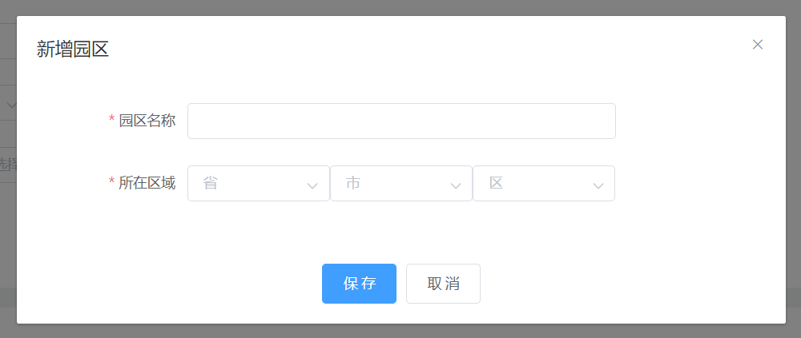

# Vue子组件修改父组件的props值

有时我们需要在子组件中修改父组件通过传入`props`的值，加入我们需要定义一个组件：

```vue
<park-save :visible="parkSaveVisible"></park-save>
```

当`parkSaveVisible=true`时，显示子组件的`Dialog框`：



子组件完成保存完成后自动隐藏`Dialog`然后将父组件中的`parkSaveVisible`置为`false`。

### 第一步：在父组件中绑定的值加上`.sync`

```vue
<park-save :visible.sync="parkSaveVisible"></park-save>

data(){
    return {
        parkSaveVisible: false
    }
}
```

### 第二步：在子组件中发送事件更新父组件中的值

```vue
<el-dialog title="新增园区" :visible.sync="visible">
    ...
</el-dialog>
 
//props
props:{
   visible:Boolean,
}
 
//methods函数
changeValue() {
    this.$emit("update:visible", false)
}
```

