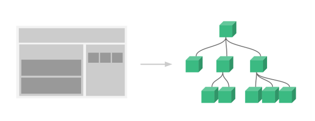
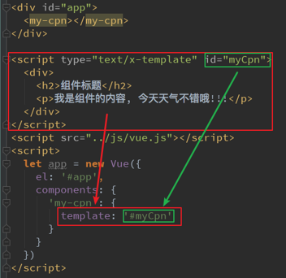
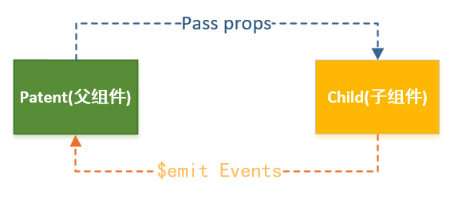
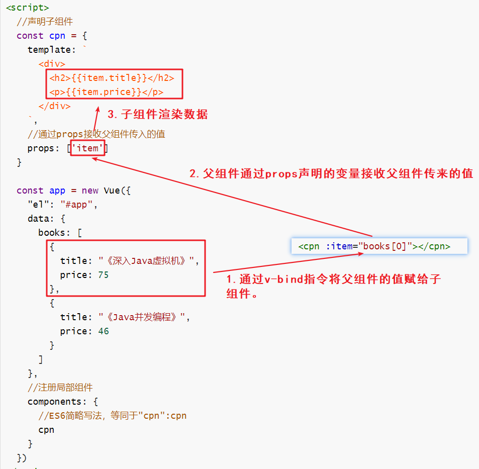
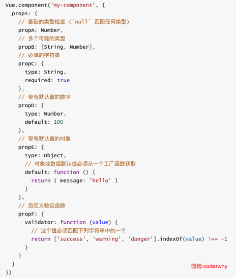
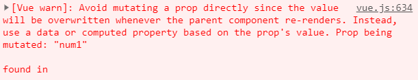
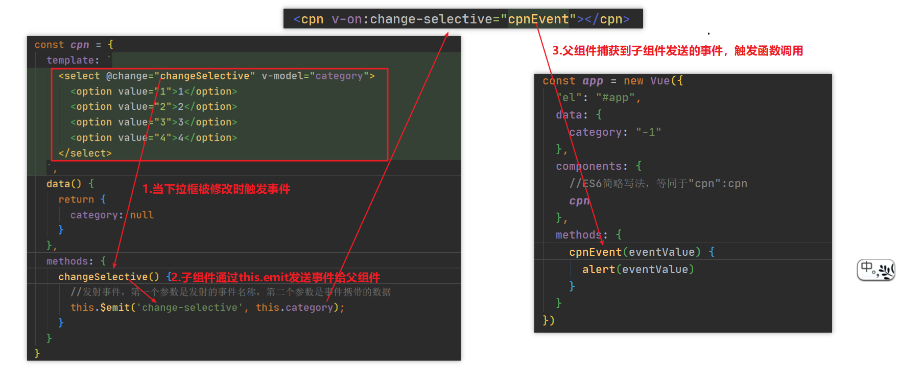
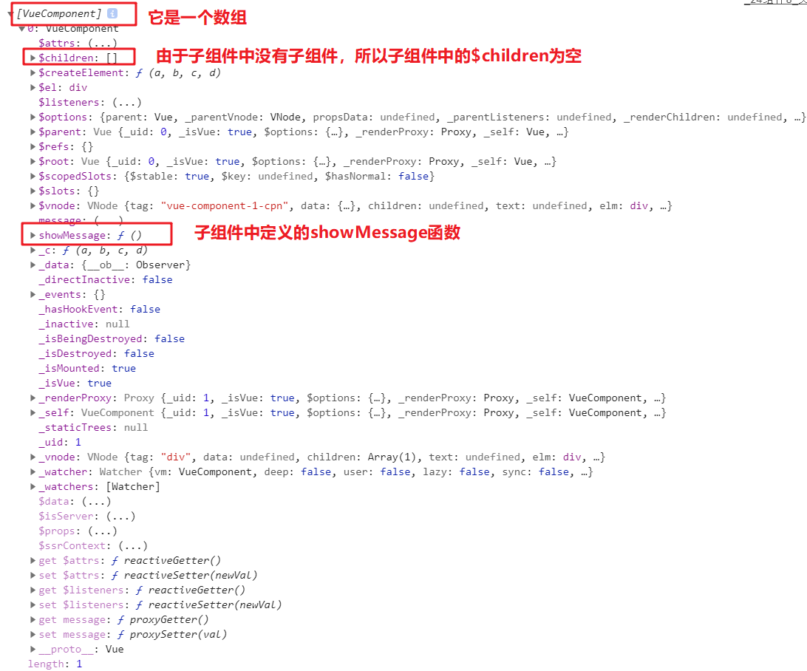

# Vue自定义组件

- [一. 组件化的基本流程](#组件化的基本流程)
- [二. 全局组件和局部组件](#全局组件和局部组件)
- [三. 组件注册的语法糖](#组件注册的语法糖)
- [四. 组件模板的抽离](#组件模板的抽离)
- [五. data必须是一个函数](#data必须是一个函数)
- [六. 组件之间的通信](#组件之间的通信)
  - [6.1 父传子](#父传子)
    - [6.6.1 props驼峰命名避坑](#props驼峰命名避坑)
    - [6.6.2 props数据验证](#props数据验证)
    - [6.1.3 子组件中应该避免修改props中的值](#子组件中应该避免修改props中的值)
  - [6.2 子传父](#子传父)
- [七.组件访问](#组件访问)
  - [7.1 父组件访问子组件](#父组件访问子组件)
    - [7.1.1 $children](#$children)
    - [7.1.2 $refs](#$refs)
  - [7.2 子组件访问父组件](#子组件访问父组件)
    - [7.2.1 $parent](#$parent)
    - [7.2.2 $root](#$root)

组件化是Vue.js中的重要思想，它提供了一种抽象，让我们可以开发出一个个独立可复用的小组件来构造我们的应用。任何的应用都会被抽象成一颗组件树。



## 一. 组件使用的基本流程<a name="组件化的基本流程"> </a>

组件的使用分成三个步骤：

- 创建组件构造器
- 注册组件
- 使用组件

创建组件构造器：

```javascript
const cpn = Vue.extend({
  template: `
    <div>
      <h2>标题</h2>
      <p>内容1</p>
      <p>内容2</p>
    </div>
  `
})
```

注册组件：

```java
//第一个参数是组件的标签名，第二个参数是组件的构造器
Vue.component('cpn',cpn);
```

使用组件：

```html
<cpn></cpn>
```

**Vue.extend()**：

- 调用Vue.extend()创建的是一个组件构造器。 
- 通常在创建组件构造器时，传入template代表我们自定义组件的模板。
- 该模板就是在使用到组件的地方，要显示的HTML代码。
- 事实上，这种写法在Vue2.x的文档中几乎已经看不到了，它会直接使用下面我们会讲到的语法糖，但是在很多资料还是会提到这种方式，而且这种方式是学习后面方式的基础。

**Vue.component()**：

- 调用Vue.component()是将刚才的组件构造器注册为一个组件，并且给它起一个组件的标签名称。

- 所以需要传递两个参数：1.注册组件的标签名、2.组件构造器

## 二. 全局组件和局部组件<a name="全局组件和局部组件"> </a>

### 2.1 全局组件

当我们通过调用Vue.component()注册组件时，组件的注册是全局的。这意味着该组件可以在任意Vue实例下使用。我们下面创建了两个Vue实例，然后通过注册全局组件，在两个Vue实例所管理的HTML标签下都能够使用该组件：

```html
<!--全局组件能够在多个Vue实例中使用-->
<!DOCTYPE html>
<html lang="en">
<head>
  <meta charset="UTF-8">
  <title>Title</title>
</head>
<body>
  <div id="app1">
    <cpn></cpn>
  </div>
  <div id="app2">
    <cpn></cpn>
  </div>
</body>
<script src="./js/vue.js"></script>
<script>
  const cpn = Vue.extend({
    template: `
      <div>
        <h2>标题</h2>
        <p>内容1</p>
        <p>内容2</p>
      </div>
    `
  })
  //注册全局组件
  Vue.component('cpn', cpn);
  const app1 = new Vue({
    "el": "#app1",
    data: {}
  });
  const app2 = new Vue({
    "el": "#app2",
    data: {}
  });
</script>
</body>
</html>
```

### 2.2 局部组件

如果我们注册的组件是挂载在某个实例中, 那么就是一个局部组件：

```javascript
const app2 = new Vue({
  "el": "#app2",
  data: {},
  //注册局部组件，局部组件只能在当前实例中使用
  components: {
    'cpn': cpn
  }
});
```

## 三. 组件注册的语法糖<a name="组件注册的语法糖"> </a>

在上面介绍了组件注册的方式，可能会有些繁琐。在Vue官网上介绍的是简化的注册方式，主要是省去了调用Vue.extend()的步骤，可以直接使用一个对象来代替：

```javascript
Vue.component('cpn', {
  template: `
    <div>
      <h2>标题</h2>
      <p>内容1</p>
      <p>内容2</p>
    </div>`  
});
```

## 四. 组件模板的抽离<a name="组件模板的抽离"> </a>

刚才，我们通过语法糖简化了Vue组件的注册过程，另外还有一个地方的写法比较麻烦，就是template模块写法.如果我们能将其中的HTML分离出来写，然后挂载到对应的组件上，必然结构会变得非常清晰。Vue提供了两种方案来定义HTML模块内容：

### 4.1 使用`<script>`标签



### 4.2 使用`<template>`标签


## 五. data必须是一个函数<a name="data必须是一个函数"> </a>

**一个组件的 data 选项必须是一个函数**，因此每个实例可以维护一份被返回对象的独立的拷贝。

```javascript
Vue.component('cpn', {
  template: `
    <div>
      <h2>{{title}}</h2>
      <p>{{content1}}</p>
      <p>{{content2}}</p>
    </div>
  `,
  data() {
    return {
      title: "标题",
      content1: "内容一",
      content2: "内容二"
    }
  }
});
```

## 六. 组件之间的通信<a name="组件之间的通信"> </a>



- Parent->Child：通过props向子组件传递数据。
- Child->Parent：通过事件向父组件发送消息。

### 6.1 父传子 <a name="父传子"> </a>

在开发中，往往一些数据确实需要从上层传递到下层。比如在一个页面中，我们从服务器请求到了很多的数据，其中一部分数据，并非是我们整个页面的大组件来展示的，而是需要下面的子组件进行展示。这个时候，并不会让子组件再次发送一个网络请求，而是直接让大组件(父组件)将数据传递给小组件(子组件)。

```html
<!--全局组件能够在多个Vue实例中使用-->
<!DOCTYPE html>
<html lang="en">
<head>
  <meta charset="UTF-8">
  <title>Title</title>
</head>
<body>
<div id="app">
  <cpn :item="books[0]"></cpn>
  <cpn :item="books[1]"></cpn>
</div>
</body>
<script src="./js/vue.js"></script>
<script>
  //声明子组件
  const cpn = {
    template: `
      <div>
        <h2>{{item.title}}</h2>
        <p>{{item.price}}</p>
      </div>
    `,
    //通过props接收父组件传入的值
    props: ['item']
  }
  
  const app = new Vue({
    "el": "#app",
    data: {
      books: [
        {
          title: "《深入Java虚拟机》",
          price: 75
        },
        {
          title: "《Java并发编程》",
          price: 46
        }
      ]
    },
	//注册局部组件
    components: {
      //ES6简略写法，等同于"cpn":cpn
      cpn
    }
  })
</script>
</body>
</html>
```



#### 6.1.1 props驼峰命名避坑<a name="props驼峰命名避坑"> </a>

**需要注意的是我们在使用`v-bind`指令给子组件绑定值时不能使用大写，因为HTML标签属性是不区分大小写的，换句话说类似于驼峰命名的格式也不能使用，不然子组件无法接受到父组件传入的值**。例如：

```javascript
//下面这个情况子组件接收不到值
<cpn :productList="books[0]"></cpn>

const cpn = {
    template: `
      <div>
        <h2>{{productList.title}}</h2>
        <p>{{productList.price}}</p>
      </div>
    `,
    //通过props接收父组件传入的值
    props: ['productList']
  }
```

如果我们props需要使用驼峰进行语义区分，我们需要在使用`v-bind`绑定参数时使用`-`分割：

```java
//使用“-”区分语义，然后pros使用驼峰即可
<cpn :product-list="books[0]"></cpn>
const cpn = {
    template: `
      <div>
        <h2>{{productList.title}}</h2>
        <p>{{productList.price}}</p>
      </div>
    `,
    //通过props接收父组件传入的值
    props: ['productList']
  }
```

需要注意的是，上述问题只会在静态引入Vue框架时才会出现，如果是采用脚手架开发的话由于项目会有一个编译过程，`vue-cli`帮我们解决了这个问题，所以这个问题就不存在了。

#### 6.1.2 props数据验证 <a name="props数据验证"> </a>

在前面，我们的props选项是使用一个数组。我们说过，除了数组之外，我们也可以使用对象，当需要对**props**进行类型等验证时，就需要对象写法了。验证都支持哪些数据类型呢？

- String
- Number
- Boolean
- Array
- Object
- Date
- Funciton
- Symbol

当我们有自定义构造函数时，验证也支持自定义的类型。

数据验证的写法举例：



#### 6.1.3 子组件中应该避免修改props中的值<a name="子组件中应该避免修改props中的值"> </a>

在父组件给子组件传值时子组件会使用props创建一个属性去接收父组件传入的值，这个值我们在子组件中是不建议改变的，不然Vue会报出警告：



```html
<div id="app">
  <cpn :num1="num1" :num2="num2"></cpn>
</div>

const app = new Vue({
    el: '#app',
    data: {
      num1: 1,
      num2: 0
    },
    components: {
      cpn: {
        template: `
          <div>
            <h2>{{num1}}</h2>
            <input type="text" v-model="num1">
            <h2>{{num2}}</h2>
            <input type="text" v-model="num2">
          </div>
        `,
        props: [
          'num1', 'num2'
        ]
      }
    }
```

如果我们真的有需求对父组件传入的值进行修改，我们可以在子组件中创建一个data属性，让其初始化为props接收的值，然后我们就可以修改data中属性的值了：

```html
const app = new Vue({
    el: '#app',
    data: {
      num1: 1,
      num2: 0
    },
    components: {
      cpn: {
        template: `
          <div>
            <h2>{{dnum1}}</h2>
            <input type="text" v-model="dnum1">
            <h2>{{dnum2}}</h2>
            <input type="text" v-model="dnum2">
          </div>
        `,
        data() {
          return {
            dnum1: this.num1,
            dnum2: this.num2
          };
        },
        props: [
          'num1', 'num2'
        ]
      }
    }
  });
```


### 6.2 子传父<a name="子传父"> </a>

子组件向父组件传进行通信，需要子组件通过`this.emit`发射事件，然后父组件捕捉到事件，从而触发这个事件绑定函数。如果需要传递数据，则在发送数据时通过`this.emit`携带数据即可。

子传父通信流程：



```html
<!--全局组件能够在多个Vue实例中使用-->
<!DOCTYPE html>
<html lang="en">
<head>
  <meta charset="UTF-8">
  <title>Title</title>
</head>
<body>
<div id="app">
  <cpn v-on:change-selective="cpnEvent"></cpn>
  {{category<=0?'':category}}
</div>
</body>
<script src="./js/vue.js"></script>
<script>
  const cpn = {
    template: `
      <select @change="changeSelective" v-model="category">
        <option value="1">1</option>
        <option value="2">2</option>
        <option value="3">3</option>
        <option value="4">4</option>
      </select>
    `,
    data() {
      return {
        category: null
      }
    },
    methods: {
      changeSelective() {
        //发射事件，第一个参数是发射的事件名称，第二个参数是事件携带的数据
        this.$emit('change-selective', this.category);
      }
    }
  }
  const app = new Vue({
    "el": "#app",
    data: {
      category: "-1"
    },
    components: {
      //ES6简略写法，等同于"cpn":cpn
      cpn
    },
    methods: {
      cpnEvent(eventValue) {
        alert(eventValue)
      }
    }
  })
</script>
</body>
</html>
```

## 七.组件访问<a name="组件访问"> </a>

有时候需要父组件访问子组件，子组件访问父组件，或者是子组件访问根组件。 在组件实例中，Vue提供了相应的属性，包括`$parent`、​`$children`、`​$refs`和`​$root`，这些属性都挂载在组件的this上。本文将详细介绍Vue组件实例间的直接访问

### 7.1 父组件访问子组件<a name="父组件访问子组件"> </a>

#### 7.1.1 `$children`<a name="$children"> </a>

我们可以通过`$children`拿到子组件的对象，调用子组件的方法或者获取属性值。通过`console.log`打印`$children`我们发现它实际上是一个数组，数组中每一个元素就是当前组件的一个子组件：



假如饿哦们在子组件中定义了一个`showMessage`方法用于打印组件中`message`属性，现在我们可以通过`$children`获取子组件，然后调用它的`showMessage`方法：

```html
<cpn></cpn>
<button @click="showChildMessage">调用子组件的showMessage方法</button>

const app = new Vue({
    el: '#app',
    methods:{
      showChildMessage(){
        this.$children[0].showMessage();
      }
    },
    components: {
      cpn: {
        template: `
          <div>
            子组件：{{message}}
          </div>
        `,
        data() {
          return {
            message: '子组件消息'
          };
        },
        methods:{
          showMessage(){
            console.log(this.message);
          }
        }
      }
    }
  });
```

#### 7.1.2 `$refs`<a name="$refs"> </a>

由于我们使用`$children`时会返回的是子组件数组，而这个数组会随着HTML中组件的使用顺序去改变，所以在开发中通过下标写死会给后序的维护带来很多潜在的大坑（别人可能在你写的组件前加了一个新组件后，发现原来的功能不能用了）。

我们可以使用`$refs`来解决这个问题，我们只需要在使用组件时给组件指定一个key:

```html
<cpn ref="aaa"></cpn>
```

然后我们就可以通过`$refs.key`获取到指定的组件对象了：

```html
<div id="#app">
    <cpn ref="aaa"></cpn>
	<button @click="showChildMessage">调用子组件的showMessage方法</button>
</div>

const app = new Vue({
    el: '#app',
    methods:{
      showChildMessage(){
        this.$refs.aaa.showMessage();
      }
    },
    components: {
      cpn: {
        template: `
          <div>
            子组件：{{message}}
          </div>
        `,
        data() {
          return {
            message: '子组件消息'
          };
        },
        methods:{
          showMessage(){
            console.log(this.message);
          }
        }
      }
    }
  });
```

### 7.2 子组件访问父组件<a name="子组件访问父组件"> </a>

#### 7.2.1 `$parent`<a name="$parent"> </a>

`$parent`可以获取当前组件的父组件对象：

```html
<div id="app">
  父组件：{{message}}
  <cpn></cpn>
</div>

const app = new Vue({
    el: '#app',
    methods:{
      showMessage(){
        console.info(this.message)
      }
    },
    data:{
      message: "父组件消息"
    },
    components: {
      cpn: {
        template: `
          <div>
            <button @click="showParentMessage">访问父组件</button>
          </div>
        `,
        methods:{
          showParentMessage(){
            this.$parent.showMessage();
          }
        }
      }
    }
  });
```

#### 7.2.2 `$root`<a name="$root"> </a>

`$root`可以获取根组件，也就是Vue实例。

