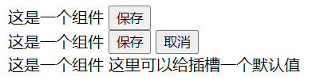
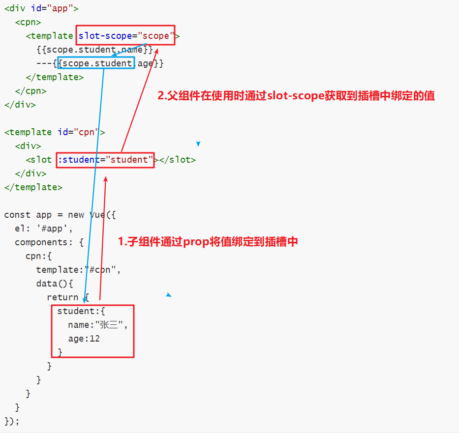

# 插槽（slot）

组件虽然能够提高对公有特性进行抽取，但无法解决这些公有需求中的个性化问题，此时我们可以为组件定义插槽来解决组件个性化的问题，我们需要对组建中需要灵活变动的东西使用插槽，当组件被其它组件或Vue实例使用的时候再来决定这些插槽中具体插入什么东西。

## 一. 匿名插槽

匿名插槽我们只需要在组件中使用`<slot>`标签注明插槽定义的位置，然后在使用组件中，在标签内部定义插槽中具体的值即可：

```html
<div id="app">
  <cpn>
    <button>保存</button> //将要写的内容写在标签内，像HTML标签一样
  </cpn>
  <cpn>
    <button>保存</button>
    <button>取消</button> 
  </cpn>
  <cpn></cpn>
</div>

<template id="cpn">
  <div>
    这是一个组件
    <slot>这里可以给插槽一个默认值</slot> //插槽
  </div>
</template>

const app = new Vue({
    el: '#app',
    components: {
      cpn:{
        template:"#cpn"
      }
    }
  });
```



## 二. 具名插槽

匿名插槽在只有一个插槽的情况下没有任何问题，但是如果我们需要在一个组件中定义若干个插槽时，匿名插槽就不能满足我们的需求了。

#### 2.6.0之前版本

`<slot>`标签有一个name属性用于定义插槽的名字，需要注意的是：如果我们在定义插槽时不指定name属性，那它会有一个名为`default`的默认值。

```html
<div id="app">
  <cpn>
    <button slot="slot1">保存</button>
    <span slot="slot1">-----</span>
    <button slot="slot2">保存</button>
  </cpn>
</div>

<template id="cpn">
  <div>
    这是一个组件
    <slot name="slot1">这里可以给插槽一个默认值1</slot>
    <slot name="slot2">这里可以给插槽一个默认值2</slot>
  </div>
</template>

const app = new Vue({
  el: '#app',
  components: {
    cpn:{
      template:"#cpn"
    }
  }
});
```

#### 2.6.0版本改动

自 2.6.0 起新增`v-slot`指令来替代`slot`属性，slot属性已废弃使用。在Vue2.x版本中还会继续支持该属性，但是到了Vue3.0中将会被正式废弃。上面`slot`属性转换成`v-slot`是这样写的：

```html
<div id="app">
  <cpn>
    <template v-slot:slot1>
        <button>保存</button>
        <span>-----</span>
      </template>
      <template v-slot:slot2>
        <button>取消</button>
      </template>
  </cpn>
</div>
```

注意 **v-slot 只能添加在` <template>` 上** (只有[一种例外情况](https://cn.vuejs.org/v2/guide/components-slots.html#%E7%8B%AC%E5%8D%A0%E9%BB%98%E8%AE%A4%E6%8F%92%E6%A7%BD%E7%9A%84%E7%BC%A9%E5%86%99%E8%AF%AD%E6%B3%95))，这一点和已经废弃的 [`slot` attribute](https://cn.vuejs.org/v2/guide/components-slots.html#%E5%BA%9F%E5%BC%83%E4%BA%86%E7%9A%84%E8%AF%AD%E6%B3%95) 不同。

## 三. 作用域插槽

### 3.1 编译作用域

在理解作用域插槽之前我们需要理解编译作用域的概念。我们先看看下面这段代码，在Vue实例和组件中都有各自的`isShow`属性，如果我们在使用组件时通过`isShow`来决定是否显示，那它实际上是由Vue实例中的属性决定。

```html
<div id="app">
  <cpn v-show="isShow"></cpn>
</div>

<template id="cpn">
  <div>
    <span>HelloWorld！</span>
  </div>
</template>

const app = new Vue({
  el: '#app',
  data:{
    isShow: true
  },
  components: {
    cpn:{
      template:"#cpn",
      data(){
        return {
          isShow: false
        }
      }
    }
  }
});
```

这也就是Vue官方给出的说明：父组件模板中所有东西都会在父级作用域内编译；子组件模板中的所有东西都会在子级作用域内编译。

### 3.2 作用域插槽

前面匿名插槽和具名插槽都是使用父组件中的数据进行渲染的。作用域插槽解决的问题是，**让插槽使用子组件中的数据进行渲染**。

#### 2.6.0之前版本

在 `<template>` 上使用特殊的 `slot-scope` attribute，可以接收传递给插槽的 prop：

```html
<div id="app">
  <cpn>
    <template slot-scope="scope">
      {{scope.student.name}}
      ---{{scope.student.age}}
    </template>
  </cpn>
</div>

<template id="cpn">
  <div>
    <slot :student="student"></slot>
  </div>
</template>

const app = new Vue({
  el: '#app',
  components: {
    cpn:{
      template:"#cpn",
      data(){
        return {
          student:{
            name:"张三",
            age:12
          }
        }
      }
    }
  }
});
```



#### 2.6.0版本改动

与2.6.0之前版本一样，我们仍然需要使用v-bind指令，将子组件的值绑定到插槽中：

```html
<template id="cpn">
  <div>
    <slot :student="student"></slot>
  </div>
</template>
```

绑定在 `<slot>` 元素上的 attribute 被称为**插槽 prop**。现在在父级作用域中，我们可以使用带值的 `v-slot` 来定义我们提供的插槽 prop 的名字：

`v-slot`指令语法：v-slot:插槽名称="变量名称"

```java
<cpn>
  <template v-slot:default="scope">
    {{scope.student.name}}
    ---{{scope.student.age}}
  </template>
</cpn>
```

完整实例：

```html
<div id="app">
  <cpn>
    <template v-slot:slot1="scope">
      {{scope.student.name}}
      ---{{scope.student.age}}
    </template>
    <template v-slot:slot2="scope">
      {{scope.student.name}}
      ---{{scope.student.age}}
    </template>
  </cpn>
</div>

<template id="cpn">
  <div>
    <slot name="slot1" :student="student"></slot>
    <slot name="slot2" :student="person"></slot>
  </div>
</template>

const app = new Vue({
  el: '#app',
  data:{
    isShow: true
  },
  components: {
    cpn:{
      template:"#cpn",
      data(){
        return {
          student:{
            name:"张三",
            age:12
          },
          person:{
            name:"李四",
            age:32
          }
        }
      }
    }
  }
});
```


插槽内容时使用子组件中的数据进行渲染。