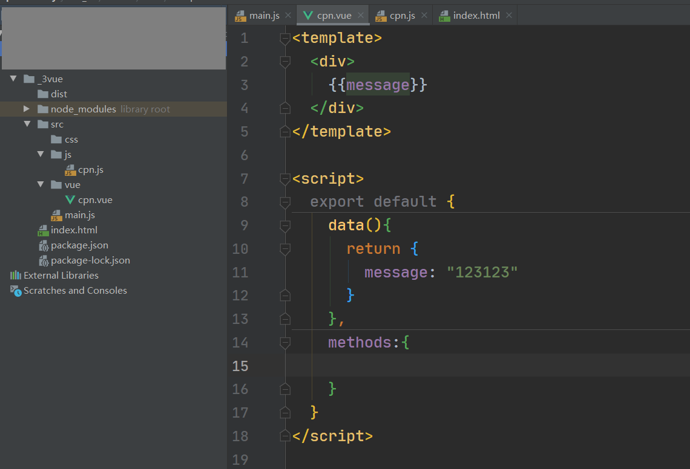

# Vue工程化演进过程

## 一. 借助Webpack管理Vue依赖

在实际开发中，我们会使用Vuejs进行开发，而且会以特殊的文件来组织vue的组件。现在，我们希望在项目中使用Vuejs，那么必然需要对其有依赖，所以需要先进行安装：

```shell
npm install vue --save 
```

项目中使用Vue：

`index.html`

```html
<!DOCTYPE html>
<html lang="en">
<head>
  <meta charset="UTF-8">
  <title>Title</title>
  <script src="dist/bundle.js"></script>
</head>
<body>
  <div id="app">
  	{{message}}  
  </div>
</body>
</html>
```

`main.js`

```js
import Vue from "vue"

new Vue({
  el: "#app",
  data: {
    message: "123123"
  }
})
```

我们借助webpack管理Vue的依赖，就不用我们手动在项目中通过`<script>`标签引入`vue.js`，但是已这种方式使用vue和传统方式去比就是在包的管理上不同，我们还是需要在`index.html`中指定`div容器`，然后在引入的js中通过`new Vue()`的方式来初始化Vue。


## 二. template实现SPA

如果我们需要开发多个HTML页面，我们就需要在每个HTML中引入一个JS，然后每个JS中都要通过`new Vue()`去创建一个Vue实例初始化这个页面中的Vue，这样的做法显得过于繁琐，此时SPA的概念就应运而生了。

SPA：单页Web应用（single page web application，SPA） SPA 是指加载单个 HTML 页面并在用户与应用程序交互时动态更新该页面的。它将所有的活动局限于一个 Web 页面中，仅在该 Web 页面初始化时加载相应的 HTML 、 JavaScript 、 CSS 。一旦页面加载完成， SPA 不会因为用户的操作而进行页面的重新加载或跳转，而是利用 JavaScript 动态的变换 HTML（采用的是 div 切换显示和隐藏），从而实现UI与用户的交互。在 SPA 应用中，应用加载之后就不会再有整页刷新。相反，展示逻辑预先加载，并有赖于内容Region（区域）中的视图切换来展示内容。

换句话说，SPA项目中只会有一个HTML文件，我们可以通过`template`实现SPA：

在前面的Vue实例中，我们定义了el属性，用于和index.html中的#app进行绑定，让Vue实例之后可以管理它其中的内容。这里，我们可以将div元素中的`{{message}}`内容删掉，只保留一个基本的id为div的元素（**后文称为根容器**）

`index.html`

```html
<!DOCTYPE html>
<html lang="en">
<head>
  <meta charset="UTF-8">
  <title>Title</title>
  <script src="dist/bundle.js"></script>
</head>
<body>
  <div id="app"></div>
</body>
</html>
```

`main.js`

```js
import Vue from "vue"

new Vue({
  el: "#app",
  template: `
    <div>
      {{message}}
    </div>
  `,
  data: {
    message: "123123"
  }
})
```

最终使用webpack打包后运行，**template中定义的模板会替换`el`中声明的根容器**，这样我们只需要通过定义不同的模板，然后将不同模板替换至根容器中就能实现SPA应用了。

tips：这里我们只是简单讲述了利用`template`实现页面DOM替换，但要实现一个完整的SPA应用，我们还需要借助Vue提供的路由，路由的概念不是本文的重点，此文不做赘述。


## 三. 利用组件语法优雅提取template

前面我们将模板代码写在Vue实例中显得不太优雅，我们可以利用组件化思想将模板抽取为一个组件，让模板与Vue代码进行分离：

`index.html`

```html
<!DOCTYPE html>
<html lang="en">
<head>
  <meta charset="UTF-8">
  <title>Title</title>
  <script src="dist/bundle.js"></script>
</head>
<body>
  <div id="app"></div>
</body>
</html>
```

`js/cpn.js`

```js
export default {
  template: `
    <div>
      {{message}}
    </div>
  `,
  data() {
    return {
      message: "123123"
    }
  },
  methods:{

  }
}
```

`main.js`

```js
import Vue from "vue"
import cpn from "./js/app"

new Vue({
  el: "#app",
  template: `<cpn/>`,
  components:{
    cpn
  }
})

```

在上一节的基础上，我们将模板相关的代码全部抽取为一个组件，然后在Vue实例中在`template`中使用组件。也就是说Vue在渲染时会将`index.html`中渲染成我们声明的组件，这样我们就成功将模板代码和Vue实例声明给分离开了。

**我们可以将每一个页面当成一个组件去对待**，每一个组件就是一个单独的JS，我们需要显示什么页面就将对应组件替换到根容器上。


## 四. vue专属文件优雅的声明组件

通过webstorm我们可以创建`*.vue`文件，它是Vue专门用来编写组件的文件：



这样我们就可以将原先`cpn.js`中的代码移入到`hello.vue`中了：

`vue/cpn.vue`

```js
<template>
  <div>
    {{message}}
  </div>
</template>

<script>
  export default {
    data(){
      return {
        message: "123123"
      }
    },
    methods:{
      
    }
  }
</script>

<style scoped>

</style>
```

`main.js`

```js
import Vue from "vue"
import cpn from "./vue/cpn"

new Vue({
  el: "#app",
  template: `<cpn/>`,
  components:{
    cpn
  }
})

```

这里我们的项目中出现了一个新类型文件`*.vue`，这种文件webpack肯定是不支持打包构建的，我们需要给项目配置vue文件相关`loader`：

```shell
npm install vue-loader vue-template-compiler --save-dev #只是开发环境需要，构建完成后就是直接可运行的js文件了
```

配置`webpack.config.js`：

```js
const path = require('path')

module.exports = {
  entry: './src/main.js',
  output: {
    path: path.resolve(__dirname, 'dist'),
    filename: 'bundle.js'
  },
  module: {
    rules: [
      {
        test: /\.css$/,
        // css-loader只负责将css文件进行加载
        // style-loader负责将样式添加到DOM中
        // 使用多个loader时, 是从右向左
        use: [ 'style-loader', 'css-loader' ]
      },
      {
        test: /\.vue$/,
        use: ['vue-loader']
      }
    ]
  }
}
```

到这里我们就走到了Vue演变的最后一步了，我们通过`*.vue`文件抽离出了Vue组件的声明，我们需要什么页面就只需要将对应组件替换到`index.html`中即可，这样一个优雅的SPA应用就演变出来了。

