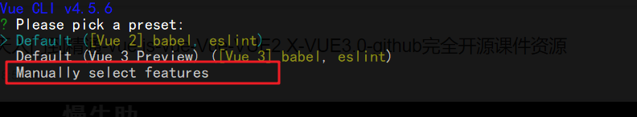
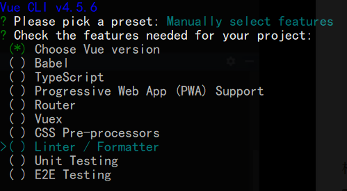
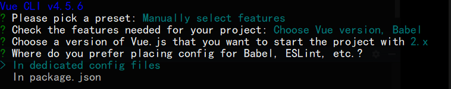
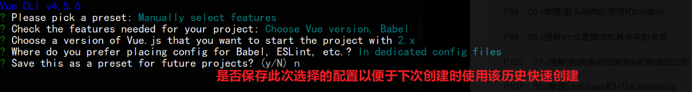

# Vue CLI3创建项目

第一步：执行`vue create xxx`创建项目

运行完成后，会进入配置模式的选择，我们这里选择手动配置：

第二步：根据需求选择需要的特性（空格键取消和选择）

点击回车，进入下一步。

第三步：选择Babel等配置信息的地方，可以设置为单独存放，也可以存放在package.json中。

第四步：它会提示你是否保存此次选择的配置，如果保存后下一次我们就可以已此次记录的配置快速项目：

