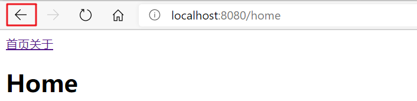
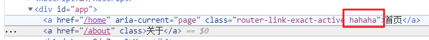

# 路由

## 一. 基本使用

### 第一步：安装`vue-router`

```shell
npm install vue-router --save
```

### 第二步：在`src`下新建`router`文件夹，在`router`中创建`index.js`文件：

```js
//1.导入vue-router模块
import VueRouter from 'vue-router'
import Vue from 'vue'

//2.通过Vue.use()方法，安装插件键
Vue.use(VueRouter);

//3.创建VueRouter对象
const vueRouter = new VueRouter({
    //配置路径和组件的关系
    routes:[

    ]
});

//4.导出VueRouter对象，方便在main.js中引入该对象，然后将其传入vue实例中
export default vueRouter;
```

在`src/router/index.js`中我们需要创建一个VueRouter对象并导出该对象，然后我们需要在`src/main.js`中导入该模块。

### 第三步：在`main.js`中引入router

```js
import Vue from 'vue'
import App from './App.vue'
import router from "./router"; //这里引用src/router/index.js文件，由于文件是index.js则可以省略，它会默认找目录下的index.js

Vue.config.productionTip = false

new Vue({
  render: h => h(App),
  router,//将路由对象放入Vue实例中
}).$mount('#app')

```

前三步的配置，我们搭建好了router的基本框架，我们现在就需要对router进行细节上的配置了。

### 第四步：配置路由映射

首先为了演示方便，我们先在`src/components`目录下创建两个文件：Home.vue、About.vue。我们配置这两个组件对应的路由：

```js
...

const vueRouter = new VueRouter({
    //配置路径和组件的关系
    routes:[
        {
            path: "/home",
            component: Home
        },
        {
            path: "/about",
            component: About
        }
    ]
});

...
```

### 第五步：使用`<router-link>`和`<router-view>`

完成路由映射的配置后，我们还需要在`src/App.vue`中使用`router-view`标签指明组件渲染的位置。

首先我们得知道，为什么是在`App.vue`中添加`router-view`标签？

这是因为在`src/main.js`中render函数中指定的是`App.vue`组件。实际上Vue实例在创建后会使用render函数指向的组件去渲染到我们指定的`index.html`页面容器中；而路由就是通过Vue内部逻辑，控制其它组件渲染到`App.vue`中的`<router-view>`中:

```vue
<template>
  <div id="app">
    <!--使用router-linker进行跳转-->
    <router-link to="/home">首页</router-link>
    <router-link to="/about">关于</router-link>                   
    <router-view></router-view>
  </div>
</template>

<script>
export default {
  name: 'App',
  components: {
  }
}
</script>
```

## 二. 其它配置

### 2.1 `<router-link>`

#### 2.1.1 `<router-link>`与`<a>`标签跳转的区别

Vue-router是伴随着Vue框架出现的路由系统，它也是公认的一种优秀的路由解决方案。在使用Vue-router时候，我们常常会使用其自带的路径跳转组件`router-link`实现跳转，这和传统的a标签极其相似！但它们到底有什么具体的区别呢？

- 使用`<router-link>`进行跳转不会刷新整个页面（不会重新加载资源），只会将目标组件渲染至`<router-view>`上。
- 虽然`<router-link>`默认情况下最终也会被渲染成`<a>`标签，但是用户点击由``<router-link>``生成的`<a>`标签后，Vue会自动在标签上加上`class=router-link-active"`样式属性，这样我们可以很轻松的实现按钮点击高亮的效果。


#### 2.1.2 tag属性

`<router-link>` 组件支持用户在具有路由功能的应用中 (点击) 导航。 它默认渲染成带有正确链接的 `<a>` 标签，可以通过配置 tag 属性生成别的标签.。例如，将router-link渲染成button：

```vue
<router-link to="/home" tag="button">首页</router-link>
```

#### 2.1.3 replace属性

默认情况下，如果我们使用history模式进行跳转，它是使用`pushState`将新路径压入栈顶，使得URL改变，但是这种方式会使得浏览器的回退按钮可以点击:



此时我们可以使用`history.replaceState`来更新栈顶路由，这样history栈中一直只会有一个URL地址，那回退按钮自然无法点击，想要到这个模板我们只需要在`<router-link>`中添加`replace`属性即可：

```vue
<router-link to="/home" tag="button" replace>首页</router-link>
```

#### 2.1.4 active-class属性

前面我们提到了，用户在点击`<router-link>`渲染出的`<a>`标签时，会自动加上一个样式属性；如果我们需要自定义`<a>`标签点击后的样式属性名称，则可以使用`active-class`属性指定：

```vue
<router-link to="/home" active-class="hahaha">首页</router-link>
```



这个属性在高亮显示的导航栏菜单或者底部tabbar经常用到。

在`<router-link>`上添加`active-class`属性可以改变当前`<router-link>`标签在激活时的`class`属性名称，如果我们想全局修改激活后的属性名称，我们需要在`router/index.js`中进行配置：

```js
const vueRouter = new VueRouter({
    //配置路径和组件的关系
    routes: ...,
    //设置激活时，标签的样式
    linkActiveClass: "hahaha"
});
```

### 2.2 路由重定向

如果我们需要当用户输入网址时默认跳转到一个组件上去，我们可以借助重定向：

```js
routes:[
        {
          path: "",
          redirect: "/home" //当用户输入缺省值时我们重定向到首页
        },
        {
            path: "/home",
            component: Home
        },
        {
            path: "/about",
            component: About
        }
    ]
```

### 2.3 使用History模式跳转

`VueRouter`默认情况下是使用的`Hash`模式来管理URL的，但是`Hash`模式中的URL总是存在#号，我们可以在创建时将URL管理模式指定成History模式：

```js
const vueRouter = new VueRouter({
    //配置路径和组件的关系
    routes:[
        {
          path: "",
          redirect: "/home"
        },
        {
            path: "/home",
            component: Home
        },
        {
            path: "/about",
            component: About
        }
    ],
    mode: 'history'
});
```

hash模式和history模式的具体区别请参考：[URL hash和HTML5 history](./_7URL_hash和HTML5_history.md)

## 三. 通过代码实现路由跳转

```vue
<button @click="goHome()">首页</button>

...
goHome(){
  //每一个组件实例中Vue都会置入$router对象
  this.$router.push("/home");
}
...
```

我们可以通过内置的`$router`对象的push或者replace方法改变URL，不能通过hisotory.pushState进行跳转，因为此种方式跳过了Vue路由组件的监听，不会生效。

**使用push和replace进行路由跳转的区别**

- push由于是压栈操作，跳转后仍可回退

- replace是替换栈顶元素，所以跳转后不可回退

