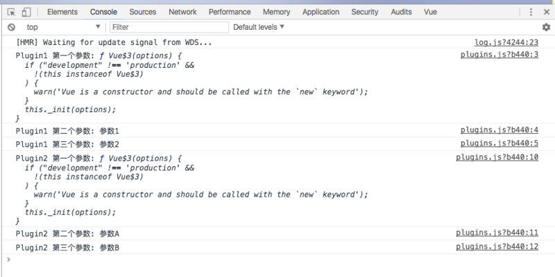

# 理解Vue.use()方法

> 本文转载至：<https://segmentfault.com/a/1190000012296163>

## 先举个例?

我们先来看一个简单的案例

首先我使用官方脚手架新建一个项目`vue init webpack vue-demo`

然后我创建两个文件`index.js plugins.js`.

我将这两个文件放置在`src/classes/vue-use`目录下

接下来对这两个文件进行编写

```js
// 文件:  src/classes/vue-use/plugins.js

const Plugin1 = {
    install(a, b, c) {
        console.log('Plugin1 第一个参数:', a);
        console.log('Plugin1 第二个参数:', b);
        console.log('Plugin1 第三个参数:', c);
    },
};

function Plugin2(a, b, c) {
    console.log('Plugin2 第一个参数:', a);
    console.log('Plugin2 第二个参数:', b);
    console.log('Plugin2 第三个参数:', c);
}

export { Plugin1, Plugin2 };
```

```js
// 文件: src/classes/vue-use/index.js

import Vue from 'vue';

import { Plugin1, Plugin2 } from './plugins';

Vue.use(Plugin1, '参数1', '参数2');
Vue.use(Plugin2, '参数A', '参数B');
```

然后我们在入口文件`main.js`引用这段代码

```js
// 文件: src/main.js

import Vue from 'vue';

import '@/classes/vue-use';
import App from './App';
import router from './router';

Vue.config.productionTip = false;

/* eslint-disable no-new */
new Vue({
    el: '#app',
    router,
    render: h => h(App),
});
```

**此时我们执行`npm run dev`打开8080端口开启开发调试工具可以看到控制台输出以下信息**



从中可以发现我们在`plugin1`中的`install`方法编写的三个console都打印出来，第一个打印出来的是Vue对象，第二个跟第三个是我们传入的两个参数。

而`plugin2`没有`install`方法，它本身就是一个方法，也能打印三个参数，第一个是Vue对象，第二个跟第三个也是我们传入的两个参数。

那么现在我们是不是大概对`Vue.use`有一个模糊的猜想～

## 分析源码

好我们还是不要猜想，直接上源码

```js
// Vue源码文件路径：src/core/global-api/use.js

import { toArray } from '../util/index'

export function initUse (Vue: GlobalAPI) {
  Vue.use = function (plugin: Function | Object) {
    const installedPlugins = (this._installedPlugins || (this._installedPlugins = []))
    if (installedPlugins.indexOf(plugin) > -1) {
      return this
    }

    // additional parameters
    const args = toArray(arguments, 1)
    args.unshift(this)
    if (typeof plugin.install === 'function') {
      plugin.install.apply(plugin, args)
    } else if (typeof plugin === 'function') {
      plugin.apply(null, args)
    }
    installedPlugins.push(plugin)
    return this
  }
}
```

从源码中我们可以发现vue首先判断这个插件是否被注册过，不允许重复注册。

并且接收的`plugin`参数的限制是`Function | Object`两种类型，对于这两种类型有不同的处理。首先将我们传入的参数整理成数组 => `const args = toArray(arguments, 1)`。**(toArray源码)**

```js
// Vue源码文件路径：src/core/shared/util.js

export function toArray (list: any, start?: number): Array<any> {
  start = start || 0
  let i = list.length - start
  const ret: Array<any> = new Array(i)
  while (i--) {
    ret[i] = list[i + start]
  }
  return ret
}
```

再将`Vue`对象添加到这个数组的起始位置`args.unshift(this)`,这里的this 指向`Vue`对象
如果我们传入的`plugin`(Vue.use的第一个参数)的`install`是一个方法。也就是说如果我们传入一个对象，对象中包含`install`方法，那么我们就调用这个`plugin`的`install`方法并将整理好的数组当成参数传入`install`方法中。 => `plugin.install.apply(plugin, args)`

如果我们传入的`plugin`就是一个函数,那么我们就直接调用这个函数并将整理好的数组当成参数传入。 => `plugin.apply(null, args)`之后给这个插件添加至已经添加过的插件数组中，标示已经注册过 => `installedPlugins.push(plugin)`最后返回Vue对象。

## 小结

通过以上分析我们可以知道，在我们以后编写插件的时候可以有两种方式。一种是将这个插件的逻辑封装成一个对象，最后将最后在install编写业务代码暴露给Vue对象。这样做的好处是可以添加任意参数在这个对象上方便将install函数封装得更加精简，可拓展性也比较高；还有一种则是将所有逻辑都编写成一个函数暴露给Vue。

其实两种方法原理都一样，无非第二种就是将这个插件直接当成install函数来处理。个人觉得第一种方式比较合理。

```js
export const Plugin = {
    install(Vue) {
        Vue.component...
        Vue.mixins...
        Vue...
        // 我们也可以在install里面执行其他函数，Vue会将this指向我们的插件
        console.log(this)  // {install: ...,utils: ...}
        this.utils(Vue)    // 执行utils函数
        console.log(this.COUNT) // 0
    },
    utils(Vue) {
        Vue...
        console.log(Vue)  // Vue
    },
    COUNT: 0    
}
// 我们可以在这个对象上添加参数，最终Vue只会执行install方法，而其他方法可以作为封装install方法的辅助函数

const test = 'test'
export function Plugin2(Vue) {
    Vue...
    console.log(test)  // 'test'
    // 注意如果插件编写成函数形式，那么Vue只会把this指向null，并不会指向这个函数
    console.log(this)  // null
}
// 这种方式我们只能在一个函数中编写插件逻辑，可封装性就不是那么强了
```

小弟不才，对vue源码的理解暂且到这。欢迎大佬们多指教～