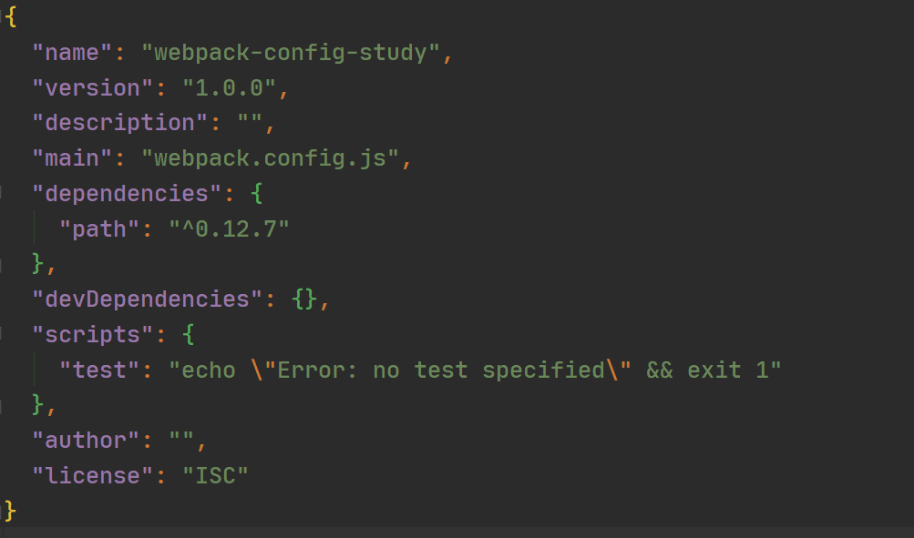

# Webpack配置

前面我们介绍了Webpack打包构建的基本操作，但是如果每次使用webpack的命令都需要写上入口和出口作为参数，就非常麻烦，我们可以对Webpack进行配置后让它自动进行打包构建。

## 一. 打包入口和出口的配置

我们需要在项目根路径下创建`webpack.config.js`文件，然后在其内部配置打包的入口和出口：

```js
const path = require('path')

const config = {
  entry: './src/main.js',
  output: {
    path: path.resolve(__dirname,'dist'), //注意，打包出口路径必须是一个绝对路径，所以这里借助path模块来获取项目的绝对路径。
    filename: 'bundle.js' //打包的出口文件
  }
}
module.exports = config;
```

由于打包的出口路径要求是一个绝对路径，所以我们可以借助`path`模块来获取项目的绝对路径。

## 二. 局部安装Webpack

一个项目往往依赖特定的webpack版本，全局的版本可能很这个项目的webpack版本不一致，导出打包出现问题，所以通常一个项目，都有自己局部的webpack。

第一步：进行局部安装

```shell
npm install webpack@3.6.0 --save-dev
```

第二步：通过`node_modules/.bin/webpack`启动webpack进行打包

```shell
node_modules/.bin/webpack
```

显然我们在使用局部webpack进行打包时非常繁琐，我们可以借助`npm run`简化操作。

## 三. package.json配置

通常情况下，我们并不会使用`webpack`命令对项目进行打包，我们通常会将webpack命令映射到`npm run xxx`命令上。如果需要进行映射，就需要在项目根目录下创建`package.json`文件。

#### 第一步：创建`package.json`文件

```shell
npm init
```

输入上面命令后按照提示输入信息，也可以回车跳过这些信息，最后就会初始化一个`package.json`文件。



#### 第二步：将webpack映射到`build`命令上

`scripts`中就是需要映射的命令，我们只需要在里面加上`"build": "webpack" `就完成了`webpack`->`npm run build`的映射。

```json
{
  "name": "webpack-config-study",
  "version": "1.0.0",
  "description": "",
  "main": "webpack.config.js",
  "dependencies": {
    "path": "^0.12.7"
  },
  "devDependencies": {},
  "scripts": {
    "test": "echo \"Error: no test specified\" && exit 1",
    "build": "webpack" 
  },
  "author": "",
  "license": "ISC"
}
```

**`package.json`中的scripts的脚本在执行时，会按照一定的顺序寻找命令对应的位置。首先，会寻找本地的node_modules/.bin路径中对应的命令；如果没有找到，会去全局的环境变量中寻找**。