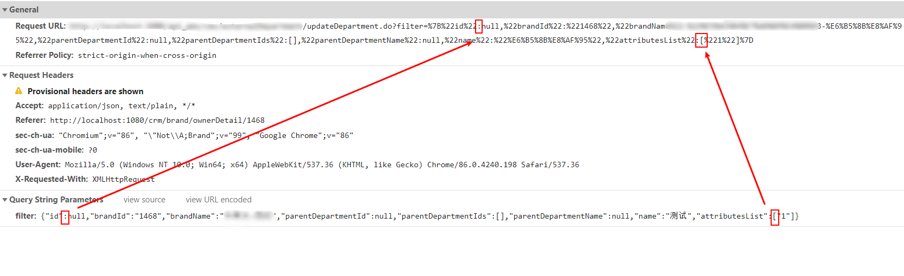
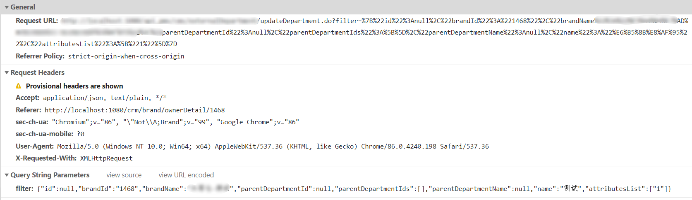

# Axios get请求中Json字符串中括号没有编码

今天重构原来业务代码，将原先JSP页面重构到VUE项目中，请求老接口时报了400错误。经过对比发现是因为Axios没有转义：

没有正确转码的请求：

正确转码的请求：



原先代码如下：

```js
this.$axios
   .get(this.$pmsPath + '/*********/updateDepartment.do', {
     params: {
       filter: JSON.stringify(param)
     }
   })
```

## 解决方案

更改axios默认的编码行为

第一步：安装`qs`

```shell
npm install --save qs
```

第二步：更改axios编码行为

```js
this.$axios
   .get(this.$pmsPath + '/*********/updateDepartment.do', {
     params: {
       filter: JSON.stringify(param)
     },
     paramsSerializer: function (p) { //固定写法
       return qs.stringify(p, {arrayFormat: 'repeat'})
     }
   })
```

