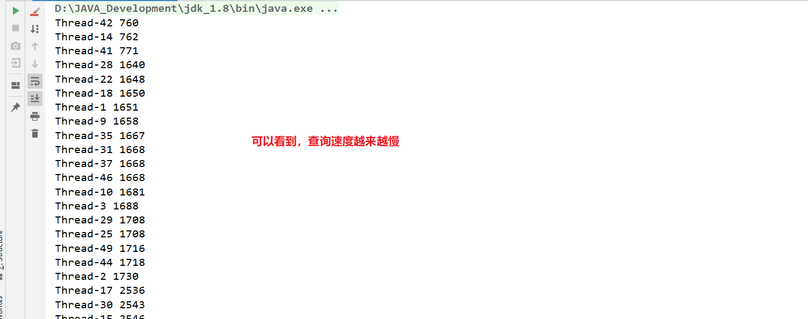

# CyclicBarrier

## 1. CyclicBarrier 是什么？

从字面上的意思可以知道，这个类的中文意思是“循环栅栏”。大概的意思就是一个可循环利用的屏障。

它的作用就是会让所有线程都等待完成后才会继续下一步行动。

举个例子，就像生活中我们会约朋友们到某个餐厅一起吃饭，有些朋友可能会早到，有些朋友可能会晚到，但是这个餐厅规定必须等到所有人到齐之后才会让我们进去。这里的朋友们就是各个线程，餐厅就是 CyclicBarrier。

## 2. 怎么使用 CyclicBarrier

### 2.1 构造方法

```java
public CyclicBarrier(int parties)
public CyclicBarrier(int parties, Runnable barrierAction)
```

- parties：是参与线程的个数。
- barrierAction：当屏障跳闸时执行的命令，或 null如果没有动作 。

### 2.2 方法

```java
public int await() throws InterruptedException, BrokenBarrierException
public int await(long timeout, TimeUnit unit) throws InterruptedException, BrokenBarrierException, TimeoutException
```

- **await()方法作用**：线程调用 await() 表示自己已经到达栅栏，如果此时到达栅栏的线程数未达到阈值，则阻塞等待；如果此时刚好到达阈值，则通知其他线程同时“起跑”，后面的我们仍可以使用await()方法再次统一“起跑线”。
- **BrokenBarrierException异常**：表示栅栏已经被破坏，破坏的原因可能是其中一个线程 await() 时被中断或者超时


## 3. CyclicBarrier应用案例

我们可以通过CyclicBarrier来展现高并发场景中查询效率的问题。我们创建N个线程，然后统一“起跑”去查询数据库，然后打印自己线程查询用时：

```java
public class MaxQueryConnectionsTest {

    private static final int MAX_NUMS = 50;//设置并发查询数

    private static CyclicBarrier cyclicBarrier = new CyclicBarrier(MAX_NUMS);//设置栅栏

    private static class QueryThread implements Runnable {

        @Override
        public void run() {
            try {
                cyclicBarrier.await();
                long start = System.currentTimeMillis();
                Connection connection = getConnection();
                PreparedStatement statement = connection.prepareStatement("select * from events_statements_summary_by_thread_by_event_name");
                ResultSet resultSet = statement.executeQuery();
                long end = System.currentTimeMillis();
                System.out.println(Thread.currentThread().getName()+" "+(end-start));
            } catch (SQLException | InterruptedException | BrokenBarrierException e) {
                e.printStackTrace();
            }
        }
    }

    public static Connection getConnection() throws SQLException {
        Connection root = DriverManager.getConnection("jdbc:mysql://127.0.0.1:3306/performance_schema?serverTimezone=GMT%2B8&useUnicode=true&characterEncoding=utf-8", "root", "980613");
        return root;
    }

    public static void main(String[] args) {
        for (int i = 0; i < MAX_NUMS; i++) {
            new Thread(new QueryThread()).start();
        }
    }
}

```



实际上这个功能不仅可以用CyclicBarrier实现，实际上还可以用CountDownLatch来实现：

```java
public class MaxQueryConnectionsTest2 {

    private static final int MAX_NUMS = 50;//设置并发查询数

    private static CountDownLatch countDownLatch = new CountDownLatch(MAX_NUMS);

    private static class QueryThread implements Runnable {

        @Override
        public void run() {
            try {
                countDownLatch.await();
                long start = System.currentTimeMillis();
                Connection connection = getConnection();
                PreparedStatement statement = connection.prepareStatement("select * from events_statements_summary_by_thread_by_event_name");
                ResultSet resultSet = statement.executeQuery();
                long end = System.currentTimeMillis();
                System.out.println(Thread.currentThread().getName() + " " + (end - start));
            } catch (SQLException | InterruptedException e) {
                e.printStackTrace();
            }
        }
    }

    public static Connection getConnection() throws SQLException {
        Connection root = DriverManager.getConnection("jdbc:mysql://127.0.0.1:3306/performance_schema?serverTimezone=GMT%2B8&useUnicode=true&characterEncoding=utf-8", "root", "980613");
        return root;
    }

    public static void main(String[] args) {
        for (int i = 0; i < MAX_NUMS; i++) {
            new Thread(new QueryThread()).start();
            countDownLatch.countDown();//这里进行countDown操作，当计数器为0时就会通知所有线程开始执行
        }
    }
}
```


## 4. CountDownLatch与CyclicBarrier有什么区别

从字面上理解，Countdown表示减法计数，Latch表示门闩的意思，计数为0的时候就可以打开门闩了。Cyclic Barrier表示循环的障碍物。两者都有一个“栅栏”的意思。

CyclicBarrier是可循环使用的栅栏，当线程数达到阈值时，栅栏会释放所有线程（这些线程同时“起跑”），此时CyclicBarrier还可以重复使用，如果再次执行await()方法，线程仍会阻塞，只有目标数量的线程达到新栅栏时才会释放栅栏。

CoutDownLatch是一次性栅栏，当栅栏的计数器减为零后，就会释放栅栏。与CyclicBarrier最大的不同是，CoutDownLatch的countDown操作可以在别的线程中完成，这样做就可以达到类似join的效果，及在前置服务线程执行完毕后，再执行后面的线程（详见：[CountDownLatch](./_9CountDownLatch.md)）。CyclicBarrier单纯的是等待相同任务到达起点线后，然后同时执行。