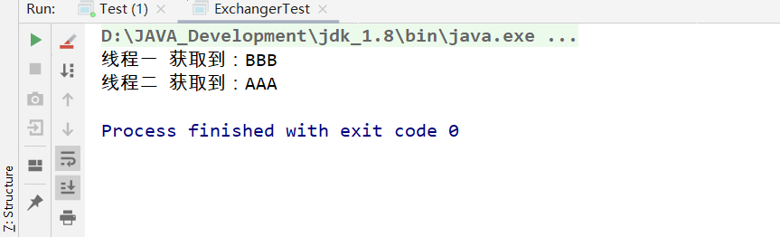

# Exchanger

Exchanger用于两个线程之间交换数据，线程可以在成对内配对和交换元素的同步点。 每个线程在输入exchange方法时提供一些对象，与合作者线程匹配，并在返回时接收其合作伙伴的对象。 交换器可以被视为一个的双向形式SynchronousQueue 。 交换器在诸如遗传算法和管道设计的应用中可能是有用的。 

**示例代码**：

```java
public class ExchangerTest {
    public static void main(String[] args) {
        final Exchanger<String> exchanger = new Exchanger<>();
        new Thread(() -> {
            try {
                Thread.sleep(50);
                String data = exchanger.exchange("AAA");
                System.out.println(Thread.currentThread().getName() + " 获取到：" + data);
            } catch (InterruptedException e) {
                e.printStackTrace();
            }
        }, "线程一").start();
        new Thread(() -> {
            try {
                Thread.sleep(100);
                String data = exchanger.exchange("BBB");
                System.out.println(Thread.currentThread().getName() + " 获取到：" + data);
            } catch (InterruptedException e) {
                e.printStackTrace();
            }
        }, "线程二").start();
    }
}

```

