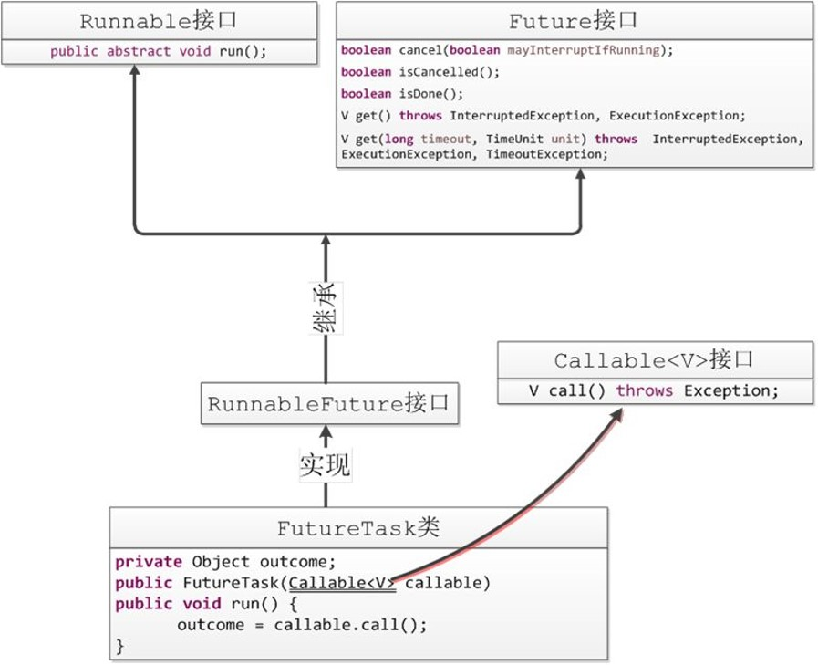

# Callable和FutureTask的使用

在[《创建线程的三种方式》](_1创建线程的三种方式.md)一文中我们描述了创建线程的三种方式，我们在这里更加深入的了解Callable创建线程的方式：

## 1. Callable与Runnable

先说一下java.lang.Runnable吧，它是一个接口，在它里面只声明了一个run()方法：

```java
public interface Runnable {
    public abstract void run();
}
```

由于run()方法返回值为void类型，所以在执行完任务之后无法返回任何结果。

Callable位于java.util.concurrent包下，它也是一个接口，在它里面也只声明了一个方法，只不过这个方法叫做call()：

```java
public interface Callable<V> {
    V call() throws Exception;
}
```

可以看到，这是一个泛型接口，该接口声明了一个名称为call()的方法，同时这个方法可以有返回值V，也可以抛出异常。call()方法返回的类型就是传递进来的V类型。


## 2. Future

Future就是对于具体的Runnable或者Callable任务的执行结果进行取消、查询是否完成、获取结果。必要时可以通过get方法获取执行结果，该方法会阻塞直到任务返回结果。

` Future<V>`接口是用来获取异步计算结果的，说白了就是对具体的Runnable或者Callable对象任务执行的结果进行获取(get())，取消(cancel())，判断是否完成等操作。我们看看Future接口的源码：

```java
public interface Future<V> {
    boolean cancel(boolean mayInterruptIfRunning);
    boolean isCancelled();
    boolean isDone();
    V get() throws InterruptedException, ExecutionException;
    V get(long timeout, TimeUnit unit)
        throws InterruptedException, ExecutionException, TimeoutException;
}
```

在Future接口中声明了5个方法，下面依次解释每个方法的作用：

- cancel方法：用来取消任务，如果取消任务成功则返回true，如果取消任务失败则返回false。
  - 参数`mayInterruptIfRunning`：尝试取消执行此任务。 如果任务已经完成、已经被取消或由于某种其他原因而无法取消，则此尝试将失败，返回false。如果成功，并且当cancel()执行时此任务尚未启动，则此任务不应运行。 如果任务已经开始，当`mayInterruptIfRunning==true`时试图停止该任务。 

- isCancelled方法：表示任务是否被取消成功，如果在任务正常完成前被取消成功，则返回 true。

- isDone方法：表示任务是否已经完成，若任务完成，则返回true；

- get()方法：用来获取执行结果，这个方法会产生阻塞，会一直等到任务执行完毕才返回；

- get(long timeout, TimeUnit unit)：用来获取执行结果，如果在指定时间内，还没获取到结果，就直接返回null。

**简单来说，Future提供了三种功能**：

1. 判断任务是否完成。
2. 能够中断任务。
3. 能够获取任务的执行结果。


## 3. FutureTask

但是Future只是一个接口，所以我们需要用到Future的实现类FutureTask：



我们可以看到FutureTask也实现了Runnable接口，这意味着他可以直接被线程所执行；而FutureTask被作为线程运行时，真正执行是Callable接口中的call方法，这样我们就可以通过FutureTask获取call方法执行后的结果：

```java
public class MyCallable implements Callable<String> {
    @Override
    public String call() throws Exception {
        System.out.println(Thread.currentThread().getName() + "is running");
        Thread.sleep(2000);
        return "线程执行完毕";
    }
}
```

```java
public class CallableTest {
    public static void main(String[] args) throws ExecutionException, InterruptedException {
        MyCallable myCallable = new MyCallable();
        FutureTask<String> futureTask=new FutureTask<>(myCallable);
        Thread thread = new Thread(futureTask);
        thread.start();
        String result = futureTask.get();//此时主线程阻塞，等待thread线程执行完毕，获取返回值   
        System.out.println(result);
    }
}
```

文章参考：https://www.cnblogs.com/xiaoxi/p/8303574.html

