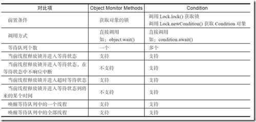

# ReentrantLock显示锁

在Java 1.5之前，协调对共享对象的访问可以使用的机制只有synchronized和volatile两种。Java1.5增加了一种新的机制：ReentrantLock。但ReentrantLock并不是替代内置加锁的方法，而是当内置加锁机制不适用时，作为一种可选择的高级功能。在学习显示锁之前，我们需要明确两个问题：

1. 什么是可重入锁  

2. 锁的公平性指的是什么

## 1. 可重入锁

广义上的可重入锁指的是可重复可递归调用的锁，在外层使用锁之后，在内层仍然可以使用，并且不发生死锁（前提得是同一个对象或者class），这样的锁就叫做可重入锁。ReentrantLock和synchronized都是可重入锁。

```java
public class Test {
    public synchronized void A() {
        B();
    }
    public synchronized void B() { }
}
```

由于synchronized提供的是可重入锁，所以在调用A方法获取到锁后，再进入B方法时仍可以获取到锁，不会发生死锁的问题。

## 2. 公平锁与非公平锁

### 2.1 公平锁与非公平锁的定义

公平锁指多个线程按照申请锁的顺序来获取锁，线程直接进入队列中排队，队列中的第一个线程才能获得锁。

而非公平锁就是调度系统并不保证按照线程申请锁的顺序来交付锁，如果某个时刻锁空闲，而刚好有一个线程来申请锁，则将锁交给该线程，也就不会唤醒已经挂起的锁。

### 2.2 公平锁与非公平锁的效率问题

大多数情况下，非公平锁的效率是高于公平锁的。这是因为公平锁在有新的线程请求锁时仍将其加到队列的末尾，该线程会被挂起，然后唤醒队列头部的线程获取锁；但如果是非公平锁，此时有一个线程请求锁，恰好此时锁没有被占用，此时调度系统会将锁交付给这个新线程，而不会死板的将新线程加入队尾并挂起，然后唤醒队头线程。**也就是说非公平锁会降低线程被挂起的几率，而恢复一个被挂起的线程与该线程真正运行之间存在严重的延迟。**

了解完这两个概念后，我们来学习显示锁：

## 3. Lock

`lock`是一个接口，定义了一组抽象的加锁操作。与`synchronized`不同的是，`lock`提供了一种无条件的、可轮询的、定时的以及可中断的锁的获取操作。

```java
public interface Lock {
    //获得锁，如果锁定不可用，则当前线程将被禁用以进行线程调度，并且在此之前处于休眠状态。
    void lock();

    //如果当前线程未被中断，则获取锁。如果锁可用，则获取锁，并立即返回。可中断锁获取操作的实现
    void lockInterruptibly() throws InterruptedException;

    //仅在调用时锁为空闲状态才获取该锁。通常对于那些不是必须获取锁的操作可能有用。轮询锁及可定时锁获取操作的实现。
    boolean tryLock();

    //在指定时间内获取锁，时间单位由第二参数决定
    boolean tryLock(long time, TimeUnit unit) throws InterruptedException;

    //释放锁。对应于lock()、tryLock()、tryLock(xx)、lockInterruptibly()等操作，如果成功的话应该对应着一个unlock()，这样可以避免死锁或者资源浪费。
    void unlock();

    //返回绑定到此 Lock 实例的新 Condition 实例。
    Condition newCondition();
}

```


## 4.ReentrantLock

ReentrantLock是Lock接口的实现类，它提供了与`synchronized`相同的互斥性、内存可见性及可重入的加锁语义，在加锁与释放锁时也与`synchronized`有相同的内存语义。

### 4.1 ReentrantLock的公平性问题

ReentrantLock默认是非公平锁（synchronized也是非公平锁），也就是说。但是我们可以通过重载构造方法来创建公平锁：

```java
public ReentrantLock(boolean fair) {
    sync = fair ? new FairSync() : new NonfairSync();//如果为true则创建公平锁，false创建非公平锁
}
```

### 4.2 ReentrantLock可重入性

ReentrantLock是可重入锁。

### 4.3 显示锁的基本使用

```java
public class LockDemo {
	private Lock lock  = new ReentrantLock();//创建显示锁
	private int count;	
	public void increament() {
		lock.lock();//加锁
		try {
			count++;
		}finally {
			lock.unlock();//解锁一定要在finally中执行
		}
	}
}
```

需要注意的是解锁一定要在finally中进行，这是JDK注释给出的规范。

### 4.4 Condition实现线程协作

在使用Lock之前，我们使用的最多的同步方式应该是synchronized关键字来实现同步方式了。配合Object的wait()、notify()系列方法可以实现等待/通知模式。Condition接口也提供了类似Object的监视器方法，与Lock配合可以实现等待/通知模式，但是这两者在使用方式以及功能特性上还是有差别的。Object和Condition接口的一些对比。



在显示锁中我们需要通过Condition来进行wait和notify操作，下面是Condition接口：

```java
public interface Condition {
    void await() throws InterruptedException;//对应Object中的wait方法，使获取锁的当前线程等待
    void awaitUninterruptibly();//不可中断等待
    long awaitNanos(long nanosTimeout) throws InterruptedException;//等待指定时间，以纳秒为单位
    boolean await(long time, TimeUnit unit) throws InterruptedException;//等待指定时间，时间单位由第二个参数指定
    boolean awaitUntil(Date deadline) throws InterruptedException;//造成当前线程在接到信号、被中断或到达指定最后期限之前一直处于等待状态。如果没有到指定时间就被通知，则返回true，否则表示到了指定时间，返回返回false。
    void signal();//唤醒等待队列中的一个线程，相当于notify。
    void signalAll();//唤醒当前等待队列中所有线程，相当于notifuyAll。
}

```

需要注意的是在synchronized内置锁中，只会维持一个等待队列，而在显示锁中可以通过多次执行newCondition()方法获取多个等待队列，如果让每个线程对应一个condition，那么就可以实现线程的精准唤醒。

我们就拿生产者消费者示例代码来看看，如何使用多个condition实现线程的精准唤醒：

```java
public class SharedResource {
    private int empty = 1;//代表缓存池中的空位,如果是1代表还有一个空位，此时需要一个生产者来生产产品方进去
    private String buffer;

    private Lock lock = new ReentrantLock(true);//创建非公平锁
    private Condition producterCondition = lock.newCondition();//生产者condition，专门用于生产者的等待与唤醒
    private Condition consumerCondition = lock.newCondition();//消费者cndition

    public void setbuffer(String str) {
        lock.lock();
        while (empty == 0) {
            try {
                producterCondition.await();//让生产者等待
            } catch (InterruptedException e) {
                e.printStackTrace();
            }
        }
        buffer = str;
        empty = 0;
        System.out.println(Thread.currentThread().getName() + "生产：" + str);
        try {
            consumerCondition.signalAll();//精确唤醒消费者
        } finally {
            lock.unlock();
        }
    }

    public  void getBuffer() {
        while (empty == 1) {//如果缓存池中有一个空位，也就表示没有产品在缓存池中
            try {
                consumerCondition.await();
            } catch (InterruptedException e) {
                e.printStackTrace();
            }
        }
        String temp = buffer;
        buffer = null;
        empty = 1;
        System.out.println(Thread.currentThread().getName() + "消费：" + temp);
        try {
            producterCondition.signalAll();//精确唤醒生产者
        } finally {
            lock.unlock();
        }
    }
}
```


## 5. 什么时候使用显示锁

可以看到，显示锁可以完成内置锁能完成的所有工作，但它不仅限于此。

1. 它提供了可中断阻塞机制，在synchronized内置锁中，线程一旦因为未获取到锁而阻塞则不可被中断，而在显示锁中提供了可中断等待锁的机制。
2. 显示锁提供了时间约束的锁等待机制。
3. 显示锁提供了公平锁的实现（显示锁和内置锁默认都是非公平锁）
4. 显示锁通过Condition实现了更丰富的线程协作机制（例如在内置锁中wait方法是可中断的，而condition可以提供不可中断的等待）
5. 就性能来说显示锁和内置锁无明显差异
6. 内置锁书写更简洁，在无以上特殊需求的情况下，优先使用内置锁。

**参考文章**：

[Java之显示锁](https://blog.csdn.net/lmh_19941113/article/details/86581576)

[究竟什么是可重入锁？](https://blog.csdn.net/rickiyeat/article/details/78314451)

[公平锁与非公平锁+效率差异原因](https://blog.csdn.net/rootkiss/article/details/100627224)

[Java并发之Condition](https://www.cnblogs.com/gemine/p/9039012.html)