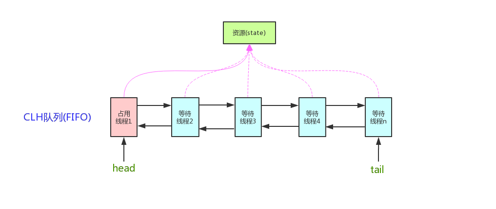

# 使用AQS实现一把锁

AQS是AbstractQueuedSynchronizer的简称。AQS提供了一种实现阻塞锁和一系列依赖FIFO等待队列的同步器的框架，如下图所示：AQS使得一系列同步器依赖于一个单独的原子变量（state），它提供了一个非常有用的基础。子类们必须定义改变state变量的protected方法，这些方法定义了state是如何被获取或释放的。鉴于此，本类中的其他方法执行所有的排队和阻塞机制。子类也可以维护其他的state变量，但是为了保证同步，必须原子地操作这些变量。

AbstractQueuedSynchronizer中对state的操作是原子的，且不能被继承。**所有的同步机制的实现均依赖于对改变量的原子操作**。为了实现不同的同步机制，我们需要创建一个非共有的（non-public internal）扩展了AQS类的内部辅助类来实现相应的同步逻辑。AbstractQueuedSynchronizer并不实现任何同步接口，**它提供了一些可以被具体实现类直接调用的一些原子操作方法,用来重写相应的同步逻辑**。AQS同时提供了互斥模式（exclusive）和共享模式（shared）两种不同的同步逻辑。一般情况下，子类只需要根据需求实现其中一种模式，当然也有同时实现两种模式的同步类，如`ReadWriteLock`。接下来将详细介绍AbstractQueuedSynchronizer的提供的一些具体实现方法。

## 1.实现一个锁

### 1.1 State状态

AbstractQueuedSynchronizer维护了一个volatile int类型的变量，用户表示当前同步状态。volatile虽然不能保证操作的原子性，但是保证了当前变量state的可见性。至于[volatile](https://www.jianshu.com/p/14fc9d34de33)的具体语义，可以参考相关文章。state的访问方式有三种：

- getState()
- setState()
- compareAndSetState()

这三种操作均是原子操作，其中compareAndSetState的实现依赖于Unsafe的compareAndSwapInt()方法。代码实现如下：

```java
  /**
     * The synchronization state.
     */
    private volatile int state;
  
    /**
     * 返回同步状态的当前值。
     * @return current state value
     */
    protected final int getState() {
        return state;
    }

    /**
     * 设置同步状态的值。
     */
    protected final void setState(int newState) {
        state = newState;
    }

    /**
     * 如果当前状态值等于期望值，则自动将同步状态设置为给定的更新值。
     *
     * @param expect 期望值
     * @param update 当前值
     * @return 返回true代表成功
     */
    protected final boolean compareAndSetState(int expect, int update) {
        // See below for intrinsics setup to support this
        return unsafe.compareAndSwapInt(this, stateOffset, expect, update);
    }
```

### 1.2 AQS中的模板方法

AQS既然是实现阻塞锁的基础，那么它一定会暴露接口给锁的实现者，从而方便的实现一个显示锁。AQS中运用了模板方法模式，它将锁获取与释放的算法定义在AQS内部，而有些具体的步骤则等待着AQS的子类去实现。

我们都知道在模板方法模式中，“模板”方法是一个算法的骨架，而AQS中就包含了众多“模板”方法，这些方法暴露给锁的开发者调用，从而真正实现一个锁，下列方法就是暴露给锁实现者的“模板”方法：

- 独占式获取
  - accquire
  - acquireInterruptibly
  - tryAcquireNanos

- 独占式释放锁
  - release 

- 共享式获取
  - acquireShared

  - acquireSharedInterruptibly

  - tryAcquireSharedNanos

- 共享式释放锁
  - releaseShared

这些方法依赖于子类的具体实现，也就是下列的方法

### 1.3 AQS子类需要实现的方法

AQS定义两种资源共享方式：Exclusive（独占锁，只有一个线程能执行，如ReentrantLock）和Share（共享锁，多个线程可同时执行，如Semaphore/CountDownLatch/ReentrantReadWriteLock.ReadLock）。

不同的自定义同步器争用共享资源的方式也不同。自定义同步器在实现时只需要实现共享资源state的获取与释放方式即可，至于具体线程等待队列的维护（如获取资源失败入队/唤醒出队等），AQS已经在顶层（也就是第2节中提到的方法）实现好了。自定义同步器实现时主要实现以下几种方法：

- **独占锁需要覆盖的方法**：
  - tryAcquire(int)：独占方式。尝试获取资源，成功则返回true，失败则返回false。
  - tryRelease(int)：独占方式。尝试释放资源，成功则返回true，失败则返回false。

- **共享锁需要覆盖的方法**：

  - tryAcquireShared(int)：共享方式。尝试获取资源。负数表示失败；0表示成功，但没有剩余可用资源；正数表示成功，且有剩余资源。
  - tryReleaseShared(int)：共享方式。尝试释放资源，如果释放后允许唤醒后续等待结点返回true，否则返回false。

- **独占锁和共享锁都要实现的方法**：
  - isHeldExclusively()： 该线程是否正在独占资源。只有用到condition才需要去实现它 。

这五个方法虽然在AbstractQueuedSynchronizer都不是抽象方法，但是他们都没有具体实现代码，执行后会抛出异常：

```java
protected boolean tryAcquire(int arg) {
    throw new UnsupportedOperationException();
}
```


### 1.4 独占锁的实现

一个独占锁要实现Lock接口，而在内部我们要实现一个AQS，它是实现阻塞锁关键，我们需要调用AQS中模板方法，实现Lock接口的相应功能：

```java
public class MyLock implements Lock {

    /**
     * 创建内部类，继承AQS，主要实现内部的isHeldExclusively、tryAcquire、tryRelease
     */
    private static class Sync extends AbstractQueuedSynchronizer {

        /**
         * 在独占锁模式下，表示锁是否占用，当state==1时代表锁被占用,state==0表示锁空闲
         *
         * @return
         */
        protected boolean isHeldExclusively() {
            return getState() == 1;
        }

        /**
         * 尝试获取一次锁
         *
         * @param arg
         * @return
         */
        protected boolean tryAcquire(int arg) {
            if (compareAndSetState(0, 1)) {
                //设置独占线程为当前线程
                setExclusiveOwnerThread(Thread.currentThread());
                return true;
            }
            return false;
        }

        /**
         * @param arg
         * @return
         */
        protected boolean tryRelease(int arg) {
            if (getState() == 0) {
                throw new IllegalMonitorStateException();
            }
            //设置当前独占的线程为空
            setExclusiveOwnerThread(null);
            //将锁置为非占用状态
            setState(0);
            return true;
        }

        Condition newCondition() {
            return new ConditionObject();
        }
    }


    /**
     * AQS实例
     */
    private final Sync sync = new Sync();

    @Override
    public void lock() {
        sync.acquire(1);
    }

    @Override
    public void lockInterruptibly() throws InterruptedException {
        sync.acquireInterruptibly(1);
    }

    @Override
    public boolean tryLock() {
        return sync.tryAcquire(1);
    }

    @Override
    public boolean tryLock(long time, TimeUnit unit) throws InterruptedException {
        return sync.tryAcquireNanos(1, unit.toNanos(time));
    }

    @Override
    public void unlock() {
        sync.tryRelease(1);
    }

    @Override
    public Condition newCondition() {
        return sync.newCondition();
    }
}

```

参考文章：https://www.cnblogs.com/waterystone/p/4920797.html

