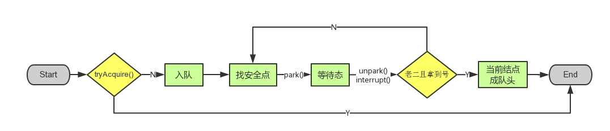

## AQS源码分析

## 1. AQS中同步队列的实现

在AQS中维持着一个双向链表，而AQS本身持有着双向链表的头尾节点的引用：


在AQS中有一个Node内部类来表示等待队列的节点，Node结点是对每一个等待获取资源的线程的封装，其包含了需要同步的线程本身及其等待状态，如是否被阻塞、是否等待唤醒、是否已经被取消等。：

```java
public abstract class AbstractQueuedSynchronizer
    extends AbstractOwnableSynchronizer
    implements java.io.Serializable {
   
    static final class Node {
        static final Node SHARED = new Node();
        static final Node EXCLUSIVE = null;

        static final int CANCELLED =  1;
        static final int SIGNAL    = -1;
        static final int CONDITION = -2;
        static final int PROPAGATE = -3;
        
        volatile int waitStatus;//当前节点线程的等待状态

        volatile Node prev;//同步队列的前驱节点
        
        volatile Node next;//同步队列的后继节点
       
        volatile Thread thread;//节点中封装的线程对象
        
        Node nextWaiter;//如果当前线程正在等待队列中，则该属性指向下一个等待线程的节点
       
       	....
    }

    
    private transient volatile Node head;//同步队列的头结点

   
    private transient volatile Node tail;//同步队列的尾节点
    ....
}
```

## 2. 节点的状态

Node中waitStatus属性表示当前Node结点的等待状态，共有5种取值CANCELLED、SIGNAL、CONDITION、PROPAGATE、0。

- **CANCELLED**(1)：表示当前结点已取消调度。当timeout或被中断（响应中断的情况下），会触发变更为此状态，进入该状态后的结点将不会再变化。
- **SIGNAL**(-1)：表示后继结点在等待当前结点唤醒。后继结点入队时，会将前继结点的状态更新为SIGNAL。
- **CONDITION**(-2)：表示结点等待在Condition上，当其他线程调用了Condition的signal()方法后，CONDITION状态的结点将**从等待队列转移到同步队列中**，等待获取同步锁。
- **PROPAGATE**(-3)：共享模式下，前继结点不仅会唤醒其后继结点，同时也可能会唤醒后继的后继结点。
- **0**：新结点入队时的默认状态。

注意，**负值表示结点处于有效等待状态，而正值表示结点已被取消。所以源码中很多地方用>0、<0来判断结点的状态是否正常**。

## 3. acquire(int)方法

此方法是独占模式下线程获取共享资源的顶层入口。如果获取到资源，线程直接返回，否则进入等待队列，直到获取到资源为止，且整个过程忽略中断的影响。这也正是lock()的语义，当然不仅仅只限于lock()。获取到资源后，线程就可以去执行其临界区代码了。下面是acquire()的源码：

```java
public final void acquire(int arg) {
    if (!tryAcquire(arg) &&
        acquireQueued(addWaiter(Node.EXCLUSIVE), arg))
        selfInterrupt();
}
```

函数流程如下： 

1. tryAcquire()尝试直接去获取资源，如果成功则直接返回（这里体现了非公平锁，每个线程获取锁时会尝试直接抢占加塞一次，而CLH队列中可能还有别的线程在等待）；
2. addWaiter()将该线程加入等待队列的尾部，并标记为独占模式；
3. acquireQueued()使线程阻塞在等待队列中获取资源，一直获取到资源后才返回。如果在整个等待过程中被中断过，则返回true，否则返回false。
4. 如果线程在等待过程中被中断过，它是不响应的。只是获取资源后才再进行自我中断selfInterrupt()，将中断补上。

 这时单凭这4个抽象的函数来看流程还有点朦胧，不要紧，看完接下来的分析后，你就会明白了。就像《大话西游》里唐僧说的：等你明白了舍生取义的道理，你自然会回来和我唱这首歌的。 

### 3.1 tryAcquire(int)

此方法尝试去获取独占资源。如果获取成功，则直接返回true，否则直接返回false。这也正是tryLock()的语义，还是那句话，当然不仅仅只限于tryLock()。如下是tryAcquire()的源码： 

```java
protected boolean tryAcquire(int arg) {
    throw new UnsupportedOperationException();
}
```

什么？直接throw异常？说好的功能呢？好吧，**还记得概述里讲的AQS只是一个框架，具体资源的获取/释放方式交由自定义同步器去实现吗**？就是这里了！！！AQS这里只定义了一个接口，具体资源的获取交由自定义同步器去实现了（通过state的get/set/CAS）！！！至于能不能重入，能不能加塞，那就看具体的自定义同步器怎么去设计了！！！当然，自定义同步器在进行资源访问时要考虑线程安全的影响。

这里之所以没有定义成abstract，是因为独占模式下只用实现tryAcquire-tryRelease，而共享模式下只用实现tryAcquireShared-tryReleaseShared。如果都定义成abstract，那么每个模式也要去实现另一模式下的接口。说到底，Doug Lea还是站在咱们开发者的角度，尽量减少不必要的工作量。

### 3.2 addWaiter(Node)

此方法用于将当前线程加入到等待队列的队尾，并返回当前线程所在的结点。还是上源码吧： 

```java
private Node addWaiter(Node mode) {
    //以给定模式构造结点。mode有两种：EXCLUSIVE（独占）和SHARED（共享）
    Node node = new Node(Thread.currentThread(), mode);
    
    //尝试快速方式直接放到队尾。
    Node pred = tail;
    if (pred != null) {
        node.prev = pred;
        if (compareAndSetTail(pred, node)) {
            pred.next = node;
            return node;
        }
    }
    
    //上一步失败则通过enq入队。
    enq(node);
    return node;
}
```

不用再说了，直接看注释吧。 

#### 3.2.1 enq(Node)

 此方法用于将node加入队尾。源码如下： 

```java
private Node enq(final Node node) {
    //CAS"自旋"，直到成功加入队尾
    for (;;) {
        Node t = tail;
        if (t == null) { // 队列为空，创建一个空的标志结点作为head结点，并将tail也指向它。
            if (compareAndSetHead(new Node()))
                tail = head;
        } else {//正常流程，放入队尾
            node.prev = t;
            if (compareAndSetTail(t, node)) {//compareAndSetTail是将tail指针指向新插入的节点，如果成功则返回true
                t.next = node;
                return t;
            }
        }
    }
}
```

### 3.3  acquireQueued(Node, int)

OK，通过tryAcquire()和addWaiter()，该线程获取资源失败，已经被放入等待队列尾部了。聪明的你立刻应该能想到该线程下一部该干什么了吧：**进入等待状态休息，直到其他线程彻底释放资源后唤醒自己，自己再拿到资源，然后就可以去干自己想干的事了**。没错，就是这样！是不是跟医院排队拿号有点相似~~acquireQueued()就是干这件事：**在等待队列中排队拿号（中间没其它事干可以休息），直到拿到号后再返回**。这个函数非常关键，还是上源码吧： 

```java
final boolean acquireQueued(final Node node, int arg) {
    boolean failed = true;//标记是否成功拿到资源
    try {
        boolean interrupted = false;//标记等待过程中是否被中断过
        
        //又是一个“自旋”！
        for (;;) {
            final Node p = node.predecessor();//拿到前驱
            //如果前驱是head，即该结点已成老二，那么便有资格去尝试获取资源（可能是老大释放完资源唤醒自己的，当然也可能被interrupt了）。
            if (p == head && tryAcquire(arg)) {
                setHead(node);//拿到资源后，将head指向该结点。所以head所指的标杆结点，就是当前获取到资源的那个结点或null。
                p.next = null; // setHead中node.prev已置为null，此处再将head.next置为null，就是为了方便GC回收以前的head结点。也就意味着之前拿完资源的结点出队了！
                failed = false; // 成功获取资源
                return interrupted;//返回等待过程中是否被中断过
            }
            
            //如果自己可以休息了，就通过park()进入waiting状态，直到被unpark()。如果不可中断的情况下被中断了，那么会从park()中醒过来，发现拿不到资源，从而继续进入park()等待。
            if (shouldParkAfterFailedAcquire(p, node) &&
                parkAndCheckInterrupt())
                interrupted = true;//如果等待过程中被中断过，哪怕只有那么一次，就将interrupted标记为true
        }
    } finally {
        if (failed) // 如果等待过程中没有成功获取资源（如timeout，或者可中断的情况下被中断了），那么取消结点在队列中的等待。
            cancelAcquire(node);
    }
}
```

到这里了，我们先不急着总结acquireQueued()的函数流程，先看看shouldParkAfterFailedAcquire()和parkAndCheckInterrupt()具体干些什么。 

#### 3.3.1 shouldParkAfterFailedAcquire(Node, Node)

此方法主要用于检查状态，看看自己是否真的可以去休息了（进入waiting状态，如果线程状态转换不熟，可以参考本人上一篇写的[Thread详解](http://www.cnblogs.com/waterystone/p/4920007.html)），万一队列前边的线程都放弃了只是瞎站着，那也说不定，对吧！ 

```java
private static boolean shouldParkAfterFailedAcquire(Node pred, Node node) {
    int ws = pred.waitStatus;//拿到前驱的状态
    if (ws == Node.SIGNAL)
        //如果已经告诉前驱拿完号后通知自己一下，那就可以安心休息了
        return true;
    if (ws > 0) {
        /*
         * 如果前驱放弃了，那就一直往前找，直到找到最近一个正常等待的状态，并排在它的后边。
         * 注意：那些放弃的结点，由于被自己“加塞”到它们前边，它们相当于形成一个无引用链，稍后就会被保安大叔赶走了(GC回收)！
         */
        do {
            node.prev = pred = pred.prev;
        } while (pred.waitStatus > 0);
        pred.next = node;
    } else {
         //如果前驱正常，那就把前驱的状态设置成SIGNAL，告诉它拿完号后通知自己一下。有可能失败，人家说不定刚刚释放完呢！
        compareAndSetWaitStatus(pred, ws, Node.SIGNAL);
    }
    return false;
}
```

整个流程中，如果前驱结点的状态不是SIGNAL，那么自己就不能安心去休息，需要去找个安心的休息点，同时可以再尝试下看有没有机会轮到自己拿号。 

#### 3.3.2 parkAndCheckInterrupt()

如果线程找好安全休息点后，那就可以安心去休息了。此方法就是让线程去休息，真正进入等待状态。 

```java
private final boolean parkAndCheckInterrupt() {
    LockSupport.park(this);//调用park()使线程进入阻塞状态（LockSupport是实现线程阻塞和唤醒的工具类，底层方法是native）
    return Thread.interrupted();//如果被唤醒，查看自己是不是被中断的。
}
```

#### 3.3.3 acquireQueued()小结

OK，看了shouldParkAfterFailedAcquire()和parkAndCheckInterrupt()，现在让我们再回到acquireQueued()，总结下该函数的具体流程：

1. 结点进入队尾后，检查状态，找到安全休息点；
2. 调用park()进入waiting状态，等待unpark()或interrupt()唤醒自己；
3. 被唤醒后，看自己是不是有资格能拿到号。如果拿到，head指向当前结点，并返回从入队到拿到号的整个过程中是否被中断过；如果没拿到，继续流程1。


### 3.4 acquire(int)方法总结

OKOK，acquireQueued()分析完之后，我们接下来再回到acquire()！再贴上它的源码吧： 

```java
public final void acquire(int arg) {
    if (!tryAcquire(arg) &&
        acquireQueued(addWaiter(Node.EXCLUSIVE), arg))
        selfInterrupt();
}
```

再来总结下它的流程吧：

1. 调用自定义同步器的tryAcquire()尝试直接去获取资源，如果成功则直接返回；
2. 没成功，则addWaiter()将该线程加入等待队列的尾部，并标记为独占模式；
3. acquireQueued()使线程在等待队列中休息，有机会时（轮到自己，会被unpark()）会去尝试获取资源。获取到资源后才返回。如果在整个等待过程中被中断过，则返回true，否则返回false。
4. 如果线程在等待过程中被中断过，它是不响应的。只是获取资源后才再进行自我中断selfInterrupt()，将中断补上。

由于此函数是重中之重，我再用流程图总结一下：



至此，acquire()的流程终于算是告一段落了。这也就是ReentrantLock.lock()的流程，不信你去看其lock()源码吧，整个函数就是一条acquire(1)！！！ 


## 4. release(int)

上一小节已经把acquire()说完了，这一小节就来讲讲它的反操作release()吧。此方法是独占模式下线程释放共享资源的顶层入口。它会释放指定量的资源，如果彻底释放了（即state=0）,它会唤醒等待队列里的其他线程来获取资源。这也正是unlock()的语义，当然不仅仅只限于unlock()。下面是release()的源码： 

```java
public final boolean release(int arg) {
    if (tryRelease(arg)) {
        Node h = head;//找到头结点
        if (h != null && h.waitStatus != 0)
            unparkSuccessor(h);//唤醒等待队列里的下一个线程
        return true;
    }
    return false;
}
```

### 4.1 tryRelease(int)

跟tryAcquire()一样，这个方法是需要独占模式的自定义同步器去实现的。正常来说，tryRelease()都会成功的，因为这是独占模式，该线程来释放资源，那么它肯定已经拿到独占资源了，直接减掉相应量的资源即可(state-=arg)，也不需要考虑线程安全的问题。但要注意它的返回值，上面已经提到了，**release()是根据tryRelease()的返回值来判断该线程是否已经完成释放掉资源了**！所以自义定同步器在实现时，如果已经彻底释放资源(state=0)，要返回true，否则返回false。 

下列是自己实现的tryRelease：

```java
protected boolean tryRelease(int arg) {
    if (getState() == 0) {
        throw new IllegalMonitorStateException();
    }
    //设置当前独占的线程为空
    setExclusiveOwnerThread(null);
    //将锁置为非占用状态
    setState(0);
    return true;
}
```

### 4.2 unparkSuccessor(Node)

此方法用于唤醒等待队列中下一个线程。下面是源码： 

```java
private void unparkSuccessor(Node node) {
    //这里，node一般为当前线程所在的结点。
    int ws = node.waitStatus;
    if (ws < 0)//置零当前线程所在的结点状态，允许失败。
        compareAndSetWaitStatus(node, ws, 0);

    Node s = node.next;//找到下一个需要唤醒的结点s
    if (s == null || s.waitStatus > 0) {//如果为空或已取消
        s = null;
        for (Node t = tail; t != null && t != node; t = t.prev) // 从后向前找。
            if (t.waitStatus <= 0)//从这里可以看出，<=0的结点，都是有效的结点。
                s = t;
    }
    if (s != null)
        LockSupport.unpark(s.thread);//唤醒
}
```

这个函数并不复杂。一句话概括：**用unpark()唤醒等待队列中最前边的那个未放弃线程**，这里我们也用s来表示吧。此时，再和acquireQueued()联系起来，s被唤醒后，进入if (p == head && tryAcquire(arg))的判断（即使p!=head也没关系，它会再进入shouldParkAfterFailedAcquire()寻找一个安全点。这里既然s已经是等待队列中最前边的那个未放弃线程了，那么通过shouldParkAfterFailedAcquire()的调整，s也必然会跑到head的next结点，下一次自旋p==head就成立啦），然后s把自己设置成head标杆结点，表示自己已经获取到资源了，acquire()也返回了！！

### 4.3 release小结

release()是独占模式下线程释放共享资源的顶层入口。它会释放指定量的资源，如果彻底释放了（即state=0）,它会唤醒等待队列里的其他线程来获取资源。 


## 5. acquireShared(int)

此方法是共享模式下线程获取共享资源的顶层入口。它会获取指定量的资源，获取成功则直接返回，获取失败则进入等待队列，直到获取到资源为止，整个过程忽略中断。下面是acquireShared()的源码： 

```java
public final void acquireShared(int arg) {
    if (tryAcquireShared(arg) < 0)
        doAcquireShared(arg);
}
```

这里tryAcquireShared()依然需要自定义同步器去实现。但是AQS已经把其返回值的语义定义好了：**负值代表获取失败；0代表获取成功，但没有剩余资源；正数表示获取成功，还有剩余资源，其他线程还可以去获取**。所以这里acquireShared()的流程就是：

1. tryAcquireShared()尝试获取资源，成功则直接返回；

2. 失败则通过doAcquireShared()进入等待队列，直到获取到资源为止才返回。

### 5.1 doAcquireShared(int)

此方法用于将当前线程加入等待队列尾部休息，直到其他线程释放资源唤醒自己，自己成功拿到相应量的资源后才返回。下面是doAcquireShared()的源码： 

```java
private void doAcquireShared(int arg) {
    final Node node = addWaiter(Node.SHARED);//加入队列尾部
    boolean failed = true;//是否成功标志
    try {
        boolean interrupted = false;//等待过程中是否被中断过的标志
        for (;;) {
            final Node p = node.predecessor();//前驱
            if (p == head) {//如果到head的下一个，因为head是拿到资源的线程，此时node被唤醒，很可能是head用完资源来唤醒自己的
                int r = tryAcquireShared(arg);//尝试获取资源
                if (r >= 0) {//成功
                    setHeadAndPropagate(node, r);//将head指向自己，还有剩余资源可以再唤醒之后的线程
                    p.next = null; // help GC
                    if (interrupted)//如果等待过程中被打断过，此时将中断补上。
                        selfInterrupt();
                    failed = false;
                    return;
                }
            }
            
            //判断状态，寻找安全点，进入waiting状态，等着被unpark()或interrupt()
            if (shouldParkAfterFailedAcquire(p, node) &&
                parkAndCheckInterrupt())
                interrupted = true;
        }
    } finally {
        if (failed)
            cancelAcquire(node);
    }
}
```

有木有觉得跟acquireQueued()很相似？对，其实流程并没有太大区别。只不过这里将补中断的selfInterrupt()放到doAcquireShared()里了，而独占模式是放到acquireQueued()之外，其实都一样，不知道Doug Lea是怎么想的。

跟独占模式比，还有一点需要注意的是，这里只有线程是head.next时（“老二”），才会去尝试获取资源，有剩余的话还会唤醒之后的队友。那么问题就来了，假如老大用完后释放了5个资源，而老二需要6个，老三需要1个，老四需要2个。老大先唤醒老二，老二一看资源不够，他是把资源让给老三呢，还是不让？答案是否定的！老二会继续park()等待其他线程释放资源，也更不会去唤醒老三和老四了。

独占模式，同一时刻只有一个线程去执行，这样做未尝不可；但共享模式下，多个线程是可以同时执行的，现在因为老二的资源需求量大，而把后面量小的老三和老四也都卡住了。当然，这并不是问题，只是AQS保证严格按照入队顺序唤醒罢了（保证公平，但降低了并发）。

#### 5.1.1 setHeadAndPropagate(Node, int)

```java
private void setHeadAndPropagate(Node node, int propagate) {
    Node h = head; 
    setHead(node);//head指向自己
     //如果还有剩余量，继续唤醒下一个邻居线程
    if (propagate > 0 || h == null || h.waitStatus < 0) {
        Node s = node.next;
        if (s == null || s.isShared())
            doReleaseShared();
    }
}
```

此方法在setHead()的基础上多了一步，就是自己苏醒的同时，如果条件符合（比如还有剩余资源），还会去唤醒后继结点，毕竟是共享模式！ 

doReleaseShared()我们留着下一小节的releaseShared()里来讲。 

### 5.2 acquireShared小结

OK，至此，acquireShared()也要告一段落了。让我们再梳理一下它的流程：

1. tryAcquireShared()尝试获取资源，成功则直接返回；
2. 失败则通过doAcquireShared()进入等待队列park()，直到被unpark()/interrupt()并成功获取到资源才返回。整个等待过程也是忽略中断的。

其实跟acquire()的流程大同小异，只不过多了个**自己拿到资源后，还会去唤醒后继队友的操作（这才是共享嘛）**。


## 6. releaseShared()

上一小节已经把acquireShared()说完了，这一小节就来讲讲它的反操作releaseShared()吧。此方法是共享模式下线程释放共享资源的顶层入口。它会释放指定量的资源，如果成功释放且允许唤醒等待线程，它会唤醒等待队列里的其他线程来获取资源。下面是releaseShared()的源码： 

```java
public final boolean releaseShared(int arg) {
    if (tryReleaseShared(arg)) {//尝试释放资源
        doReleaseShared();//唤醒后继结点
        return true;
    }
    return false;
}
```

此方法的流程也比较简单，一句话：释放掉资源后，唤醒后继。跟独占模式下的release()相似，但有一点稍微需要注意：独占模式下的tryRelease()在完全释放掉资源（state=0）后，才会返回true去唤醒其他线程，这主要是基于独占下可重入的考量；而共享模式下的releaseShared()则没有这种要求，共享模式实质就是控制一定量的线程并发执行，那么拥有资源的线程在释放掉部分资源时就可以唤醒后继等待结点。例如，资源总量是13，A（5）和B（7）分别获取到资源并发运行，C（4）来时只剩1个资源就需要等待。A在运行过程中释放掉2个资源量，然后tryReleaseShared(2)返回true唤醒C，C一看只有3个仍不够继续等待；随后B又释放2个，tryReleaseShared(2)返回true唤醒C，C一看有5个够自己用了，然后C就可以跟A和B一起运行。而ReentrantReadWriteLock读锁的tryReleaseShared()只有在完全释放掉资源（state=0）才返回true，所以自定义同步器可以根据需要决定tryReleaseShared()的返回值。 

### 6.1 doReleaseShared()

此方法主要用于唤醒后继。下面是它的源码： 

```java
private void doReleaseShared() {
    for (;;) {
        Node h = head;
        if (h != null && h != tail) {
            int ws = h.waitStatus;
            if (ws == Node.SIGNAL) {
                if (!compareAndSetWaitStatus(h, Node.SIGNAL, 0))
                    continue;
                unparkSuccessor(h);//唤醒后继
            }
            else if (ws == 0 &&
                     !compareAndSetWaitStatus(h, 0, Node.PROPAGATE))
                continue;
        }
        if (h == head)// head发生变化
            break;
    }
}
```

### 6.2 releaseShared()小结

本节我们详解了独占和共享两种模式下获取-释放资源(acquire-release、acquireShared-releaseShared)的源码，相信大家都有一定认识了。值得注意的是，acquire()和acquireShared()两种方法下，线程在等待队列中都是忽略中断的。AQS也支持响应中断的，acquireInterruptibly()/acquireSharedInterruptibly()即是，相应的源码跟acquire()和acquireShared()差不多，这里就不再详解了。 


参考文章：https://www.cnblogs.com/waterystone/p/4920797.html