# JDK7及其早期版本HashMap扩容死锁问题

在JDK7及其早期版本中HashMap在多线程环境下会发生扩容死锁的问题。

HashMap中在创建时默认会有16个桶，有一个默认加载因子0.75，如果Map中的Entry数量达到阈值（16*0.75）就会进行扩容，将原来的桶的数量扩展至原来的两倍，而在多线程环境下JDK7的HashMap会产生扩容死锁的问题。

下列方法是Map进行扩容的核心方法：

```java
void resize(int newCapacity) {
    Entry[] oldTable = table;
    int oldCapacity = oldTable.length;
    if (oldCapacity == MAXIMUM_CAPACITY) {
        threshold = Integer.MAX_VALUE;
        return;
    }
    Entry[] newTable = new Entry[newCapacity];
    transfer(newTable, initHashSeedAsNeeded(newCapacity));
    table = newTable;
    threshold = (int)Math.min(newCapacity * loadFactor, MAXIMUM_CAPACITY + 1);
}
/**
 * 将所有Entry从当前表转移到新表。
 */
void transfer(Entry[] newTable, boolean rehash) {
    int newCapacity = newTable.length;
    for (Entry<K,V> e : table) {
        while(null != e) {
            Entry<K,V> next = e.next;//1
            //计算Hash，然后计算新数组中的索引值
            /*if (rehash) {
                e.hash = null == e.key ? 0 : hash(e.key);
            }
            int i = indexFor(e.hash, newCapacity);*/
            e.next = newTable[i];//2
            newTable[i] = e;//3
            e = next;//4
        }
    }
}
```

我们大致可以将Entry的重散列看成四步：

- Entry<K,V> next = e.next;
- e.next = newTable[i];
- newTable[i] = e;
- e = next;

我们分别将上面四行代码编号为：1、2、3、4

现在我们来重现多线程情况下扩容死锁的情况，为了方便演示，我们将原始Map的桶的数量定为4，扩容后容量翻倍变为8，原Map中有两个Entry需要重散列，分别为：A、B。

1. 线程二执行完代码行1，阻塞：

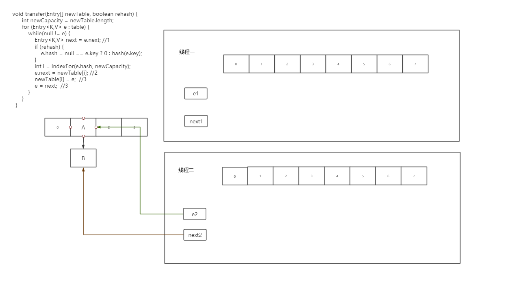

2. 线程一开始执行，并执行完代码行1：

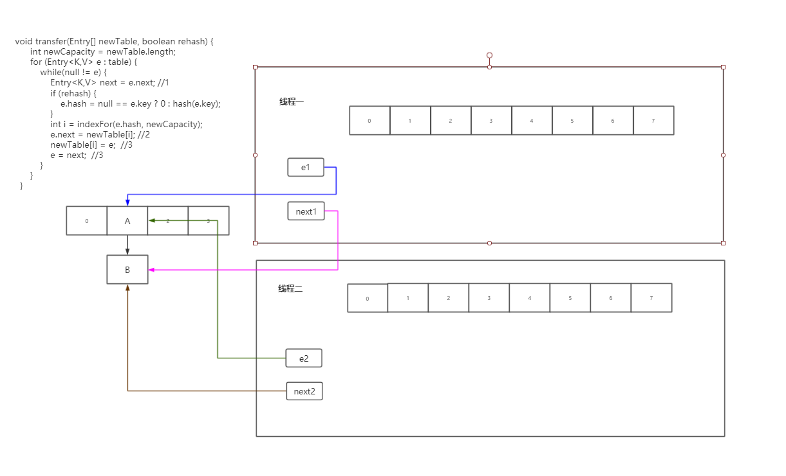

3. 线程一执行代码行2，假设我们在扩容时两个节点新索引值为5：

```java
e.next = newTable[5];
```

由于此时`newTable[5]==null`所以就相当于e.next=null，也就是A.next=null。

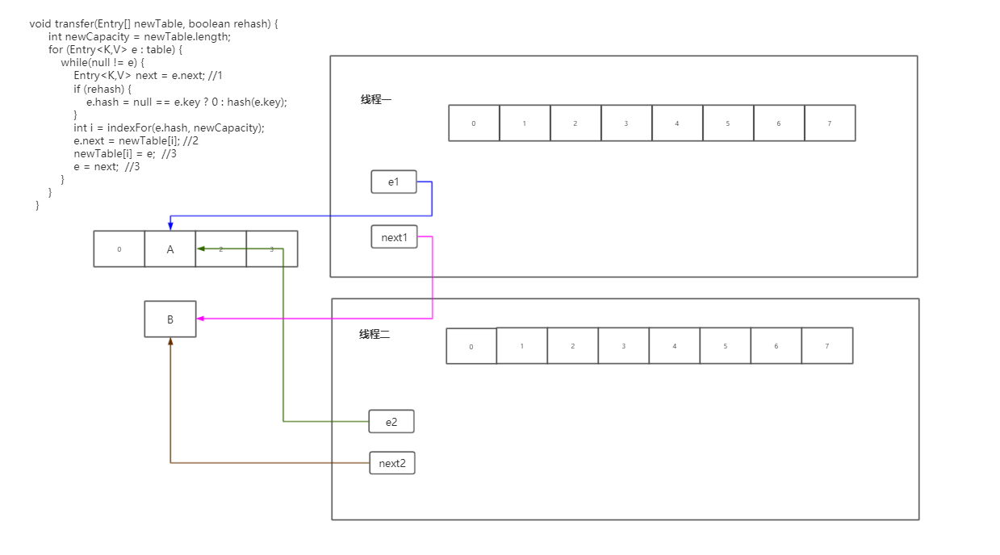

4. 线程一执行代码行3：

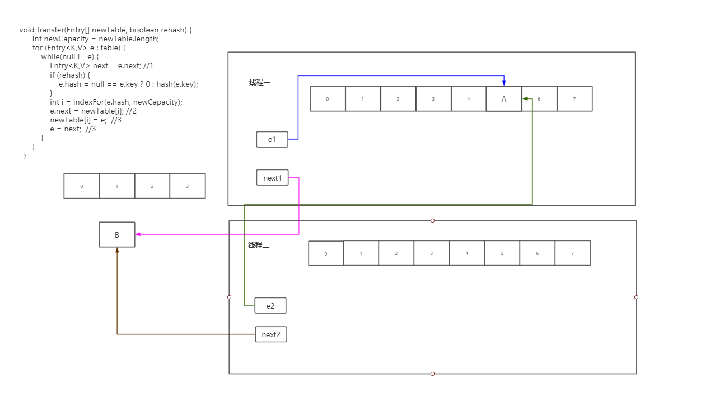

5. 线程一执行代码行4：

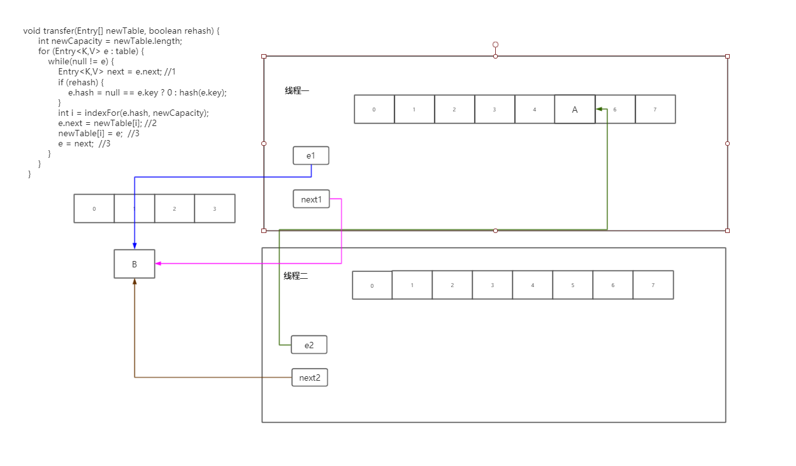

6. 线程一再次进入循环执行代码行一，此时线程一中next变量指向null：

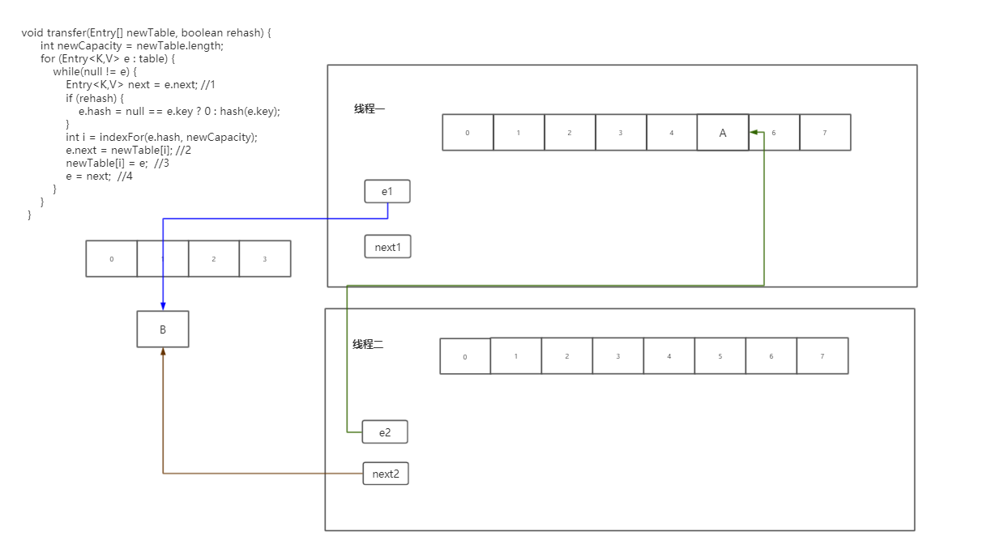

7. 线程一执行代码行2：

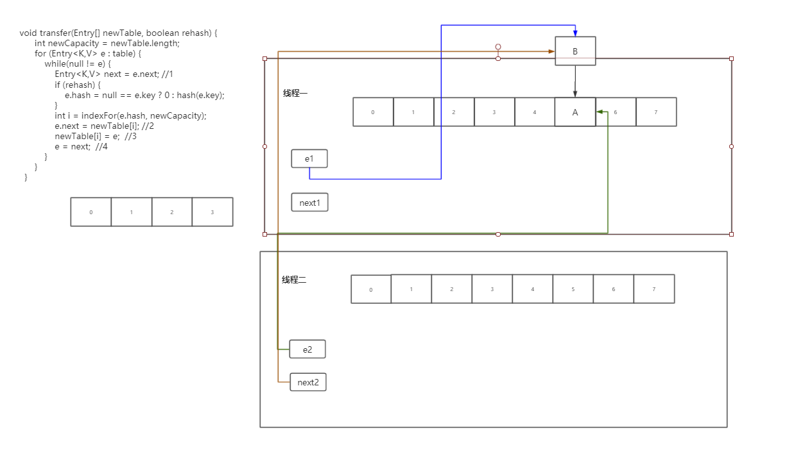

8. 线程一执行代码行3：

   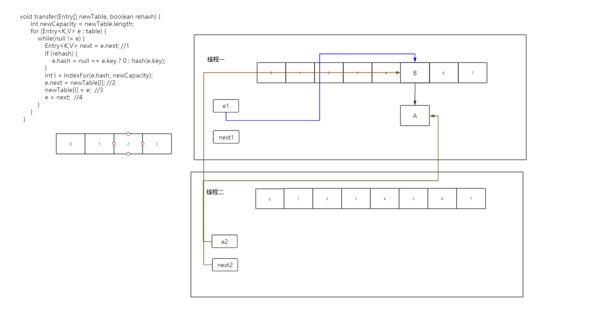

9. 线程一执行代码行4：


此时线程一的扩容工作已经进行完毕，我们开始回到线程二。

10. 线程二执行代码行2：

    ```java
    e.next = newTable[i];
    ```

由于线程二的newTable[i]=null，而e.next也就是A.next本来就为空，所以这句话在此时并未对结构造成实质影响。


11. 线程二执行代码行3：

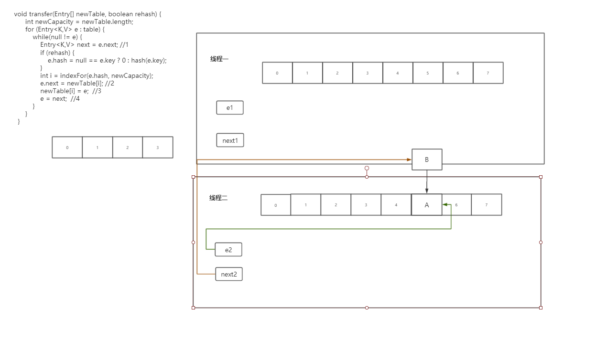

12. 线程二执行代码行4：

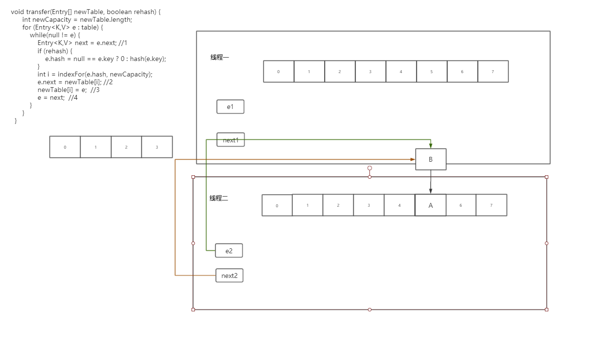

13. 线程二再次循环执行代码行1：

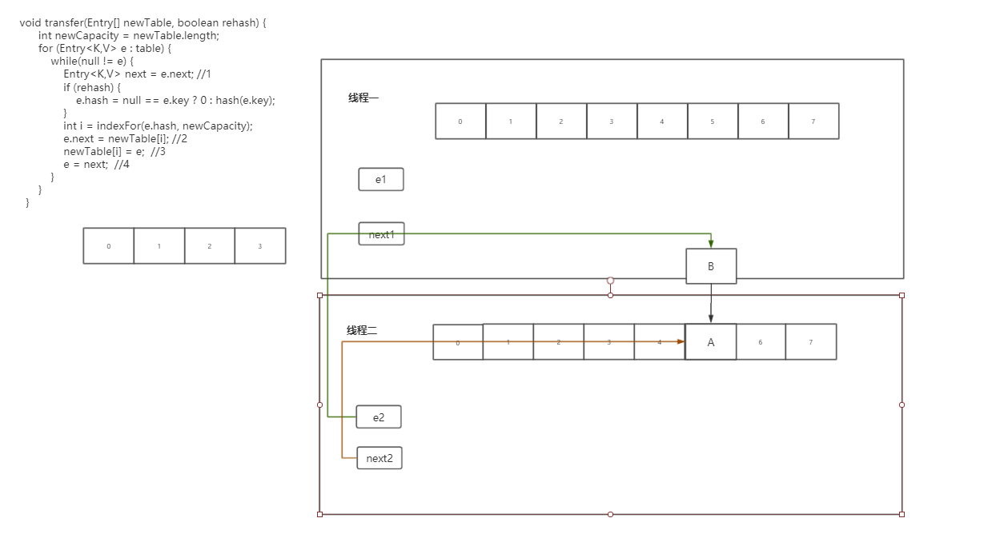

14. 线程二执行代码行2：

    本行代码对结构无影响

    

15. 线程二执行代码行3：

    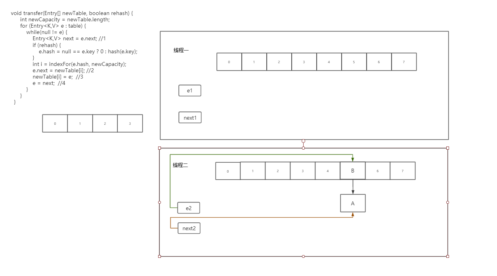

16. 线程二执行代码行4：

    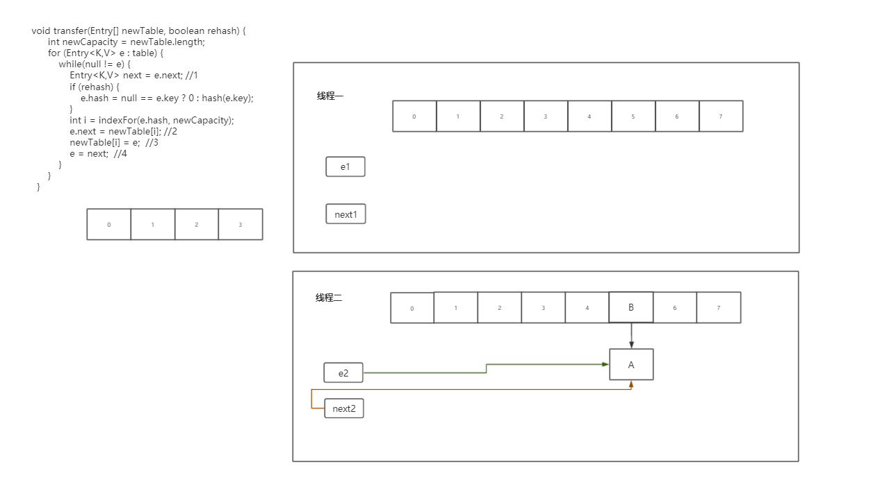

17. 线程二执行代码行1：

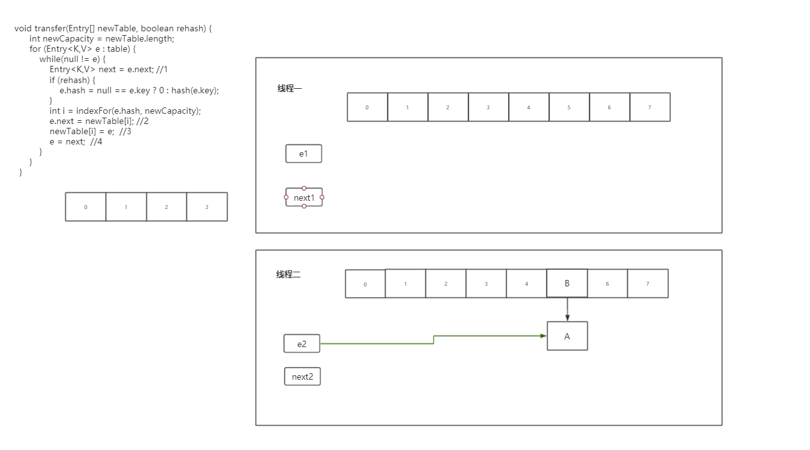

18. 线程二执行代码行2（成环）：

    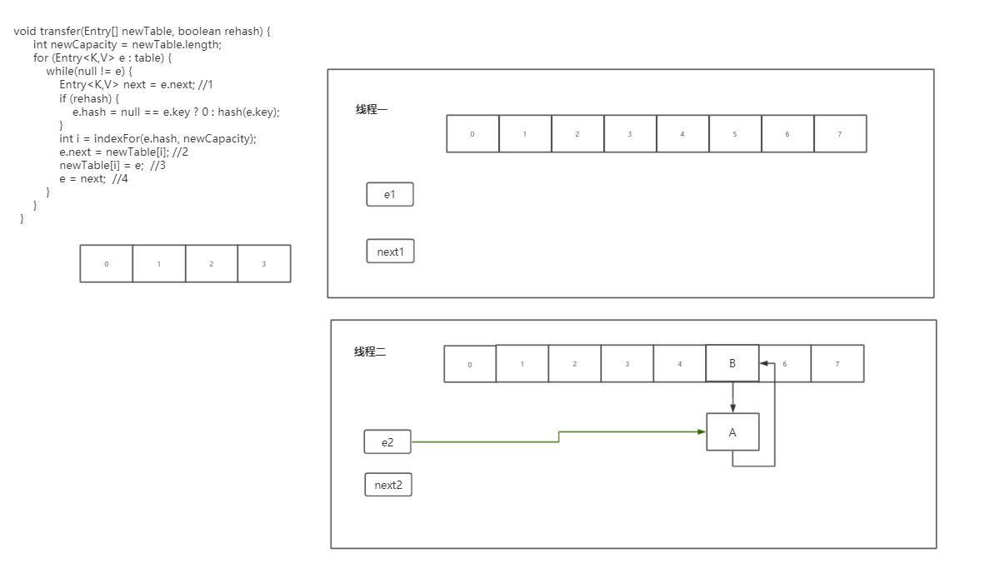

此时A、B两节点之间就会形成环形结构。

19. 线程二执行代码行3：

    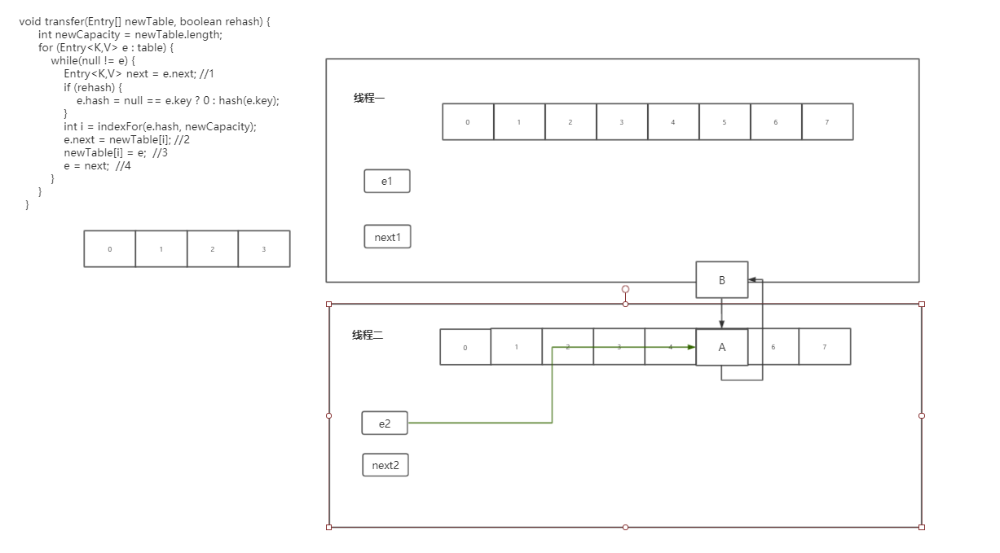

20. 线程二执行代码行4：

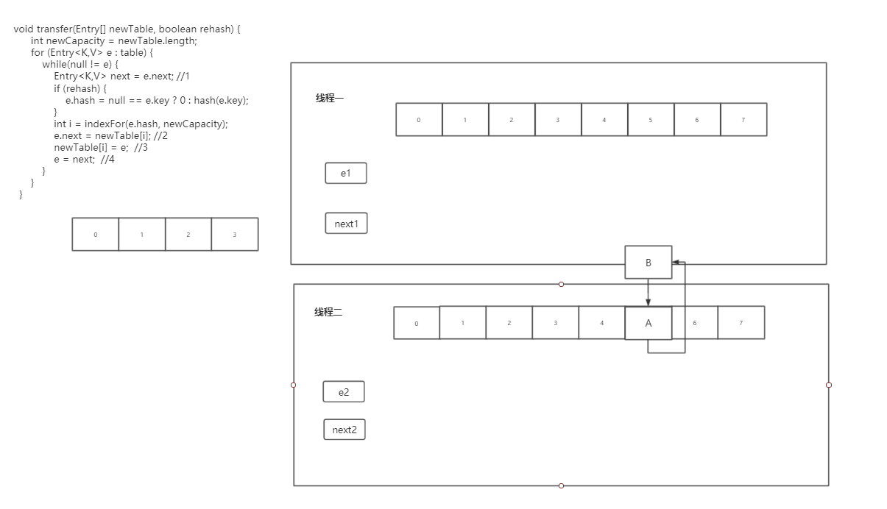

在JDK8中由于采取了不同的扩容机制，所以在JDK8中不会出现扩容死锁问题。但是这并不意味着JDK8的HashMap是线程安全的。