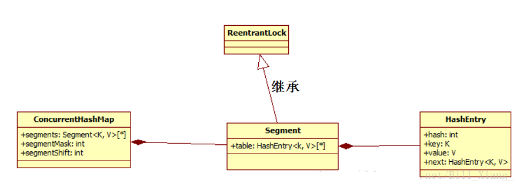

# ConcurrentHashMap

ConcurrentHashMap从JDK1.5开始随java.util.concurrent包一起引入JDK中，主要为了解决HashMap线程不安全和Hashtable效率不高的问题。众所周知，HashMap在多线程编程中是线程不安全的，而Hashtable由于使用了synchronized修饰方法而导致执行效率不高；因此，在concurrent包中，实现了ConcurrentHashMap以使在多线程编程中可以使用一个高性能的线程安全HashMap方案。

而JDK1.7之前的ConcurrentHashMap使用分段锁机制实现，JDK1.8则使用数组+链表+红黑树数据结构和CAS原子操作实现ConcurrentHashMap；本文将分别介绍这两种方式的实现方案及其区别。 

## 一. ConcurrentHashMap的实现——JDK7版本

### 1.1 分段锁机制

Hashtable之所以效率低下主要是因为其实现使用了synchronized关键字对put等操作进行加锁，而synchronized关键字加锁是对整个对象进行加锁，也就是说在进行put等修改Hash表的操作时，锁住了整个Hash表，从而使得其表现的效率低下；因此，在JDK1.5~1.7版本，Java使用了分段锁机制实现ConcurrentHashMap.

简而言之，ConcurrentHashMap在对象中保存了一个Segment数组，即将整个Hash表划分为多个分段；而每个Segment元素，即每个分段则类似于一个Hashtable；这样，在执行put操作时首先根据hash算法定位到元素属于哪个Segment，然后对该Segment加锁即可。因此，ConcurrentHashMap在多线程并发编程中可是实现多线程put操作。接下来，本文将详细分析JDK1.7版本中ConcurrentHashMap的实现原理。

### 1.2 ConcurrentHashMap的数据结构



ConcurrentHashMap类结构如上图所示。由图可知，在ConcurrentHashMap中，定义了一个Segment<K, V>[]数组来将Hash表实现分段存储，从而实现分段加锁；而么一个Segment元素则与HashMap结构类似，其包含了一个HashEntry数组，用来存储Key/Value对。Segment继承了ReetrantLock，表示Segment是一个可重入锁，因此ConcurrentHashMap通过可重入锁对每个分段进行加锁。

### 1.3 ConcurrentHashMap初始化

JDK1.7的ConcurrentHashMap的初始化主要分为两个部分：一是初始化ConcurrentHashMap，即初始化segments数组、segmentShift段偏移量和segmentMask段掩码等；然后则是初始化每个segment分段。接下来，我们将分别介绍这两部分初始化。

ConcurrentHashMap包含多个构造函数，而所有的构造函数最终都调用了如下的构造函数：

```java
public ConcurrentHashMap(int initialCapacity,
                         float loadFactor, int concurrencyLevel) {
    if (!(loadFactor > 0) || initialCapacity < 0 || concurrencyLevel <= 0)
        throw new IllegalArgumentException();
    if (concurrencyLevel > MAX_SEGMENTS)
        concurrencyLevel = MAX_SEGMENTS;
    // Find power-of-two sizes best matching arguments
    int sshift = 0;
    int ssize = 1;
    while (ssize < concurrencyLevel) {
        ++sshift;
        ssize <<= 1;
    }
    this.segmentShift = 32 - sshift;
    this.segmentMask = ssize - 1;
    if (initialCapacity > MAXIMUM_CAPACITY)
        initialCapacity = MAXIMUM_CAPACITY;
    int c = initialCapacity / ssize;
    if (c * ssize < initialCapacity)
        ++c;
    int cap = MIN_SEGMENT_TABLE_CAPACITY;
    while (cap < c)
        cap <<= 1;
    // create segments and segments[0]
    Segment<K,V> s0 =
        new Segment<K,V>(loadFactor, (int)(cap * loadFactor),
                         (HashEntry<K,V>[])new HashEntry[cap]);
    Segment<K,V>[] ss = (Segment<K,V>[])new Segment[ssize];
    UNSAFE.putOrderedObject(ss, SBASE, s0); // ordered write of segments[0]
    this.segments = ss;
}
```

由代码可知，该构造函数需要传入三个参数：initialCapacity、loadFactor、concurrencyLevel，其中，concurrencyLevel主要用来初始化segments、segmentShift和segmentMask等；而initialCapacity和loadFactor则主要用来初始化每个Segment分段。

#### 1.3.1 初始化ConcurrentHashMap

根据ConcurrentHashMap的构造方法可知，在初始化时创建了两个中间变量ssize和sshift，它们都是通过concurrencyLevel计算得到的。其中ssize表示了segments数组的长度，为了能通过按位与的散列算法来定位segments数组的索引，必须保证segments数组的长度是2的N次方，所以在初始化时通过循环计算出一个大于或等于concurrencyLevel的最小的2的N次方值来作为数组的长度；而sshift表示了计算ssize时进行移位操作的次数。

segmentShift用于定位参与散列运算的位数，其等于32减去sshift，使用32是因为ConcurrentHashMap的hash()方法返回的最大数是32位的；segmentMask是散列运算的掩码，等于ssize减去1，所以掩码的二进制各位都为1.

因为ssize的最大长度为65536，所以segmentShift最大值为16，segmentMask最大值为65535. 由于segmentShift和segmentMask与散列运算相关，因此之后还会对此进行分析。

#### 1.3.2 初始化Segment分段

ConcurrentHashMap通过initialCapacity和loadFactor来初始化每个Segment. 在初始化Segment时，也定义了一个中间变量cap，其等于initialCapacity除以ssize的倍数c，如果c大于1，则取大于等于c的2的N次方，cap表示Segment中HashEntry数组的长度；loadFactor表示了Segment的加载因子，通过cap*loadFactor获得每个Segment的阈值threshold.

默认情况下，initialCapacity等于16，loadFactor等于0.75，concurrencyLevel等于16。


### 1.4 定位Segment

由于采用了Segment分段锁机制实现一个高效的同步，那么首先则需要通过hash散列算法计算key的hash值，从而定位其所在的Segment. 因此，首先需要了解ConcurrentHashMap中hash()函数的实现。 

```java
private int hash(Object k) {
    int h = hashSeed;
 
    if ((0 != h) && (k instanceof String)) {
        return sun.misc.Hashing.stringHash32((String) k);
    }
 
    h ^= k.hashCode();
 
    // Spread bits to regularize both segment and index locations,
    // using variant of single-word Wang/Jenkins hash.
    h += (h <<  15) ^ 0xffffcd7d;
    h ^= (h >>> 10);
    h += (h <<   3);
    h ^= (h >>>  6);
    h += (h <<   2) + (h << 14);
    return h ^ (h >>> 16);
}
```
通过hash()函数可知，首先通过计算一个随机的hashSeed减少String类型的key值的hash冲突；然后利用Wang/Jenkins hash算法对key的hash值进行再hash计算。通过这两种方式都是为了减少散列冲突，从而提高效率。因为如果散列的质量太差，元素分布不均，那么使用Segment分段加锁也就没有意义了。

```java
private Segment<K,V> segmentForHash(int h) {
    long u = (((h >>> segmentShift) & segmentMask) << SSHIFT) + SBASE;
    return (Segment<K,V>) UNSAFE.getObjectVolatile(segments, u);
}
```

 接下来，ConcurrentHashMap通过上述定位函数则可以定位到key所在的Segment分段。 


### 1.5 ConcurrentHashMap的操作

在介绍ConcurrentHashMap的操作之前，首先需要介绍一下Unsafe类，因为在JDK1.7新版本中是通过Unsafe类的方法实现锁操作的。Unsafe类是一个保护类，一般应用程序很少用到，但其在一些框架中经常用到，如JDK、Netty、Spring等框架。Unsafe类提供了一些硬件级别的原子操作，其在JDK1.7和JDK1.8中的ConcurrentHashMap都有用到，但其用法却不同，在此只介绍在JDK1.7中用到的几个方法：

- arrayBaseOffset(Class class)：获取数组第一个元素的偏移地址。
- arrayIndexScale(Class class)：获取数组中元素的增量地址。
- getObjectVolatile(Object obj, long offset)：获取obj对象中offset偏移地址对应的Object型field属性值，支持Volatile读内存语义。

#### 1.5.1 get

JDK1.7的ConcurrentHashMap的get操作是不加锁的，因为在每个Segment中定义的HashEntry数组和在每个HashEntry中定义的value和next HashEntry节点都是volatile类型的，volatile类型的变量可以保证其在多线程之间的可见性，因此可以被多个线程同时读，从而不用加锁。而其get操作步骤也比较简单，定位Segment –> 定位HashEntry –> 通过getObjectVolatile()方法获取指定偏移量上的HashEntry –> 通过循环遍历链表获取对应值。

- 定位Segment：(((h >>> segmentShift) & segmentMask) << SSHIFT) + SBASE

- 定位HashEntry：(((tab.length - 1) & h)) << TSHIFT) + TBASE

#### 1.5.2 put

ConcurrentHashMap的put方法就要比get方法复杂的多，其实现源码如下：

```java
public V put(K key, V value) {
    Segment<K,V> s;
    if (value == null)
        throw new NullPointerException();
    int hash = hash(key);
    int j = (hash >>> segmentShift) & segmentMask;
    if ((s = (Segment<K,V>)UNSAFE.getObject          // nonvolatile; recheck
         (segments, (j << SSHIFT) + SBASE)) == null) //  in ensureSegment
        s = ensureSegment(j);
    return s.put(key, hash, value, false);
}
```
同样的，put方法首先也会通过hash算法定位到对应的Segment，此时，如果获取到的Segment为空，则调用ensureSegment()方法；否则，直接调用查询到的Segment的put方法插入值，注意此处并没有用getObjectVolatile()方法读，而是在ensureSegment()中再用volatile读操作，这样可以在查询segments不为空的时候避免使用volatile读，提高效率。在ensureSegment()方法中，首先使用getObjectVolatile()读取对应Segment，如果还是为空，则以segments[0]为原型创建一个Segment对象，并将这个对象设置为对应的Segment值并返回。

在Segment的put方法中，首先需要调用tryLock()方法获取锁，然后通过hash算法定位到对应的HashEntry，然后遍历整个链表，如果查到key值，则直接插入元素即可；而如果没有查询到对应的key，则需要调用rehash()方法对Segment中保存的table进行扩容，扩容为原来的2倍，并在扩容之后插入对应的元素。插入一个key/value对后，需要将统计Segment中元素个数的count属性加1。最后，插入成功之后，需要使用unLock()释放锁。

#### 1.5.3 size

ConcurrentHashMap的size操作的实现方法也非常巧妙，一开始并不对Segment加锁，而是直接尝试将所有的Segment元素中的count相加，这样执行两次，然后将两次的结果对比，如果两次结果相等则直接返回；而如果两次结果不同，则再将所有Segment加锁，然后再执行统计得到对应的size值。

## 二. ConcurrentHashMap的实现——JDK8版本

在JDK1.7之前，ConcurrentHashMap是通过分段锁机制来实现的，所以其最大并发度受Segment的个数限制。因此，在JDK1.8中，ConcurrentHashMap的实现原理摒弃了这种设计，而是选择了与HashMap类似的数组+链表+红黑树的方式实现，而加锁则采用CAS和synchronized实现。

### 2.1ConcurrentHashMap数据结构

JDK1.8的ConcurrentHashMap数据结构比JDK1.7之前的要简单的多，其使用的是HashMap一样的数据结构：数组+链表+红黑树。ConcurrentHashMap中包含一个table数组，其类型是一个Node数组；而Node是一个继承自Map.Entry<K, V>的链表，而当这个链表结构中的数据大于8，则将数据结构升级为TreeBin类型的红黑树结构。另外，JDK1.8中的ConcurrentHashMap中还包含一个重要属性sizeCtl，其是一个控制标识符，不同的值代表不同的意思：其为0时，表示hash表还未初始化，而为正数时这个数值表示初始化或下一次扩容的大小，相当于一个阈值；即如果hash表的实际大小>=sizeCtl，则进行扩容，默认情况下其是当前ConcurrentHashMap容量的0.75倍；而如果sizeCtl为-1，表示正在进行初始化操作；而为-N时，则表示有N-1个线程正在进行扩容。

### 2.2 ConcurrentHashMap的初始化

JDK1.8的ConcurrentHashMap的初始化过程也比较简单，所有的构造方法最终都会调用如下这个构造方法。

```java
public ConcurrentHashMap(int initialCapacity,
                         float loadFactor, int concurrencyLevel) {
    if (!(loadFactor > 0.0f) || initialCapacity < 0 || concurrencyLevel <= 0)
        throw new IllegalArgumentException();
    if (initialCapacity < concurrencyLevel)   // Use at least as many bins
        initialCapacity = concurrencyLevel;   // as estimated threads
    long size = (long)(1.0 + (long)initialCapacity / loadFactor);
    int cap = (size >= (long)MAXIMUM_CAPACITY) ?
        MAXIMUM_CAPACITY : tableSizeFor((int)size);
    this.sizeCtl = cap;
}
```

该初始化过程通过指定的初始容量initialCapacity，加载因子loadFactor和预估并发度concurrencyLevel三个参数计算table数组的初始大小sizeCtl的值。

可以看到，在构造ConcurrentHashMap时，并不会对hash表（Node<K, V>[] table）进行初始化，hash表的初始化是在插入第一个元素时进行的。在put操作时，如果检测到table为空或其长度为0时，则会调用initTable()方法对table进行初始化操作。

```java
private final Node<K,V>[] initTable() {
    Node<K,V>[] tab; int sc;
    while ((tab = table) == null || tab.length == 0) {
        if ((sc = sizeCtl) < 0)
            Thread.yield(); // lost initialization race; just spin
        else if (U.compareAndSwapInt(this, SIZECTL, sc, -1)) {
            try {
                if ((tab = table) == null || tab.length == 0) {
                    int n = (sc > 0) ? sc : DEFAULT_CAPACITY;
                    @SuppressWarnings("unchecked")
                    Node<K,V>[] nt = (Node<K,V>[])new Node<?,?>[n];
                    table = tab = nt;
                    sc = n - (n >>> 2);
                }
            } finally {
                sizeCtl = sc;
            }
            break;
        }
    }
    return tab;
}
```

可以看到，该方法使用一个循环实现table的初始化；在循环中，首先会判断sizeCtl的值，如果其小于0，则说明其正在进行初始化或扩容操作，则不执行任何操作，调用yield()方法使当前线程返回等待状态；而如果sizeCtl大于等于0，则使用CAS操作比较sizeCtl的值是否是-1，如果是-1则进行初始化。初始化时，如果sizeCtl的值为0，则创建默认容量的table；否则创建大小为sizeCtl的table；然后重置sizeCtl的值为0.75n，即当前table容量的0.75倍，并返回创建的table，此时初始化hash表完成。

### 2.3 ConcurrentHashMap的操作

#### 2.3.1 get

通过get获取hash表中的值时，首先需要获取key值的hash值。而在JDK1.8的ConcurrentHashMap中通过speed()方法获取。 

```java
static final int spread(int h) {
    return (h ^ (h >>> 16)) & HASH_BITS;
}
```
speed()方法将key的hash值进行再hash，让hash值的高位也参与hash运算，从而减少哈希冲突。然后再查询对应的value值。 

```java
public V get(Object key) {
    Node<K,V>[] tab; Node<K,V> e, p; int n, eh; K ek;
    int h = spread(key.hashCode());
    if ((tab = table) != null && (n = tab.length) > 0 &&
        (e = tabAt(tab, (n - 1) & h)) != null) {
        if ((eh = e.hash) == h) {
            if ((ek = e.key) == key || (ek != null && key.equals(ek)))
                return e.val;
        }
        else if (eh < 0)
            return (p = e.find(h, key)) != null ? p.val : null;
        while ((e = e.next) != null) {
            if (e.hash == h &&
                ((ek = e.key) == key || (ek != null && key.equals(ek))))
                return e.val;
        }
    }
    return null;
}
```
查询时，首先通过tabAt()方法找到key对应的Node链表或红黑树，然后遍历该结构便可以获取key对应的value值。其中，tabAt()方法主要通过Unsafe类的getObjectVolatile()方法获取value值，通过volatile读获取value值，可以保证value值的可见性，从而保证其是当前最新的值。

#### 2.3.2 put

JDK1.8的ConcurrentHashMap的put操作实现方式主要定义在putVal(K key, V value, boolean onlyIfAbsent)中。 

```java
final V putVal(K key, V value, boolean onlyIfAbsent) {
    if (key == null || value == null) throw new NullPointerException();
    int hash = spread(key.hashCode());
    int binCount = 0;
    for (Node<K,V>[] tab = table;;) {
        Node<K,V> f; int n, i, fh;
        if (tab == null || (n = tab.length) == 0)
            tab = initTable();
        else if ((f = tabAt(tab, i = (n - 1) & hash)) == null) {
            if (casTabAt(tab, i, null,
                         new Node<K,V>(hash, key, value, null)))
                break;                   // no lock when adding to empty bin
        }
        else if ((fh = f.hash) == MOVED)
            tab = helpTransfer(tab, f);
        else {
            V oldVal = null;
            synchronized (f) {
                if (tabAt(tab, i) == f) {
                    if (fh >= 0) {
                        binCount = 1;
                        for (Node<K,V> e = f;; ++binCount) {
                            K ek;
                            if (e.hash == hash &&
                                ((ek = e.key) == key ||
                                 (ek != null && key.equals(ek)))) {
                                oldVal = e.val;
                                if (!onlyIfAbsent)
                                    e.val = value;
                                break;
                            }
                            Node<K,V> pred = e;
                            if ((e = e.next) == null) {
                                pred.next = new Node<K,V>(hash, key,
                                                          value, null);
                                break;
                            }
                        }
                    }
                    else if (f instanceof TreeBin) {
                        Node<K,V> p;
                        binCount = 2;
                        if ((p = ((TreeBin<K,V>)f).putTreeVal(hash, key,
                                                       value)) != null) {
                            oldVal = p.val;
                            if (!onlyIfAbsent)
                                p.val = value;
                        }
                    }
                }
            }
            if (binCount != 0) {
                if (binCount >= TREEIFY_THRESHOLD)
                    treeifyBin(tab, i);
                if (oldVal != null)
                    return oldVal;
                break;
            }
        }
    }
    addCount(1L, binCount);
    return null;
}
```
put操作大致可分为以下几个步骤：

-  计算key的hash值，即调用speed()方法计算hash值；
-  获取hash值对应的Node节点位置，此时通过一个循环实现。有以下几种情况：
   -  如果table表为空，则首先进行初始化操作，初始化之后再次进入循环获取Node节点的位置；
   -  如果table不为空，但没有找到key对应的Node节点，则直接调用casTabAt()方法插入一个新节点，此时不用加锁；
   -  如果table不为空，且key对应的Node节点也不为空，但Node头结点的hash值为-1，则表示需要扩容，此时调用helpTransfer()方法进行扩容；
   -  其他情况下，则直接向Node中插入一个新Node节点，此时需要对这个Node链表或红黑树通过synchronized加锁。

- 插入元素后，判断对应的Node结构是否需要改变结构，如果需要则调用treeifyBin()方法将Node链表升级为红黑树结构；
- 最后，调用addCount()方法记录table中元素的数量。

#### 2.3.3 size

JDK1.8的ConcurrentHashMap中保存元素的个数的记录方法也有不同，首先在添加和删除元素时，会通过CAS操作更新ConcurrentHashMap的baseCount属性值来统计元素个数。但是CAS操作可能会失败，因此，ConcurrentHashMap又定义了一个CounterCell数组来记录CAS操作失败时的元素个数。因此，ConcurrentHashMap中元素的个数则通过如下方式获得：

元素总数 = baseCount + sum(CounterCell)

```java
final long sumCount() {
    CounterCell[] as = counterCells; CounterCell a;
    long sum = baseCount;
    if (as != null) {
        for (int i = 0; i < as.length; ++i) {
            if ((a = as[i]) != null)
                sum += a.value;
        }
    }
    return sum;
}
```
而JDK1.8中提供了两种方法获取ConcurrentHashMap中的元素个数。

```java
public int size() {
    long n = sumCount();
    return ((n < 0L) ? 0 :
            (n > (long)Integer.MAX_VALUE) ? Integer.MAX_VALUE :
            (int)n);
}
 
public long mappingCount() {
    long n = sumCount();
    return (n < 0L) ? 0L : n; // ignore transient negative values
}
```
如代码所示，size只能获取int范围内的ConcurrentHashMap元素个数；而如果hash表中的数据过多，超过了int类型的最大值，则推荐使用mappingCount()方法获取其元素个数。

以上主要分析了ConcurrentHashMap在JDK1.7和JDK1.8中的两种不同实现方案，当然ConcurrentHashMap的功能强大，还有很多方法本文都未能详细解析，但其分析方法与本文以上的内容类似，因此不再赘述，感兴趣的同学可以自行分析比较。通过学习JDK源码，对以后的Java程序设计也有一定的帮助。本系列文章将深入剖析Java concurrent包中的并发编程设计，并从中提炼出一些使用场景，从而为今后的Java程序设计提供一些小小的灵感。

参考文章： https://blog.csdn.net/bill_xiang_/article/details/81122044 