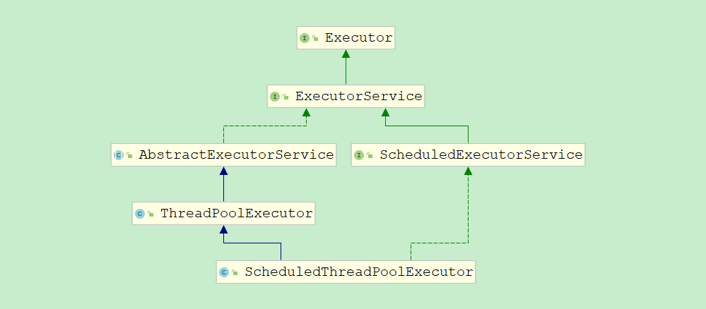
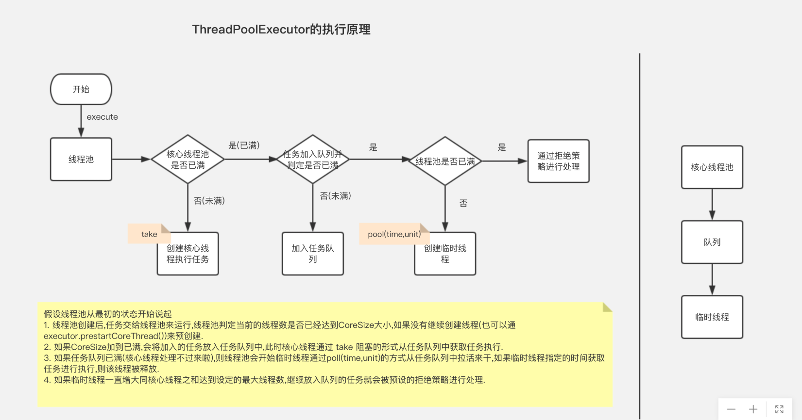
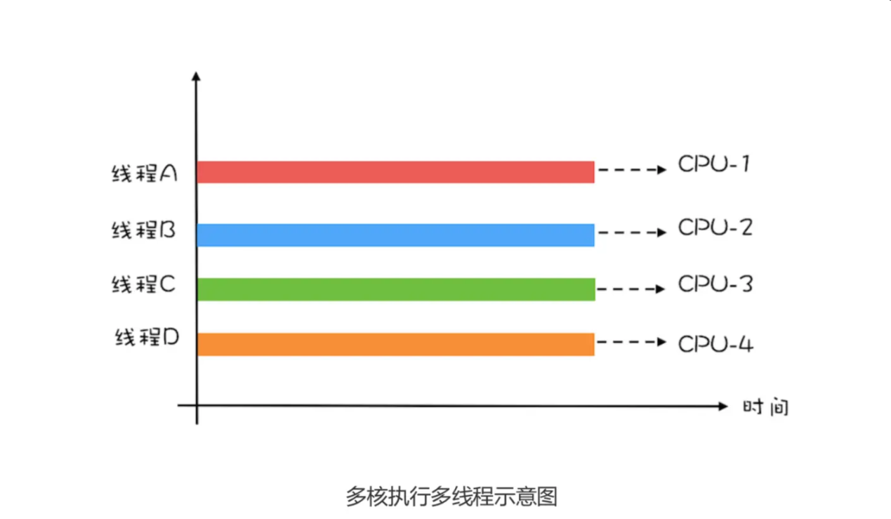
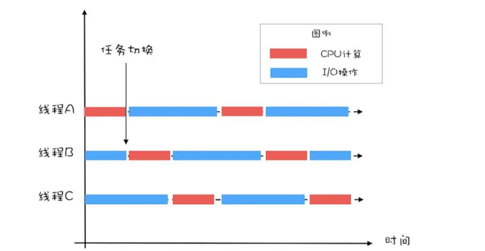

# 线程池

## 一. 线程池技术的意义

多线程技术主要解决处理器单元内多个线程执行的问题，它可以显著减少处理器单元的闲置时间，增加处理器单元的吞吐能力。
假设一个服务器完成一项任务所需时间为：T1 创建线程时间，T2 在线程中执行任务的时间，T3 销毁线程时间。
如果：T1 + T3 远大于 T2，则可以采用线程池，以提高服务器性能。

一个线程池包括以下四个基本组成部分：

- 1、线程池管理器（ThreadPool）：用于创建并管理线程池，包括 创建线程池，销毁线程池，添加新任务；
- 2、工作线程（PoolWorker）：线程池中线程，在没有任务时处于等待状态，可以循环的执行任务；
- 3、任务接口（Task）：每个任务必须实现的接口，以供工作线程调度任务的执行，它主要规定了任务的入口，任务执行完后的收尾工作，任务的执行状态等；
- 4、任务队列（taskQueue）：用于存放没有处理的任务。提供一种缓冲机制。

线程池技术正是关注如何缩短或调整T1,T3时间的技术，从而提高服务器程序性能的。它把T1，T3分别安排在服务器程序的启动和结束的时间段或者一些空闲的时间段，这样在服务器程序处理客户请求时，不会有T1，T3的开销了。

线程池不仅调整T1,T3产生的时间段，而且它还显著减少了创建线程的数目，看一个例子：

- 假设一个服务器一天要处理50000个请求，并且每个请求需要一个单独的线程完成。在线程池中，线程数一般是固定的，所以产生线程总数不会超过线程池中线程的数目，而如果服务器不利用线程池来处理这些请求则线程总数为50000。一般线程池大小是远小于50000。所以利用线程池的服务器程序不会为了创建50000而在处理请求时浪费时间，从而提高效率。

**线程池的工作主要是控制运行的线程数量，处理过程中将任务放入队列，然后在线程创建后启动这些任务，如果任务数量超过了最大线程数量，需要进入队列排队等候，等其他线程执行完毕，再从队列中取出任务来执行** 

主要特点：

- 线程复用
- 控制最大并发数量
- 管理线程

带来的好处：

- 降低了资源消耗。通过复用机制降低了线程创建和销毁的消耗。
- 提高了响应速度。当任务到达时，任务不需要等候就能立即执行。
- 提高了线程的可管理性。线程是稀缺的，如果无限制创建，不仅会消耗系统资源，还会降低系统的稳定性，使用线程池可以进行统一分配，调优和监控。

## 二. 线程池技术的基本原理

**整体思路**：线程池长期驻留着一定数量的线程，这些线程不断从阻塞队列中抽取“任务”，然后调用任务方法即可完成线程的复用。

下面我们使用Java代码实现一个简易的线程池：

```java
public class MyThreadPool {
    private static final int DEFAULT_THREAD_NUM = 5;//线程池中默认线程个数
    private static final int DEFAULT_TASK_NUM = 100;//队列中默认的任务个数

    private WorkThread[] workThreads;
    private BlockingQueue<Runnable> taskQueue;//任务队列
    private int thread_num;//工作线程数
    private int task_num;//任务个数

    public MyThreadPool() {
        this(DEFAULT_THREAD_NUM, DEFAULT_TASK_NUM);
    }

    public MyThreadPool(int thread_num, int task_num) {
        if (thread_num <= 0 || task_num <= 0) {
            throw new IllegalArgumentException();
        }
        this.thread_num = thread_num;
        this.task_num = task_num;
        this.taskQueue = new ArrayBlockingQueue<>(task_num);
        this.workThreads = new WorkThread[thread_num];
        for (int i = 0; i < thread_num; i++) {
            WorkThread workThread = new WorkThread(this.taskQueue);
            workThreads[i] = workThread;
            workThread.start();
        }
    }


    private static class WorkThread extends Thread {
        private BlockingQueue<Runnable> blockingQueue;

        public WorkThread(BlockingQueue<Runnable> blockingQueue) {
            this.blockingQueue = blockingQueue;
        }

        @Override
        public void run() {
            while (!this.isInterrupted()) {
                try {
                    Runnable work = blockingQueue.take();
                    work.run();
                } catch (InterruptedException e) {
                    //在捕获take方法阻塞时因中断抛出异常后会清空中断状态，所以在这里需要重设中断状态
                    this.interrupt();
                }
            }
        }

        /**
         * 关闭当前线程
         */
        public void stopWork() {
            this.interrupt();
        }
    }

    public void destroy() {
        /**
         * 中断线程池中所有线程，并清阻塞队列
         */
        for (WorkThread workThread : workThreads) {
            workThread.stopWork();
        }
        taskQueue.clear();
    }

    public void execute(Runnable work) {
        try {
            //将任务加入阻塞队列，如果队列满了，则当前线程阻塞
            taskQueue.put(work);
        } catch (InterruptedException e) {
            e.printStackTrace();
        }
    }
}
```


## 三. JDK线程池



### 3.1 构造器

```java
public ThreadPoolExecutor(int corePoolSize,
                          int maximumPoolSize,
                          long keepAliveTime,
                          TimeUnit unit,
                          BlockingQueue<Runnable> workQueue,
                          ThreadFactory threadFactory,
                          RejectedExecutionHandler handler) {
    if (corePoolSize < 0 ||
        maximumPoolSize <= 0 ||
        maximumPoolSize < corePoolSize ||
        keepAliveTime < 0)
        throw new IllegalArgumentException();
    if (workQueue == null || threadFactory == null || handler == null)
        throw new NullPointerException();
    this.corePoolSize = corePoolSize;
    this.maximumPoolSize = maximumPoolSize;
    this.workQueue = workQueue;
    this.keepAliveTime = unit.toNanos(keepAliveTime);
    this.threadFactory = threadFactory;
    this.handler = handler;
}
```

- corePoolSize：线程池中常驻线程数。
- maximumPoolSize：线程池能够容纳的最大线程数。
- keepAliveTime：多余的空闲线程的存活时间。当前线程池数量超过corePoolSize时，当空闲时间达到keepAliveTime值时，多余空闲线程会被销毁知道只剩下corePoolSize为止。
- unit：keepAliveTime的单位。
- workQueue：任务队列，被提交但尚未执行的任务。
- threadFactory：表示生成线程池中工作线程的线程工厂。
- handler：饱和策略，表示当队列满了并且工作线程大于等于线程池的最大线程数时，新加入的任务如何处理。
  - AbortPolicy ：直接抛出异常，默认；
  - CallerRunsPolicy：用调用者所在的线程来执行任务。
  - DiscardOldestPolicy：丢弃阻塞队列里最老的任务，队列里最靠前的任务。
  - DiscardPolicy ：当前任务直接丢弃。


### 3.2 提交任务

execute(Runnable command) 不需要返回

Future<T> submit(Callable<T> task) 需要返回

```java
public void execute(Runnable command) {
    if (command == null)
        throw new NullPointerException();
    int c = ctl.get();
    if (workerCountOf(c) < corePoolSize) {//工作线程数量小于核心线程数时
        if (addWorker(command, true))
            return;
        c = ctl.get();
    }
    if (isRunning(c) && workQueue.offer(command)) {
        int recheck = ctl.get();
        if (! isRunning(recheck) && remove(command))
            reject(command);
        else if (workerCountOf(recheck) == 0)
            addWorker(null, false);
    }
    else if (!addWorker(command, false))//试图创建新线程
        reject(command);//拒绝任务
}
```



### 3.3 关闭线程池

- shutdownNow()：设置线程池的状态，还会尝试停止正在运行或者暂停任务的线程。

- shutdown()：设置线程池的状态，只会中断所有没有执行任务的线程。


## 四. JDK其他线程池的实现

- FixedThreadPool：创建固定线程数量的，适用于负载较重的服务器，使用了无界队列。
- SingleThreadExecutor：创建单个线程，需要顺序保证执行任务，不会有多个线程活动，使用了无界队列。
- CachedThreadPool：会根据需要来创建新线程的，执行很多短期异步任务的程序，使用了SynchronousQueue。
- WorkStealingPool（JDK7以后）：基于ForkJoinPool实现。
- ScheduledThreadPoolExecutor 

## 五. 线程池的使用

### 5.1 使用JDK预定义的线程池实现

实际上，上述线程池的实现都是基于ThreadPoolExecutor去实现。

```java
public class Test {
    public static void main(String[] args) {
        //使用Executors类创建线程池
        ExecutorService executorService = Executors.newSingleThreadExecutor();
        for (int i = 0; i < 100; i++) {
            executorService.execute(new Work());
        }
    }

    private static class Work implements Runnable {
        @Override
        public void run() {
            try {
                TimeUnit.SECONDS.sleep(1);
            } catch (InterruptedException e) {
                e.printStackTrace();
            }
            System.out.println(Thread.currentThread().getName()+System.currentTimeMillis());
        }
    }
}
```

### 5.2 手动创建线程池

我们通过查看`Executors.newSingleThreadExecutor()`源码可知，实际上还是通过ThreadPoolExecutor类来创建的：

```java
public static ExecutorService newSingleThreadExecutor() {
    return new FinalizableDelegatedExecutorService
        (new ThreadPoolExecutor(1, 1,
                                0L, TimeUnit.MILLISECONDS,
                                new LinkedBlockingQueue<Runnable>()));
}
```

实际上，只要我们能够合理配置线程池参数，我们完全可以使用ThreadPoolExecutor来创建线程池：

```java
public class Test {
    public static void main(String[] args) {
        ExecutorService executorService = new ThreadPoolExecutor(1, 1, 0L, TimeUnit.MILLISECONDS, new ArrayBlockingQueue<Runnable>(5));
        for (int i = 0; i < 100; i++) {
            executorService.execute(new Work());
        }
    }

    private static class Work implements Runnable {
        @Override
        public void run() {
            try {
                TimeUnit.SECONDS.sleep(1);
            } catch (InterruptedException e) {
                e.printStackTrace();
            }
            System.out.println(Thread.currentThread().getName()+System.currentTimeMillis());
        }
    }
}

```

 

##  六. 线程池参数的配置 

大家都写过多线程应用，也都用过线程池，那么线程池究竟设置多少个合适呢？

想必这个问题困恼着我们很多人，我们中的大部分都是拍着脑袋决定的。针对 CPU 密集型的程序比较简单我们就不讨论了，但是对于 IO 密集型的程序究竟设置多少合适呢？

```
线程数 = CPU 核心数 *（ 1 - IO 阻塞系数）
```

公式中提到的阻塞系数决定于你的程序的 IO 延迟程度，当然这也是需要通过经验评估出来的，下面的图呢就是一个具体例子测试情况，可以看出来线程池的大小对响应时间的比例，并不是线程越多越快，针对每一个程序都会有一个合适的点。当然这个公式给我们提供的是一个解决思路，并不是实际的数量，毕竟我们的程序的性能也是参差不齐的。所以我们需要参考上面的公式，结合自己程序的“阻塞”时间合理的评估一个数量。


为便于你理解，这里我举个简单的例子说明一下:计算 1+2+... ... +100 亿的值，如果在 4 核的 CPU 上利用 4 个线程执行，线程 A 计算 [1，25 亿)，线程 B 计算 [25 亿，50 亿)，线程 C 计算 [50，75 亿)，线程 D 计算 [75 亿，100 亿]，之后汇总，那么理论上应该比一个线程计算 [1， 100 亿] 快将近 4 倍，响应时间能够降到 25%。一个线程，对于 4 核的 CPU，CPU 的利用率只 有 25%，而 4 个线程，则能够将 CPU 的利用率提高到 100%。



**创建多少线程合适**?

创建多少线程合适，要看多线程具体的应用场景。我们的程序一般都是 CPU 计算和 I/O 操作交 叉执行的，由于 I/O 设备的速度相对于 CPU 来说都很慢，所以大部分情况下，I/O 操作执行的时间相对于 CPU 计算来说都非常长，这种场景我们一般都称为 I/O 密集型计算；与之相对的就是 CPU 密集型计算了，CPU 密集型计算大部分场景下都是纯 CPU 计算。I/O 密集 型程序和 CPU 密集型程序，计算最佳线程数的方法是不同的。

**下面我们对这两个场景分别说明**：

对于 CPU 密集型计算，多线程本质上是提升多核 CPU 的利用率，所以对于一个 4 核的 CPU， 每个核一个线程，理论上创建 4 个线程就可以了，再多创建线程也只是增加线程切换的成本。所 以，对于 CPU 密集型的计算场景，理论上“线程的数量 =CPU 核数”就是最合适的。不过在工程上，线程的数量一般会设置为“CPU 核数 +1”，这样的话，当线程因为偶尔的内存页失效或 其他原因导致阻塞时，这个额外的线程可以顶上，从而保证 CPU 的利用率。

对于 I/O 密集型的计算场景，比如前面我们的例子中，如果 CPU 计算和 I/O 操作的耗时是 1:1，那么 2 个线程是最合适的。如果 CPU 计算和 I/O 操作的耗时是 1:2，那多少个线程合适 呢?是 3 个线程，如下图所示:CPU 在 A、B、C 三个线程之间切换，对于线程 A，当 CPU 从 B、C 切换回来时，线程 A 正好执行完 I/O 操作。这样 CPU 和 I/O 设备的利用率都达到了 100%。



通过上面这个例子，我们会发现，对于 I/O 密集型计算场景，最佳的线程数是与程序中 CPU 计 算和 I/O 操作的耗时比相关的，我们可以总结出这样一个公式:

```undefined
最佳线程数 =1 +(I/O 耗时 / CPU 耗时)
```

我们令 R=I/O 耗时 / CPU 耗时，综合上图，可以这样理解:当线程 A 执行 IO 操作时，另外 R 个线程正好执行完各自的 CPU 计算。这样 CPU 的利用率就达到了 100%。

不过上面这个公式是针对单核 CPU 的，至于多核 CPU，也很简单，只需要等比扩大就可以了， 计算公式如下:

```undefined
最佳线程数 =CPU 核数 * [ 1 +(I/O 耗时 / CPU 耗时)]
```

**总结**

很多人都知道线程数不是越多越好，但是设置多少是合适的，却又拿不定主意。其实只要把握住 一条原则就可以了，这条原则就是将硬件的性能发挥到极致。上面我们针对 CPU 密集型和 I/O 密集型计算场景都给出了理论上的最佳公式，这些公式背后的目标其实就是将硬件的性能发挥到 极致。

对于 I/O 密集型计算场景，I/O 耗时和 CPU 耗时的比值是一个关键参数，不幸的是这个参数是 未知的，而且是动态变化的，所以工程上，我们要估算这个参数，然后做各种不同场景下的压测 来验证我们的估计。不过工程上，原则还是将硬件的性能发挥到极致，所以压测时，我们需要重 点关注 CPU、I/O 设备的利用率和性能指标(响应时间、吞吐量)之间的关系。

- 用ThreadPoolExecutor自定义线程池，看线程是的用途，如果任务量不大，可以用无界队列，如果任务量非常大，要用有界队列，防止OOM

- 如果任务量很大，还要求每个任务都处理成功，要对提交的任务进行阻塞提交，重写拒绝机制，改为阻塞提交。保证不抛弃一个任务

- 最大线程数一般设为2N+1最好，N是CPU核数

- 核心线程数，看应用，如果是任务，一天跑一次，设置为0，合适，因为跑完就停掉了，如果是常用线程池，看任务量，是保留一个核心还是几个核心线程数

- 如果要获取任务执行结果，用CompletionService，但是注意，获取任务的结果的要重新开一个线程获取，如果在主线程获取，就要等任务都提交后才获取，就会阻塞大量任务结果，队列过大OOM，所以最好异步开个线程获取结果

本文参考至： https://www.jianshu.com/p/f5ead62827d7 