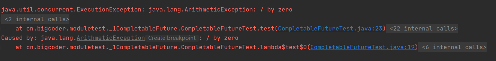
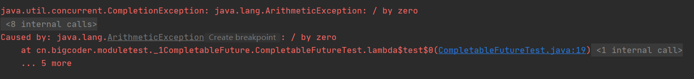

# CompletableFuture

> 本文转载至：[https://colobu.com/2016/02/29/Java-CompletableFuture](https://colobu.com/2016/02/29/Java-CompletableFuture)
>

[Future](https://docs.oracle.com/javase/8/docs/api/java/util/concurrent/Future.html)是Java 5添加的类，用来描述一个异步计算的结果。你可以使用`isDone`方法检查计算是否完成，或者使用`get`阻塞住调用线程，直到计算完成返回结果，你也可以使用`cancel`方法停止任务的执行。

```java
public class BasicFuture {
    public static void main(String[] args) throws ExecutionException, InterruptedException {
        ExecutorService es = Executors.newFixedThreadPool(10);
        Future<Integer> f = es.submit(() ->{
                // 长时间的异步计算
                // ……
                // 然后返回结果
                return 100;
            });
//        while(!f.isDone())
//            ;
        f.get();
    }
}
```

虽然`Future`以及相关使用方法提供了异步执行任务的能力，但是对于结果的获取却是很不方便，只能通过阻塞或者轮询的方式得到任务的结果。阻塞的方式显然和我们的异步编程的初衷相违背，轮询的方式又会耗费无谓的CPU资源，而且也不能及时地得到计算结果，为什么不能用观察者设计模式当计算结果完成及时通知监听者呢？

很多语言，比如Node.js，采用回调的方式实现异步编程。Java的一些框架，比如Netty，自己扩展了Java的 `Future`接口，提供了`addListener`等多个扩展方法：

```java
ChannelFuture future = bootstrap.connect(new InetSocketAddress(host, port));
future.addListener(new ChannelFutureListener(){
        @Override
        public void operationComplete(ChannelFuture future) throws Exception
        {
            if (future.isSuccess()) {
                // SUCCESS
            }
            else {
                // FAILURE
            }
        }
});
```

Google guava也提供了通用的扩展Future:[ListenableFuture](http://google.github.io/guava/releases/19.0/api/docs/com/google/common/util/concurrent/ListenableFuture.html)、[SettableFuture](http://google.github.io/guava/releases/19.0/api/docs/com/google/common/util/concurrent/SettableFuture.html) 以及辅助类[Futures](http://google.github.io/guava/releases/19.0/api/docs/com/google/common/util/concurrent/Futures.html)等,方便异步编程：

```java
final String name = ...;
inFlight.add(name);
ListenableFuture<Result> future = service.query(name);
future.addListener(new Runnable() {
    public void run() {
      processedCount.incrementAndGet();
      inFlight.remove(name);
      lastProcessed.set(name);
      logger.info("Done with {0}", name);
    }
}, executor);
```

Scala也提供了简单易用且功能强大的Future/Promise[异步编程模式](http://docs.scala-lang.org/overviews/core/futures.html)。

作为正统的Java类库，是不是应该做点什么，加强一下自身库的功能呢？

在Java 8中, 新增加了一个包含50个方法左右的类: [CompletableFuture](https://docs.oracle.com/javase/8/docs/api/java/util/concurrent/CompletableFuture.html)，提供了非常强大的Future的扩展功能，可以帮助我们简化异步编程的复杂性，提供了函数式编程的能力，可以通过回调的方式处理计算结果，并且提供了转换和组合CompletableFuture的方法。

下面我们就看一看它的功能吧。

## 一. 主动完成计算

CompletableFuture类实现了[CompletionStage](https://docs.oracle.com/javase/8/docs/api/java/util/concurrent/CompletionStage.html)和[Future](https://docs.oracle.com/javase/8/docs/api/java/util/concurrent/Future.html)接口，所以你还是可以像以前一样通过阻塞或者轮询的方式获得结果，尽管这种方式不推荐使用。

```java
public T 	get()
public T 	get(long timeout, TimeUnit unit)
public T 	getNow(T valueIfAbsent)
public T 	join()
```

`getNow`有点特殊，如果结果已经计算完则返回结果或者抛出异常，否则返回给定的`valueIfAbsent`值。
`join`返回计算的结果或者抛出一个unchecked异常(CompletionException)，它和`get`对抛出的异常的处理有些细微的区别，你可以运行下面的代码进行比较：

```java
CompletableFuture<Integer> future = CompletableFuture.supplyAsync(() -> {
    int i = 1/0;
    return 100;
});
//future.join();
future.get();
```

get：



join:



尽管Future可以代表在另外的线程中执行的一段异步代码，但是你还是可以在本身线程中执行：

```java
public static CompletableFuture<Integer> compute() {
    final CompletableFuture<Integer> future = new CompletableFuture<>();

    return future;
}
```

上面的代码中`future`没有关联任何的`Callback`、线程池、异步任务等，如果客户端调用`future.get`就会一致傻等下去。你可以通过下面的代码完成一个计算，触发客户端的等待：

```java
f.complete(100);
```

当然你也可以抛出一个异常，而不是一个成功的计算结果：

```java
f.completeExceptionally(new Exception());
```

完整的代码如下：

```java
public static void main(String[] args) {
    final CompletableFuture<Integer> f = new CompletableFuture<>();
    class Client extends Thread {
        CompletableFuture<Integer> f;

        Client(String threadName, CompletableFuture<Integer> f) {
            super(threadName);
            this.f = f;
        }

        @Override
        public void run() {
            try {
                System.out.println(this.getName() + ": " + f.get());
            } catch (InterruptedException e) {
                e.printStackTrace();
            } catch (ExecutionException e) {
                e.printStackTrace();
            }
        }
    }
    new Client("Client1", f).start();
    new Client("Client2", f).start();
    System.out.println("waiting");
    f.complete(100);
    //f.completeExceptionally(new Exception());
}
```

可以看到我们并没有把`f.complete(100);`放在另外的线程中去执行，但是在大部分情况下我们可能会用一个线程池去执行这些异步任务。`CompletableFuture.complete()`、`CompletableFuture.completeExceptionally`只能被调用一次。但是我们有两个后门方法可以重设这个值:`obtrudeValue`、`obtrudeException`，但是使用的时候要小心，因为`complete`已经触发了客户端，有可能导致客户端会得到不期望的结果。

## 二. 创建CompletableFuture对象

`CompletableFuture.completedFuture`是一个静态辅助方法，用来返回一个已经计算好的`CompletableFuture`。

```java
public static <U> CompletableFuture<U> completedFuture(U value)
```

而以下四个静态方法用来为一段异步执行的代码创建`CompletableFuture`对象：

```java
public static CompletableFuture<Void> 	runAsync(Runnable runnable)
public static CompletableFuture<Void> 	runAsync(Runnable runnable, Executor executor)
public static <U> CompletableFuture<U> 	supplyAsync(Supplier<U> supplier)
public static <U> CompletableFuture<U> 	supplyAsync(Supplier<U> supplier, Executor executor)
```

以`Async`结尾并且没有指定`Executor`的方法会使用`ForkJoinPool.commonPool()`作为它的线程池执行异步代码。

`runAsync`方法也好理解，它以`Runnable`函数式接口类型为参数，所以`CompletableFuture`的计算结果为空。

`supplyAsync`方法以`Supplier<U>`函数式接口类型为参数,`CompletableFuture`的计算结果类型为`U`。

因为方法的参数类型都是函数式接口，所以可以使用lambda表达式实现异步任务，比如：

```java
CompletableFuture<String> future = CompletableFuture.supplyAsync(() -> {
    //长时间的计算任务
    return "·00";
});
```

## 三. 计算结果完成时的处理

当`CompletableFuture`的计算结果完成，或者抛出异常的时候，我们可以执行特定的`Action`。主要是下面的方法：

```java
public CompletableFuture<T> 	whenComplete(BiConsumer<? super T,? super Throwable> action)
public CompletableFuture<T> 	whenCompleteAsync(BiConsumer<? super T,? super Throwable> action)
public CompletableFuture<T> 	whenCompleteAsync(BiConsumer<? super T,? super Throwable> action, Executor executor)
public CompletableFuture<T>     exceptionally(Function<Throwable,? extends T> fn)
```

可以看到`Action`的类型是`BiConsumer<? super T,? super Throwable>`，它可以处理正常的计算结果，或者异常情况。
方法不以`Async`结尾，意味着`Action`使用相同的线程执行，而`Async`可能会使用其它的线程去执行(如果使用相同的线程池，也可能会被同一个线程选中执行)。

注意这几个方法都会返回`CompletableFuture`，当`Action`执行完毕后它的结果返回原始的`CompletableFuture`的计算结果或者返回异常。

```java
private static Random rand = new Random();
    private static long t = System.currentTimeMillis();

    @Test
    public void testWhenComplete() throws ExecutionException, InterruptedException {
        CompletableFuture<Integer> future = CompletableFuture.supplyAsync(() -> {
            System.out.println("begin to start compute");
            try {
                Thread.sleep(3000);
            } catch (InterruptedException e) {
                throw new RuntimeException(e);
            }
            System.out.println("end to start compute. passed " + (System.currentTimeMillis() - t) / 1000 + " seconds");
            return rand.nextInt(1000);
        });
        //whenComplete会在任务执行完成后被触发，它将触发一个新的CompletableFuture执行，这个新的CompletableFuture的返回值与上一阶段的返回值相同
        CompletableFuture<Integer> f = future.whenComplete((v, e) -> {
            System.out.println("future-v:" + v);
            System.out.println("future-e:" + e);
            try {
                Thread.sleep(2000);
            } catch (InterruptedException interruptedException) {
                interruptedException.printStackTrace();
            }
        });
        f.whenComplete((v, e) -> {
            System.out.println("future-v:" + v);
            System.out.println("future-e:" + e);
        });
        System.out.println("main:" + f.get());
    }
```

`exceptionally`方法返回一个新的CompletableFuture，当原始的CompletableFuture抛出异常的时候，就会触发这个CompletableFuture的计算，调用function计算值，否则如果原始的CompletableFuture正常计算完后，这个新的CompletableFuture也计算完成，它的值和原始的CompletableFuture的计算的值相同。也就是这个`exceptionally`方法用来处理异常的情况。

下面一组方法同样也返回CompletableFuture对象，但是与上面那组方法不同的是，`handle*`创建的处理阶段可以拥有自己的返回值，而`when*`创建的新处理阶段只能沿用上一阶段的返回值。

```java
public <U> CompletableFuture<U> 	handle(BiFunction<? super T,Throwable,? extends U> fn)
public <U> CompletableFuture<U> 	handleAsync(BiFunction<? super T,Throwable,? extends U> fn)
public <U> CompletableFuture<U> 	handleAsync(BiFunction<? super T,Throwable,? extends U> fn, Executor executor)
```

同样，不以`Async`结尾的方法由原来的线程计算，以`Async`结尾的方法由默认的线程池`ForkJoinPool.commonPool()`或者指定的线程池`executor`运行。

```java
@Test
public void testHandle() throws ExecutionException, InterruptedException {
    CompletableFuture<Integer> future = CompletableFuture.supplyAsync(() -> {
        System.out.println("begin to start compute");
        try {
            Thread.sleep(3000);
        } catch (InterruptedException e) {
            throw new RuntimeException(e);
        }
        return 1;
    });
    CompletableFuture<Object> future2 = future.handle((integer, throwable) -> {
        System.out.println("future1执行完毕，返回值:" + integer);
        try {
            Thread.sleep(2000);
        } catch (InterruptedException e) {
            e.printStackTrace();
        }
        return 2;
    });

    System.out.println("future2执行完毕，返回值:" + future2.get());
}
```

## 三. 转换

这一组函数的功能是当原来的CompletableFuture计算完后，将结果传递给函数`fn`，将`fn`的结果作为新的`CompletableFuture`计算结果。因此它的功能相当于将`CompletableFuture<T>`转换成`CompletableFuture<U>`。

我们前面说到的`handle*`同样也具有转换的效果，它们与`handle`方法的区别在于`handle`方法会处理正常计算值和异常，因此它可以屏蔽异常，避免异常继续抛出。而`thenApply`方法只是用来处理正常值，因此一旦有异常就会抛出。

```java
public <U> CompletableFuture<U> 	thenApply(Function<? super T,? extends U> fn)
public <U> CompletableFuture<U> 	thenApplyAsync(Function<? super T,? extends U> fn)
public <U> CompletableFuture<U> 	thenApplyAsync(Function<? super T,? extends U> fn, Executor executor)
```

这三个函数的区别和上面介绍的一样，不以`Async`结尾的方法由原来的线程计算，以`Async`结尾的方法由默认的线程池`ForkJoinPool.commonPool()`或者指定的线程池`executor`运行。Java的CompletableFuture类总是遵循这样的原则，下面就不一一赘述了。

使用例子如下：

```java
CompletableFuture<Integer> future = CompletableFuture.supplyAsync(() -> {
    return 100;
});
CompletableFuture<String> f =  future.thenApplyAsync(i -> i * 10).thenApply(i -> i.toString());
System.out.println(f.get()); //"1000"
```

需要注意的是，这些转换并不是马上执行的，也不会阻塞，而是在前一个stage完成后继续执行。

## 四. 消费(执行Action)

上面的方法是当计算完成的时候，会生成新的计算结果(`thenApply`, `handle`)，或者返回同样的计算结果`whenComplete`，`CompletableFuture`还提供了一种处理结果的方法，只对结果执行`Action`,而不返回新的计算值，因此计算值为`Void`:

```java
public CompletableFuture<Void> 	thenAccept(Consumer<? super T> action)
public CompletableFuture<Void> 	thenAcceptAsync(Consumer<? super T> action)
public CompletableFuture<Void> 	thenAcceptAsync(Consumer<? super T> action, Executor executor)
```

看它的参数类型也就明白了，它们是函数式接口`Consumer`，这个接口只有输入，没有返回值。

```java
CompletableFuture<Integer> future = CompletableFuture.supplyAsync(() -> {
    return 100;
});
CompletableFuture<Void> f =  future.thenAccept(System.out::println);
System.out.println(f.get());
```

`thenAcceptBoth`以及相关方法提供了类似的功能，当两个CompletionStage都正常完成计算的时候，就会执行提供的`action`，它用来组合另外一个异步的结果。
`runAfterBoth`是当两个CompletionStage都正常完成计算的时候,执行一个Runnable，这个Runnable并不使用计算的结果。

```java
public <U> CompletableFuture<Void> 	thenAcceptBoth(CompletionStage<? extends U> other, BiConsumer<? super T,? super U> action)
public <U> CompletableFuture<Void> 	thenAcceptBothAsync(CompletionStage<? extends U> other, BiConsumer<? super T,? super U> action)
public <U> CompletableFuture<Void> 	thenAcceptBothAsync(CompletionStage<? extends U> other, BiConsumer<? super T,? super U> action, Executor executor)
public     CompletableFuture<Void> 	runAfterBoth(CompletionStage<?> other,  Runnable action)
```

例子如下：

```java
CompletableFuture<Integer> future = CompletableFuture.supplyAsync(() -> {
    return 100;
});
CompletableFuture<Void> f =  future.thenAcceptBoth(CompletableFuture.completedFuture(10), (x, y) -> System.out.println(x * y));
System.out.println(f.get());
```

更彻底地，下面一组方法当计算完成的时候会执行一个Runnable,与`thenAccept`不同，Runnable并不使用CompletableFuture计算的结果。

```java
public CompletableFuture<Void> 	thenRun(Runnable action)
public CompletableFuture<Void> 	thenRunAsync(Runnable action)
public CompletableFuture<Void> 	thenRunAsync(Runnable action, Executor executor)
```

因此先前的CompletableFuture计算的结果被忽略了,这个方法返回`CompletableFuture<Void>`类型的对象。

```java
CompletableFuture<Integer> future = CompletableFuture.supplyAsync(() -> {
    return 100;
});
CompletableFuture<Void> f =  future.thenRun(() -> System.out.println("finished"));
System.out.println(f.get());
```

> 因此，你可以根据方法的参数的类型来加速你的记忆。`Runnable`类型的参数会忽略计算的结果，`Consumer`是纯消费计算结果，`BiConsumer`会组合另外一个`CompletionStage`纯消费，`Function`会对计算结果做转换，`BiFunction`会组合另外一个`CompletionStage`的计算结果做转换。

## 五. 组合

```java
public <U> CompletableFuture<U> 	thenCompose(Function<? super T,? extends CompletionStage<U>> fn)
public <U> CompletableFuture<U> 	thenComposeAsync(Function<? super T,? extends CompletionStage<U>> fn)
public <U> CompletableFuture<U> 	thenComposeAsync(Function<? super T,? extends CompletionStage<U>> fn, Executor executor)
```

这一组方法接受一个Function作为参数，这个Function的输入是当前的CompletableFuture的计算值，返回结果将是一个新的CompletableFuture，这个新的CompletableFuture会组合原来的CompletableFuture和函数返回的CompletableFuture。因此它的功能类似:

```
A +--> B +---> C
```

记住，`thenCompose`返回的对象并不一是函数`fn`返回的对象，如果原来的`CompletableFuture`还没有计算出来，它就会生成一个新的组合后的CompletableFuture。

例子：

```java
CompletableFuture<Integer> future = CompletableFuture.supplyAsync(() -> {
    return 100;
});
CompletableFuture<String> f =  future.thenCompose( i -> {
    return CompletableFuture.supplyAsync(() -> {
        return (i * 10) + "";
    });
});
System.out.println(f.get()); //1000
```

而下面的一组方法`thenCombine`用来复合另外一个CompletionStage的结果。它的功能类似：

```
A +
  |
  +------> C
  +------^
B +
```

两个CompletionStage是并行执行的，它们之间并没有先后依赖顺序，`other`并不会等待先前的`CompletableFuture`执行完毕后再执行。

```java
public <U,V> CompletableFuture<V> 	thenCombine(CompletionStage<? extends U> other, BiFunction<? super T,? super U,? extends V> fn)
public <U,V> CompletableFuture<V> 	thenCombineAsync(CompletionStage<? extends U> other, BiFunction<? super T,? super U,? extends V> fn)
public <U,V> CompletableFuture<V> 	thenCombineAsync(CompletionStage<? extends U> other, BiFunction<? super T,? super U,? extends V> fn, Executor executor)
```

其实从功能上来讲,它们的功能更类似`thenAcceptBoth`，只不过`thenAcceptBoth`是纯消费，它的函数参数没有返回值，而`thenCombine`的函数参数`fn`有返回值。

```java
CompletableFuture<Integer> future = CompletableFuture.supplyAsync(() -> {
    return 100;
});
CompletableFuture<String> future2 = CompletableFuture.supplyAsync(() -> {
    return "abc";
});
CompletableFuture<String> f =  future.thenCombine(future2, (x,y) -> y + "-" + x);
System.out.println(f.get()); //abc-100
```

## 六. Either

`thenAcceptBoth`和`runAfterBoth`是当两个CompletableFuture都计算完成，而我们下面要了解的方法是当任意一个CompletableFuture计算完成的时候就会执行。

```java
public CompletableFuture<Void> 	acceptEither(CompletionStage<? extends T> other, Consumer<? super T> action)
public CompletableFuture<Void> 	acceptEitherAsync(CompletionStage<? extends T> other, Consumer<? super T> action)
public CompletableFuture<Void> 	acceptEitherAsync(CompletionStage<? extends T> other, Consumer<? super T> action, Executor executor)

public <U> CompletableFuture<U> 	applyToEither(CompletionStage<? extends T> other, Function<? super T,U> fn)
public <U> CompletableFuture<U> 	applyToEitherAsync(CompletionStage<? extends T> other, Function<? super T,U> fn)
public <U> CompletableFuture<U> 	applyToEitherAsync(CompletionStage<? extends T> other, Function<? super T,U> fn, Executor executor)
acceptEither`方法是当任意一个CompletionStage完成的时候，`action`这个消费者就会被执行。这个方法返回`CompletableFuture<Void>
```

`applyToEither`方法是当任意一个CompletionStage完成的时候，`fn`会被执行，它的返回值会当作新的`CompletableFuture<U>`的计算结果。

下面这个例子有时会输出`100`,有时候会输出`200`,哪个Future先完成就会根据它的结果计算。

```java
Random rand = new Random();
CompletableFuture<Integer> future = CompletableFuture.supplyAsync(() -> {
    try {
        Thread.sleep(10000 + rand.nextInt(1000));
    } catch (InterruptedException e) {
        e.printStackTrace();
    }
    return 100;
});
CompletableFuture<Integer> future2 = CompletableFuture.supplyAsync(() -> {
    try {
        Thread.sleep(10000 + rand.nextInt(1000));
    } catch (InterruptedException e) {
        e.printStackTrace();
    }
    return 200;
});
CompletableFuture<String> f =  future.applyToEither(future2,i -> i.toString());
```

## 七. 辅助方法 `allOf` 和 `anyOf`

前面我们已经介绍了几个静态方法：`completedFuture`、`runAsync`、`supplyAsync`,下面介绍的这两个方法用来组合多个CompletableFuture。

```java
public static CompletableFuture<Void> 	    allOf(CompletableFuture<?>... cfs)
public static CompletableFuture<Object> 	anyOf(CompletableFuture<?>... cfs)
```

`allOf`方法是当所有的`CompletableFuture`都执行完后执行计算。

`anyOf`方法是当任意一个`CompletableFuture`执行完后就会执行计算，计算的结果相同。

下面的代码运行结果有时是100,有时是"abc"。但是`anyOf`和`applyToEither`不同。`anyOf`接受任意多的CompletableFuture但是`applyToEither`只是判断两个CompletableFuture,`anyOf`返回值的计算结果是参数中其中一个CompletableFuture的计算结果，`applyToEither`返回值的计算结果却是要经过`fn`处理的。当然还有静态方法的区别，线程池的选择等。

```java
Random rand = new Random();
CompletableFuture<Integer> future1 = CompletableFuture.supplyAsync(() -> {
    try {
        Thread.sleep(10000 + rand.nextInt(1000));
    } catch (InterruptedException e) {
        e.printStackTrace();
    }
    return 100;
});
CompletableFuture<String> future2 = CompletableFuture.supplyAsync(() -> {
    try {
        Thread.sleep(10000 + rand.nextInt(1000));
    } catch (InterruptedException e) {
        e.printStackTrace();
    }
    return "abc";
});
//CompletableFuture<Void> f =  CompletableFuture.allOf(future1,future2);
CompletableFuture<Object> f =  CompletableFuture.anyOf(future1,future2);
System.out.println(f.get());
```

我想通过上面的介绍，应该把CompletableFuture的方法和功能介绍完了(`cancel`、`isCompletedExceptionally()`、`isDone()`以及继承于Object的方法无需介绍了， `toCompletableFuture()`返回CompletableFuture本身)，希望你能全面了解CompletableFuture强大的功能，并将它应用到Java的异步编程中。如果你有使用它的开源项目，可以留言分享一下。

## 八. 更进一步

如果你用过Guava的Future类，你就会知道它的`Futures`辅助类提供了很多便利方法，用来处理多个Future，而不像Java的CompletableFuture，只提供了`allOf`、`anyOf`两个方法。 比如有这样一个需求，将多个CompletableFuture组合成一个CompletableFuture，这个组合后的CompletableFuture的计算结果是个List,它包含前面所有的CompletableFuture的计算结果，guava的`Futures.allAsList`可以实现这样的功能，但是对于java CompletableFuture，我们需要一些辅助方法：

```java
 public static <T> CompletableFuture<List<T>> sequence(List<CompletableFuture<T>> futures) {
       CompletableFuture<Void> allDoneFuture = CompletableFuture.allOf(futures.toArray(new CompletableFuture[futures.size()]));
       return allDoneFuture.thenApply(v -> futures.stream().map(CompletableFuture::join).collect(Collectors.<T>toList()));
   }
public static <T> CompletableFuture<Stream<T>> sequence(Stream<CompletableFuture<T>> futures) {
       List<CompletableFuture<T>> futureList = futures.filter(f -> f != null).collect(Collectors.toList());
       return sequence(futureList);
   }
```

或者Java Future转CompletableFuture:

```java
public static <T> CompletableFuture<T> toCompletable(Future<T> future, Executor executor) {
    return CompletableFuture.supplyAsync(() -> {
        try {
            return future.get();
        } catch (InterruptedException | ExecutionException e) {
            throw new RuntimeException(e);
        }
    }, executor);
}
```

github有多个项目可以实现Java CompletableFuture与其它Future (如Guava ListenableFuture)之间的转换，如[spotify/futures-extra](https://github.com/spotify/futures-extra)、[future-converter](https://github.com/lukas-krecan/future-converter)、[scala/scala-java8-compat ](https://github.com/scala/scala-java8-compat/blob/master/src/main/scala/scala/compat/java8/FutureConverters.scala)等。

