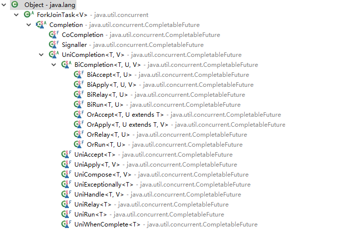
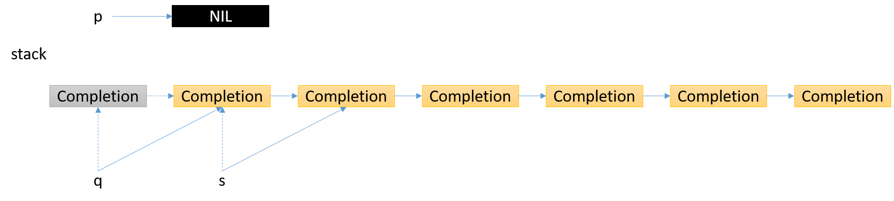
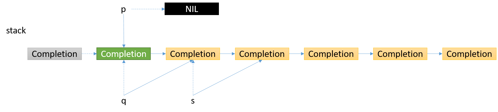
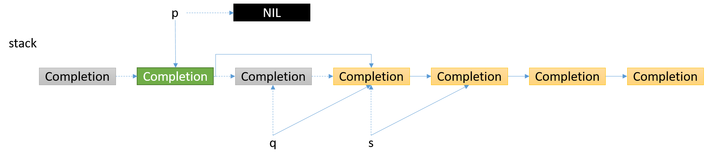
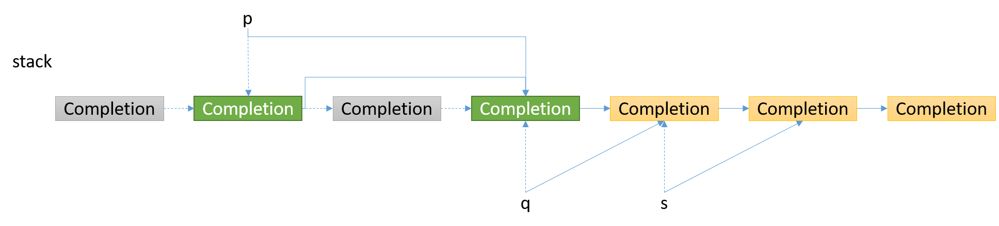

# CompletableFuture源码分析

> 本文转载至：<https://www.cnblogs.com/aniao/p/aniao_cf.html>

## supplyAsync

### supplyAsync(Supplier<U> supplier)

```java
public static <U> CompletableFuture<U> supplyAsync(Supplier<U> supplier) {
    return asyncSupplyStage(asyncPool, supplier); // asyncPool, ForkJoinPool.commonPool()或者ThreadPerTaskExecutor(实现了Executor接口，里面的内容是{new Thread(r).start();})
}
```

### asyncSupplyStage(Executor e, Supplier<U> f)

```java
static <U> CompletableFuture<U> asyncSupplyStage(Executor e, Supplier<U> f) {
    if (f == null)
        throw new NullPointerException();
    CompletableFuture<U> d = new CompletableFuture<U>(); // 构建一个新的CompletableFuture, 以此构建AsyncSupply作为Executor的执行参数
    e.execute(new AsyncSupply<U>(d, f)); // AsyncSupply继承了ForkJoinTask, 实现了Runnable, AsynchronousCompletionTask接口
    return d; // 返回d，立返
}
```

### AsyncSupply

```java
// CompletableFuture的静态内部类，作为一个ForkJoinTask
static final class AsyncSupply<T> extends ForkJoinTask<Void> implements Runnable, AsynchronousCompletionTask {
    CompletableFuture<T> dep; // AsyncSupply作为一个依赖Task，dep作为这个Task的Future
    Supplier<T> fn; // fn作为这个Task的具体执行逻辑，函数式编程

    AsyncSupply(CompletableFuture<T> dep, Supplier<T> fn) {
        this.dep = dep;
        this.fn = fn;
    }

    public final Void getRawResult() {
        return null;
    }

    public final void setRawResult(Void v) {
    }

    public final boolean exec() {
        run();
        return true;
    }

    public void run() {
        CompletableFuture<T> d;
        Supplier<T> f;
        if ((d = dep) != null && (f = fn) != null) { // 非空判断
            dep = null;
            fn = null;
            if (d.result == null) { // 查看任务是否结束，如果已经结束(result != null)，直接调用postComplete()方法
                try {
                    d.completeValue(f.get()); // 等待任务结束，并设置结果
                } catch (Throwable ex) {
                    d.completeThrowable(ex); // 异常
                }
            }
            d.postComplete(); // 任务结束后，会执行所有依赖此任务的其他任务，这些任务以一个无锁并发栈的形式存在
        }
    }
}
```

### postComplete

```java
final void postComplete() {
    CompletableFuture<?> f = this; // 当前CompletableFuture
    Completion h; // 无锁并发栈，(Completion next), 保存的是依靠当前的CompletableFuture一串任务，完成即触发（回调）
    while ((h = f.stack) != null || (f != this && (h = (f = this).stack) != null)) { // 当f的stack为空时，使f重新指向当前的CompletableFuture，继续后面的结点
        CompletableFuture<?> d;
        Completion t;
        if (f.casStack(h, t = h.next)) { // 从头遍历stack，并更新头元素
            if (t != null) {
                if (f != this) { // 如果f不是当前CompletableFuture，则将它的头结点压入到当前CompletableFuture的stack中，使树形结构变成链表结构，避免递归层次过深
                    pushStack(h);
                    continue; // 继续下一个结点，批量压入到当前栈中
                }
                h.next = null; // 如果是当前CompletableFuture, 解除头节点与栈的联系
            }
            f = (d = h.tryFire(NESTED)) == null ? this : d; // 调用头节点的tryFire()方法，该方法可看作Completion的钩子方法，执行完逻辑后，会向后传播的
        }
    }
}
```

### 示意图

每个CompletableFuture持有一个Completion栈stack, 每个Completion持有一个CompletableFuture -> dep, 如此递归循环下去，是层次很深的树形结构，所以想办法将其变成链表结构。


首先取出头结点，下图中灰色Completion结点，它会返回一个CompletableFuture, 同样也拥有一个stack，策略是遍历这个CompletableFuture的stack的每个结点，依次压入到当前CompletableFuture的stack中，关系如下箭头所示，灰色结点指的是处理过的结点。


第一个Completion结点返回的CompletableFuture, 将拥有的stack里面的所有结点都压入了当前CompletableFuture的stack里面。


后续的Completion结点返回的CompletableFuture, 将拥有的stack里面的所有结点都压入了当前CompletableFuture的stack里面，重新构成了一个链表结构，后续也按照前面的逻辑操作，如此反复，便会遍历完所有的CompletableFuture, 这些CompletableFuture(叶子结点)的stack为空，也是结束条件。


postComplete()最后调用的是Completion#tryFire()方法，先看下Completion的数据结构

## Completion

```java
abstract static class Completion extends ForkJoinTask<Void> implements Runnable, AsynchronousCompletionTask {
        volatile Completion next; // 无锁并发栈

        /**
         * 钩子方法，有三种模式，postComplete()方法里面使用的是NESTED模式，避免过深的递归调用 SYNC, ASYNC, or NESTED
         */
        abstract CompletableFuture<?> tryFire(int mode); // run()和exec()都调用了这个钩子方法

        /** cleanStack()方法里有用到 */
        abstract boolean isLive();

        public final void run() {
            tryFire(ASYNC);
        }

        public final boolean exec() {
            tryFire(ASYNC);
            return true;
        }

        public final Void getRawResult() {
            return null;
        }

        public final void setRawResult(Void v) {
        }
    }
```

- static final int SYNC = 0;       同步
- static final int ASYNC = 1;    异步
- static final int NESTED = -1; 嵌套

Completion继承了ForkJoinTask, 实现了Runnable, AsynchronousCompletionTask接口，它有诸多子类，如下图



每一个子类都实现了自己的`tryFire`方法，先看一下`UniCompletion`：

### UniCompletion

```java
abstract static class UniCompletion<T,V> extends Completion {
    Executor executor;                 // 执行器
    CompletableFuture<V> dep;          // 依赖的任务
    CompletableFuture<T> src;          // 被依赖的任务

    UniCompletion(Executor executor, CompletableFuture<V> dep,
                  CompletableFuture<T> src) {
        this.executor = executor; this.dep = dep; this.src = src;
    }

    final boolean claim() { // 如果当前任务可以被执行，返回true，否则，返回false; 保证任务只被执行一次
        Executor e = executor;
        if (compareAndSetForkJoinTaskTag((short)0, (short)1)) {
            if (e == null)
                return true;
            executor = null; // 设置为不可用
            e.execute(this);
        }
        return false;
    }

    final boolean isLive() { return dep != null; }
}
```

claim()方法用于保证任务只被执行一次。

### whenComplete、whenCompleteAsync方法

```java
public CompletableFuture<T> whenComplete(BiConsumer<? super T, ? super Throwable> action) {
        return uniWhenCompleteStage(null, action);
    }

    public CompletableFuture<T> whenCompleteAsync(BiConsumer<? super T, ? super Throwable> action) {
        return uniWhenCompleteStage(asyncPool, action);
    }
```

xxx和xxxAsync方法的区别是，有没有asyncPool作为入参，有的话，任务直接入栈，不检查任务是否完成。uniWhenCompleteStage方法有说明

### uniWhenCompleteStage(Executor e, BiConsumer<? super T, ? super Throwable> f)

```java
private CompletableFuture<T> uniWhenCompleteStage(Executor e, BiConsumer<? super T, ? super Throwable> f) {
        if (f == null)
            throw new NullPointerException();
        CompletableFuture<T> d = new CompletableFuture<T>(); // 构建future
        if (e != null || !d.uniWhenComplete(this, f, null)) { // 如果线程池不为空，直接构建任务入栈，并调用tryFire()方法；否则，调用uniWhenComplete()方法，检查依赖的那个任务是否完成，没有完成返回false,
                                                                // 完成了返回true, 以及后续一些操作。
            UniWhenComplete<T> c = new UniWhenComplete<T>(e, d, this, f); // UniWhenComplete继承了UniCompletion
            push(c);
            c.tryFire(SYNC); // 先调一下钩子方法，检查一下任务是否结束
        }
        return d;
    }
```

### uniWhenComplete(CompletableFuture<T> a, BiConsumer<? super T, ? super Throwable> f, UniWhenComplete<T> c)

```java
final boolean uniWhenComplete(CompletableFuture<T> a, BiConsumer<? super T, ? super Throwable> f, UniWhenComplete<T> c) {
        Object r;
        T t;
        Throwable x = null;
        if (a == null || (r = a.result) == null || f == null) // 被依赖的任务还未完成
            return false;
        if (result == null) { // 被依赖的任务完成了
            try {
                if (c != null && !c.claim()) // 判断任务是否能被执行
                    return false;
                if (r instanceof AltResult) { // 判断异常，AltResult类型很简单，里面只有一个属性Throwable ex;
                    x = ((AltResult) r).ex;
                    t = null;
                } else {
                    @SuppressWarnings("unchecked")
                    T tr = (T) r; // 正常的结果
                    t = tr;
                }
                f.accept(t, x); // 执行任务
                if (x == null) {
                    internalComplete(r); // 任务的结果设置为被依赖任务的结果
                    return true;
                }
            } catch (Throwable ex) {
                if (x == null)
                    x = ex; // 记录异常
            }
            completeThrowable(x, r); // 设置异常和结果
        }
        return true;
    }
```

### push()

```java
final void push(UniCompletion<?, ?> c) {
    if (c != null) {
        while (result == null && !tryPushStack(c))
            lazySetNext(c, null); // 失败重置c的next域
    }
}

final boolean tryPushStack(Completion c) {
    Completion h = stack;
    lazySetNext(c, h);
    return UNSAFE.compareAndSwapObject(this, STACK, h, c);
}

static void lazySetNext(Completion c, Completion next) {
    UNSAFE.putOrderedObject(c, NEXT, next);
}
```

### UniWhenComplete

```java
static final class UniWhenComplete<T> extends UniCompletion<T, T> {
    BiConsumer<? super T, ? super Throwable> fn;

    UniWhenComplete(Executor executor, CompletableFuture<T> dep, CompletableFuture<T> src,
            BiConsumer<? super T, ? super Throwable> fn) {
        super(executor, dep, src);
        this.fn = fn;
    }

    final CompletableFuture<T> tryFire(int mode) { // 钩子方法
        CompletableFuture<T> d; // 依赖的任务
        CompletableFuture<T> a; // 被依赖的任务
        if ((d = dep) == null || !d.uniWhenComplete(a = src, fn, mode > 0 ? null : this)) // 如果是异步模式(mode = 1),就不判断任务是否结束
            return null; // dep为空，说明已经调用过了
        dep = null;
        src = null;
        fn = null;
        return d.postFire(a, mode); // 钩子方法之后的处理
    }
}
```

### postFire(CompletableFuture<?> a, int mode)

```java
final CompletableFuture<T> postFire(CompletableFuture<?> a, int mode) {
        if (a != null && a.stack != null) { // 被依赖的任务存在，且stack不为空，先处理它
            if (mode < 0 || a.result == null) // 如果是嵌套模式(mode = -1), 或者任务的结果为空，直接清空栈
                a.cleanStack();
            else
                a.postComplete(); // 否则，调用postComplete()方法
        }
        if (result != null && stack != null) { // 再处理当前任务
            if (mode < 0) // 嵌套模式，直接返回自身(树 -> 链表，避免过深的递归调用)
                return this;
            else
                postComplete(); // 调用postComplete()方法
        }
        return null;
    }
```

### cleanStack()

```java
final void cleanStack() { // 过滤掉已经死掉的结点(Not isLive)
    for (Completion p = null, q = stack; q != null;) { // q指针从头节点开始，向右移动，s一直执行q的下一个结点，p要么为空，要么指向遍历过的最后一个活着的结点，一旦发现q死掉了，就断开q, 连接p, s
        Completion s = q.next;
        if (q.isLive()) { // 还活着，p指向遍历过的最后一个结点，q向右移动
            p = q;
            q = s;
        } else if (p == null) { // 说明第一个结点就是死掉的，cas stack, q指向stack
            casStack(q, s);
            q = stack;
        } else { // 否则的话，连接p, s
            p.next = s;
            if (p.isLive()) // 再次判断p结点是否还或者(在这期间是否有别的线程改动了)
                q = s; // 还活着，q继续向右移动
            else {
                p = null; // 过期的值，从新开始
                q = stack;
            }
        }
    }
}
```

如下图

1. 第1个结点是无效结点，更新stack，更新指针



2. 第2个结点是有效结点，更新指针



3. 第3个结点是无效结点，更新指针



4. 第4个结点是有效结点，更新指针



到这里CompletableFuture的核心流程就已经走完了，其它方法与whenComplete方法处理流程相似。