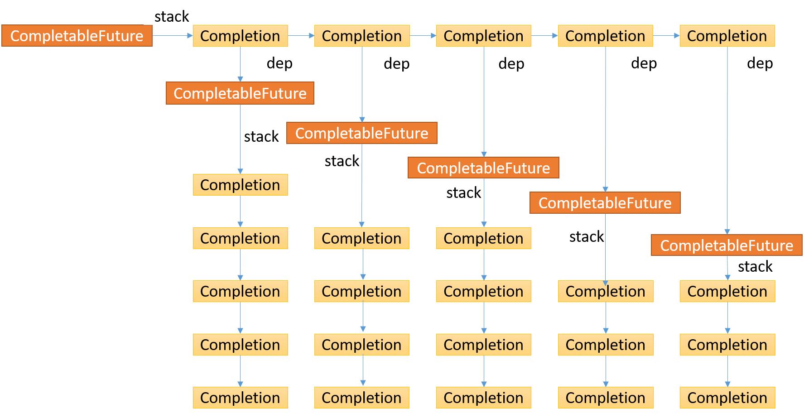
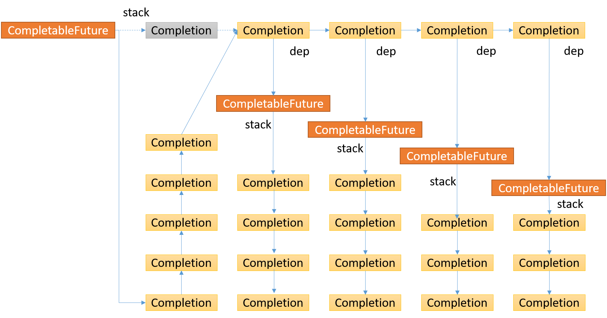
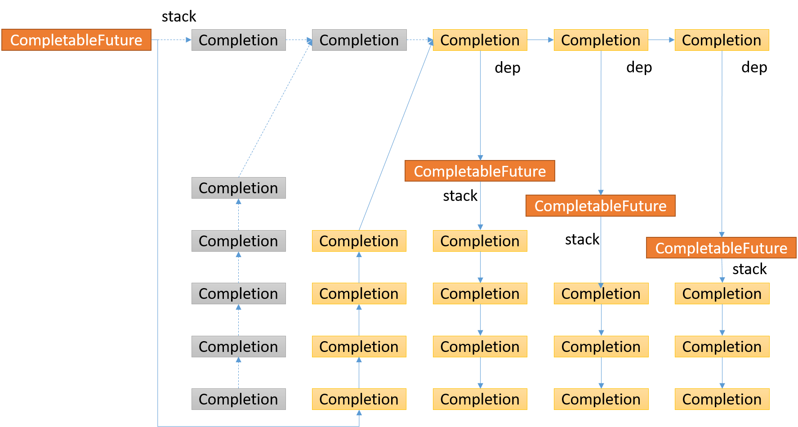
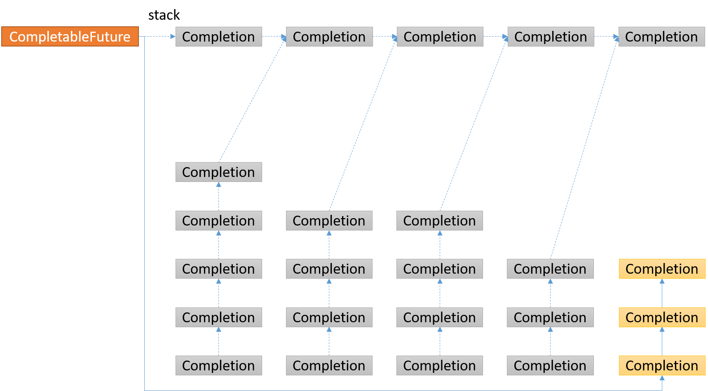

# CompletableFuture源码分析

> 本文转载至：<https://www.cnblogs.com/aniao/p/aniao_cf.html>

## supplyAsync

### supplyAsync(Supplier<U> supplier)

```java
public static <U> CompletableFuture<U> supplyAsync(Supplier<U> supplier) {
    return asyncSupplyStage(asyncPool, supplier); // asyncPool, ForkJoinPool.commonPool()或者ThreadPerTaskExecutor(实现了Executor接口，里面的内容是{new Thread(r).start();})
}
```

### asyncSupplyStage(Executor e, Supplier<U> f)

```java
static <U> CompletableFuture<U> asyncSupplyStage(Executor e, Supplier<U> f) {
    if (f == null)
        throw new NullPointerException();
    CompletableFuture<U> d = new CompletableFuture<U>(); // 构建一个新的CompletableFuture, 以此构建AsyncSupply作为Executor的执行参数
    e.execute(new AsyncSupply<U>(d, f)); // AsyncSupply继承了ForkJoinTask, 实现了Runnable, AsynchronousCompletionTask接口
    return d; // 返回d，立返
}
```

### AsyncSupply

```java
// CompletableFuture的静态内部类，作为一个ForkJoinTask
static final class AsyncSupply<T> extends ForkJoinTask<Void> implements Runnable, AsynchronousCompletionTask {
    CompletableFuture<T> dep; // AsyncSupply作为一个依赖Task，dep作为这个Task的Future
    Supplier<T> fn; // fn作为这个Task的具体执行逻辑，函数式编程

    AsyncSupply(CompletableFuture<T> dep, Supplier<T> fn) {
        this.dep = dep;
        this.fn = fn;
    }

    public final Void getRawResult() {
        return null;
    }

    public final void setRawResult(Void v) {
    }

    public final boolean exec() {
        run();
        return true;
    }

    public void run() {
        CompletableFuture<T> d;
        Supplier<T> f;
        if ((d = dep) != null && (f = fn) != null) { // 非空判断
            dep = null;
            fn = null;
            if (d.result == null) { // 查看任务是否结束，如果已经结束(result != null)，直接调用postComplete()方法
                try {
                    d.completeValue(f.get()); // 等待任务结束，并设置结果
                } catch (Throwable ex) {
                    d.completeThrowable(ex); // 异常
                }
            }
            d.postComplete(); // 任务结束后，会执行所有依赖此任务的其他任务，这些任务以一个无锁并发栈的形式存在
        }
    }
}
```

### postComplete

```java
final void postComplete() {
    CompletableFuture<?> f = this; // 当前CompletableFuture
    Completion h; // 无锁并发栈，(Completion next), 保存的是依靠当前的CompletableFuture一串任务，完成即触发（回调）
    while ((h = f.stack) != null || (f != this && (h = (f = this).stack) != null)) { // 当f的stack为空时，使f重新指向当前的CompletableFuture，继续后面的结点
        CompletableFuture<?> d;
        Completion t;
        if (f.casStack(h, t = h.next)) { // 从头遍历stack，并更新头元素
            if (t != null) {
                if (f != this) { // 如果f不是当前CompletableFuture，则将它的头结点压入到当前CompletableFuture的stack中，使树形结构变成链表结构，避免递归层次过深
                    pushStack(h);
                    continue; // 继续下一个结点，批量压入到当前栈中
                }
                h.next = null; // 如果是当前CompletableFuture, 解除头节点与栈的联系
            }
            f = (d = h.tryFire(NESTED)) == null ? this : d; // 调用头节点的tryFire()方法，该方法可看作Completion的钩子方法，执行完逻辑后，会向后传播的
        }
    }
}
```

### 示意图

每个CompletableFuture持有一个Completion栈stack, 每个Completion持有一个CompletableFuture -> dep, 如此递归循环下去，是层次很深的树形结构，所以想办法将其变成链表结构。



首先取出头结点，下图中灰色Completion结点，它会返回一个CompletableFuture, 同样也拥有一个stack，策略是遍历这个CompletableFuture的stack的每个结点，依次压入到当前CompletableFuture的stack中，关系如下箭头所示，灰色结点指的是处理过的结点。



第一个Completion结点返回的CompletableFuture, 将拥有的stack里面的所有结点都压入了当前CompletableFuture的stack里面。



后续的Completion结点返回的CompletableFuture, 将拥有的stack里面的所有结点都压入了当前CompletableFuture的stack里面，重新构成了一个链表结构，后续也按照前面的逻辑操作，如此反复，便会遍历完所有的CompletableFuture, 这些CompletableFuture(叶子结点)的stack为空，也是结束条件。



postComplete()最后调用的是Completion#tryFire()方法，先看下Completion的数据结构