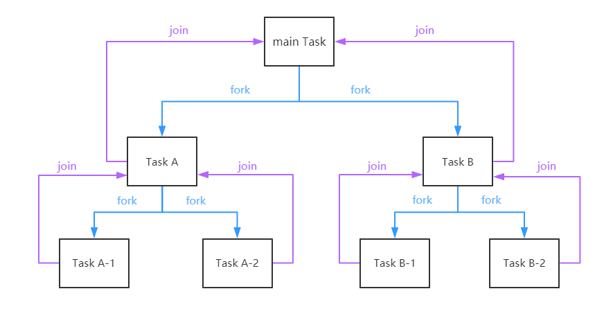
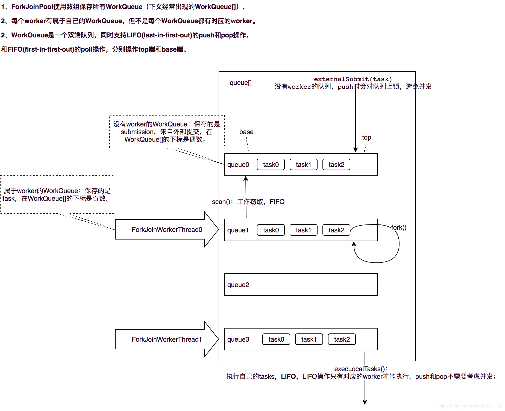
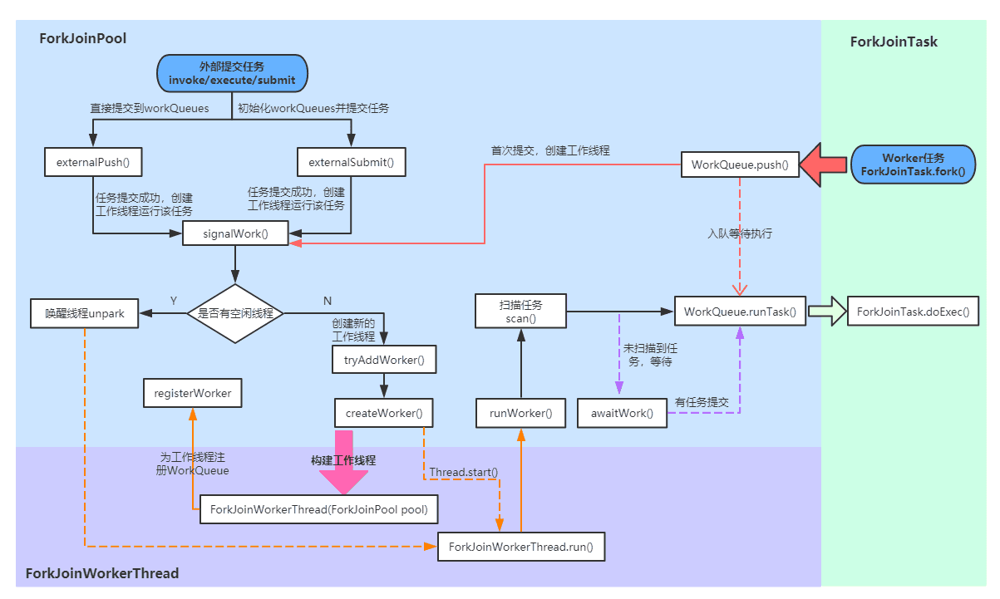
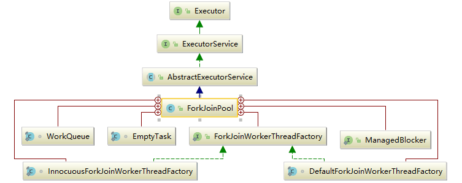
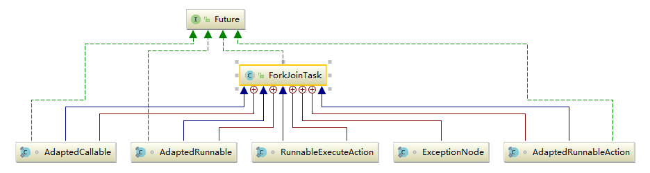

# Fork-Join框架

Fork/Join主要用来解决什么样的问题?

Fork/Join框架是在哪个JDK版本中引入的?

Fork/Join框架主要包含哪三个模块? 模块之间的关系是怎么样的?

ForkJoinPool类继承关系?

ForkJoinTask抽象类继承关系? 在实际运用中，我们一般都会继承 RecursiveTask 、RecursiveAction 或 CountedCompleter 来实现我们的业务需求，而不会直接继承 ForkJoinTask 类。

整个Fork/Join 框架的执行流程/运行机制是怎么样的?

具体阐述Fork/Join的分治思想和work-stealing 实现方式?

有哪些JDK源码中使用了Fork/Join思想?

如何使用Executors工具类创建ForkJoinPool?

写一个例子: 用ForkJoin方式实现1+2+3+...+100000?

Fork/Join在使用时有哪些注意事项? 结合JDK中的斐波那契数列实例具体说明。

> 请带着这些问题继续后文，会很大程度上帮助你更好的理解Fork/Join框架。

## 一. 简介

Fork/Join框架是Java并发工具包中的一种可以将一个大任务拆分为很多小任务来异步执行的工具，自JDK1.7引入。

### 1.1 三个模块及关系

Fork/Join框架主要包含三个模块:

- 任务对象: `ForkJoinTask` (包括`RecursiveTask`、`RecursiveAction` 和 `CountedCompleter`)
- 执行Fork/Join任务的线程: `ForkJoinWorkerThread`
- 线程池: `ForkJoinPool`

这三者的关系是: ForkJoinPool可以通过池中的ForkJoinWorkerThread来处理ForkJoinTask任务。

```java
// from 《A Java Fork/Join Framework》Dong Lea
Result solve(Problem problem) {
	if (problem is small)
 		directly solve problem
 	else {
 		split problem into independent parts
 		fork new subtasks to solve each part
 		join all subtasks
 		compose result from subresults
	}
}
```

ForkJoinPool 只接收 ForkJoinTask 任务(在实际使用中，也可以接收 Runnable/Callable 任务，但在真正运行时，也会把这些任务封装成 ForkJoinTask 类型的任务)，RecursiveTask 是 ForkJoinTask 的子类，是一个可以递归执行的 ForkJoinTask，RecursiveAction 是一个无返回值的 RecursiveTask，CountedCompleter 在任务完成执行后会触发执行一个自定义的钩子函数。

在实际运用中，我们一般都会继承 `RecursiveTask` 、`RecursiveAction` 或 `CountedCompleter` 来实现我们的业务需求，而不会直接继承 ForkJoinTask 类。

### 1.2 核心思想: 分治算法(Divide-and-Conquer)

分治算法(Divide-and-Conquer)把任务递归的拆分为各个子任务，这样可以更好的利用系统资源，尽可能的使用所有可用的计算能力来提升应用性能。首先看一下 Fork/Join 框架的任务运行机制:



### 1.3 核心思想: work-stealing(工作窃取)算法

work-stealing(工作窃取)算法: 线程池内的所有工作线程都尝试找到并执行已经提交的任务，或者是被其他活动任务创建的子任务(如果不存在就阻塞等待)。这种特性使得 ForkJoinPool 在运行多个可以产生子任务的任务，或者是提交的许多小任务时效率更高。尤其是构建异步模型的 ForkJoinPool 时，对不需要合并(join)的事件类型任务也非常适用。

在 ForkJoinPool 中，线程池中每个工作线程(ForkJoinWorkerThread)都对应一个任务队列(WorkQueue)，工作线程优先处理来自自身队列的任务(LIFO或FIFO顺序，参数 mode 决定)，然后以FIFO的顺序随机窃取其他队列中的任务。

具体思路如下:

- 每个线程都有自己的一个WorkQueue，该工作队列是一个双端队列。
- 队列支持三个功能push、pop、poll
- push/pop只能被队列的所有者线程调用，而poll可以被其他线程调用。
- 划分的子任务调用fork时，都会被push到自己的队列中。
- 默认情况下，工作线程从自己的双端队列获出任务并执行。
- 当自己的队列为空时，线程随机从另一个线程的队列末尾调用poll方法窃取任务。



### 1.4 Fork/Join 框架的执行流程

上图可以看出ForkJoinPool 中的任务执行分两种:

- 直接通过 FJP 提交的外部任务(external/submissions task)，存放在 workQueues 的偶数槽位；
- 通过内部 fork 分割的子任务(Worker task)，存放在 workQueues 的奇数槽位。

那Fork/Join 框架的执行流程是什么样的?



## 二. 一个小例子

使用 ForkJoin 框架实现一个计算1-N求和的代码：

```java
public class CountTaskTmp extends RecursiveTask<Integer> {

    private static final int THRESHOLD = 2;
    private int start;
    private int end;

    public CountTaskTmp(int start, int end) {
        this.start = start;
        this.end = end;
    }

    //实现compute 方法来实现任务切分和计算
    protected Integer compute() {
        int sum = 0;
        boolean canCompute = (end - start) <= THRESHOLD;
        if (canCompute) {
            for (int i = start; i <= end; i++) {
                sum += i;
            }
        } else {
            //如果任务大于阀值，就分裂成两个子任务计算
            int mid = (start + end) / 2;
            CountTaskTmp leftTask = new CountTaskTmp(start, mid);
            CountTaskTmp rightTask = new CountTaskTmp(mid + 1, end);

            //执行子任务
            leftTask.fork();
            rightTask.fork();

            //等待子任务执行完，并得到结果
            int leftResult = (int) leftTask.join();
            int rightResult = (int) rightTask.join();

            sum = leftResult + rightResult;
        }

        return sum;
    }

    public static void main(String[] args) {
        //使用ForkJoinPool来执行任务
        ForkJoinPool forkJoinPool = new ForkJoinPool();

        //生成一个计算资格，负责计算1+2+3+4
        CountTaskTmp task = new CountTaskTmp(1, 4);

        Integer r = forkJoinPool.invoke(task);
        System.out.println(r);
        //  或者可以这样写
        //        Future<Integer> result = forkJoinPool.submit(task);
        //        try {
        //            System.out.println(result.get());
        //        } catch (Exception e) {
        //        }
    }
}
```

## 二. Fork/Join类关系

### 2.1 ForkJoinPool继承关系



内部类介绍:

- ForkJoinWorkerThreadFactory: 内部线程工厂接口，用于创建工作线程ForkJoinWorkerThread
- DefaultForkJoinWorkerThreadFactory: ForkJoinWorkerThreadFactory 的默认实现类
- InnocuousForkJoinWorkerThreadFactory: 实现了 ForkJoinWorkerThreadFactory，无许可线程工厂，当系统变量中有系统安全管理相关属性时，默认使用这个工厂创建工作线程。
- EmptyTask: 内部占位类，用于替换队列中 join 的任务。
- ManagedBlocker: 为 ForkJoinPool 中的任务提供扩展管理并行数的接口，一般用在可能会阻塞的任务(如在 Phaser 中用于等待 phase 到下一个generation)。
- WorkQueue: ForkJoinPool 的核心数据结构，本质上是work-stealing 模式的双端任务队列，内部存放 ForkJoinTask 对象任务，使用 @Contented 注解修饰防止伪共享。
  - 工作线程在运行中产生新的任务(通常是因为调用了 fork())时，此时可以把 WorkQueue 的数据结构视为一个栈，新的任务会放入栈顶(top 位)；工作线程在处理自己工作队列的任务时，按照 LIFO 的顺序。
  - 工作线程在处理自己的工作队列同时，会尝试窃取一个任务(可能是来自于刚刚提交到 pool 的任务，或是来自于其他工作线程的队列任务)，此时可以把 WorkQueue 的数据结构视为一个 FIFO 的队列，窃取的任务位于其他线程的工作队列的队首(base位)。
- 伪共享状态: 缓存系统中是以缓存行(cache line)为单位存储的。缓存行是2的整数幂个连续字节，一般为32-256个字节。最常见的缓存行大小是64个字节。当多线程修改互相独立的变量时，如果这些变量共享同一个缓存行，就会无意中影响彼此的性能，这就是伪共享。

### 2.2 ForkJoinTask继承关系



ForkJoinTask 实现了 Future 接口，说明它也是一个可取消的异步运算任务，实际上ForkJoinTask 是 Future 的轻量级实现，主要用在纯粹是计算的函数式任务或者操作完全独立的对象计算任务。fork 是主运行方法，用于异步执行；而 join 方法在任务结果计算完毕之后才会运行，用来合并或返回计算结果。 其内部类都比较简单，ExceptionNode 是用于存储任务执行期间的异常信息的单向链表；其余四个类是为 Runnable/Callable 任务提供的适配器类，用于把 Runnable/Callable 转化为 ForkJoinTask 类型的任务(因为 ForkJoinPool 只可以运行 ForkJoinTask 类型的任务)。


> 本文转载至：[JUC线程池: Fork/Join框架详解 | Java 全栈知识体系 (pdai.tech)](https://pdai.tech/md/java/thread/java-thread-x-juc-executor-ForkJoinPool.html)
