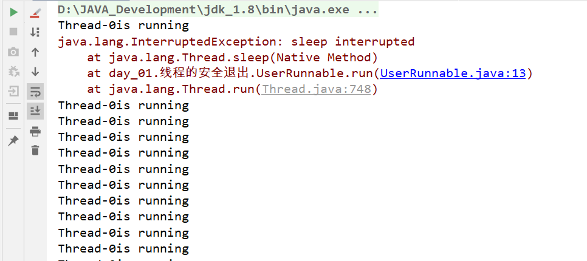
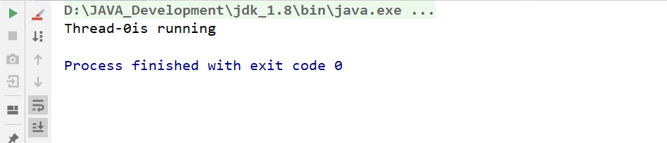

# 线程的中断

我们如何让线程安全的停止呢？

## 1. 线程自然终止

自然执行完或抛出未处理异常。

## 2. stop()，resume()，suspend()方法

stop()，resume(),suspend()已不建议使用，stop()会导致线程不会正确释放资源，suspend()容易导致死锁。

## 3. 线程中断

Thread类提供了interrupt方法，用于中断目标线程的执行。

### 3.1 interrupt方法

interrupt()方法用于中断一个线程，而Java中线程的处理是协作式的而不是抢占式的。实际上调用一个线程的interrupt() 方法中断一个线程，并不是强行关闭这个线程，只是跟这个线程打个招呼，将线程的中断标志位置为true，线程是否中断，由线程本身决定。

```java
public class UserRunnable implements Runnable {
    @Override
    public void run() {
        while (true){
            System.out.println(Thread.currentThread().getName()+"is running");
        }
    }
}
```

```java
public class SafeExitTest {
    public static void main(String[] args) {
        Thread thread = new Thread(new UserRunnable());
        thread.start();
        thread.interrupt();
    }
}
```

我们可以看到，在UserRunnable线程中，我们并没有对中断进行任何处理，所以在SafeExitTest中调用线程的interrupt方法并不会导致线程的中断，控制台还是会继续打印。只有在目标线程中进行了正确的中断处理后才会有中断效果：

```java
public class UserRunnable implements Runnable {
    @Override
    public void run() {
        while (!Thread.currentThread().isInterrupted()) {//判断当前线程是否被中断
            System.out.println(Thread.currentThread().getName() + "is running");
        }
    }
}
```

**Thread类中相关方法**

- isInterrupted() ：判定指定线程是否处于中断状态。
- static interrupted() ：静态方法，判定当前线程是否处于中断状态，同时将中断标志位改为false。

### 3.2 阻塞线程与线程中断

Java`中断响应`是描述当一个线程或方法A处于运行、阻塞或死锁状态时，外界(通常指其他线程、系统IO等)对A的影响能否让A线程或者方法抛出InterruptedException异常并提前返回，如果会提前返回并且抛出InterruptedException，就叫可中断响应方法或线程，如果不会抛出InterruptedException，就叫不可中断线程或方法。

Java语言中所有阻塞方法都声明抛出InterruptedException异常（例如 `Thread.sleep()`、 `Thread.join()` 或 `Object.wait()`）。也就是说，如果一个线程执行了阻塞方法，使得当前线阻塞，第三方线程执行interrupt方法中断线程，都会使得该阻塞方法抛出InterruptedException异常并退出阻塞，**并且将当前线程的中断标志位设置为false**。

如果没有这个机制， `interrupt()` 则只是单纯设置线程的中断状态。那这个试图中断的线程仍在阻塞当中，那么后序的中断工作则无法进行。

### 3.3 阻塞线程的线程中断案例

```java
public class UserRunnable implements Runnable {
    @Override
    public void run() {
        while (!Thread.currentThread().isInterrupted()) {
            System.out.println(Thread.currentThread().getName() + "is running");
            try {
                Thread.sleep(10);//第7行
            } catch (InterruptedException e) {
                e.printStackTrace();
            }
        }
    }
}
```

```java
public class SafeExitTest {
    public static void main(String[] args) throws InterruptedException {
        Thread thread = new Thread(new UserRunnable());
        thread.start();
        Thread.sleep(10);
        thread.interrupt();//第6行
    }
}
```

上面的代码我们仅仅是在每次循环的时候让线程sleep了10ms，但这很有可能会导致中断操作的失败（注意这里说的是很有可能）。



可以看到控制台不断输出"Thread-0is running"，这是因为在执行`SafeExitTest:6`（SafeExitTest类的第6行代码）这行代码时，目标线程处于阻塞状态，此时`UserRunnable:7`这行代码抛出InterruptedException异常，线程退出阻塞状态，并将中断标志位设置为false。这也就是为什么虽然在while语句中对中断标志位进行了判断，而在主线程试图中断目标线程时，目标线程仍能继续循环的原因。

经过多次测试也会出现中断成功的情况：



出现这种情况，是因为中断操作放生在第一次循环完成和第二次循环判断开始之前。

**具体细节参考**：

https://blog.csdn.net/meiliangdeng1990/article/details/80559012

https://www.ibm.com/developerworks/cn/java/j-jtp05236.html

