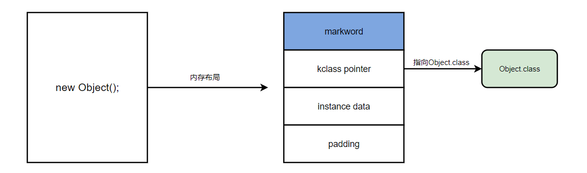
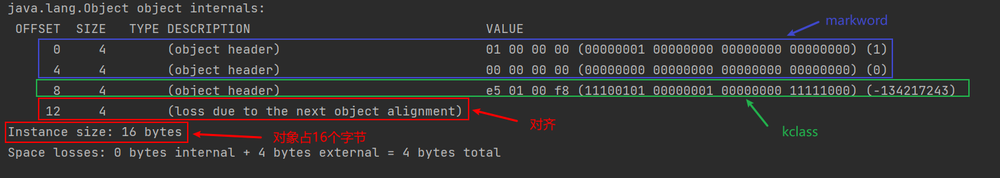
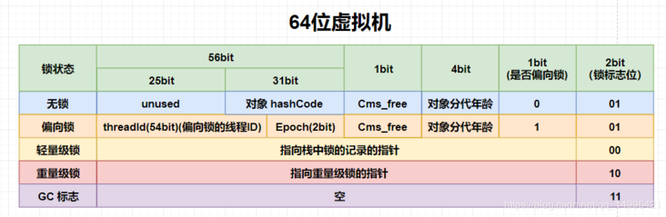
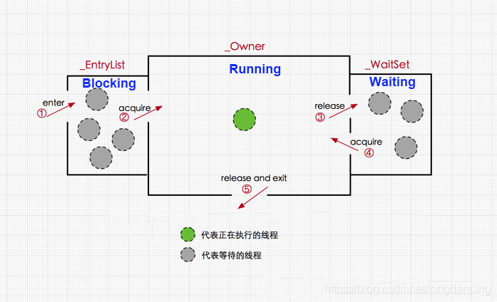
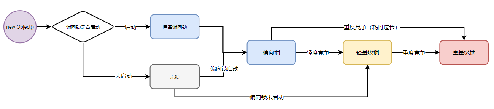
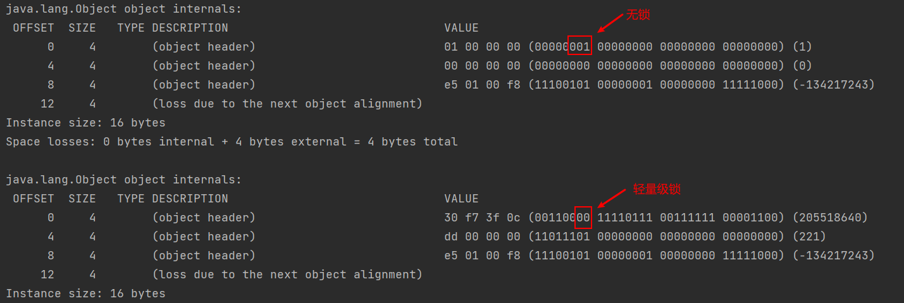
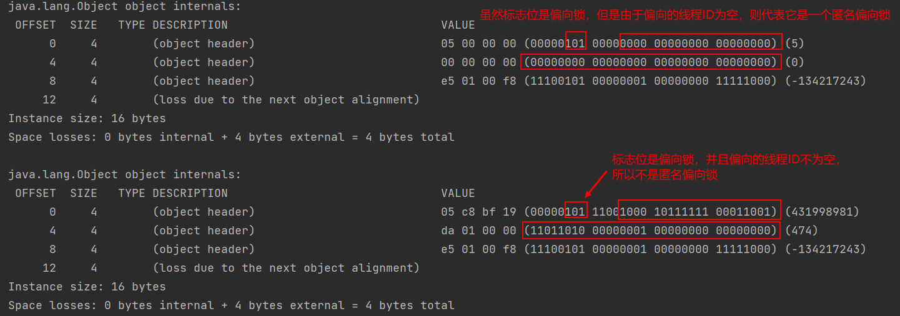
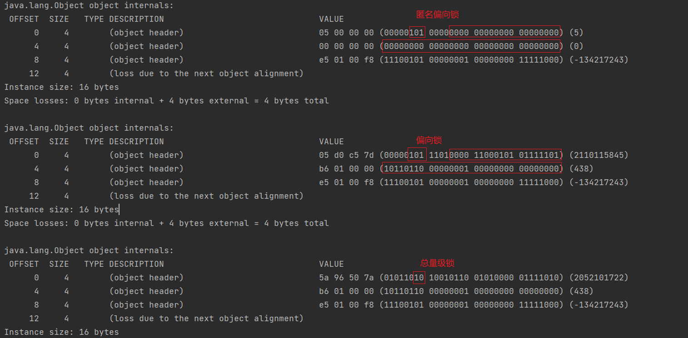

# synchronized锁升级过程

JDK 1.6后锁的状态总共有四种，级别由低到高依次为：无锁、偏向锁、轻量级锁、重量级锁，这四种锁状态分别代表什么，为什么会有锁升级？

其实在 JDK 1.6之前，synchronized 还是一个重量级锁，底层使用操作系统的 Mutex Lock（互斥锁）实现，而操作系统实现线程之间的切换需要从用户态转换到核心态，这个成本非常高，状态之间的转换需要相对比较长的时间，这就是为什么重量级锁效率低的原因。

但是在JDK 1.6后，JVM为了提高锁的获取与释放效率对（synchronized ）进行了优化，引入了 偏向锁 和 轻量级锁 ，从此以后锁的状态就有了四种（无锁、偏向锁、轻量级锁、重量级锁），并且四种状态会随着竞争的情况逐渐升级，而且是不可逆的过程，也就是说只能进行锁升级（从低级别到高级别），不能锁降级（高级别到低级别），这种设计目的是为了提高获得锁和释放锁的效率。

## 一. 对象的内存布局

要弄清楚加锁过程到底发生了什么需要看一下对象创建之后再内存中的布局是个什么样的？

一个对象在new出来之后在内存中主要分为4个部分：

- markword：默认存储对象的HashCode，分代年龄和锁标志位信息。这些信息都是与对象自身定义无关的数据，所以Mark Word被设计成一个非固定的数据结构以便在极小的空间内存存储尽量多的数据。它会根据对象的状态复用自己的存储空间，也就是说**在运行期间Mark Word里存储的数据结构会随着锁标志位的变化而变化**。

- klass pointer：对象指向它的类元数据的指针，虚拟机通过这个指针来确定这个对象是哪个类的实例。

- instance data：记录了对象里面的变量数据。

- padding：作为对齐使用，对象在64位服务器版本中，规定对象内存必须要能被8字节整除，如果不能整除，那么就靠对齐来补。举个例子：new出了一个对象，内存只占用18字节，但是规定要能被8整除，所以padding=6。



知道了这4个部分之后，我们来验证一下底层。借助于第三方包 JOL( Java Object Layout)内存布局去看看。首先我们先引入JOL依赖：

```xml
<dependency>
    <groupId>org.openjdk.jol</groupId>
    <artifactId>jol-core</artifactId>
    <version>0.10</version>
</dependency>
```

编写以下代码，查看Object内存布局：

```java
public class JOLDemo {
    private static Object  o;
    public static void main(String[] args) {
        o = new Object();
        System.out.println(ClassLayout.parseInstance(o).toPrintable());
    }
}
```



synchronized不论是修饰方法还是代码块，都是通过持有修饰对象的锁来实现同步，那么Synchronized锁对象是存在哪里的呢？答案是存在锁对象的对象头的markword中。那么markword在对象头中到底长什么样？

前面我们说过，markword中的数据结构会在运行时期随着锁标识位的变化而发生变化的，而markword分为下列几种状态：



- 无锁： 对象头开辟 31bit 的空间用来存储对象的 hashcode ，4 bit 用于存放对象分代年龄，1 bit 用来存放是否偏向锁的标识位，2 bit 用来存放锁标识位为**01**
- 偏向锁：在偏向锁中划分更细，其中54 bit 用来存放线程ID，2 bit 用来存放 Epoch，4 bit 存放对象分代年龄，1 bit 存放是否偏向锁标识（ 0表示无锁，1表示偏向锁），锁的标识位还是**01**

- 轻量级锁：在轻量级锁中直接开辟 62 bit 的空间存放指向栈中锁记录的指针，2 bit 存放锁的标志位，其标志位为**00**
- 重量级锁： 在重量级锁中和轻量级锁一样，62 bit 的空间用来存放指向重量级锁的指针，2 bit 存放锁的标识位，其标志位为**11**

- GC标记： 开辟62 bit 的内存空间却没有占用，2 bit 空间存放锁标志位为11。

## 二. 锁的分类

### 2.1 无锁

无锁是指没有对资源进行锁定，所有的线程都能访问并修改同一个资源，但同时只有一个线程能修改成功。

无锁的特点是修改操作会在循环内进行，线程会不断的尝试修改共享资源。如果没有冲突就修改成功并退出，否则就会继续循环尝试。如果有多个线程修改同一个值，必定会有一个线程能修改成功，而其他修改失败的线程会不断重试直到修改成功。

### 2.2 偏向锁

大多数情况下锁不仅不存在多线程竞争，而且总是由同一线程多次获得。偏向锁的目的是在某个线程获得锁之后，消除这个线程锁重入（CAS）的开销，看起来让这个线程得到了偏护。另外，JVM对那种会有多线程加锁，但不存在锁竞争的情况也做了优化，听起来比较拗口，但在现实应用中确实是可能出现这种情况，因为线程之前除了互斥之外也可能发生同步关系，被同步的两个线程（一前一后）对共享对象锁的竞争很可能是没有冲突的。对这种情况，JVM用一个epoch表示一个偏向锁的时间戳（真实地生成一个时间戳代价还是蛮大的，因此这里应当理解为一种类似时间戳的identifier）

#### 2.3.1 偏向锁的获取

当一个线程访问同步块并获取锁时，会在对象头和栈帧中的锁记录里存储锁偏向的线程ID，以后该线程在进入和退出同步块时不需要花费CAS操作来加锁和解锁，而只需简单的测试一下对象头的Mark Word里是否存储着指向当前线程的偏向锁，如果测试成功，表示线程已经获得了锁，如果测试失败，则需要再测试下Mark Word中偏向锁的标识是否设置成1（表示当前是偏向锁），如果没有设置，则使用CAS竞争锁，如果设置了，则尝试使用CAS将对象头的偏向锁指向当前线程。

#### 2.3.2 偏向锁的撤销

偏向锁使用了一种等到竞争出现才释放锁的机制，所以当其他线程尝试竞争偏向锁时，持有偏向锁的线程才会释放锁。偏向锁的撤销，需要等待全局安全点（在这个时间点上没有字节码正在执行），它会首先暂停拥有偏向锁的线程，然后检查持有偏向锁的线程是否活着，如果线程不处于活动状态，则将对象头设置成无锁状态，如果线程仍然活着，拥有偏向锁的栈会被执行，遍历偏向对象的锁记录，栈中的锁记录和对象头的Mark Word，要么重新偏向于其他线程，要么恢复到无锁或者标记对象不适合作为偏向锁，最后唤醒暂停的线程。

### 2.4 轻量级锁（CAS自旋实现）

线程在执行同步块之前，JVM会先在当前线程的栈桢中创建用于存储锁记录的空间，并将对象头中的Mark Word复制到锁记录中，官方称为Displaced Mark Word。**然后线程尝试使用CAS将对象头中的Mark Word替换为指向锁记录的指针。如果成功，当前线程获得锁，如果失败，则自旋获取锁，当自旋获取锁仍然失败时，表示存在其他线程竞争锁(两条或两条以上的线程竞争同一个锁)，则轻量级锁会膨胀成重量级锁。**

**轻量级解锁时，会使用原子的CAS操作来将Displaced Mark Word替换回到对象头，如果成功，则表示同步过程已完成。**如果失败，表示有其他线程尝试过获取该锁，则要在释放锁的同时唤醒被挂起的线程。

### 2.5 重量级锁

重量级锁对应的锁标志位是10，存储了指向重量级监视器锁的指针，在HotSpot中，对象的监视器（monitor）锁对象由ObjectMonitor对象实现（C++），其跟同步相关的数据结构如下：

```c++
ObjectMonitor() {
  _count        = 0; //用来记录该对象被线程获取锁的次数
  _waiters      = 0;
  _recursions   = 0; //锁的重入次数
  _owner        = NULL; //指向持有ObjectMonitor对象的线程 
  _WaitSet      = NULL; //处于wait状态的线程，会被加入到_WaitSet
  _WaitSetLock  = 0 ;
  _EntryList    = NULL ; //处于等待锁block状态的线程，会被加入到该列表
}
```

光看这些数据结构对监视器锁的工作机制还是一头雾水，那么我们首先看一下线程在获取锁的几个状态的转换：



线程的生命周期存在5个状态，start、running、waiting、blocking和dead

对于一个synchronized修饰的方法(代码块)来说：

1. 当多个线程同时访问该方法，那么这些线程会先被放进`_EntryList`队列，此时线程处于blocking状态
2. 当一个线程获取到了实例对象的监视器（monitor）锁，那么就可以进入running状态，执行方法，此时，ObjectMonitor对象的`_owner`指向当前线程，`_count`加1表示当前对象锁被一个线程获取。
3. 当running状态的线程调用wait()方法，那么当前线程释放monitor对象，进入waiting状态，ObjectMonitor对象的`_owner`变为null，`_count`减1，同时线程进入`_WaitSet`队列，直到有线程调用notify()方法唤醒该线程，则该线程会进入`_EntryList`队列中

## 三. 锁的升级路线



### 3.1 升级为偏向锁

从锁升级的图中能看到两个路线，“偏向锁未启动-->普通对象”和“偏向锁已启动-->匿名偏向对象”什么意思呢？原来我们是可以配置偏向锁未启动和偏向锁已启动的。 操作系统有个参数-XX:BiasedLockingStartupDelay=0从字面意思，偏向锁的启动延迟。JVM默认情况下会在启动后4s开启偏向锁。

我们编写下列代码来验证“无锁->偏向锁”的转化过程：

```java
public class JOLDemo {
    private static Object  o;
    public static void main(String[] args) {
        o = new Object();
        System.out.println(ClassLayout.parseInstance(o).toPrintable());
        synchronized (o){
            System.out.println(ClassLayout.parseInstance(o).toPrintable());
        }
    }
}
```



默认情况下偏向锁会在程序启动后4s后才会开启（如有必要可以使用JVM参数来关闭延迟-XX：BiasedLockingStartupDelay = 0）所以的上述代码致使之中都没有开启偏向锁，所以最终效果就是“无锁->轻量级锁”。

> 前文我们说过markword由64位（8个字节）组成，现实生活中我们通常把高位数字放在前面，在计算机中通常会把低位字节放在前面，这也就是为什么打印出来的内存布局中第一行的第一个字节最后两个bit是锁标志位，而不是第二行最后一个字节最后两个bit是锁标志位的原因。

我们可以通过Thread.sleep(5000)来使得虚拟机开启偏向锁：

```java
public class JOLDemo {
    public static void main(String[] args) throws InterruptedException {
        Thread.sleep(5000);
        Object o = new Object();
        System.out.println(ClassLayout.parseInstance(o).toPrintable());
        synchronized (o){
            System.out.println(ClassLayout.parseInstance(o).toPrintable());
        }
    }
}
```



### 3.2 升级为重量级锁

这是一个相当复杂的过程，在JDK1.6之前，有两种情况，某个线程的自旋次数超过10次(JVM调优可调)，等待的自旋的线程数(JVM调优)超过了CPU核数的二分之一。满足这两个条件的任意一个，操作系统会把这些线程丢到等待队列，膨胀为重量级锁。在JDK1.6之后，出现了自适应自旋。什么意思呢？JDK根据运行的情况和每个线程运行的情况决定要不要升级。

```java
public class JOLDemo {
    public static void main(String[] args) throws InterruptedException {
        Thread.sleep(5000);
        Object o = new Object();
        System.out.println(ClassLayout.parseInstance(o).toPrintable());

        new Thread(() -> {
            synchronized (o) {
                //由于是第一个线程获取锁，此处应该是偏向锁
                System.out.println(ClassLayout.parseInstance(o).toPrintable());
                try {
                    //sleep 5s不释放锁
                    Thread.sleep(5000);
                } catch (InterruptedException e) {
                    e.printStackTrace();
                }
            }
        }).start();
        Thread.sleep(1000);
        new Thread(() -> {
            synchronized (o) {
                //由于上一个线程长时间持有锁，CAS超过阈值后膨胀为重量级锁
                System.out.println(ClassLayout.parseInstance(o).toPrintable());
            }
        }).start();
    }
}

```



本文参考至：

[Java并发——Synchronized关键字和锁升级，详细分析偏向锁和轻量级锁的升级_tongdanping的博客-CSDN博客](https://blog.csdn.net/tongdanping/article/details/79647337)

[谈谈JVM内部锁升级过程 (qq.com)](https://mp.weixin.qq.com/s/2yxexZUr5MWdMZ02GCSwdA)

[深度分析：锁升级过程和锁状态，看完这篇你就懂了！ - SegmentFault 思否](https://segmentfault.com/a/1190000022904663)

[Synchronized你以为你真的懂？ - 知乎 (zhihu.com)](https://zhuanlan.zhihu.com/p/127884116)

