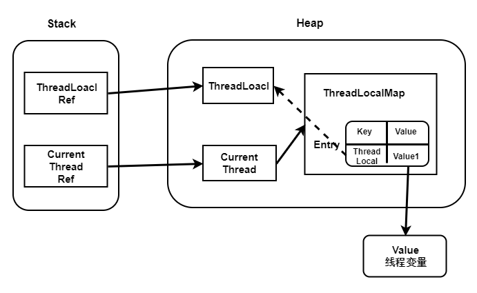

# ThreadLocal、InheritableThreadLocal详解

本文讲述ThreadLocal和InheritableThreadLocal的实现原理，探讨二者在实际使用中的局限性。

## 一. ThreadLocal

### 1.1 如何使用

```java
ThreadLocal<String> threadLocal = new ThreadLocal<>();
threadLocal.set("主线程的值1");

new Thread(() -> {
    System.out.println("子线程打印：" + threadLocal.get());
    threadLocal.set("子线程的值1");
    System.out.println("子线程打印2：" + threadLocal.get());
}).start();

Thread.sleep(1000);

System.out.println("主线程打印：" + threadLocal.get());
```

输出：

```java
子线程打印：null
子线程打印2：子线程的值1
主线程打印：主线程的值1
```

ThreadLocal 是 Java 里一种特殊变量，它是一个线程级别变量，每个线程都有一个 ThreadLocal 就是每个线程都拥有了自己独立的一个副本，双方在各自线程改变的值，均只能在自己这个线程中体现，竞态条件被彻底消除了，在并发模式下是绝对安全的变量。

### 2.2 ThreadLocal实现原理

#### 2.2.1 ThreadLocal中的重要属性

```java
// 当前 ThreadLocal 的 hashCode，由 nextHashCode() 计算而来，用于计算当前 ThreadLocal 在 ThreadLocalMap 中的索引位置
private final int threadLocalHashCode = nextHashCode();
// 哈希魔数，主要与斐波那契散列法以及黄金分割有关
private static final int HASH_INCREMENT = 0x61c88647;
// 返回计算出的下一个哈希值，其值为 i * HASH_INCREMENT，其中 i 代表调用次数
private static int nextHashCode() {
    return nextHashCode.getAndAdd(HASH_INCREMENT);
}
// 保证了在一台机器中每个 ThreadLocal 的 threadLocalHashCode 是唯一的
private static AtomicInteger nextHashCode = new AtomicInteger();
```

其中的 `HASH_INCREMENT` 也不是随便取的，它转化为十进制是 `1640531527`，`2654435769` 转换成 int 类型就是 `-1640531527`，`2654435769` 等于 `(√5-1)/2` 乘以 2 的 32 次方。`(√5-1)/2` 就是黄金分割数，近似为 `0.618`，也就是说 `0x61c88647` 理解为一个黄金分割数乘以 2 的 32 次方，它可以保证 nextHashCode 生成的哈希值，均匀的分布在 2 的幂次方上，且小于 2 的 32 次方。

下面用例子来证明下：

```java
private static final int HASH_INCREMENT = 0x61c88647;

public static void main(String[] args) throws Exception {
    int n = 5;
    int max = 2 << (n - 1);
    for (int i = 0; i < max; i++) {
        System.out.print(i * HASH_INCREMENT & (max - 1));
        System.out.print(" ");

    }
}
```

运行结果为：`0 7 14 21 28 3 10 17 24 31 6 13 20 27 2 9 16 23 30 5 12 19 26 1 8 15 22 29 4 11 18 25`

可以发现元素索引值完美的散列在数组当中，并没有出现冲突。

#### 2.2.2 ThreadLocalMap

除了上述属性外，还有一个重要的属性 ThreadLocalMap，ThreadLocalMap 是 ThreadLocal 的静态内部类，当一个线程有多个 ThreadLocal 时，需要一个容器来管理多个 ThreadLocal，ThreadLocalMap 的作用就是管理线程中多个 ThreadLocal，源码如下：

```java
static class ThreadLocalMap {
	/**
	 * 键值对实体的存储结构
	 */
	static class Entry extends WeakReference<ThreadLocal<?>> {
		// 当前线程关联的 value，这个 value 并没有用弱引用追踪
		Object value;

		/**
		 * 构造键值对
		 *
		 * @param k k 作 key,作为 key 的 ThreadLocal 会被包装为一个弱引用
		 * @param v v 作 value
		 */
		Entry(ThreadLocal<?> k, Object v) {
			super(k);
			value = v;
		}
	}

	// 初始容量，必须为 2 的幂
	private static final int INITIAL_CAPACITY = 16;

	// 存储 ThreadLocal 的键值对实体数组，长度必须为 2 的幂
	private Entry[] table;

	// ThreadLocalMap 元素数量
	private int size = 0;

	// 扩容的阈值，默认是数组大小的三分之二
	private int threshold;
}
```

从源码中看到 ThreadLocalMap 其实就是一个简单的 Map 结构，底层是数组，有初始化大小，也有扩容阈值大小，数组的元素是 Entry，**Entry 的 key 就是 ThreadLocal 的引用，value 是 ThreadLocal 的值**。这里需要注意的是，ThreadLoalMap和HashMap很大的区别是，Entry中没有next字段，所以就不存在链表的情况了。如果出现hash冲突怎么办？稍后我们会详细解释！

Thread对象中持有着Thread对象

#### 2.2.3 set()方法

我们先去看下 ThreadLocal 的 set 方法，源码如下：

```java
public void set(T value) {
    // 得到当前线程对象
    Thread t = Thread.currentThread();
    // 这里获取ThreadLocalMap
    ThreadLocalMap map = getMap(t);
    // 如果map存在，则将当前线程对象t作为key，要存储的对象
    //作为value存到map里面去
    if (map != null)
        map.set(this, value);
    else
        createMap(t, value);
}
```

set 方法的作用是把我们想要存储的 value 给保存进去。set 方法的流程主要是：

- 先获取到当前线程的引用
- 利用这个引用来获取到 ThreadLocalMap
- 如果 map 为空，则去创建一个 ThreadLocalMap
- 如果 map 不为空，就利用 ThreadLocalMap 的 set 方法将 value 添加到 map 中

其中 map 就是我们上面讲到的 ThreadLocalMap，可以看到它是通过当前线程对象获取到的 ThreadLocalMap，接下来我们看 getMap方法的源代码：

```java
/**
 * 返回当前线程 thread 持有的 ThreadLocalMap
 *
 * @param t 当前线程
 * @return ThreadLocalMap
 */
ThreadLocalMap getMap(Thread t) {
	return t.threadLocals;
}
```

getMap 方法的作用主要是获取当前线程内的 ThreadLocalMap 对象，原来这个 ThreadLocalMap 是线程的一个属性，下面让我们看看 Thread 中的相关代码：

```java
public class Thread implements Runnable {
	/**
	 * ThreadLocal 的 ThreadLocalMap 是线程的一个属性，所以在多线程环境下 threadLocals 是线程安全的
	 */
	ThreadLocal.ThreadLocalMap threadLocals = null;
}
```

可以看出每个线程都有 ThreadLocalMap 对象，被命名为 `threadLocals`，默认为 null，所以每个线程的 ThreadLocals 都是隔离独享的。

调用 ThreadLocalMap.set() 时，会把当前 `threadLocal` 对象作为 key，想要保存的对象作为 value，存入 map。

相信到这里，大家应该对 Thread、ThreadLocal 以及 ThreadLocalMap 的关系有了进一步的理解，下图为三者之间的关系：



其中 ThreadLocalMap.set() 的源码如下：

```java
/**
 * 在 map 中存储键值对<key, value>
 *
 * @param key   threadLocal
 * @param value 要设置的 value 值
 */
private void set(ThreadLocal<?> key, Object value) {
	Entry[] tab = table;
	int len = tab.length;
	// 计算 key 在数组中的下标
	int i = key.threadLocalHashCode & (len - 1);
	// 遍历一段连续的元素，以查找匹配的 ThreadLocal 对象
	for (Entry e = tab[i]; e != null; e = tab[i = nextIndex(i, len)]) {
		// 获取该哈希值处的ThreadLocal对象
		ThreadLocal<?> k = e.get();

		// 键值ThreadLocal匹配，直接更改map中的value
		if (k == key) {
			e.value = value;
			return;
		}

		// 若 key 是 null，说明 ThreadLocal 被清理了，直接替换掉
		if (k == null) {
			replaceStaleEntry(key, value, i);
			return;
		}
	}

	// 直到遇见了空槽也没找到匹配的ThreadLocal对象，那么在此空槽处安排ThreadLocal对象和缓存的value
	tab[i] = new Entry(key, value);
	int sz = ++size;
	// 如果没有元素被清理，那么就要检查当前元素数量是否超过了容量阙值(数组大小的三分之二)，以便决定是否扩容
	if (!cleanSomeSlots(i, sz) && sz >= threshold) {
		// 扩容的过程也是对所有的 key 重新哈希的过程
		rehash();
	}
}
```

在插入过程中，根据ThreadLocal对象的hash值，定位到table中的位置i，过程如下：

1、如果当前位置是空的，那么正好，就初始化一个Entry对象放在位置i上；

2、如果位置 i 已经有Entry对象了，如果这个Entry对象的key正好是即将设置的key，那么重新设置Entry中的value；

3、很不巧，位置i的Entry对象，和即将设置的key没关系，那么只能找下一个空位置；

> ThreadLocalMap 解决 hash 冲突的方式采用的是**线性探测法**，如果发生冲突会继续寻找下一个空的位置。

#### 2.3.4 get()方法

在get的时候，也会根据ThreadLocal对象的hash值，定位到table中的位置，然后判断该位置Entry对象中的key是否和get的key一致，如果不一致，就判断下一个位置，可以发现，set和get如果冲突严重的话，效率很低。

#### 2.3.5 resize()方法

```java
/**
 * 扩容，重新计算索引，标记垃圾值，方便 GC 回收
 */
private void resize() {
	Entry[] oldTab = table;
	int oldLen = oldTab.length;
	int newLen = oldLen * 2;
	// 新建一个数组，按照2倍长度扩容
	Entry[] newTab = new Entry[newLen];
	int count = 0;

	// 将旧数组的值拷贝到新数组上
	for (int j = 0; j < oldLen; ++j) {
		Entry e = oldTab[j];
		if (e != null) {
			ThreadLocal<?> k = e.get();
			// 若有垃圾值，则标记清理该元素的引用，以便GC回收
			if (k == null) {
				e.value = null;
			} else {
				// 计算 ThreadLocal 在新数组中的位置
				int h = k.threadLocalHashCode & (newLen - 1);
				// 如果发生冲突，使用线性探测往后寻找合适的位置
				while (newTab[h] != null) {
					h = nextIndex(h, newLen);
				}
				newTab[h] = e;
				count++;
			}
		}
	}
	// 设置新的扩容阈值，为数组长度的三分之二
	setThreshold(newLen);
	size = count;
	table = newTab;
}
```

resize 方法主要是进行扩容，同时会将垃圾值标记方便 GC 回收，扩容后数组大小是原来数组的两倍。

### 2.3 ThreadLocal为什么会存在内存泄露

ThreadLocal内存泄露还要从ThreadLocalMap中的Entry说起：

```java
static class ThreadLocalMap {
	/**
	 * 键值对实体的存储结构
	 */
	static class Entry extends WeakReference<ThreadLocal<?>> {
		// 当前线程关联的 value，这个 value 并没有用弱引用追踪
		Object value;

		/**
		 * 构造键值对
		 *
		 * @param k k 作 key,作为 key 的 ThreadLocal 会被包装为一个弱引用
		 * @param v v 作 value
		 */
		Entry(ThreadLocal<?> k, Object v) {
			super(k);
			value = v;
		}
	}
}
```

Entry继承至 `WeakReference`，这说明Entry中的key，也就是ThreadLocal的引用，是弱引用所持有的，这样如果ThreadLocal没有被其他线程的强引用所引用，一旦垃圾回收器运行后扫描到弱引用，便会回收，导致Entry的key为null。

但是此时如果线程没有退出，仍然持有着ThreadLocalMap，而ThreadLocalMap又会持有Entry的引用，value却不会被回收掉。只有当Thread退出后整个Entry被回收，或者set和get操作时，将这个无用的value引用断开。

> 对弱引用不了解的同学可以参考这一篇文章：[Java中强、软、弱、虚四种引用详解_Java_奈学教育_InfoQ写作社区](https://xie.infoq.cn/article/f518beecfe140d30db42d1c5e)

### 2.4 ThreadLocal的应用场景

ThreadLocal 的特性也导致了应用场景比较广泛，主要的应用场景如下：

- 线程间数据隔离，各线程的 ThreadLocal 互不影响
- 方便同一个线程使用某一对象，避免不必要的参数传递
- 全链路追踪中的 traceId 或者流程引擎中上下文的传递一般采用 ThreadLocal
- Spring 事务管理器采用了 ThreadLocal
- Spring MVC 的 RequestContextHolder 的实现使用了 ThreadLocal

## 二. 可继承的 InheritableThreadLocal

### 2.1 ThreadLocal的局限性

我们知道ThreadLocal解决的是让每个线程读取的ThreadLocal变量是相互独立的。但是有时候我们需要在子线程中使用父线程的ThreadLocal中的值，此时我们是获取不到的。比如下面这个例子：

```java
ThreadLocal<String> threadLocal = new ThreadLocal<>();
threadLocal.set("主线程的值1");

new Thread(() -> {
    System.out.println(threadLocal.get());
}).start();
```

输出：null

而JDK自带的 InheritableThreadLocal 解决了父子线程数据传递的问题。

### 2.2 基本示例

我们只需要将 ThreadLocal 更换为 InheritableThreadLocal 即可完成父子线程中的值复用：

```java
InheritableThreadLocal<String> threadLocal = new InheritableThreadLocal<>();
threadLocal.set("主线程的值1");
new Thread(() -> {
    System.out.println(threadLocal.get())
}).start();
```

输出：主线程的值1

### 2.3 InheritableThreadLocal 原理

InheritableThreadLocal 继承至 ThreadLocal，并重写了下面这些方法：

```java
public class InheritableThreadLocal<T> extends ThreadLocal<T> {
    /**
     * 将此可继承线程局部变量的子线程初始值作为创建子线程时父线程值的函数进行计算。在启动子线程之前，从父线程内调用此方法。 此方法仅返回其输入参数，如果需要不同的行为，则应重写此方法。
     */
    protected T childValue(T parentValue) {
        return parentValue;
    }

    /**
     * 获取与ThreadLocal关联的映射。
     */
    ThreadLocalMap getMap(Thread t) {
       return t.inheritableThreadLocals;
    }

    /**
     * 创建与ThreadLocal关联的映射
     **/
    void createMap(Thread t, T firstValue) {
        t.inheritableThreadLocals = new ThreadLocalMap(this, firstValue);
    }
}

```

看了 `InheritableThreadLocal ` 肯定是一头雾水，里面没有核心逻辑，实际上 `InheritableThreadLocal` 子线程获取父线程数据的核心逻辑在Thread中。

在Thread中，有一个 `inheritableThreadLocals` 属性，它的类型和前文提到的 `threadLocals` 一样都是 `ThreadLocal.ThreadLocalMap`。

```java
public class Thread implements Runnable {
	ThreadLocal.ThreadLocalMap inheritableThreadLocals = null;
}
```

Thread在创建并初始化时会调用init方法，其中有一段代码：

```java
private void init(ThreadGroup g, Runnable target, String name,
                      long stackSize, AccessControlContext acc,
                      boolean inheritThreadLocals) {
       	//.........此次省略N行代码...........
        if (inheritThreadLocals && parent.inheritableThreadLocals != null)
            this.inheritableThreadLocals =
                ThreadLocal.createInheritedMap(parent.inheritableThreadLocals);
        //.........此次省略N行代码...........
    }
```

可以看到线程在初始化时，会尝试将父线程的inheritableThreadLocals 拷贝到当前正在创建的子线程的 inheritableThreadLocals 上，这样在子线程中也能获取到父线程的数据了。

## 


> 本文参考至：
>
> [一文搞懂 ThreadLocal 原理 - 武培轩 - 博客园 (cnblogs.com)](https://www.cnblogs.com/wupeixuan/p/12638203.html)
>
> [详解ThreadLocal - 掘金 (juejin.cn)](https://juejin.cn/post/6844903910679773192)
>
> [InheritableThreadLocal类原理简介使用 父子线程传递数据详解 多线程中篇（十八） - noteless - 博客园 (cnblogs.com)](https://www.cnblogs.com/noteless/p/10448283.html)