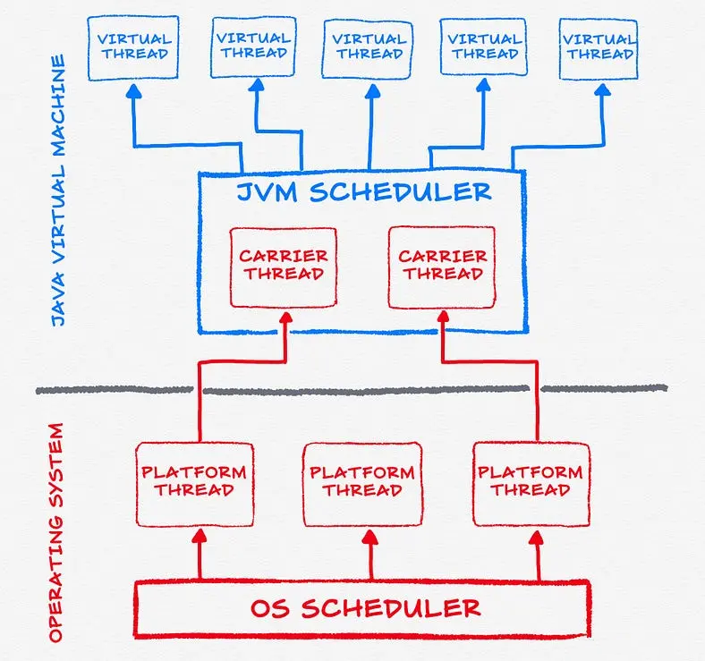

# 详解虚拟线程

**虚拟线程**是轻量级线程（类似于 Go 中的 “[协程](https://go.dev/doc/effective_go#goroutines)（Goroutine）”），可以减少编写、维护和调度高吞吐量并发应用程序的工作量。

**线程**是可供调度的最小处理单元，它与其他类似的处理单元并发运行，并且在很大程度上是独立运行的。线程（`java.lang.Thread`）有两种，**平台线程**和**虚拟线程**。

## 一. Java内部线程实现模式

**绿色线程（Green Thread）**：远古时期，Java使用绿色线程模式。这个模式下，多线程的调度和管理有JVM完成。绿色线程模式才作用M:1线程映射模型。这里就有一个问题，Java不能够规模化管理这种线程，也就无法充分发挥硬件性能。同样的实现绿色线程也是一件非常有挑战性的事情，因为它需要非常底层的支持才能够良好运行。随后Java移除了绿色线程，转而使用本地线程。这使得Java的线程执行比绿色线程更慢。

**平台线程（Platform Thread）**：从Java 1.2开始从绿色线程切换到了平台线程模式（有些人称之为本地线程（Native Thread））。在操作系统的帮助下，JVM 得以控制平台线程。平台线程的执行效率很高，但是开启和关闭他们的资源消耗较大。这就是为什么我们现在要使用线程池。这个模型遵循着 1:1 线程映射，即**一个Java线程映射到一个内核线程**。当一个Java线程被创建时，相应的一个对应的核心线程也会被创建，用来执行线程代码。自此之后，平台线程模型的做法就延续到了今天。

### 1.1 当前Java线程模型有什么问题吗？

- 只是对于操作系统内核线程的一个简单包装，真正的线程调度，还是由操作系统完成；
- 因为线程的创建和销毁都需要系统内核完成，涉及用户态切换，资源消耗较大；
- 本地线程需要保存他们的调用栈在内存中，大概2MB~20MB的预留空间。如果你有4GB内存，如果每个线程占用20MB内存，那么你就只能创建大概200个线程；
- 因为本地线程是一种系统资源，加载一个新的本地线程大概需要1毫秒；
- 上下文切换代价昂贵，需要一个到内核的系统调用；
- 上面这些强制性的限制会限制线程创建的数量，同时会导致性能下降和过度的内存消耗。因为我们不能创建更多的线程；
- 我们不能通过增加更多的线程来增应用规模，因为上下文切换和内存占用的代价高昂；

### 1.2 一个IO密集型应用的例子

考虑一台16GB内存的网络服务器。对于每个服务请求，都分配一个不同的线程。我们假设每个线程需要20MB内存空间，那么这台机器可以支持800个线程。当前，后端的API一般使用REST/SOAP调用方式，例如数据库操作和API信息转发这些IO密集型操作。由此可见，后端服务的主要是IO密集型而不是CPU密集型。

接着假设一下，一个IO操作需要100毫秒，请求执行（IO密集型）需要100毫秒，以及返回结果也需要100毫秒。同时，当每秒有800个请求时，线程数得到了最大容量。

让我们来计算一下单个请求的CPU占用时间

```markdown
CPU时间　＝　请求准备时间 +　返回结果准备时间
		＝　0.1ms +　0.1ms
		= 0.2ms
```

对于800个请求呢？

```undefined
800个线程的请求时间= 800 * 0.2ms
				= 160ms 
```

受限于我们的内存容量，我们只能创建800个请求，也就导致了我们CPU使用率并不高

```markdown
CPU使用率=160ms / 1000ms
		= 16%
```

那么如何才能使CPU的利用率到达90%呢？

```shell
16% = 800个线程
90% = X个线程
X = 4500
```

但是我们当前因为内存的限制不能创建那么多的线程，除非我们能突破这个限制，拥有90G内存。

90G的内存是一个比较离谱的数字，所以说创建本地线程很明显不能充分利用硬件资源。

## 二. 虚拟线程

虚拟线程是一个Java线程的轻量级实现版本，最早于JDK19中出现，当前仍是预览状态，可以通过Jvm配置项开启。

> 虚拟线程是JVM项目[loom](https://github.com/openjdk/loom)的一部分

虚拟线程解决了传递和维护本地线程的瓶颈问题，同时可以用之编写高吞吐的并发应用，榨干硬件资源的潜力。

与本地线程不同，**虚拟线程并不有操作系统控制，虚拟线程是一个有JVM管理的用户态线程**。对比于本地线程的高资源占用，每个虚拟线程只需要几个字节的内存空间。这是的它更适合控制管理大量的用户访问，或者说处理IO密集型任务。

在创建虚拟线程的数量上几乎没有限制，甚至可以创建一百万个，因为虚拟线程并不需要来自内核的系统调用。

在虚拟线程如此轻量化的条件下，线程池不再成为必须品，只需要在需要的时候尽情创建虚拟线程就好。

虚拟线程和传统的本地线程操作完全兼容，例如本地线程变量，同步块，线程中断，等等。

### 2.1 虚拟线程如何工作

虚拟线程是一种轻量级（用户模式）线程，这种线程是由`Java`虚拟机调度，而不是操作系统。虚拟线程占用空间小，任务切换开销几乎可以忽略不计，因此可以极大量地创建和使用。总体来看，虚拟线程实现如下：

```shell
virtual thread = continuation + scheduler
```

虚拟线程会把任务（一般是`java.lang.Runnable`）包装到一个`Continuation`实例中：

- 当任务需要阻塞挂起的时候，会调用`Continuation`的`yield`操作进行阻塞
- 当任务需要解除阻塞继续执行的时候，`Continuation`会被继续执行

`Scheduler`也就是执行器，会把任务提交到一个载体线程池中执行：

- 执行器是`java.util.concurrent.Executor`的子类
- 虚拟线程框架提供了一个默认的`ForkJoinPool`用于执行虚拟线程任务

> 下文会把carrier thread称为"载体线程"，指的是负责执行虚拟线程中任务的平台线程，或者说运行虚拟线程的平台线程称为它的载体线程

操作系统调度系统线程，而`Java`平台线程与系统线程一一映射，所以平台线程被操作系统调度，但是虚拟线程是由`JVM`调度。`JVM`把虚拟线程分配给平台线程的操作称为`mount`（挂载），反过来取消分配平台线程的操作称为`unmount`（卸载）：

- `mount`操作：虚拟线程挂载到平台线程，虚拟线程中包装的`Continuation`栈数据帧或者引用栈数据会被拷贝到平台线程的线程栈，这是一个从堆复制到栈的过程
- `unmount`操作：虚拟线程从平台线程卸载，大多数虚拟线程中包装的`Continuation`栈数据帧会留在堆内存中

这个`mount -> run -> unmount`过程用伪代码表示如下：

```java
mount();
try {
    Continuation.run();
} finally {
    unmount();
}
```

JVM 使用 M:N 来完成虚拟线程与本地线程的映射。




### 2.2 虚拟线程和线程池的异同

看上去虚拟线程和线程池有类似之处，都是利用M个内核线程，完成N个任务，而避免平台线程频繁的创建和销毁。但他们是有本质区别的：

- 线程池中的正在执行的任务只有到任务执行完成后，才会释放平台线程，如果某个任务在执行过程中发生IO阻塞也不会被挂起执行其他任务。
- 虚拟线程中运行的代码调用阻塞I/O操作时，Java运行时会挂起虚拟线程，然后切换到另一个可执行的虚拟线程，直到它可以恢复为止。

## 三. 虚拟线程的使用

官方提供了以下四种方式创建虚拟线程：

1. 使用 `Thread.startVirtualThread()` 创建
2. 使用 `Thread.ofVirtual()` 创建
3. 使用 `ThreadFactory` 创建

### 3.1 使用 Thread.startVirtualThread() 创建

```java
public class VirtualThreadTest {
  public static void main(String[] args) {
    CustomThread customThread = new CustomThread();
    Thread.startVirtualThread(customThread);
  }
}

static class CustomThread implements Runnable {
  @Override
  public void run() {
    System.out.println("CustomThread run");
  }
}
```

### 3.2 使用 Thread.ofVirtual()创建

```java
public class VirtualThreadTest {
  public static void main(String[] args) {
    CustomThread customThread = new CustomThread();
    // 创建不启动
    Thread unStarted = Thread.ofVirtual().unstarted(customThread);
    unStarted.start();
    // 创建直接启动
    Thread.ofVirtual().start(customThread);
  }
}
static class CustomThread implements Runnable {
  @Override
  public void run() {
    System.out.println("CustomThread run");
  }
}

```

### 3.3 使用 ThreadFactory 创建

```java
public class VirtualThreadTest {
  public static void main(String[] args) {
    CustomThread customThread = new CustomThread();
    ThreadFactory factory = Thread.ofVirtual().factory();
    Thread thread = factory.newThread(customThread);
    thread.start();
  }
}

static class CustomThread implements Runnable {
  @Override
  public void run() {
    System.out.println("CustomThread run");
  }
}
```


> [Java虚拟线程 - 昕希 - 博客园 (cnblogs.com)](https://www.cnblogs.com/bloodcolding/p/17457875.html)
>
> [Java21手册（一）：虚拟线程 Virtual Threads - 掘金 (juejin.cn)](https://juejin.cn/post/7280746515526058038)
>
> [Java 21 正式 GA，虚拟线程真的来了 - calvinit - 博客园 (cnblogs.com)](https://www.cnblogs.com/calvinit/p/17730501.html)
>
> [虚拟线程调度执行流程及原理 - 掘金 (juejin.cn)](https://juejin.cn/post/7215568891124236346)
>
> [虚拟线程 - VirtualThread源码透视 - throwable - 博客园 (cnblogs.com)](https://www.cnblogs.com/throwable/p/16758997.html)