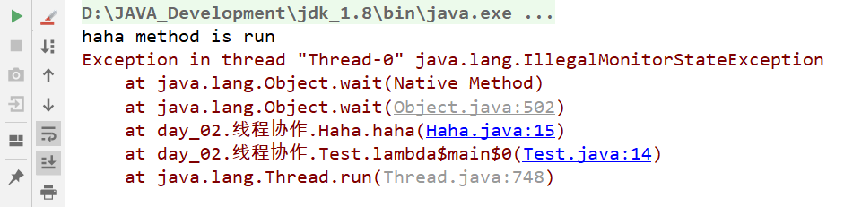

# wait()、notify()方法需要和synchronized一起使用

**Obj.wait()与Obj.notify()必须要与synchronized(Obj)一起使用**，也就是wait,与notify是针对已经获取了Obj锁进行操作，从语法角度来说就是Obj.wait(),Obj.notify必须在synchronized(Obj){...}语句块内。从功能上来说wait就是说线程在获取对象锁后，主动释放对象锁，同时本线程休眠。直到有其它线程调用对象的notify()唤醒该线程，才能继续获取对象锁，并继续执行。相应的notify()就是对对象锁的唤醒操作。

## 1. 不一起使用导致的后果

```java
public class Haha {
    public Map<String,String> map=new HashMap<>();
    public void haha() throws InterruptedException {
        synchronized (map){//使用map加锁
            System.out.println("haha method is run");
            this.wait();//用当前对象，调用wait方法会报错；正确的写法是map.wait()
        }
    }
}
```

```java
public class Test {
    public static void main(String[] args) {
        new Thread(()->{
            try {
                new Haha().haha();
            } catch (InterruptedException e) {
                e.printStackTrace();
            }
        }).start();
    }
}
```

在上述代码中由于Haha类的haha方法中使用map加的锁，但又试图使用this.wait方法释放锁此时会报错：




### 2. 为什么要在一起使用

Object.wait(),Object.notify(),Object.notifyAll()都是Object的方法，换句话说，就是每个类里面都有这些方法。

- Object.wait()：释放当前对象锁，并进入阻塞队列
- Object.notify()：唤醒当前对象阻塞队列里的任一线程（并不保证唤醒哪一个）
- Object.notifyAll()：唤醒当前对象阻塞队列里的所有线程

为什么这三个方法要与synchronized一起使用呢？解释这个问题之前，我们先要了解几个知识点

- 每一个对象都有一个与之对应的监视器

- 每一个监视器里面都有一个**该对象**的锁以及一个**等待队列**和一个**同步队列**

wait()方法的语义有两个，一是释放当前对象锁，另一个是进入阻塞队列，可以看到，这些操作都是与监视器相关的，当然要指定一个监视器才能完成这个操作了

notify()方法也是一样的，用来唤醒一个线程，你要去唤醒，首先你得知道他在哪儿，所以必须先找到该对象，也就是获取该对象的锁，当获取到该对象的锁之后，才能去该对象的对应的等待队列去唤醒一个线程。值得注意的是，只有当执行唤醒工作的线程离开同步块，即释放锁之后，被唤醒线程才能去竞争锁。

因wait()而导致阻塞的线程是放在**阻塞队列**中的，因竞争失败导致的阻塞是放在**同步队列**中的，notify()/notifyAll()实质上是把阻塞队列中的线程放到同步队列中去

为了便于理解，你可以把线程想象成一个个列车，对象想象成车站，每一个车站每一次能跑一班车，这样理解起来就比较容易了。

值得提的一点是，synchronized是一个非公平的锁，如果竞争激烈的话，可能导致某些线程一直得不到执行。
