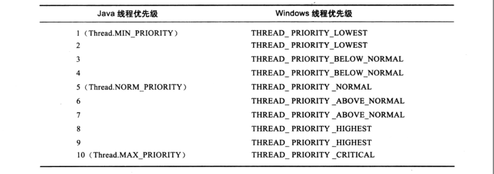

# 线程的优先级

Java线程提供优先级的概念，Java语言一共设置了10个级别的线程优先级（Thread.MIN_PRIORITY至Thread.MAX_PRIORITY），在两个线程处于ready状态时，优先级越高的线程越容易被系统选择执行。

**线程优先级API**：

- setPriority(int newPriority)：新建线程的优先级默认是5。
- getPriority()：获取此线程的优先级。

需要注意的是，**线程优先级并不是很靠谱**，原因是Java的线程是被映射到系统原生线程上来实现的，所以线程调度最终有操作系统说了算，虽然现在很多操作系统都提供优先级的概念，但是并不见得能与Java线程的优先级一一对应，如Solaris中有2147483648（2的31次方）种优先级，但是Windows有7种，比Java线程优先级多还好说，中间留下一点空位即可，但比Java线程优先级少的系统就不得不出现几个优先级相同的情况了。

下图就是java线程优先级与Windows线程优先级对应的关系：

Windows平台JDK中使用了除THREAD_PRIORITY_IDLE之外的其余6种优先级。

上文说到”线程优先级并不是很靠谱“，不仅仅是说在一些平台上不同的优先级实际会变的相同这一点，还有其他情况让我们不能太依赖优先级：优先级可能会被系统自行改变。例如在WIndows系统中存在一个名为”优先级推进器“的功能（Priority Boosting，当然它可以关闭掉），它的大致作用就是当系统发生一个线程被执行的特别勤奋时，可能会越过线程优先级去为它分配执行时间。因此我们不能在程序中通过优先级来完全准确地判断一组状态都为ready的线程将会先执行哪一个。

**本文参考至**：《深入Java虚拟机》