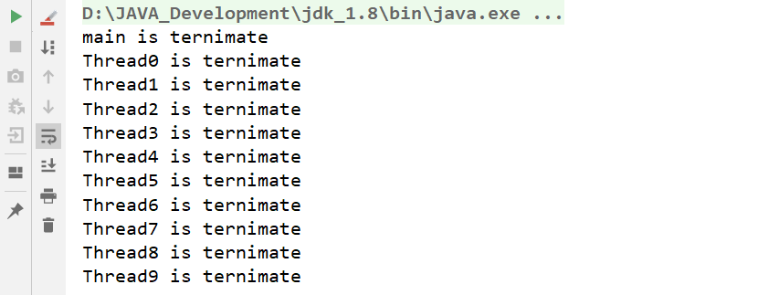

# 线程的join方法

如果线程A执行了线程B的join方法，线程A必须要等待B执行完成了以后，线程A才能继续自己的工作。但是如果线程A此时已经获取到了锁，那么线程A并不会释放这个锁。

**示例代码**：

```java
public class JoinTest {
    private static class JumpQueue implements Runnable {

        private Thread thread;

        public JumpQueue(Thread thread) {
            this.thread = thread;
        }

        @Override
        public void run() {
            try {
                thread.join();
                System.out.println(Thread.currentThread().getName()+" is ternimate");
            } catch (InterruptedException e) {
                e.printStackTrace();
            }
        }
    }

    public static void main(String[] args) throws InterruptedException {
        Thread preThread = Thread.currentThread();//获取主线程
        for (int i = 0; i < 10; i++) {
            Thread thread = new Thread(new JumpQueue(preThread), "Thread" + i);
            thread.start();
            preThread = thread;
        }
        Thread.sleep(3000);
        System.out.println(Thread.currentThread().getName()+" is ternimate");
    }
}
```

在上述代码中我们不断创建是个线程，让新创建的线程join到前面线程的后面，那么我们就可以看到主线程和十个线程串行的效果：



