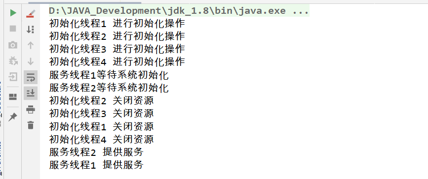

# CountDownLatch

## 1. 背景

- countDownLatch是在java1.5被引入，跟它一起被引入的工具类还有CyclicBarrier、Semaphore、concurrentHashMap和BlockingQueue。
- 存在于java.util.cucurrent包下。

## 2. 概念

- CountDownLatch这个类使一个线程等待其他线程各自执行完毕后再执行。
- 是通过一个计数器来实现的，计数器的初始值是线程的数量。每当一个线程执行完毕后，计数器的值就-1，当计数器的值为0时，表示所有线程都执行完毕，然后在闭锁上等待的线程就可以恢复工作了。

## 3. 源码

- CountDownLatch类中只提供了一个构造器：

```java
//参数count为计数值
public CountDownLatch(int count) {  };  
```

- 类中有三个方法是最重要的：

```java
//调用await()方法的线程会被挂起，它会等待直到count值为0才继续执行
public void await() throws InterruptedException { };   

//和await()类似，只不过等待一定的时间后count值还没变为0的话就会继续执行
public boolean await(long timeout, TimeUnit unit) throws InterruptedException { }; 

//将count值减1
public void countDown() { };  
```


## 4. 示例

我们模拟有四个线程进行系统的初始化操作，然后有两个服务线程等待着初始化工作完成后才进行下一步的操作：

```java
public class CountDownLatchTest {

    /**
     * 创建一个CountDownLatch计数器
     */
    private static CountDownLatch countDownLatch = new CountDownLatch(4);

    /**
     * 初始化线程
     */
    private static class InitThread implements Runnable {
        @Override
        public void run() {
            System.out.println(Thread.currentThread().getName() + " 进行初始化操作");
            try {
                Thread.sleep(1000);
            } catch (InterruptedException e) {
                e.printStackTrace();
            }
            //计数器减一
            countDownLatch.countDown();
            System.out.println(Thread.currentThread().getName() + " 关闭资源");
        }
    }

    /**
     * 服务线程
     */
    private static class ServerThread implements Runnable {
        @Override
        public void run() {
            try {
                System.out.println(Thread.currentThread().getName()+ "等待系统初始化");
                countDownLatch.await();//等待初始化线程都执行完毕后，再从阻塞状态转为可运行状态
                System.out.println(Thread.currentThread().getName() + " 提供服务");
            } catch (InterruptedException e) {
                e.printStackTrace();
            }
        }
    }

    public static void main(String[] args) {
        for (int i = 1; i <= 4; i++) {
            new Thread(new InitThread(), "初始化线程" + i).start();
        }

        for (int i = 1; i <= 2; i++) {
            new Thread(new ServerThread(), "服务线程" + i).start();
        }
    }
}
```



