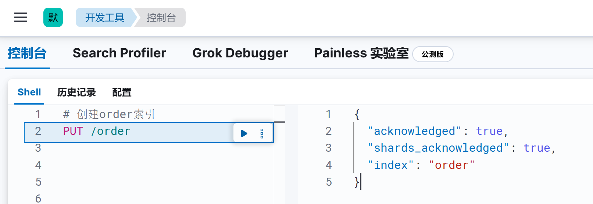
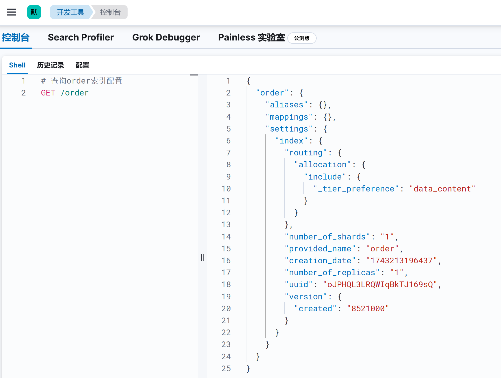
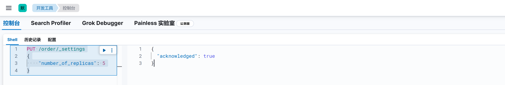
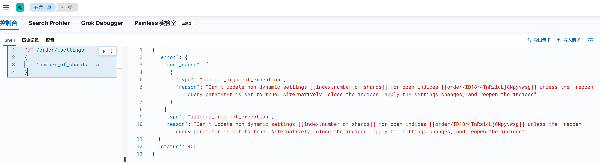
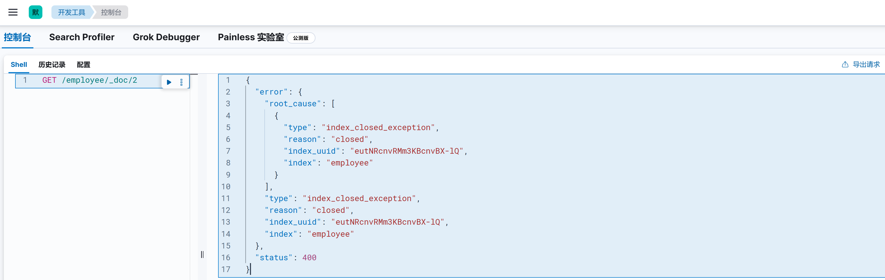
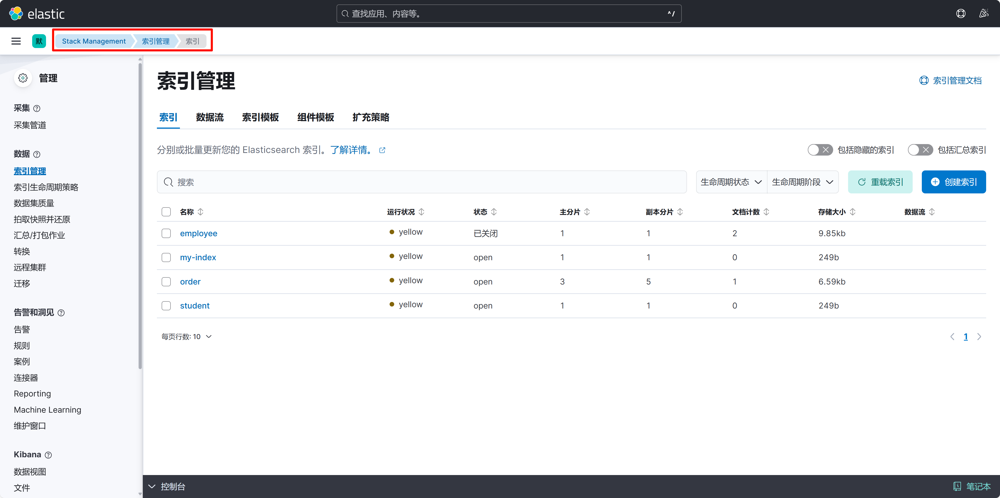

# ElasticSearch索引管理

ElasticSearch的数据交互接口是基于HTTP协议实现的，基本格式如下：

## 一. 创建索引

默认情况下，我们向一个不存在的的索引添加数据时，就会创建这个索引：


我们向一个不存在的employee索引添加一条数据，那么默认情况下ES会帮我们自动创建索引，并且也会自动帮我们创建字段映射：


### 1.1 禁止自动创建索引

那么如果我们需要对这个建立索引的过程做更多的控制：比如想要确保这个索引有数量适中的主分片，并且在我们索引任何数据之前，分析器和映射已经被建立好。那么就会引入两点：第一个**禁止自动创建索引**，第二个是**手动创建索引**。

- 禁止自动创建索引

可以通过在 config/elasticsearch.yml 的每个节点下添加下面的配置：

```bash
action.auto_create_index: false
```

手动创建索引就是接下来文章的内容。

### 1.2 手动创建索引

```shell
PUT /{index_name}
{
    "settings": { ... any settings ... },
    "mappings": {
        "type_one": { ... any mappings ... },
        "type_two": { ... any mappings ... },
        ...
    }
}
```

需要注意的是，索引名称有如下要求：

- 仅限小写
- 不能包含 `\` 、 `/` 、 `*` 、 `?` 、 `"` 、 `<` 、 `>` 、 `|` 、 ` ` (空格字符)、 `,` 、 `#`
- 7.0 之前的索引可以包含冒号 ( `:` ，但该功能已被弃用，7.0 及以上版本将不再支持
- 不能以 `-` 、 `_` 、 `+` 开头
- 不能是 `.` 或 `..`
- 不能超过 255 个字节（注意是字节，因此多字节字符将更快地计入 255 的限制）
- 以 `.` 开头的名称已被弃用，[ 隐藏索引](https://www.elastic.co/guide/en/elasticsearch/reference/current/index-modules.html#index-hidden)和插件管理的内部索引除外

例如我需要新增一个名为 `order` 索引：

```shell
PUT /order
```



我们也可以在创建索引时指定索引配置：

```txt
PUT /order2
{
  "settings": {
		"number_of_shards": 1,
		"number_of_replicas": 1
	},
  "mappings": {
    "properties": {
      "name": {
        "type": "text",
        "fields": {
          "keyword": {
            "type": "keyword",
            "ignore_above": 256
          }
        }
      },
      "age": {
        "type": "long"
      },
      "remarks": {
        "type": "text"
      }
    }
  }
}
```

## 二. 查看索引配置

格式：

```txt
GET /{index_name}
```

例如我们需要查询刚刚创建的order索引的配置：



由于在创建order索引时未指定具体配置，所以order索引采用默认配置创建。

```json
{
  // 这是整个 order 索引的配置对象
  "order": {
    // 用于定义索引的别名，当前为空，未配置别名
    "aliases": {},
    // 用于定义索引的映射，当前为空，未配置映射
    "mappings": {},
    // 索引的各种设置
    "settings": {
      "index": {
        // 与索引分片的路由分配相关设置
        "routing": {
          "allocation": {
            "include": {
              // 优先将分片分配到具有 data_content 层级的节点上
              "_tier_preference": "data_content"
            }
          }
        },
        // 索引的主分片数量，这里设置为 1
        "number_of_shards": "1",
        // 索引的名称
        "provided_name": "order",
        // 索引的创建日期，以毫秒为单位的时间戳
        "creation_date": "1743213196437",
        // 索引的副本分片数量，这里设置为 1
        "number_of_replicas": "1",
        // 索引的唯一标识符
        "uuid": "oJPHQL3LRQWIqBkTJ169sQ",
        "version": {
          // 创建该索引的 Elasticsearch 版本
          "created": "8521000"
        }
      }
    }
  }
}
```

## 三. 更新索引配置

### 3.1 修改setting配置

修改settings配置的格式：

```txt
PUT /{index_name}/_settings
{
    "number_of_replicas": 1
}
```

我们可以用该API动态修改 order 索引分片的副本数：



`number_of_shards` 只能在创建索引时指定，如果尝试修改 `number_of_shards` 则会报错：



### 3.2 修改mapping配置

如果需要新增字段映射：

```bash
PUT /{index_name}/_mapping
{
  "properties": {
    "author": {
      "type": "text",
      "fields": {
        "keyword": { "type": "keyword" }
      }
    }
  }
}
```

字段映射功能会在后面文章中详细介绍。

### 3.3 修改aliases配置

字段别名功能会在后面文章中详细介绍。

## 四. 索引删除

```bash
# 删除单个索引
DELETE /my_index

# 删除多个索引
DELETE /index1,index2

# 通配符删除
DELETE /logs-*

# 强制删除（忽略权限）
DELETE /my_index?master_timeout=30s&timeout=30s
```

## 五. 打开关闭索引

### 5.1 关闭索引

一旦索引被关闭，那么这个索引只能显示元数据信息，**不能够进行读写操作**。

语法格式：

```txt
POST /{index_name}/_close
```

关闭索引后，操作数据报错：



### 5.2 打开索引

索引打开后又可以重新写数据了

语法格式：

```txt
POST /{index_name}/_open
```

## 六. kibana管理索引

在Kibana如下路径，我们可以查看和管理索引



