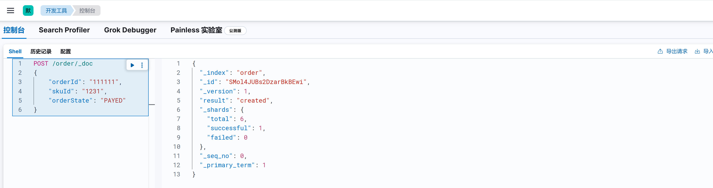
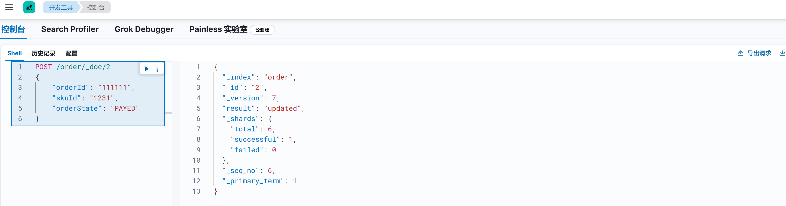
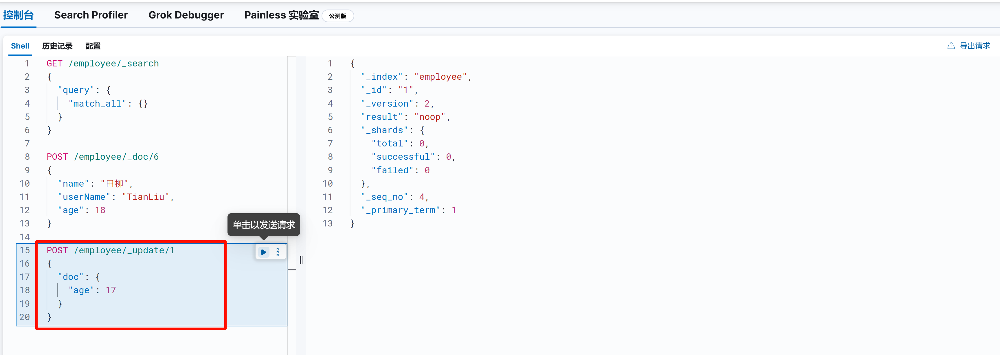
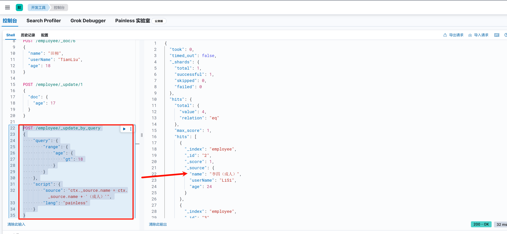
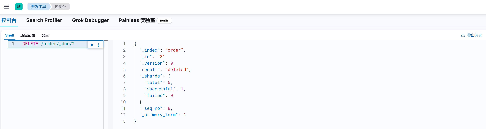

# 文档管理

ElasticSearch的数据交互接口是基于HTTP协议实现的，基本格式如下：

```
http://localhost:9200/{index}/{type}/{id} 
```

- **index：索引名称，可以类比关系型数据库的表**
- **type：类型名称，需要注意的是，在7.x之后，去掉了type属性，默认用“_doc”，8.x不再支持在请求中指定类型**
- **id：即id，可以不指定，elasticSearch会自动生成**
- **文档：即对象的json序列化**
- ***元数据：即elasticSearch的数据格式，一般如下，”_source”对应的数据即为我们存储的文档\***

## 一. 插入文档

```bash
POST /{index_name}/_doc/{id}
{
   ...
}
```

- index_name：索引名称
- id：文档ID，该参数非必填。如果未填写ID则会新增文档，并自动生成ID。指定ID后，如果文档存在，则会更新；若不存在，则新增。

新增文档，不指定ID：



新增文档，指定ID：



## 二. 更新文档

### 2.1 根据ID替换文档

**`PUT` 请求**：通常用于完整替换文档。如果只提供了部分字段，原文档中未提及的字段会被删除。比如原文档有 `field1`、`field2` 和 `field3`，使用 `PUT` 请求只更新 `field1`，那么更新后文档将只包含 `field1`，`field2` 和 `field3` 会被删除。

```bash
PUT /{index_name}/_doc/{document_id}
{
   ...
}
```

- index_name：索引名称
- id：文档ID，必填。

例如：

```json
PUT /employee/_doc/7
{
    "name": "王五",
    "age": 27
}
```

### 2.2 根据ID部分更新文档

部分更新允许你只更新文档中的某些字段，而不影响其他字段。以下是一个使用 `POST` 请求进行部分更新的示例：

```json
POST /{index_name}/_update/{document_id}
{
    "doc": {
        "field1": "new_value1",
        "field2": "new_value2"
    }
}
```



### 2.3 根据查询条件更新文档

#### 2.3.1 案例一：更新部分文档name字段

例如我需要更新所有 `age>18` 的数据，在 `name` 字段后面增加一个统一后缀“（成人）”：

```java
POST /employee/_update_by_query
{
    "query": {
        "range": {
            "age": {
                "gt": 18
            }
        }
    },
    "script": {
        "source": "ctx._source.Name = ctx._source.Name + '（成人）'",
        "lang": "painless"
    }
}
```

**解释：**

- **`_update_by_query`**：这是 Elasticsearch 提供的用于批量更新满足特定查询条件的文档的 API。
- **`query`**：指定更新操作的筛选条件。这里使用 `range` 查询筛选出 `age` 大于 18 的文档。
- **`script`**：使用 Painless 脚本对符合条件的文档进行更新。`ctx._source` 表示当前文档的源数据，通过 `ctx._source.Name = ctx._source.Name + '（成人）'` 语句在 `Name` 字段后面添加 “（成人）” 后缀。



#### 2.3.2 案例二：删除文档中的某个字段

```java
POST /employee/_update_by_query
{
    "query": {
        "match_all": {}
    },
    "script": {
        "source": "if (ctx._source.containsKey('Name')) { ctx._source.remove('Name') }",
        "lang": "painless"
    }
}
```

## 三. 删除文档

### 3.1 根据ID删除文档

```bash
DELETE /{index_name}/_doc/{id}
```

- index_name：索引名称
- id：文档ID，必填。



### 3.2 根据查询条件删除文档

删除 `age>60` 的文档：

```JSON
POST /employee/_delete_by_query
{
    "query": {
        "range": {
            "age": {
                "gt": 60
            }
        }
    }
}
```


