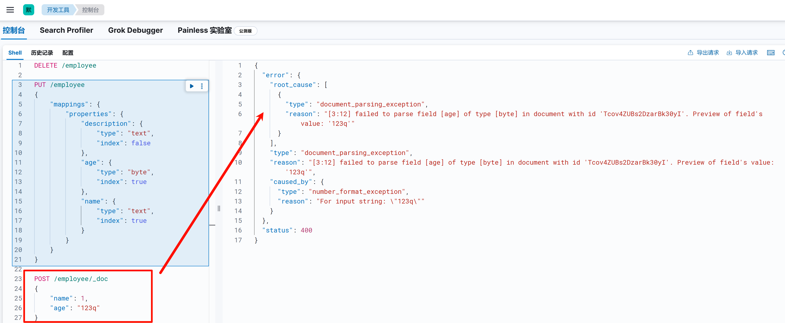

# Elasticsearch索引字段映射（mapping）

## 一. 字段映射的作用

在 Elasticsearch里，Mapping 是对索引中字段的数据类型、存储方式、分析器等进行定义的一种机制，它在 ES 的使用中起着至关重要的作用，以下为你详细介绍其用途：

### 1.1 数据类型定义

**确保数据正确存储**：ES 支持多种数据类型，像文本（text）、关键字（keyword）、数值（integer、long、double 等）、日期（date）等。通过 Mapping 可以明确每个字段的数据类型，保证数据以正确的格式存储。例如，把 `age` 字段定义成 `integer` 类型，就能避免将字符串值误存到该字段中。

```json
{
    "mappings": {
        "properties": {
            "age": {
                "type": "integer"
            },
            "name": {
                "type": "text"
            }
        }
    }
}
```

**支持不同的查询方式**：不同的数据类型支持不同的查询操作。比如，`text` 类型字段适用于全文搜索，而 `keyword` 类型字段更适合精确匹配查询。合理定义数据类型能让查询更高效、准确。

当字段设置映射后，字段的数据类型就固定下来了，如果尝试向索引中添加一个字段类型不符合的文档，就会提示添加失败：

例如，我们新增一个 `employee` 索引：


如果我们尝试添加的文档，不兼容设定的字段类型，就会报错：



### 1.2 控制字段索引行为

**指定是否索引**：通过 Mapping 可以控制某个字段是否被索引。若某个字段不需要被搜索，可将其 `index` 属性设置为 `false`，这样能减少索引的大小，提高索引性能。

```json
{
    "mappings": {
        "properties": {
            "description": {
                "type": "text",
                "index": false
            }
        }
    }
}
```

**设置索引选项**：还能为字段设置其他索引选项，例如 `norms`、`doc_values` 等，以优化索引和查询性能。

### 1.3 分析器配置

**文本处理**：对于 `text` 类型的字段，可通过 Mapping 指定分析器（analyzer）。分析器负责对文本进行分词、大小写转换、停用词过滤等操作，不同的分析器适用于不同的语言和业务场景。比如，在处理中文文本时，可使用 `ik_max_word` 或 `ik_smart` 分析器。

```json
{
    "mappings": {
        "properties": {
            "content": {
                "type": "text",
                "analyzer": "ik_max_word"
            }
        }
    }
}
```

**提高搜索准确性**：合适的分析器能将文本拆分成有意义的词项，提高搜索的准确性和召回率。

### 1.4 嵌套对象和数组处理

**处理复杂数据结构**：ES 支持嵌套对象和数组的存储。通过 Mapping 可以定义嵌套对象的结构，确保嵌套字段能被正确索引和查询。例如，在一个存储文章信息的索引中，文章可能有多个标签，可将 `tags` 字段定义为数组类型。

```json
{
    "mappings": {
        "properties": {
            "title": {
                "type": "text"
            },
            "tags": {
                "type": "keyword"
            }
        }
    }
}
```

**支持嵌套查询**：对于嵌套对象，还能进行嵌套查询，实现更复杂的数据检索。

### 1.5 元数据管理

**字段别名**：可以通过 Mapping 为字段设置别名，方便在查询时使用更简洁或更具语义的名称。

```json
{
    "mappings": {
        "properties": {
            "full_name": {
                "type": "text"
            },
            "alias": {
                "type": "alias",
                "path": "full_name"
            }
        }
    }
}
```

**自定义字段元数据**：还能为字段添加自定义的元数据，用于记录字段的额外信息，如字段的描述、用途等。

### 1.6 性能优化

- **减少磁盘空间占用**：合理的 Mapping 配置可以减少不必要的字段索引和存储，从而降低磁盘空间的使用。例如，将不需要搜索的字段设置为不索引，或者使用合适的数据类型来存储数据。
- **提高查询性能**：通过优化字段的数据类型、分析器和索引选项等，可以提高查询的响应速度和效率。例如，对于经常用于排序和聚合的字段，启用 `doc_values` 可以显著提高性能。

## 二. 动态字段映射

当 Elasticsearch 检测到文档中的新字段时，它会**默认将该字段动态添加到类型映射中**。

例如，我们新建一个空的order索引后，默认情况下order索引下是没有字段映射配置的：


如果我们向 order 索引中添加文档，文档中由于没有这些字段，Elasticsearch 会自动根据传入字段的数据类型创建字段映射：


## 三. 显示映射

在实际的开发工作中，开发人员往往对数据有着更为深入和精准的理解，相比之下，Elasticsearch 自动进行的猜测则显得相对局限。动态映射在项目起步阶段确实能发挥一定的作用，它为开发者快速搭建索引提供了便利。然而，随着业务的发展和数据复杂度的提升，显式映射的必要性就愈发凸显。

以传入的 string 类型数据为例，它可能承载着不同含义和用途。它既可能代表时间类型的数据，用于记录事件发生的具体时刻；也可能是需要进行全文搜索的文本内容，属于 text 类型；还可能是用于精确匹配的关键字，即 keyword 类型。在这种情况下，动态字段映射的局限性就暴露无遗，它难以精准地识别和处理这些不同用途的 string 数据，无法满足我们对数据进行精细化管理和高效查询的需求。

这样我们就可以在创建索引时，显示指定索引的字段映射配置：

```json
PUT /order
{
    "mappings": {
        "properties": {
            "age": {
                "type": "integer"
            },
            "email": {
                "type": "keyword"
            },
            "name": {
                "type": "text"
            }
        }
    }
}
```

如果存在嵌套类型字段，可以这样配置：
```json
PUT /order
{
    "mappings": {
        "properties": {
            "age": {
                "type": "integer"
            },
            "email": {
                "type": "keyword"
            },
            "name": {
                "type": "text"
            },
            "user": {
                "type": "object",
                "properties": {
                    "userId": {
                        "type": "keyword"
                    },
                    "userName": {
                        "type": "text"
                    }
                }
            }
        }
    }
} 
```

## 四. 关闭索引的动态字段映射

在 Elasticsearch 中，动态字段映射虽然方便，但在生产环境中可能导致意外字段污染索引结构。通过以下配置可精准控制动态映射行为。

`dynamic` 参数控制是否动态添加新字段，接受以下参数：

| 取值             | 描述                                                         |
| ---------------- | ------------------------------------------------------------ |
| `true`（默认值） | 新字段被自动添加到映射中。                                   |
| `runtime`        | 新字段作为[运行时字段](https://www.elastic.co/guide/en/elasticsearch/reference/current/runtime.html)添加到映射中。这些字段未被索引，并在查询时从 `_source` 加载。 |
| `false`          | 新字段将被忽略。这些字段不会被索引或搜索，但仍会出现在返回的命中结果的 `_source` 字段中。这些字段不会添加到映射中，必须明确添加新字段。 |
| `strict`         | 如果检测到新字段，则会抛出异常并拒绝该文档。必须将新字段明确添加到映射中。 |

### 4.1 关闭整个索引的动态字段映射

通过设置 `mappings.dynamic` 参数，可全局禁用索引的动态字段映射：

**方式一：忽略新字段（推荐生产环境）**

```json
PUT /your-index
{
  "mappings": {
    "dynamic": "false",  // 禁用动态映射，新字段被忽略
    "properties": {
      "known_field": { "type": "text" }
    }
  }
}
```

**行为说明**：

- 文档仍可正常写入，但新字段不会被索引
- 查询时无法使用未定义的字段
- 适合数据结构稳定的场景

**方式二：严格模式（防止非法字段）**

```json
PUT /your-index
{
  "mappings": {
    "dynamic": "strict",  // 遇到新字段抛出异常
    "properties": {
      "known_field": { "type": "text" }
    }
  }
}
```

**行为说明**：

- 写入包含未知字段的文档时会报错
- 适合对数据结构严格控制的场景

### 4.2 关闭部分嵌套结构的动态字段映射

若需保留全局动态映射，但限制某些嵌套对象的字段添加，可在对象层级单独配置：

示例：禁用嵌套对象的动态映射

```json
PUT /your-index
{
  "mappings": {
    "properties": {
      "user": {
        "type": "object",
        "dynamic": "false",  // 仅禁用 user 对象的动态映射
        "properties": {
          "id": { "type": "keyword" },
          "name": { "type": "text" }
        }
      }
    }
  }
}
```

**适用场景**：

- 用户信息等固定结构的对象
- 防止日志类数据污染关键业务字段
- 需保留其他层级的动态映射能力

### 4.3 最佳实践建议

1. **默认禁用动态映射**：生产环境建议始终显式定义字段
2. **使用 `strict` 模式**：在数据验证阶段强制字段合规
3. **监控字段增长**：通过 `_mapping` API 定期检查字段变更
4. **版本兼容性**：确保 Elasticsearch 版本 ≥ 5.0（支持 `strict` 模式）

通过灵活组合全局与局部配置，可在保持索引灵活性的同时，有效控制数据结构的稳定性。

## 五. 字段映射的配置

### 5.1 新增字段映射

向已存在的索引添加字段映射，语法如下：

```txt
PUT /{index_name}/_mapping
{
  "properties": {
    "employee-id": {
      "type": "keyword",
      "index": false
    }
  }
}
```


### 5.2 查询字段映射配置

方式一：只查询字段映射

```java
GET /{index_name}/_mapping
```

方式二：查询索引配置
```txt
GET /{index_name}
```


方式三：查看特定字段的映射

```txt
GET /{index_name}/_mapping/field/{field_name}
```


### 5.3 删除字段映射

无法删除字段映射

### 5.4 修改字段映射

需要注意的是：除支持的[映射参数](https://www.elastic.co/guide/en/elasticsearch/reference/current/mapping-params.html)外，您无法更改现有字段的映射或字段类型。更改现有字段可能会使已编入索引的数据无效。

如果需要更改数据流支持索引中字段的映射，请参阅[更改数据流的映射和设置 ](https://www.elastic.co/guide/en/elasticsearch/reference/current/modify-data-streams.html#data-streams-change-mappings-and-settings)。

如果您需要更改其他索引中字段的映射，请使用正确的映射创建新索引，然后将数据[重新索引](https://www.elastic.co/guide/en/elasticsearch/reference/current/docs-reindex.html)到该索引中。

重命名字段将使已在旧字段名称下编入索引的数据无效。相反，请添加 [`alias`](https://www.elastic.co/guide/en/elasticsearch/reference/current/field-alias.html) 字段以创建备用字段名称。

## 六. Elasticsearch中的数据类型

Elasticsearch支持多种数据类型：[字段数据类型](https://www.elastic.co/guide/en/elasticsearch/reference/current/mapping-types.html)。数据类型有如下几种：

| 类型分类     | 具体数据类型 | 描述                                                         | 示例                           |
| ------------ | ------------ | ------------------------------------------------------------ | ------------------------------ |
| 核心数据类型 | `text`       | 适用于全文搜索的文本数据，会被分词器处理                     | 文章内容、商品描述等           |
|              | `keyword`    | 用于精确匹配的字符串，通常不分词                             | 商品 SKU、用户 ID              |
|              | `byte`       | 整数类型，范围 -128 到 127                                   | 存储较小的整数，如某个状态码值 |
|              | `short`      | 整数类型，范围 -32768 到 32767                               | 一些数量较少的统计值           |
|              | `integer`    | 整数类型，范围 -2147483648 到 2147483647                     | 常见的整数数据，如年龄、数量   |
|              | `long`       | 整数类型，范围 -9223372036854775808 到 9223372036854775807   | 用于存储大整数，如时间戳       |
|              | `float`      | 浮点类型，单精度浮点数                                       | 精度要求不高的小数，如简单评分 |
|              | `double`     | 浮点类型，双精度浮点数                                       | 价格、科学计算数据等           |
|              | `date`       | 存储日期和时间信息，支持多种日期格式                         | 商品创建日期、订单时间         |
|              | `boolean`    | 只能存储 `true` 或 `false`                                   | 商品是否上架、用户是否激活     |
| 复杂数据类型 | `object`     | 用于存储嵌套的 JSON 对象，将相关字段组合在一起               | 用户文档中的地址信息           |
|              | `nested`     | 特殊的对象类型，处理数组中的对象，可独立索引数组中每个对象   | 订单中的商品列表               |
| 地理数据类型 | `geo_point`  | 存储地理位置的经纬度信息，支持地理距离、范围查询             | 店铺的经纬度位置               |
|              | `geo_shape`  | 存储更复杂的地理形状，如多边形、圆形等，支持形状包含、相交查询 | 某个区域的地理范围             |
| 特殊数据类型 | `binary`     | 存储二进制数据，存储时会进行 Base64 编码                     | 图片、文件等                   |