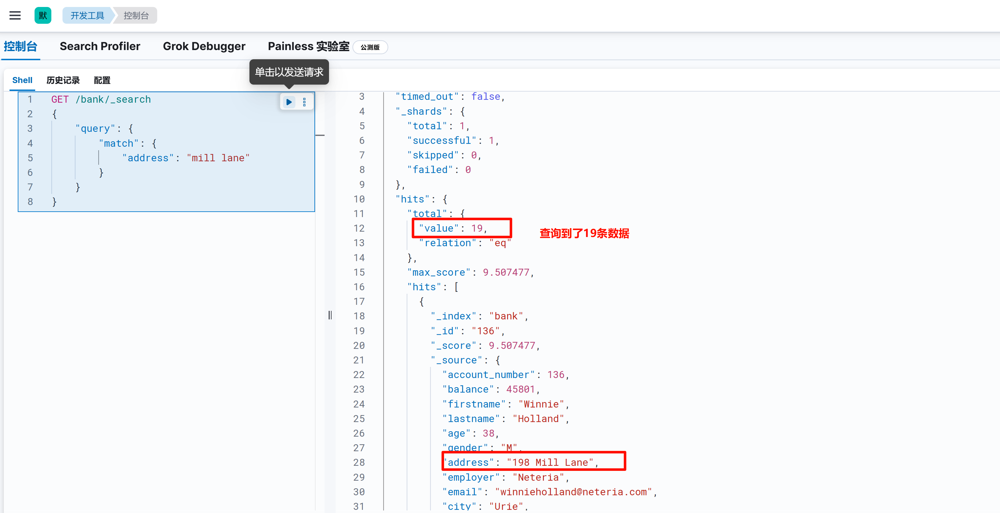
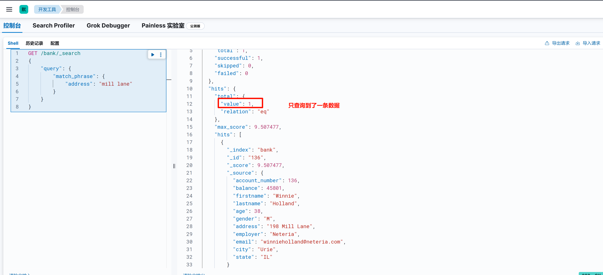
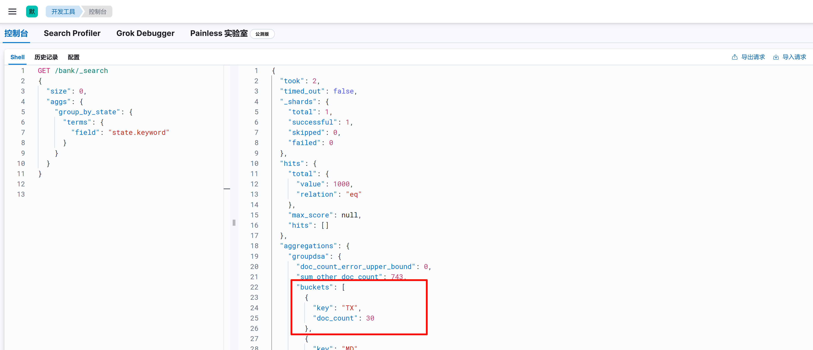
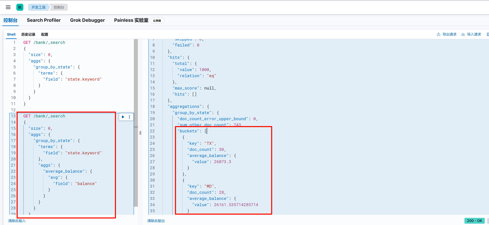

# DSL查询

> 本文参考至：[ES详解 - 入门：查询和聚合的基础使用 | Java 全栈知识体系](https://pdai.tech/md/db/nosql-es/elasticsearch-x-usage.html)

## 一. 基础查询

### 1.1 查询所有（match_all）

`match_all`表示查询所有的数据，`sort`即按照什么字段排序

```bash
GET /{index_name}/_search
{
  "query": {
    "match_all": {}
  },
  "sort": [
    {
      "account_number": "asc"
    }
  ]
}
```


相关字段解释

- `took`：Elasticsearch运行查询所花费的时间（以毫秒为单位）
- `timed_out`：搜索请求是否超时
- `_shards`：搜索了多少个分片，以及成功，失败或跳过了多少个碎片的细目分类。
- `max_score`：找到的最相关文档的分数
- `hits.total.value`：找到了多少个匹配的文档
- `hits.sort`：文档的排序位置（不按相关性得分排序时）
- `hits._score`：文档的相关性得分（使用match_all时不适用）

### 1.2 分页查询（from+size）

本质上就是from和size两个字段

```bash
GET /{index_name}/_search
{
  "query": {
    "match_all": {}
  },
  "sort": [
    {
      "account_number": "asc"
    }
  ],
  "from": 2,
  "size": 5
}
```

在 Elasticsearch 的查询请求中，`from` 和 `size` 这两个参数主要用于实现分页功能。下面为你详细解释这两个参数在你给出的查询中的作用：

- `from` 参数明确了查询结果起始的偏移量，也就是跳过前 `from` 条数据，从第 `from+1` 条结果开始返回。**它的默认值是 0，跳过前0条数据，从第1条结果返回**。在你的查询里，`from` 的值设定为 2，这表明 Elasticsearch 会跳过前 2 条结果，从第 3 条结果开始返回。

- `size` 参数指定了查询结果返回的最大文档数量。**它的默认值为 10，即默认返回 10 条结果**。在你的查询中，`size` 的值为 5，这就表示 Elasticsearch 只会返回至多 5 条结果。

### 1.3 指定字段查询（match）

如果要在字段中搜索特定字词，可以使用`match`; 如下语句将查询address 字段中包含 mill 或者 lane的数据

```bash
GET /{index_name}/_search
{
    "query": {
        "match": {
            "address": "mill lane"
        }
    }
}
```

由于ES底层是按照分词索引的，所以上述查询结果是address 字段中包含 mill 或者 lane的数据：



### 1.4 查询段落匹配（match_phrase）

如果我们希望查询的条件是 address 字段中包含 "mill lane"，则可以使用`match_phrase`

```bash
GET /{index_name}/_search
{
    "query": {
        "match_phrase": {
            "address": "mill lane"
        }
    }
}
```



## 二. 聚合查询

### 2.1 简单聚合

比如我们希望计算出 account 每个州的统计数量，使用`aggs`关键字对`state`字段聚合，被聚合的字段无需对分词统计，所以使用`state.keyword`对整个字段统计

```bash
GET /{index_name}/_search
{
  "size": 0,
  "aggs": {
    "group_by_state": {
      "terms": {
        "field": "state.keyword"
      }
    }
  }
}
```

因为无需返回条件的具体数据, 所以设置size=0，返回hits为空。

`doc_count` 表示 bucket 中每个州的数据条数。



### 2.2 嵌套聚合

ES还可以处理个聚合条件的嵌套。

比如承接上个例子， 计算每个州的平均结余。涉及到的就是在对state分组的基础上，嵌套计算avg(balance):

```bash
GET /{index_name}/_search
{
  "size": 0,
  "aggs": {
    "group_by_state": {
      "terms": {
        "field": "state.keyword"
      },
      "aggs": {
        "average_balance": {
          "avg": {
            "field": "balance"
          }
        }
      }
    }
  }
}
```



- `"group_by_state"`：这是聚合操作的名称，可以自定义，用于标识这个聚合操作。
- `"terms"`：这是一种聚合类型，被称为 “词条聚合”。它会根据指定字段的值对文档进行分组，每个不同的值会形成一个分组。
- `"field": "state.keyword"`：指定用于分组的字段为 `state.keyword`。`keyword` 类型通常用于精确匹配，在 Elasticsearch 中，对字符串字段进行聚合时，通常使用 `.keyword` 子字段以确保精确分组。
- 嵌套的aggs：表示在每个分组内部再进行一次聚合操作。
  - `"average_balance"`：这是嵌套聚合操作的名称。
  - `"avg"`：这是一种聚合类型，被称为 “平均值聚合”，用于计算指定字段的平均值。
  - `"field": "balance"`：指定用于计算平均值的字段为 `balance`。

### 2.3 对聚合结果排序

可以通过在aggs中对嵌套聚合的结果进行排序

比如承接上个例子， 对嵌套计算出的avg(balance)，这里是average_balance，进行排序

```json
GET /{index_name}/_search
{
  "size": 0,
  "aggs": {
    "group_by_state": {
      "terms": {
        "field": "state.keyword",
        "order": {
          "average_balance": "desc"
        }
      },
      "aggs": {
        "average_balance": {
          "avg": {
            "field": "balance"
          }
        }
      }
    }
  }
}
```

- `"group_by_state"`：这是聚合操作的名称，可自行定义，用于标识该聚合操作。
- `"terms"`：属于 “词条聚合” 类型，其作用是依据指定字段的值对文档进行分组，每个不同的值会形成一个分组。
- `"field": "state.keyword"`：指定用于分组的字段为 `state.keyword`。在 Elasticsearch 里，`keyword` 类型常用于精确匹配，对字符串字段进行聚合时，通常使用 `.keyword` 子字段以确保精确分组。
- `"order"`：该参数用于对分组结果进行排序。
  - `"average_balance": "desc"`：表示按照 `average_balance` 这个嵌套聚合的结果进行降序排序。也就是说，分组会根据每个州对应的平均余额从高到低排列。
- 嵌套的aggs：表示在每个分组内部再进行一次聚合操作。
  - `"average_balance"`：这是嵌套聚合操作的名称。
  - `"avg"`：属于 “平均值聚合” 类型，用于计算指定字段的平均值。
  - `"field": "balance"`：指定用于计算平均值的字段为 `balance`。

## 三. 复合查询

在查询中会有多种条件组合的查询，在ElasticSearch中叫复合查询。它提供了5种复合查询方式：**bool query(布尔查询)**、**boosting query(提高查询)**、**constant_score（固定分数查询）**、**dis_max(最佳匹配查询）**、**function_score(函数查询）**。

### 3.1 bool query(布尔查询)

Bool查询语法有以下特点

- 子查询可以任意顺序出现
- 可以嵌套多个查询，包括bool查询
- 如果bool查询中没有must条件，should中必须至少满足一条才会返回结果。

bool查询包含四种操作符，分别是must,should,must_not,filter。他们均是一种数组，数组里面是对应的判断条件。

- `must`： 必须匹配。贡献算分
- `must_not`：过滤子句，必须不能匹配，但不贡献算分
- `should`： 选择性匹配，至少满足一条。贡献算分
- `filter`： 过滤子句，必须匹配，但不贡献算分

一些例子：

```sql
GET /{index_name}/_search
{
  "query": {
    "bool" : {
      "must" : {
        "term" : { "user.id" : "kimchy" }
      },
      "filter": {
        "term" : { "tags" : "production" }
      },
      "must_not" : {
        "range" : {
          "age" : { "gte" : 10, "lte" : 20 }
        }
      },
      "should" : [
        { "term" : { "tags" : "env1" } },
        { "term" : { "tags" : "deployed" } }
      ],
      "minimum_should_match" : 1,
      "boost" : 1.0
    }
  }
}
```

