# DSL查询

Elasticsearch Query DSL（Domain Specific Language）是一种基于 JSON 的声明式查询语言，专为复杂搜索场景设计。初次接触 Elasticsearch 的查询语法可能会以让你觉得混乱，本质上是因为它采用了**分层嵌套结构**的设计，同时遵循了**组合模式（Composite Pattern）**的理念。这种设计允许查询语句以灵活的方式组合，但也会让初次接触的人感到层次复杂。

Elasticsearch 的查询语法遵循一个原则：**任何查询条件都可以嵌套在其他查询中**。无论是简单的 `term` 查询还是复杂的 `bool` 查询，它们都被视为可组合的原子单位。这种设计使得语法具有极高的灵活性，但也带来了嵌套层次的问题。

Elasticsearch 的查询可以看作一棵树，树的每个节点可以是两种类型：

1. **叶子查询（Leaf Query）**：如 `term`、`match`、`range`，**直接对字段进行操作，不可再嵌套其他查询**。
2. **复合查询（Compound Query）**：如 `bool`、`dis_max`，用于组合多个子查询（叶子或复合），形成逻辑条件。

## 一. 叶子查询

### 1.1 精确查询

下列查询用于精确匹配字段的 **未经分词** 的原始值（通常针对 `keyword` 类型或数值类型字段）。在实战过程中，需要避免将下列查询关键字应用于text类型字段的检索。进一步说，text类型字段会分词后存储，将精确查询关键字用于`text`类型字段时并不会报错，但检索结果一般会达不到预期。

例如下面介绍的term精确查询，由于 `city` 是 `text` 类型字段，我们直接使用精确匹配是搜不到数据的：


如果是 `text` 类型字段需要使用精确匹配，使用 `filed.keyword` 匹配即可：

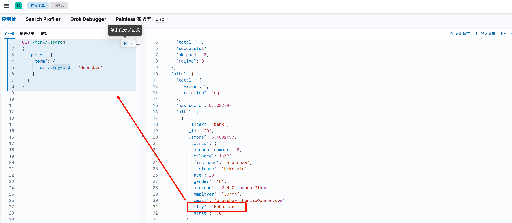

同理，我想通过精确搜索匹配 `address` 前缀为 `990 Concord` 的数据，我们同样需要使用keyword类型字段进行匹配，因为 `address` 字段本身是 `text` 类型，`990 Concord Street` 会被分词为 [“990”,“Concord”,“Street”] 三个独立的词项， `990 Concord` 无法匹配到任意一个词项的前缀，所以无法查询到数据：


但是如果只是查 `990` 的前缀，是能匹配到的，因为 `990` 被分词匹配到了：

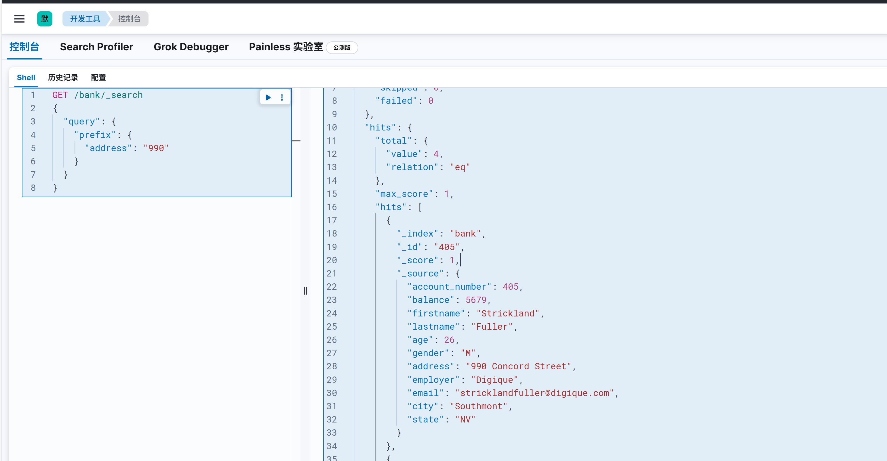

如果需要正确的匹配前缀，还是建议使用 `keyword` 类型字段：

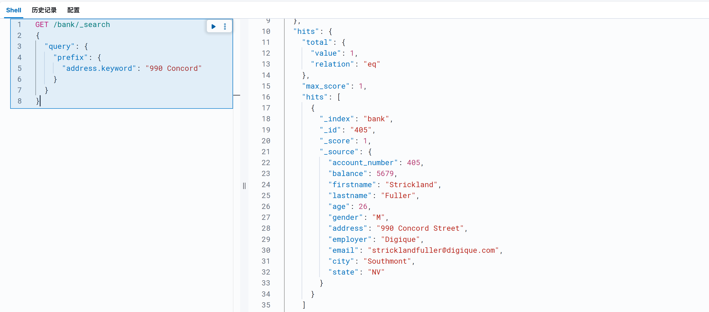

#### 1.1.1 `term` 查询

**用途**：精确匹配 `keyword` 类型字段的值。

在Elasticsearch中，term查询，对输入不做分词。会将输入作为一个整体，在倒排索引中查找准确的词项，并且使用相关度算分公式为每个包含该词项的文档进行相关度算分。

**​示例​**​：查询 `city.keyword` 为 `"Millville"` 的账户。

```json
GET /{index_name}/_search
{
  "query": {
    "term": {
      "city.keyword": "Hobucken"
    }
  }
}
```

city字段类型是 `text`，Elasticsearch定义一个 `text` 类型的字段（比如 `city`），Elasticsearch 会默认做两件事：

1. **分词处理**：将原始值拆分成词项（如 `"New York"` → `["new", "york"]`），用于全文搜索。

2. **自动生成子字段 `keyword`**：将原始值完整存储为 `keyword` 类型，用于精确匹配（如过滤、排序、聚合）。

   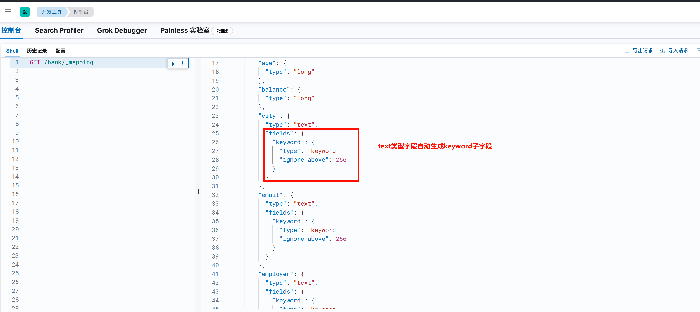

此次查询是使用term精确查询，所以我们可以借助 `city` 的 `keyword` 子字段进行精确匹配：


#### 1.1.2 `terms` 查询

**用途**：匹配 `keyword` 字段的多个精确值。
​**​示例​**​：查询 `state.keyword` 是 `"WA"` 或 `"TX"` 的账户。

```json
GET /{index_name}/_search
{
  "query": {
    "terms": {
      "state.keyword": ["WA", "TX"]
    }
  }
}
```

#### 1.1.3 `range` 查询

range检索是Elasticsearch中一种针对指定字段值在给定范围内的文档的检索类型。这种查询适合对数字、日期或其他可排序数据类型的字段进行范围筛选。range检索支持多种比较操作符，可以实现灵活的区间查询。

- 大于(gt)
- 大于等于(gte)
- 小于(lt)
- 小于等于(lte)

**​示例​**​：查询年龄在 `[30, 40]` 之间的账户。

```json
GET /{index_name}/_search
{
  "query": {
    "range": {
      "age": {
        "gte": 30,
        "lte": 40
      }
    }
  }
}
```

**日期范围检索**

假设我们正在创建一个笔记应用，每条笔记都有一个创建日期。

```json
PUT /notes
{
    "settings": {
        "number_of_shards": 1,
        "number_of_replicas": 0
    },
    "mappings": {
        "properties": {
            "title": {
                "type": "text"
            },
            "content": {
                "type": "text"
            },
            "created_at": {
                "type": "date",
                "format": "yyyy-MM-dd HH:mm:ss"
            }
        }
    }
}

POST /notes/_bulk
{"index":{"_id":"1"}}
{"title":"Note 1","content":"This is the first note.","created_at":"2023-07-01 12:00:00"}
{"index":{"_id":"2"}}
{"title":"Note 2","content":"This is the second note.","created_at":"2023-07-05 15:30:00"}
{"index":{"_id":"3"}}
{"title":"Note 3","content":"This is the third note.","created_at":"2023-07-10 08:45:00"}
{"index":{"_id":"4"}}
{"title":"Note 4","content":"This is the fourth note.","created_at":"2023-07-15 20:15:00"}
```

使用range查询来查找在特定日期范围内的笔记，假设我们想找出在2023年7月5日和2023年7月10日之间的所有笔记：

```json
POST /notes/_search
{
    "query": {
        "range": {
            "created_at": {
                "gte": "2023-07-05 00:00:00",
                "lte": "2023-07-10 23:59:59"
            }
        }
    }
}
```

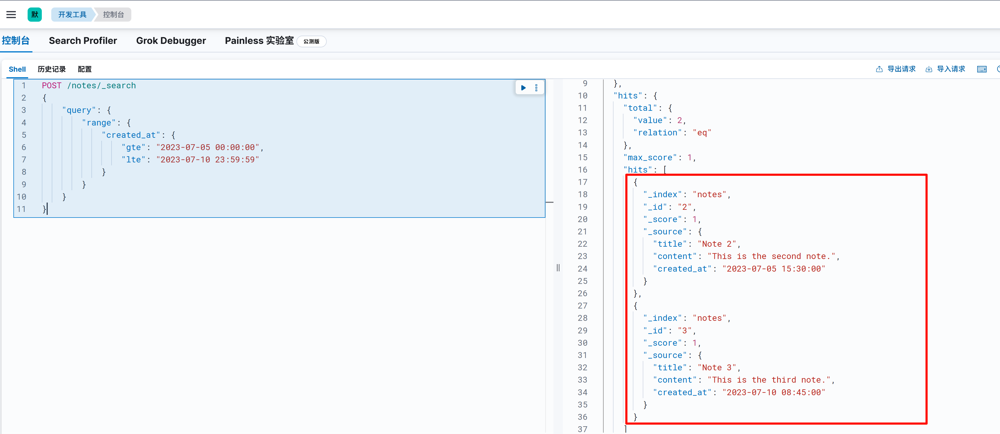

#### 1.1.4 `exists` 查询

**用途**：检查字段是否存在。

exists检索在Elasticsearch中用于筛选具有特定字段值的文档。这种查询类型适用于检查文档中是否存在某个字段，或者该字段是否包含非空值。通过使用exists检索，你可以有效地过滤掉缺少关键信息的文档，从而专注于包含所需数据的结果。应用场景包括但不限于数据完整性检查、查询特定属性的文档以及对可选字段进行筛选等。

**​示例​**​：查询 `address.keyword` 字段存在的账户。

```json
GET /{index_name}/_search
{
  "query": {
    "exists": {
      "field": "address.keyword"
    }
  }
}
```

#### 1.1.5 `prefix` 查询

**用途**：匹配字段值的前缀。

prefix会对分词后的term进行前缀搜索。

- 它不会对要搜索的字符串分词，传入的前缀就是想要查找的前缀

- 默认状态下，前缀查询不做相关性分数计算，它只是将所有匹配的文档返回，然后赋予所有相关分数值为1。**示例**：查询 `address.keyword` 以 `"990 Concord"` 开头的账户。

```json
GET /{index_name}/_search
{
  "query": {
    "prefix": {
      "address.keyword": "990 Concord"
    }
  }
}
```

查询结果：


#### 1.1.6 `wildcard` 查询

wildcard检索是Elasticsearch中一种支持通配符匹配的查询类型，它允许在检索时使用通配符表达式来匹配文档的字段值。通配符包括两种。

- 星号(*)：表示零或多个字符，可用于匹配任意长度的字符串。
- 问号(?)：表示一个字符，用于匹配任意单个字符。

wildcard检索适用于对部分已知内容的文本字段进行模糊检索。例如，在文件名或产品型号等具有一定规律的字段中，使用通配符检索可以方便地找到满足特定模式的文档。

**请注意，通配符查询可能会导致较高的计算负担，因此在实际应用中应谨慎使用，尤其是在涉及大量文档的情况下**。

```json
GET /{index_name}/_search
{
  "query": {
    "wildcard": {
      "email.keyword": "*@gmail.com"
    }
  }
}
```

#### 1.1.7 `regexp` 查询

**用途**：正则表达式匹配。
​**​示例​**​：查询 `state.keyword` 以 `"C"` 开头且长度为 2 的账户。

```json
GET /{index_name}/_search
{
  "query": {
    "regexp": {
      "state.keyword": "C.{1}"
    }
  }
}
```

#### 1.1.8 `fuzzy` 查询

**用途**：容忍拼写错误的模糊匹配。

fuzzy检索是一种强大的搜索功能，它能够在用户输入内容存在拼写错误或上下文不一致时，仍然返回与搜索词相似的文档。通过使用编辑距离算法来度量输入词与文档中词条的相似程度，模糊查询在保证搜索结果相关性的同时，有效地提高了搜索容错能力。**​示例​**​：模糊匹配 `employer.keyword` 为 `"Googlo"`（可能匹配 `"Google"`）。

```json
GET /{index_name}/_search
{
  "query": {
    "fuzzy": {
      "employer.keyword": {
        "value": "Googlo",
        "fuzziness": "AUTO"
      }
    }
  }
}
```

- fuzziness参数用于编辑距离的设置，其默认值为AUTO，支持的数值为[0，1，2]。如果值设置越界会报错。 
- prefix_length: 搜索词的前缀长度，在此长度内不会应用模糊匹配。默认是0，即整个词都会被模糊匹配。

#### 1.1.9 `ids` 查询

**用途**：通过文档 ID 查询。
​**​示例​**​：查询 ID 为 `1` 和 `2` 的账户。

```json
GET /{index_name}/_search
{
  "query": {
    "ids": {
      "values": ["1", "2"]
    }
  }
}
```

#### 1.1.10 term_set

terms_set检索是Elasticsearch中一种功能强大的检索类型，主要用于解决多值字段中的文档匹配问题，在处理具有多个属性、分类或标签的复杂数据时非常有用。

从应用场景来说，terms set检索在处理多值字段和特定匹配条件时具有很大的优势。它适用于标签系统、搜索引擎、电子商务系统、文档管理系统和技能匹配等场景。

**基本语法**：

terms_set可以检索至少匹配一定数量给定词项的文档，其中匹配的数量可以是固定值，也可以是基于另一个字段的动态值：

```json
{
    "query": {
        "terms_set": {
            "{field_name}": {
                "terms": [
                    "{term1}",
                    "{term2}", ...
                ],
                "minimum_should_match_field": "{minimum_should_match_field_name}",
				"minimum_should_match_script": {
                    "source": "{script}"
                }
            }
        }
    }
}
```

- field_name：指定要查询的字段名，这个字段通常是一个多值字段。
- terms: 提供一组词项，用于在指定字段中进行匹配。
- minimum_should_match_field: 指定一个包含匹配数量的字段名，其值应用作要匹配的最少术语数，以便返回文档。
- minimum_should_match_script: 提供一个自定义脚本，用于动态计算匹配数量。如果需要动态设置匹配所需的术语数，这个参数将非常有用。

**查询示例：**

假设我们有一个电影数据库，其中每部电影都有多个标签。现在，我们希望找到同时具有一定数量的给定标签的电影。

测试数据：

```json
PUT /movies
{
    "mappings": {
        "properties": {
            "title": {
                "type": "text"
            },
            "tags": {
                "type": "keyword"
            },
            "tags_count": {
                "type": "integer"
            }
        }
    }
}

POST /movies/_bulk
{"index":{"_id":1}}
{"title":"电影1", "tags":["喜剧","动作","科幻"], "tags_count":3}
{"index":{"_id":2}}
{"title":"电影2", "tags":["喜剧","爱情","家庭"], "tags_count":3}
{"index":{"_id":3}}
{"title":"电影3", "tags":["动作","科幻","家庭"], "tags_count":3}
```

使用固定数量的term进行匹配：

```json
GET /movies/_search
{
    "query": {
        "terms_set": {
            "tags": {
                "terms": [
                    "喜剧",
                    "动作",
                    "科幻"
                ],
                "minimum_should_match": 2
            }
        }
    }
}


GET /movies/_search
{
    "query": {
        "terms_set": {
            "tags": {
                "terms": [
                    "喜剧",
                    "动作",
                    "科幻"
                ],
                "minimum_should_match_script": {
                    "source": "2"
                }
            }
        }
    }
}
```

用动态计算的term数量进行匹配：

```json
GET /movies/_search
{
    "query": {
        "terms_set": {
            "tags": {
                "terms": [
                    "喜剧",
                    "动作",
                    "科幻"
                ],
                "minimum_should_match_field": "tags_count"
            }
        }
    }
}


GET /movies/_search
{
    "query": {
        "terms_set": {
            "tags": {
                "terms": [
                    "喜剧",
                    "动作",
                    "科幻"
                ],
                "minimum_should_match_script": {
                    "source": "doc['tags_count'].value*0.7"
                }
            }
        }
    }
}
```

### 1.2 全文检索查询（Full-Text）

全文检索查询旨在基于相关性搜索和匹配文本数据。这些查询会对输入的文本进行分析，将其拆分为词项（单个单词），并执行诸如分词、词干处理和标准化等操作。此类检索主要应用于非结构化文本数据，如文章和评论等。

#### 1.2.1 `match_all` 查询

`match_all`表示查询所有的数据，`sort`即按照什么字段排序

```bash
GET /{index_name}/_search
{
  "query": {
    "match_all": {}
  },
  "sort": [
    {
      "account_number": "asc"
    }
  ]
}
```

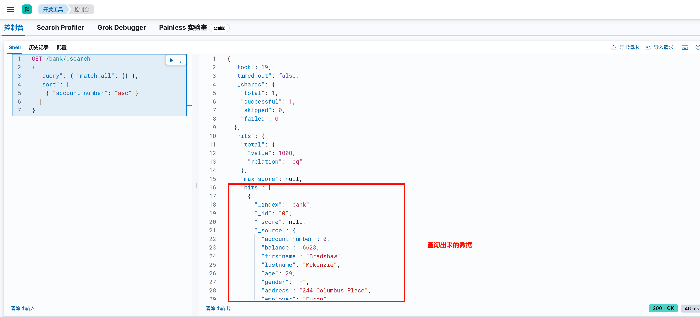

相关字段解释

- `took`：Elasticsearch运行查询所花费的时间（以毫秒为单位）
- `timed_out`：搜索请求是否超时
- `_shards`：搜索了多少个分片，以及成功，失败或跳过了多少个碎片的细目分类。
- `max_score`：找到的最相关文档的分数
- `hits.total.value`：找到了多少个匹配的文档
- `hits.sort`：文档的排序位置（不按相关性得分排序时）
- `hits._score`：文档的相关性得分（使用match_all时不适用）

#### 1.2.2 `match` 查询

match查询是一种全文搜索查询，它使用分析器将查询字符串分解成单独的词条，并在倒排索引中搜索这些词条。match查询适用于文本字段，并且可以通过多种参数来调整搜索行为。

对于match查询，其底层逻辑的概述：

1. 分词：首先，输入的查询文本会被分词器进行分词。分词器会将文本拆分成一个个词项（terms），如单词、短语或特定字符。分词器通常根据特定的语言规则和配置进行操作。

2. 匹配计算：一旦查询被分词，ES将根据查询的类型和参数计算文档与查询的匹配度。对于match查询，ES将比较查询的词项与倒排索引中的词项，并计算文档的相关性得分。相关性得分衡量了文档与查询的匹配程度。

3. 结果返回：根据相关性得分，ES将返回最匹配的文档作为搜索结果。搜索结果通常按照相关性得分进行排序，以便最相关的文档排在前面。

**用途**：对 `text` 类型字段分词后匹配任意分词。
​**​示例​**​：在 `address` 字段中搜索包含 `"Avenue"` 或 `"Street"` 的账户。

```json
GET /{index_name}/_search
{
  "query": {
    "match": {
      "address": "Avenue Street"
    }
  }
}
```

分词后and效果：

```json
GET /bank/_search
{
  "query": {
    "match": {
      "address": {
        "query": "Putnam Avenue",
        "operator": "and"
      }
    }
  }
}
```

- **"operator": "and" **代表：`address` 字段**必须包含全部分词后的词项**（即同时包含“Putnam”、“Avenue”），相当于逻辑 **AND** 条件。

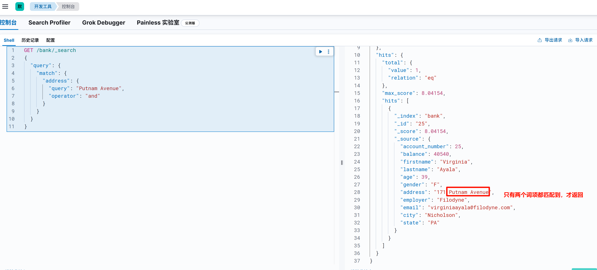

分词后 `or` 效果：

```json
GET /bank/_search
{
  "query": {
    "match": {
      "address": {
        "query": "Putnam Avenue",
        "operator": "or"
      }
    }
  }
}
```

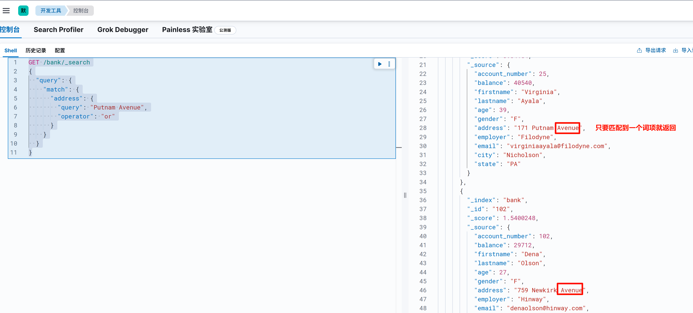

**当operator参数设置为or时，minnum_should_match参数用来控制匹配的分词的最少数量**。

```json
GET /bank/_search
{
  "query": {
    "match": {
      "address": {
        "query": "171 199 Putnam Avenue",
        "operator": "or",
        "minimum_should_match": 3
      }
    }
  }
}
```

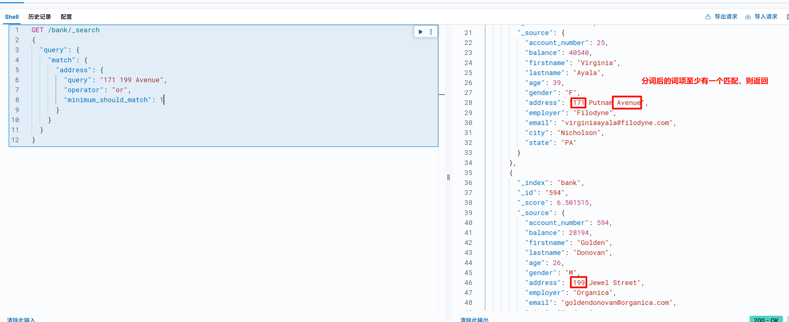


#### 1.2.4 `multi_match`

multi_match查询在Elasticsearch中用于在多个字段上执行相同的搜索操作。它可以接受一个查询字符串，并在指定的字段集合中搜索这个字符串。multi_match查询提供了灵活的匹配类型和操作符选项，以便根据不同的搜索需求调整搜索行为。

一个基本的multi_match查询的结构如下：

```json
GET /{index_name}/_search
{
    "query": {
        "multi_match": {
            "query": "{query_string}",
            "fields": [
                "{field1}",
                "{field2}", ...
            ]
        }
    }
}
```

- index_name：是你要搜索的索引名称
- query_string：是你要在多个字段中搜索的字符串。
- field1、field2：是你要搜索的字段列表

示例：

```json
GET /bank/_search
{
    "query": {
        "multi_match": {
            "query": "PA Nicholson Hope Street",
            "fields": [
                "city",
                "state",
                "address"
            ]
        }
    }
}
```

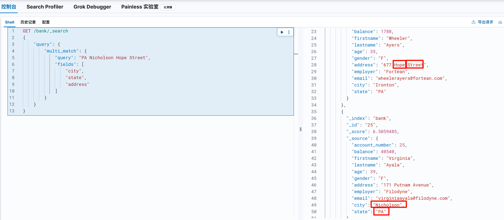

#### 1.2.3 `match_phrase` 查询

**用途**：匹配完整短语（分词顺序一致）。

match_phrase查询在Elasticsearch中用于执行短语搜索，它不仅匹配整个短语，而且还考虑了短语中各个词的顺序和位置。这种查询类型对于搜索精确短语非常有用，尤其是在用户输入的查询与文档中的文本表达方式需要严格匹配时。

例如，查询 `"quick brown"` 会匹配 `"quick brown fox"`，但不会匹配 `"brown quick"` 或 `"quick and brown"`。

一个基本的match_phrase查询的结构如下：

```json
GET /{index_name}/_search
{
    "query": {
        "match_phrase": {
            "{field_name}": {
                "query": "{phrase}"
            }
        }
    }
}
```

match_phrase查询还支持一个可选的slop参数，用于指定短语中词之间可以出现的最大位移数量。默认值为0，意味着短语中的词必须严格按照顺序出现。如果设置了非零的slop值，则允许短语中的某些词在一定范围内错位。

**`lop`**：允许词项之间的最大位置间隔（默认为 0，即严格相邻）。例如：

- `slop=1`：可匹配 `"quick [其他词] brown"`（总位移差 ≤ 1）。
- `slop=2`：允许两个词项间隔两个位置。

**​示例​**​：在 `address` 字段中搜索 `"959 National Avenue"`。

```json
GET /bank/_search
{
  "query": {
    "match_phrase": {
      "address": {
        "query": "880 Lane",
        "slop": 1
      }
    }
  }
}
```

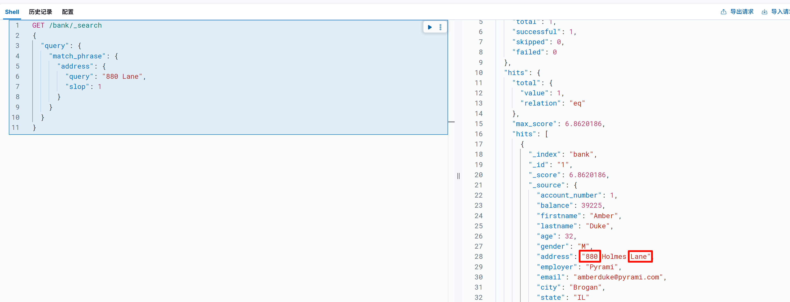

如果不加 `slop:0` 则该条数据无法查询出来。

我们可以通过以下命令查询分词后词项间隔：

```json
POST _analyze
{
    "analyzer": "ik_max_word",
    "text": "广州白云山"
}
 #结果
{
    "tokens": [
        {
            "token": "广州",
            "start_offset": 0,
            "end_offset": 2,
            "type": "CN_WORD",
            "position": 0
        },
        {
            "token": "白云山",
            "start_offset": 2,
            "end_offset": 5,
            "type": "CN_WORD",
            "position": 1
        },
        {
            "token": "白云",
            "start_offset": 2,
            "end_offset": 4,
            "type": "CN_WORD",
            "position": 2
        },
        {
            "token": "云山",
            "start_offset": 3,
            "end_offset": 5,
            "type": "CN_WORD",
            "position": 3
        }
    ]
}
```

#### 1.2.4 `match_phrase_prefix` 查询

**用途**：匹配短语前缀。
​**​示例​**​：在 `address` 字段中搜索以 `"990"` 开头的短语。

```json
GET /{index_name}/_search
{
  "query": {
    "match_phrase_prefix": {
      "address": "990"
    }
  }
}
```

#### 1.2.5 `common` 查询

**用途**：优化高频词（如停用词）的匹配。
​**​示例​**​：在 `address` 字段中搜索 `"Avenue and the Street"`，优先低频词。

```json
GET /{index_name}/_search
{
  "query": {
    "common": {
      "address": {
        "query": "Avenue and the Street",
        "cutoff_frequency": 0.001
      }
    }
  }
}
```

## 二. 复合查询

### 2.1 bool

布尔查询是最常用的组合查询，不仅将多个查询条件组合在一起，并且将查询的结果和结果的评分组合在一起。当查询条件是多个表达式的组合时，布尔查询非常有用，实际上，布尔查询把多个子查询组合（combine）成一个布尔表达式，所有子查询之间的逻辑关系是与（and）；只有当一个文档满足布尔查询中的所有子查询条件时，Elasticsearch 引擎才认为该文档满足查询条件。

布尔查询支持的子查询类型共有四种，分别是：`must`，`should`，`must_not` 和 `filter`：

- `must`：指定**必须满足**的条件（类似 SQL 中的 `AND`），文档必须同时满足所有 `must` 子句才能被匹配。**贡献算分**
- `must_not`：指定**必须不满足**的条件（类似 SQL 中的 `NOT`），匹配该条件的文档会被直接排除。
- `filter`： 与 `must` 类似，指定**必须满足**的条件，但**不计算相关性得分**，仅用于过滤文档。
- `should`： 指定**可选满足**的条件（类似 SQL 中的 `OR`），文档满足其中一个或多个子句会提升相关性得分，但非必需。**满足的子句越多，文档得分越高**；若未满足任何子句，文档仍可能被匹配（除非 `minimum_should_match` 强制要求）。

| 字段       | 条件类型               | 是否必须匹配                             | 影响得分 | 性能优化                       |
| ---------- | ---------------------- | ---------------------------------------- | -------- | ------------------------------ |
| `must`     | 必须满足               | 是                                       | 是       | 无（需计算得分）               |
| `filter`   | 必须满足               | 是                                       | 否       | 有（缓存结果，适合结构化数据） |
| `must_not` | 必须不满足             | 是（排除）                               | 是       | 部分优化（排除逻辑简单）       |
| `should`   | 可选满足（提升相关性） | 否（可通过 `minimum_should_match` 强制） | 是       | 无（需计算得分）               |

`bool` 查询语法有以下特点

- 子查询可以任意顺序出现
- 可以嵌套多个查询，包括 `bool` 查询
- 如果 `bool` 查询中没有 `must` 条件，`should` 中必须至少满足一条才会返回结果。

**示例**：查询年龄大于 30、城市是 `"Brogan"`，且不来自 `"EmployerA"` 的账户。

```json
GET /{index_name}/_search
{
  "query": {
    "bool": {
      "must": [
        { "range": { "age": { "gt": 30 } } },
        { "term": { "city.keyword": "Brogan" } }
      ],
      "must_not": [
        { "term": { "employer.keyword": "EmployerA" } }
      ],
      "filter": [
        { "range": { "balance": { "gte": 5000 } } }
      ]
    }
  }
}
```


### 2.2 dis_max

**用途**：取多个子查询中的最高分。
​**​示例​**​：在 `address` 或 `employer` 字段中搜索 `"Avenue"`。

```json
GET /{index_name}/_search
{
  "query": {
    "dis_max": {
      "queries": [
        { "match": { "address": "Avenue" } },
        { "match": { "employer": "Avenue" } }
      ],
      "tie_breaker": 0.3
    }
  }
}
```

### 2.3 function_score

**用途**：自定义评分规则。
​**​示例​**​：搜索 `"Avenue"`，并为 `gender.keyword` 为 `"F"` 的账户增加权重。

```json
GET /{index_name}/_search
{
  "query": {
    "function_score": {
      "query": { "match": { "address": "Avenue" } },
      "functions": [
        {
          "filter": { "term": { "gender.keyword": "F" } },
          "weight": 2
        }
      ],
      "boost_mode": "multiply"
    }
  }
}
```

### 2.4 boosting

**用途**：对某些条件的结果降权。
​**​示例​**​：搜索 `"Avenue"`，但降低来自 `"EmployerB"` 的账户的得分。

```json
GET /{index_name}/_search
{
  "query": {
    "boosting": {
      "positive": { "match": { "address": "Avenue" } },
      "negative": { "term": { "employer.keyword": "EmployerB" } },
      "negative_boost": 0.2
    }
  }
}
```

## 三. 分页查询

本质上就是from和size两个字段

```bash
GET /{index_name}/_search
{
  "query": {
    "match_all": {}
  },
  "sort": [
    {
      "account_number": "asc"
    }
  ],
  "from": 2,
  "size": 5
}
```

在 Elasticsearch 的查询请求中，`from` 和 `size` 这两个参数主要用于实现分页功能。下面为你详细解释这两个参数在你给出的查询中的作用：

- `from` 参数明确了查询结果起始的偏移量，也就是跳过前 `from` 条数据，从第 `from+1` 条结果开始返回。**它的默认值是 0，跳过前0条数据，从第1条结果返回**。在你的查询里，`from` 的值设定为 2，这表明 Elasticsearch 会跳过前 2 条结果，从第 3 条结果开始返回。

- `size` 参数指定了查询结果返回的最大文档数量。**它的默认值为 10，即默认返回 10 条结果**。在你的查询中，`size` 的值为 5，这就表示 Elasticsearch 只会返回至多 5 条结果。


